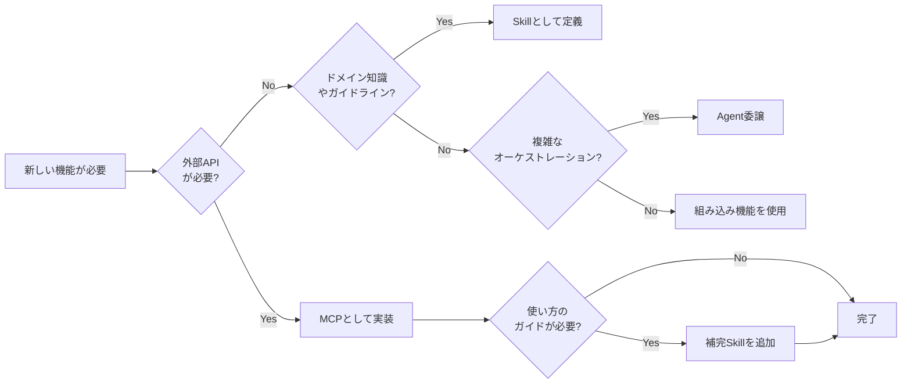

# AI Agent Toolkit

> MCPだけでは不十分 — このリポジトリは、エージェントがSkillsとToolsをどのように発見・オーケストレーションするかを扱う。

AIエージェント構成（MCP・Skills・Agent統合）に関する設計思想・アーキテクチャ・実践ノウハウをまとめたリポジトリ。

## なぜ今これが重要か

AIエージェントのエコシステムは急速に進化しています。

- [**Vercel Skills v1.1.1**](https://vercel.com/changelog/skills-v1-1-1-interactive-discovery-open-source-release-and-agent-support) — 27以上のエージェントをサポートしてオープンソース化
- [**Agent Skills Specification**](https://agentskills.io/home) — 標準化の取り組みが進行中
- **MCPの普及** — 成長しているが、発見/オーケストレーションのガイダンスが不足

これがギャップを生み出しています。
**エージェントは適切なスキルとツールをどう見つけるのか？**

## このリポジトリが解決する問題

| 課題                                        | 説明                                                   |
| ------------------------------------------- | ------------------------------------------------------ |
| **MCPだけでは不十分**                       | MCPはツールを公開するが、いつ/どう使うかのガイドがない |
| **Skillsに統合パターンがない**              | ドメイン知識は存在するが、ツールと連携していない       |
| **Agentのオーケストレーションがアドホック** | MCP + Skills を組み合わせる標準的な方法がない          |

## このリポジトリが提供するもの

```
┌─────────────────────────────────────────────────────────┐
│                    ユーザーリクエスト                      │
└─────────────────────────┬───────────────────────────────┘
                          ▼
┌─────────────────────────────────────────────────────────┐
│  Agent レイヤー       (オーケストレーション & 判断)       　　│
├─────────────────────────────────────────────────────────┤
│  Skills レイヤー      (ドメイン知識 & ガイドライン)      　　 │
├─────────────────────────────────────────────────────────┤
│  MCP レイヤー         (外部ツール & API)                　 │
└─────────────────────────────────────────────────────────┘
```

このリポジトリは以下を提供します。

- **アーキテクチャ原則** — MCP、Skills、Agentの関係
- **選択ガイドライン** — いつMCP vs Skills vs Agent委譲を使うか
- **アンチパターン** — よくある間違いとその回避方法
- **カタログポインタ** — 実装へのリンク（実装自体ではない）

## MCP vs Skills vs Agent

| 観点             | MCP                    | Skills                            | Agent                      |
| ---------------- | ---------------------- | --------------------------------- | -------------------------- |
| **解決すること** | 外部ツール/APIアクセス | ドメイン知識 & ベストプラクティス | タスクオーケストレーション |
| **所有者**       | サーバー開発者         | ドメインエキスパート              | Agentオーケストレーター    |
| **発見方法**     | 設定ベース             | インデックス / マーケットプレイス | 動的選択                   |
| **ランタイム**   | サーバープロセス       | インメモリ（コンテキスト）        | セッションベース           |
| **例**           | deepl-mcp, rfcxml-mcp  | frontend-design, solid-principles | Claude Code, Cursor        |

## クイック判断フロー



## スコープ

| レイヤー   | 役割                             | 例                               |
| ---------- | -------------------------------- | -------------------------------- |
| **MCP**    | 外部ツール・API連携              | rfcxml-mcp, deepl-mcp            |
| **Skills** | ドメイン知識・ベストプラクティス | frontend-design, doc-coauthoring |
| **Agent**  | 自律的タスク実行                 | Claude Code, Cursor              |

### 含まれるもの

- **構成論**: MCP / Skills / Agent の役割と選択判断
- **カタログ**: 構築済み・発見したツールへのポインタ
- **アーキテクチャ原則**: 組み合わせ方、アンチパターン
- **知見の蓄積**: 実プロジェクトから得た横断的学び

### 含まれないもの

- 実行可能なMCPサーバー実装 → 個別リポジトリへ
- 特定ドメインの詳細なSkill定義 → 個別リポジトリへ
- プロジェクト固有の設定・ワークフロー → 各プロジェクトへ

### 成長パターン

```
参照 → 実践 → 新知見 → 別リポジトリ化 → ポインタ追加
```

## 経緯

当初は[MCP](https://modelcontextprotocol.io/)サーバー構築が対象でしたが、以下を踏まえスコープを拡大

- [Vercel Skills v1.1.1](https://vercel.com/changelog/skills-v1-1-1-interactive-discovery-open-source-release-and-agent-support) のオープンソース化
- [Agent Skills Specification](https://agentskills.io) の標準化

> このリポジトリの内容は、AIとの壁打ちで得た、個人の意見にすぎない。

## 核心的な認識

> AIが（CI/CDを含め）いきなりバイナリを出力して実装できるようになる未来が来るまで、AI駆動開発には、これまでの人々が培ってきたエンジニアリングの導入が不可欠である。
>
> AIの判断には**ブレない参照先**が必要。

## ドキュメント

詳細は [docs/](./docs/) を参照。

### Concepts（概念・思想）

| ファイル                                                                       | 内容                           |
| ------------------------------------------------------------------------------ | ------------------------------ |
| [concepts/01-vision.md](./docs/concepts/01-vision.ja.md)                       | AI駆動開発のビジョン・核心思想 |
| [concepts/02-reference-sources.md](./docs/concepts/02-reference-sources.ja.md) | 「ブレない参照先」の体系       |
| [concepts/03-architecture.md](./docs/concepts/03-architecture.ja.md)           | MCP/Skills/Agentの構成論       |
| [concepts/04-ai-design-patterns.md](./docs/concepts/04-ai-design-patterns.ja.md) | 生成AIの設計パターンとMCPの位置づけ |

### MCP（外部連携）

| ファイル                                           | 内容                        |
| -------------------------------------------------- | --------------------------- |
| [mcp/catalog.md](./docs/mcp/catalog.ja.md)         | 構築済みMCPカタログと成果   |
| [mcp/security.md](./docs/mcp/security.ja.md)       | MCP開発時のセキュリティ考慮 |
| [mcp/development.md](./docs/mcp/development.ja.md) | MCP開発ガイド（計画中）     |

### Skills（ドメイン知識）

| ファイル                                                         | 内容                                        |
| ---------------------------------------------------------------- | ------------------------------------------- |
| [skills/overview.md](./docs/skills/overview.ja.md)               | Vercel Skills と Agent Skills Specification |
| [skills/vs-mcp.md](./docs/skills/vs-mcp.ja.md)                   | MCP vs Skills の本質的な違い・選択判断      |
| [skills/anti-patterns.md](./docs/skills/anti-patterns.ja.md)     | MCP/Skills アンチパターン集                 |
| [skills/creating-skills.md](./docs/skills/creating-skills.ja.md) | Skills作成ガイド（計画中）                  |

### Workflows（ワークフロー・運用）

| ファイル                                                                     | 内容                       |
| ---------------------------------------------------------------------------- | -------------------------- |
| [workflows/patterns.md](./docs/workflows/patterns.ja.md)                     | 連携パターン・ワークフロー |
| [workflows/development-phases.md](./docs/workflows/development-phases.ja.md) | 開発フェーズ × 対応        |

### 計画・参考

| ファイル                             | 内容                   |
| ------------------------------------ | ---------------------- |
| [roadmap.md](./docs/roadmap.ja.md)   | 優先度・ロードマップ   |
| [outputs.md](./docs/outputs.ja.md)   | 実績・アウトプット一覧 |
| [glossary.md](./docs/glossary.ja.md) | 用語集                 |

## テンプレート

| テンプレート                                           | 用途                                      |
| ------------------------------------------------------ | ----------------------------------------- |
| [templates/skill/](./templates/skill/README.ja.md)     | Skill 定義テンプレートと例                |
| [templates/command/](./templates/command/README.ja.md) | Command（スラッシュコマンド）テンプレート |

## リファレンス

- [Skills リンク集](./references/skills/links.ja.md) - Vercel Skills・Agent Skills Specification

## 関連プロジェクト

| リポジトリ                                                            | 説明                       | npm                           |
| --------------------------------------------------------------------- | -------------------------- | ----------------------------- |
| [rfcxml-mcp](https://github.com/shuji-bonji/rfcxml-mcp)               | IETF RFC構造化参照         | `@shuji-bonji/rfcxml-mcp`     |
| [xCOMET MCP Server](https://github.com/shuji-bonji/xcomet-mcp-server) | 翻訳品質評価               | `xcomet-mcp-server`           |
| [w3c-mcp](https://github.com/shuji-bonji/w3c-mcp)                     | W3C/WHATWG Web標準         | `@shuji-bonji/w3c-mcp`        |
| [epsg-mcp](https://github.com/shuji-bonji/epsg-mcp)                   | EPSG座標参照系             | `@shuji-bonji/epsg-mcp`       |
| [pdf-spec-mcp](https://github.com/shuji-bonji/pdf-spec-mcp)           | PDF仕様（ISO 32000）       | `@shuji-bonji/pdf-spec-mcp`   |
| [pdf-reader-mcp](https://github.com/shuji-bonji/pdf-reader-mcp)       | PDF内部構造解読            | `@shuji-bonji/pdf-reader-mcp` |
| [RxJS MCP Server](https://github.com/shuji-bonji/rxjs-mcp-server)     | RxJSストリーム実行・可視化 | -                             |

## GitHub リポジトリ設定

### 説明文（About）

```
AIエージェント構成（MCP・Skills・Agent統合）の設計思想・実践ノウハウ
```

### Topics（タグ）

```
mcp, skills, ai-agent, claude-code, cursor, agent-skills
```
