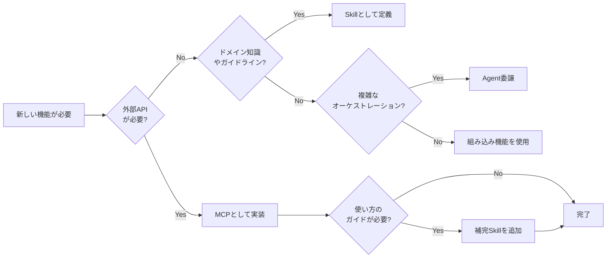

# AI Agent Architecture

[English](./README.md)

> MCPだけでは不十分 — このリポジトリは、エージェントがSkillsとToolsをどのように発見・オーケストレーションするかを扱う。

AIエージェント構成（MCP・Skills・Agent統合）に関する設計思想・アーキテクチャ・実践ノウハウをまとめたリポジトリ。

## 📖 ドキュメント

**完全なドキュメントはこちら:**

### **👉 [https://shuji-bonji.github.io/ai-agent-architecture/ja/](https://shuji-bonji.github.io/ai-agent-architecture/ja/)**

ドキュメントサイトの内容:

- **コンセプト・ビジョン** — なぜ「ブレない参照先」が必要なのか
- **MCP（Model Context Protocol）** — 外部連携レイヤーの標準化プロトコル
- **Skills（ドメイン知識）** — MCPのリアルタイム能力を補完する静的知識
- **エージェント・A2A** — サブエージェント、オーケストレーション、Agent-to-Agentプロトコル
- **アーキテクチャ** — MCP・Skills・Agentの三層モデルと構成方法
- **戦略・ロードマップ** — 構築の優先度と構成パターン

## なぜ今これが重要か

AIエージェントのエコシステムは急速に進化しています。

- [**Vercel Skills v1.1.1**](https://vercel.com/changelog/skills-v1-1-1-interactive-discovery-open-source-release-and-agent-support) — 27以上のエージェントをサポートしてオープンソース化
- [**Agent Skills Specification**](https://agentskills.io/home) — 標準化の取り組みが進行中
- **MCPの普及** — 成長しているが、発見/オーケストレーションのガイダンスが不足

これがギャップを生み出しています。
**エージェントは適切なスキルとツールをどう見つけるのか？**

## コアアーキテクチャ

```
┌───────────────────────────────────────────────────────┐
│                    ユーザーリクエスト                    │
└─────────────────────────┬─────────────────────────────┘
                          ▼
┌───────────────────────────────────────────────────────┐
│  Agent レイヤー       (オーケストレーション & 判断)        │
├───────────────────────────────────────────────────────┤
│  Skills レイヤー      (ドメイン知識 & ガイドライン)        │
├───────────────────────────────────────────────────────┤
│  MCP レイヤー         (外部ツール & API)                 │
└───────────────────────────────────────────────────────┘
```

| レイヤー   | 役割                             | 例                               |
| ---------- | -------------------------------- | -------------------------------- |
| **Agent**  | 自律的タスク実行                 | Claude Code, Cursor              |
| **Skills** | ドメイン知識・ベストプラクティス | frontend-design, doc-coauthoring |
| **MCP**    | 外部ツール・API連携              | rfcxml-mcp, deepl-mcp            |

## クイック判断フロー



## 関連プロジェクト

| リポジトリ                                                            | 説明                       | npm                           |
| --------------------------------------------------------------------- | -------------------------- | ----------------------------- |
| [rfcxml-mcp](https://github.com/shuji-bonji/rfcxml-mcp)               | IETF RFC構造化参照         | `@shuji-bonji/rfcxml-mcp`     |
| [xCOMET MCP Server](https://github.com/shuji-bonji/xcomet-mcp-server) | 翻訳品質評価               | `xcomet-mcp-server`           |
| [w3c-mcp](https://github.com/shuji-bonji/w3c-mcp)                     | W3C/WHATWG Web標準         | `@shuji-bonji/w3c-mcp`        |
| [epsg-mcp](https://github.com/shuji-bonji/epsg-mcp)                   | EPSG座標参照系             | `@shuji-bonji/epsg-mcp`       |
| [pdf-spec-mcp](https://github.com/shuji-bonji/pdf-spec-mcp)           | PDF仕様（ISO 32000）       | `@shuji-bonji/pdf-spec-mcp`   |
| [pdf-reader-mcp](https://github.com/shuji-bonji/pdf-reader-mcp)       | PDF内部構造解読            | `@shuji-bonji/pdf-reader-mcp` |
| [RxJS MCP Server](https://github.com/shuji-bonji/rxjs-mcp-server)     | RxJSストリーム実行・可視化 | -                             |

### Skills / Plugins

| リポジトリ                                                                              | 説明                                                | 種別          |
| --------------------------------------------------------------------------------------- | --------------------------------------------------- | ------------- |
| [deepl-glossary-translation](https://github.com/shuji-bonji/deepl-glossary-translation) | PDF仕様書の用語統一翻訳（pdf-spec-mcp + DeepL連携） | Skill         |
| [code-review-skill](https://github.com/shuji-bonji/code-review-skill)                   | TypeScript/MCP Serverプロジェクト向けコードレビュー | Skill         |
| [spec-compliance-skills](https://github.com/shuji-bonji/spec-compliance-skills)         | W3C/IETF仕様準拠チェック（EPUB 3.3対応）            | Cowork Plugin |

## テンプレート

| テンプレート                                           | 用途                                      |
| ------------------------------------------------------ | ----------------------------------------- |
| [templates/skill/](./templates/skill/README.ja.md)     | Skill 定義テンプレートと例                |
| [templates/command/](./templates/command/README.ja.md) | Command（スラッシュコマンド）テンプレート |

## リファレンス

- [Skills リンク集](./references/skills/links.ja.md) - Vercel Skills・Agent Skills Specification

## ご注意

本ドキュメントは、著者がClaudeを活用してAIエージェントシステムを構築・運用する中で得た実践的知見をまとめたものです。Anthropic社やその他の組織の公式ドキュメントではありません。ご意見・ご議論は [GitHub Issues](https://github.com/shuji-bonji/ai-agent-architecture/issues) にてお気軽にどうぞ。

## ライセンス

MIT License. Copyright © 2025-2026 shuji-bonji
