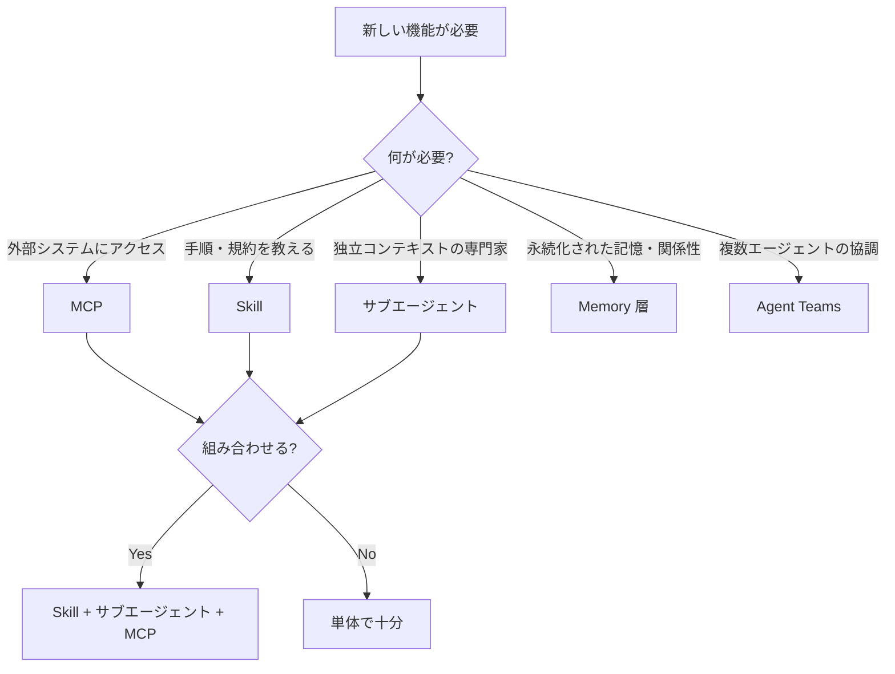

# AI Agent Architecture

[English](./README.md)

> MCPだけでは不十分 — このリポジトリは、エージェントが Skills・Tools・Memory・Identity をどのように発見・オーケストレーションするかを扱う。

AIエージェント構成（MCP・Skills・Agent・Memory・Agent ID統合）に関する設計思想・アーキテクチャ・実践ノウハウをまとめたリポジトリ。

## 📚 姉妹プロジェクト

「LLM を知る → AI Agent 設計を知る → システムに適用する」を順序立てて学べる 3 つの姉妹プロジェクトです。

| フェーズ | プロジェクト | 内容 |
| :--- | :--- | :--- |
| **1. LLM を知る** | [understanding-llm-through-claude-code](https://github.com/shuji-bonji/understanding-llm-through-claude-code) | LLM の構造的制約と「なぜそう設計するのか」（Why の本棚） |
| **2. AI Agent 設計を知る** | 👈 **このリポジトリ** | MCP・Skills・Agent・Memory・Agent ID の構成と実装パターン（What/How の地図） |
| **3. システムに適用する** | [Management-of-software-systems-and-services](https://github.com/shuji-bonji/Management-of-software-systems-and-services) | _準備中_ — AI 時代のシステム運用 |

## 📖 ドキュメント

**完全なドキュメントはこちら:**

### **👉 [https://shuji-bonji.github.io/ai-agent-architecture/ja/](https://shuji-bonji.github.io/ai-agent-architecture/ja/)**

ドキュメントサイトの内容:

- **コンセプト・ビジョン (全8章)** — なぜ「ブレない参照先」が必要なのか、三層モデル、ドクトリンと意図、Memory 層 / ナレッジグラフ
- **MCP（Model Context Protocol）** — 外部連携レイヤーの標準化プロトコル
- **Skills（ドメイン知識）** — MCPのリアルタイム能力を補完する静的知識
- **エージェント** — エージェントの分類、サブエージェント、品質ゲート、マルチエージェント / Agent Teams、A2A プロトコル、**エージェント ID**（Agent ID 時代）
- **FAQ (3行回答)** — 検索クエリへの即答: *MCP vs Skills*、*Agent / Sub-agent / Skill / MCP 4者比較*
- **戦略・構成パターン** — MCP × Skill × Agent の組み合わせ設計

## なぜ今これが重要か (2026年5月時点)

AIエージェントのエコシステムは「**仕様検討段階**」から「**本番運用フェーズ**」へと移行しました。

- **2026年4月**: **Microsoft Entra Agent ID GA**、**Okta for AI Agents GA**、**A2A v1.0 GA** — Linux Foundation A2A プロトコル参加組織が 150 を超える
- **2025年12月**: **AGENTS.md** が OpenAI と Anthropic から Linux Foundation へ寄贈、業界標準化
- **2025年10月**: **OpenID Foundation「Agentic AI のためのアイデンティティ管理」v1.1** — Agent ID の体系化
- **2024年11月**: Anthropic が **MCP** をリリース

本サイトはこれらの変化を追跡し、本番運用に耐えるエージェントシステム構築の実践パターンを記録します。

## コアアーキテクチャ (四層モデル + ドクトリン)

```
┌───────────────────────────────────────────────────────┐
│                    ユーザーリクエスト                    │
└─────────────────────────┬─────────────────────────────┘
                          ▼
┌───────────────────────────────────────────────────────┐
│  ドクトリン層        (制約・目的・判断基準)              │
├───────────────────────────────────────────────────────┤
│  Agent レイヤー       (オーケストレーション & 判断)       │
├───────────────────────────────────────────────────────┤
│  Skills レイヤー      (ドメイン知識 & ガイドライン)       │
├───────────────────────────────────────────────────────┤
│  Memory レイヤー      (永続化された記憶 & 関係性)        │
├───────────────────────────────────────────────────────┤
│  MCP レイヤー         (外部ツール & API)                │
└───────────────────────────────────────────────────────┘
```

| レイヤー       | 役割                                | 例                                       |
| -------------- | ----------------------------------- | ---------------------------------------- |
| **ドクトリン** | 制約・目的・判断基準                 | RFC 2119 規範ラダー (MUST/SHOULD)        |
| **Agent**      | 自律的タスク実行                     | Claude Code, Cursor, サブエージェント     |
| **Skills**     | ドメイン知識・ベストプラクティス     | frontend-design, doc-coauthoring         |
| **Memory**     | 永続化された事実・関係性             | Knowledge Graph、業務メモリ              |
| **MCP**        | 外部ツール・API連携                  | rfcxml-mcp, deepl-mcp                    |

## クイック判断フロー

3行で答えがほしい場合は [FAQ セクション](https://shuji-bonji.github.io/ai-agent-architecture/ja/faq/mcp-vs-skills) を参照。


```mermaid
flowchart TD
    START[新しい機能が必要] --> Q1{何が必要?}
    Q1 -->|外部システムにアクセス| MCP[MCP]
    Q1 -->|手順・規約を教える| SKILL[Skill]
    Q1 -->|独立コンテキストの専門家| SUB[サブエージェント]
    Q1 -->|永続化された記憶・関係性| MEM[Memory 層]
    Q1 -->|複数エージェントの協調| TEAM[Agent Teams]

    MCP --> COMBINE{組み合わせる?}
    SKILL --> COMBINE
    SUB --> COMBINE
    COMBINE -->|Yes| MIX[Skill + サブエージェント + MCP]
    COMBINE -->|No| SOLO[単体で十分]
```

詳細な判断ガイド:
- [MCP vs Skills FAQ](https://shuji-bonji.github.io/ai-agent-architecture/ja/faq/mcp-vs-skills)
- [Agent / Sub-agent / Skill / MCP 4者比較 FAQ](https://shuji-bonji.github.io/ai-agent-architecture/ja/faq/agent-vs-subagent-vs-skill)
- [サブエージェント vs Skills](https://shuji-bonji.github.io/ai-agent-architecture/ja/agents/subagent-vs-skill)

## 関連プロジェクト

### MCP サーバ

| リポジトリ                                                            | 説明                       | npm                           |
| --------------------------------------------------------------------- | -------------------------- | ----------------------------- |
| [rfcxml-mcp](https://github.com/shuji-bonji/rfcxml-mcp)               | IETF RFC構造化参照         | `@shuji-bonji/rfcxml-mcp`     |
| [xCOMET MCP Server](https://github.com/shuji-bonji/xcomet-mcp-server) | 翻訳品質評価               | `xcomet-mcp-server`           |
| [w3c-mcp](https://github.com/shuji-bonji/w3c-mcp)                     | W3C/WHATWG Web標準         | `@shuji-bonji/w3c-mcp`        |
| [epsg-mcp](https://github.com/shuji-bonji/epsg-mcp)                   | EPSG座標参照系             | `@shuji-bonji/epsg-mcp`       |
| [pdf-spec-mcp](https://github.com/shuji-bonji/pdf-spec-mcp)           | PDF仕様（ISO 32000）       | `@shuji-bonji/pdf-spec-mcp`   |
| [pdf-reader-mcp](https://github.com/shuji-bonji/pdf-reader-mcp)       | PDF内部構造解読            | `@shuji-bonji/pdf-reader-mcp` |
| [RxJS MCP Server](https://github.com/shuji-bonji/rxjs-mcp-server)     | RxJSストリーム実行・可視化 | -                             |

### Skills / Plugins

| リポジトリ                                                                              | 説明                                                | 種別          |
| --------------------------------------------------------------------------------------- | --------------------------------------------------- | ------------- |
| [deepl-glossary-translation](https://github.com/shuji-bonji/deepl-glossary-translation) | PDF仕様書の用語統一翻訳（pdf-spec-mcp + DeepL連携） | Skill         |
| [code-review-skill](https://github.com/shuji-bonji/code-review-skill)                   | TypeScript/MCP Serverプロジェクト向けコードレビュー | Skill         |
| [spec-compliance-skills](https://github.com/shuji-bonji/spec-compliance-skills)         | W3C/IETF仕様準拠チェック（EPUB 3.3対応）            | Cowork Plugin |

## テンプレート

| テンプレート                                           | 用途                                      |
| ------------------------------------------------------ | ----------------------------------------- |
| [templates/skill/](./templates/skill/README.ja.md)     | Skill 定義テンプレートと例                |
| [templates/command/](./templates/command/README.ja.md) | Command（スラッシュコマンド）テンプレート |

## リファレンス

- [参考リンク・資料](./references/links.md) — MCP、A2A、Agent ID、関連標準
- [Skills リンク集](./references/skills/links.ja.md) — Vercel Skills・Agent Skills Specification

## ご注意

本ドキュメントは、著者がClaudeを活用してAIエージェントシステムを構築・運用する中で得た実践的知見をまとめたものです。Anthropic社やその他の組織の公式ドキュメントではありません。ご意見・ご議論は [GitHub Issues](https://github.com/shuji-bonji/ai-agent-architecture/issues) にてお気軽にどうぞ。

## ライセンス

MIT License. Copyright © 2025-2026 shuji-bonji
