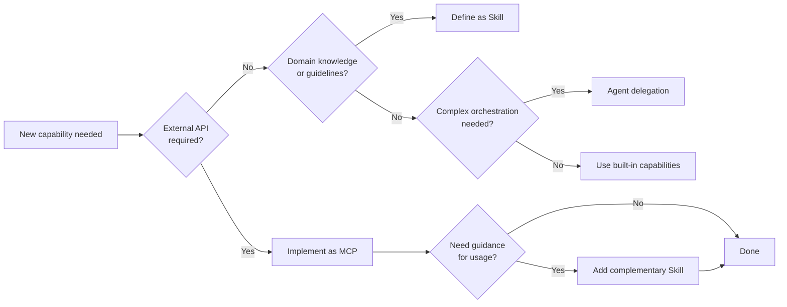

# AI Agent Toolkit

[日本語版 (Japanese)](./README.ja.md)

> MCP alone is not enough — this repo addresses how Agents discover and orchestrate Skills and Tools.

A repository documenting design principles, architecture, and practical knowledge for AI agent configuration (MCP, Skills, and Agent integration).

## 📖 Documentation

**Full documentation is available at:**

### **👉 [https://shuji-bonji.github.io/ai-agent-toolkit/](https://shuji-bonji.github.io/ai-agent-toolkit/)**

The documentation site provides:

- **Concepts & Vision** — Why "stable reference sources" matter for AI-driven development
- **MCP (Model Context Protocol)** — External integration layer with standardized protocols
- **Skills (Domain Knowledge)** — Static knowledge that complements MCP's real-time capabilities
- **Agents & A2A** — Sub-agents, orchestration patterns, and Agent-to-Agent protocol
- **Architecture** — Three-layer model (MCP / Skills / Agent) and system composition
- **Strategy & Roadmap** — Build priorities and composition patterns

## Why This Matters Now

The AI agent ecosystem is rapidly evolving:

- [**Vercel Skills v1.1.1**](https://vercel.com/changelog/skills-v1-1-1-interactive-discovery-open-source-release-and-agent-support) — Open-sourced with 27+ agent support
- [**Agent Skills Specification**](https://agentskills.io/home) — Standardization efforts underway
- **MCP Adoption** — Growing but lacking discovery/orchestration guidance

This creates a gap: **How do agents find the right skills and tools?**

## Core Architecture

```
┌─────────────────────────────────────────────────────────┐
│                      User Request                       │
└─────────────────────────┬───────────────────────────────┘
                          ▼
┌─────────────────────────────────────────────────────────┐
│  Agent Layer          (Orchestration & Decision)        │
├─────────────────────────────────────────────────────────┤
│  Skills Layer         (Domain Knowledge & Guidelines)   │
├─────────────────────────────────────────────────────────┤
│  MCP Layer            (External Tools & APIs)           │
└─────────────────────────────────────────────────────────┘
```

| Layer      | Role                              | Examples                         |
| ---------- | --------------------------------- | -------------------------------- |
| **Agent**  | Autonomous task execution         | Claude Code, Cursor              |
| **Skills** | Domain knowledge & best practices | frontend-design, doc-coauthoring |
| **MCP**    | External tool/API integration     | rfcxml-mcp, deepl-mcp            |

## Quick Decision Flow



## Related Projects

| Repository                                                            | Description                           | npm                           |
| --------------------------------------------------------------------- | ------------------------------------- | ----------------------------- |
| [rfcxml-mcp](https://github.com/shuji-bonji/rfcxml-mcp)               | IETF RFC structured reference         | `@shuji-bonji/rfcxml-mcp`     |
| [xCOMET MCP Server](https://github.com/shuji-bonji/xcomet-mcp-server) | Translation quality evaluation        | `xcomet-mcp-server`           |
| [w3c-mcp](https://github.com/shuji-bonji/w3c-mcp)                     | W3C/WHATWG Web standards              | `@shuji-bonji/w3c-mcp`        |
| [epsg-mcp](https://github.com/shuji-bonji/epsg-mcp)                   | EPSG Coordinate Reference Systems     | `@shuji-bonji/epsg-mcp`       |
| [pdf-spec-mcp](https://github.com/shuji-bonji/pdf-spec-mcp)           | PDF specification (ISO 32000)         | `@shuji-bonji/pdf-spec-mcp`   |
| [pdf-reader-mcp](https://github.com/shuji-bonji/pdf-reader-mcp)       | PDF internal structure analysis       | `@shuji-bonji/pdf-reader-mcp` |
| [RxJS MCP Server](https://github.com/shuji-bonji/rxjs-mcp-server)     | RxJS stream execution & visualization | -                             |

## Templates

| Template                                   | Purpose                                 |
| ------------------------------------------ | --------------------------------------- |
| [templates/skill/](./templates/skill/)     | Skill definition templates and examples |
| [templates/command/](./templates/command/) | Command (slash command) templates       |

## References

- [Skills Links](./references/skills/links.md) - Vercel Skills & Agent Skills Specification

## Note

This documentation reflects the author's practical insights gained through building and operating AI agent systems with Claude. It is not official documentation from Anthropic or any other organization. Contributions and discussions via [GitHub Issues](https://github.com/shuji-bonji/ai-agent-toolkit/issues) are welcome.

## License

Released under the MIT License. Copyright © 2025-2026 shuji-bonji
