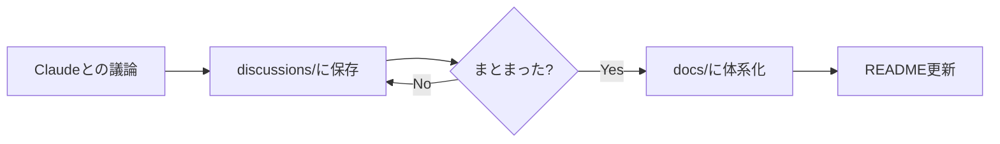

# MCP Server Construction and Integration

MCP（Model Context Protocol）サーバーの構築・統合に関する考察とアイデアを記録するリポジトリ。

## 目的

AI駆動開発を支えるMCPエコシステムの設計思想・アーキテクチャ・実装方針を整理する。

### 核心的な問い

> AIがCI/CDを含め、いきなりバイナリを出力して実装できるようになるまで、AI駆動開発には、これまでの人々が培ってきたエンジニアリングの導入が不可欠である。
>
> AIの判断には**ブレない参照先**が必要。

## リポジトリ構造

```
.
├── README.md              # 概要・ナビゲーション
├── discussions/           # 議論ログ（時系列）
│   └── YYYY-MM-DD-*.md   # Claudeとの議論記録
├── docs/                  # 整理された成果物（体系化後）
│   ├── 01-vision.md
│   ├── 02-reference-sources.md
│   └── ...
└── references/            # 参考リンク・資料
```

### 運用方針



## Discussions

| 日付       | トピック                          | ファイル                                                                                                         |
| ---------- | --------------------------------- | ---------------------------------------------------------------------------------------------------------------- |
| 2025-01-19 | AI駆動開発を支えるMCPエコシステム | [discussions/2025-01-19-ai-driven-dev-mcp-ecosystem.md](./discussions/2025-01-19-ai-driven-dev-mcp-ecosystem.md) |

## 関連プロジェクト

- [RFC MCP Server](https://github.com/shuji-bonji/rfc-mcp-server) - IETF RFC検索・解析
- [xCOMET MCP Server](https://github.com/shuji-bonji/xcomet-mcp-server) - 翻訳品質評価
- [RxJS MCP Server](https://github.com/shuji-bonji/rxjs-mcp-server) - RxJSストリーム実行・可視化

## メモ

このリポジトリはPrivateで運用し、思考の記録・アイデアのメモとして使用する。
公開可能な成果物は個別リポジトリとして切り出す。
