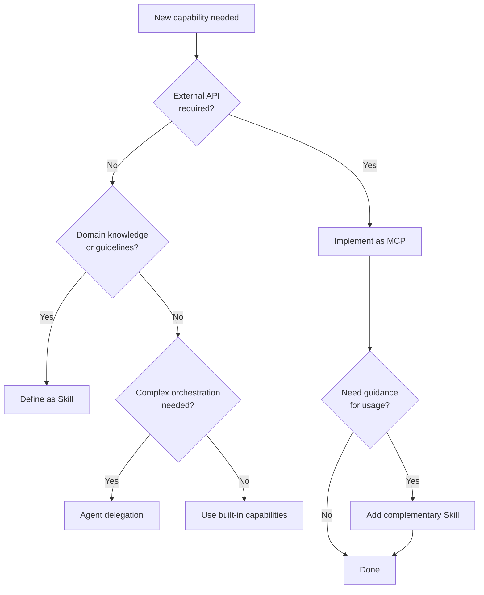

# AI Agent Toolkit

[日本語版 (Japanese)](./README.ja.md)

> MCP alone is not enough — this repo addresses how Agents discover and orchestrate Skills and Tools.

A repository documenting design principles, architecture, and practical knowledge for AI agent configuration (MCP, Skills, and Agent integration).

## Why This Matters Now

The AI agent ecosystem is rapidly evolving:

- **Vercel Skills v1.1.1** — Open-sourced with 27+ agent support
- **Agent Skills Specification** — Standardization efforts underway
- **MCP Adoption** — Growing but lacking discovery/orchestration guidance

This creates a gap: **How do agents find the right skills and tools?**

## What Problem Does This Address?

| Challenge | Description |
|-----------|-------------|
| **MCP alone is insufficient** | MCP exposes tools, but doesn't guide when/how to use them |
| **Skills lack integration patterns** | Domain knowledge exists but isn't connected to tooling |
| **Agent orchestration is ad-hoc** | No standard way to combine MCP + Skills |

## What This Repo Offers

```
┌─────────────────────────────────────────────────────────┐
│                      User Request                        │
└─────────────────────────┬───────────────────────────────┘
                          ▼
┌─────────────────────────────────────────────────────────┐
│  Agent Layer          (Orchestration & Decision)         │
├─────────────────────────────────────────────────────────┤
│  Skills Layer         (Domain Knowledge & Guidelines)    │
├─────────────────────────────────────────────────────────┤
│  MCP Layer            (External Tools & APIs)            │
└─────────────────────────────────────────────────────────┘
```

This repository provides:

- **Architecture principles** — How MCP, Skills, and Agents relate
- **Selection guidelines** — When to use MCP vs Skills vs Agent delegation
- **Anti-patterns** — Common mistakes and how to avoid them
- **Catalog pointers** — Links to implementations (not implementations themselves)

## MCP vs Skills vs Agent

| Concern | MCP | Skills | Agent |
|---------|-----|--------|-------|
| **What it solves** | External tool/API access | Domain knowledge & best practices | Task orchestration |
| **Who owns it** | Server developers | Domain experts | Agent orchestrator |
| **Discovery** | Config-based | Index / marketplace | Dynamic selection |
| **Runtime** | Server process | In-memory (context) | Session-based |
| **Examples** | deepl-mcp, rfcxml-mcp | frontend-design, solid-principles | Claude Code, Cursor |

## Quick Decision Flow



## Scope

| Layer | Role | Examples |
| ----- | ---- | -------- |
| **MCP** | External tool/API integration | rfcxml-mcp, deepl-mcp |
| **Skills** | Domain knowledge & best practices | frontend-design, doc-coauthoring |
| **Agent** | Autonomous task execution | Claude Code, Cursor |

### What's Included

- **Architecture**: MCP / Skills / Agent roles and selection criteria
- **Catalog**: Pointers to built-in and discovered tools
- **Principles**: Composition patterns and anti-patterns
- **Learnings**: Cross-project insights

### What's NOT Included

- Executable MCP server implementations → separate repositories
- Detailed domain-specific Skill definitions → separate repositories
- Project-specific configurations → individual projects

### Growth Pattern

```
Reference → Practice → New Insight → Separate Repo → Add Catalog Entry
```

## Background

Originally focused on [MCP](https://modelcontextprotocol.io/) server development, the scope expanded based on:

- [Vercel Skills v1.1.1](https://vercel.com/changelog/skills-v1-1-1-interactive-discovery-open-source-release-and-agent-support) open-source release
- [Agent Skills Specification](https://agentskills.io) standardization efforts

> Note: The content of this repository represents personal opinions derived from discussions with AI.

## Core Insight

> Until AI can directly output binaries (including CI/CD), AI-driven development requires the integration of engineering practices that humans have cultivated.
>
> AI needs **stable reference sources** for its decisions.

## Documentation

See [docs/](./docs/) for details.

### Concepts

| File | Content |
| ---- | ------- |
| [concepts/01-vision.md](./docs/concepts/01-vision.md) | AI-driven development vision |
| [concepts/02-reference-sources.md](./docs/concepts/02-reference-sources.md) | "Stable reference sources" framework |
| [concepts/03-architecture.md](./docs/concepts/03-architecture.md) | MCP/Skills/Agent architecture |

### MCP (External Integration)

| File | Content |
| ---- | ------- |
| [mcp/catalog.md](./docs/mcp/catalog.md) | Built MCP catalog |
| [mcp/security.md](./docs/mcp/security.md) | Security considerations |
| [mcp/development.md](./docs/mcp/development.md) | Development guide (planned) |

### Skills (Domain Knowledge)

| File | Content |
| ---- | ------- |
| [skills/overview.md](./docs/skills/overview.md) | Vercel Skills & Agent Skills Specification |
| [skills/vs-mcp.md](./docs/skills/vs-mcp.md) | MCP vs Skills selection guide |
| [skills/anti-patterns.md](./docs/skills/anti-patterns.md) | Anti-patterns collection |
| [skills/creating-skills.md](./docs/skills/creating-skills.md) | Skills creation guide (planned) |

### Workflows

| File | Content |
| ---- | ------- |
| [workflows/patterns.md](./docs/workflows/patterns.md) | Integration patterns |
| [workflows/development-phases.md](./docs/workflows/development-phases.md) | Development phases |

### Planning & Reference

| File | Content |
| ---- | ------- |
| [roadmap.md](./docs/roadmap.md) | Roadmap |
| [outputs.md](./docs/outputs.md) | Outputs list |
| [glossary.md](./docs/glossary.md) | Glossary |

## References

- [Skills Links](./references/skills/links.md) - Vercel Skills & Agent Skills Specification

## Related Projects

- [RFC MCP Server](https://github.com/shuji-bonji/rfc-mcp-server) - IETF RFC search & analysis
- [xCOMET MCP Server](https://github.com/shuji-bonji/xcomet-mcp-server) - Translation quality evaluation
- [RxJS MCP Server](https://github.com/shuji-bonji/rxjs-mcp-server) - RxJS stream execution & visualization

## GitHub Repository Settings

### About

```
AI Agent architecture (MCP・Skills・Agent integration) - design principles & practical knowledge
```

### Topics

```
mcp, skills, ai-agent, claude-code, cursor, agent-skills
```
