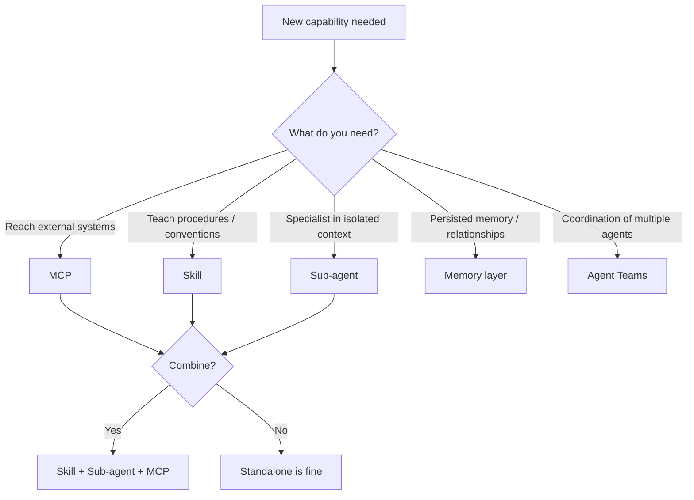

# AI Agent Architecture

[日本語版 (Japanese)](./README.ja.md)

> MCP alone is not enough — this repo addresses how Agents discover and orchestrate Skills, Tools, Memory, and Identity.

A repository documenting design principles, architecture, and practical knowledge for AI agent configuration (MCP, Skills, Agent, Memory, and Agent ID integration).

## 📚 Sister Projects

A 3-phase learning path: "Know LLMs → Know Agent Design → Apply to Systems."

| Phase | Project | Focus |
| :--- | :--- | :--- |
| **1. Know LLMs** | [understanding-llm-through-claude-code](https://github.com/shuji-bonji/understanding-llm-through-claude-code) | LLM structural constraints and the *why* behind configuration design |
| **2. Know Agent Design** | 👈 **This repository** | MCP, Skills, Agent, Memory & Agent ID — composition and implementation patterns (*what/how*) |
| **3. Apply to Systems** | [Management-of-software-systems-and-services](https://github.com/shuji-bonji/Management-of-software-systems-and-services) | _Coming soon_ — System operations in the AI era |

## 📖 Documentation

**Full documentation is available at:**

### **👉 [https://shuji-bonji.github.io/ai-agent-architecture/](https://shuji-bonji.github.io/ai-agent-architecture/)**

The documentation site provides:

- **Concepts & Vision** (8 chapters) — Why "stable reference sources" matter, the three-layer model, doctrine and intent, and the Memory layer / Knowledge Graph
- **MCP (Model Context Protocol)** — External integration layer with standardized protocols
- **Skills (Domain Knowledge)** — Static knowledge that complements MCP's real-time capabilities
- **Agents** — Agent taxonomy, sub-agents, quality gates, multi-agent / Agent Teams, A2A protocol, and **Agent ID** (the Agent ID era)
- **FAQ (3-line answers)** — Direct answers to common queries: *MCP vs Skills*, *Agent vs Sub-agent vs Skill vs MCP*
- **Strategy & Composition Patterns** — MCP × Skill × Agent composition design

## Why This Matters Now (as of May 2026)

The AI agent ecosystem has moved from "specification consideration" into **production operation phase**.

- **April 2026**: **Microsoft Entra Agent ID GA**, **Okta for AI Agents GA**, **A2A v1.0 GA** — Linux Foundation A2A protocol surpasses 150 participating organizations
- **December 2025**: **AGENTS.md** donated to Linux Foundation by OpenAI and Anthropic — industry standardization
- **October 2025**: **OpenID Foundation "Identity Management for Agentic AI" v1.1** — Agent ID systematization
- **November 2024**: Anthropic releases **MCP**

This site tracks these shifts and documents practical patterns for building production-ready agent systems.

## Core Architecture (Four-Layer Model + Doctrine)

```
┌─────────────────────────────────────────────────────────┐
│                      User Request                       │
└─────────────────────────┬───────────────────────────────┘
                          ▼
┌─────────────────────────────────────────────────────────┐
│  Doctrine Layer       (Constraints, objectives, judgment)│
├─────────────────────────────────────────────────────────┤
│  Agent Layer          (Orchestration & decision)         │
├─────────────────────────────────────────────────────────┤
│  Skills Layer         (Domain knowledge & guidelines)    │
├─────────────────────────────────────────────────────────┤
│  Memory Layer         (Persisted memory & relationships) │
├─────────────────────────────────────────────────────────┤
│  MCP Layer            (External tools & APIs)            │
└─────────────────────────────────────────────────────────┘
```

| Layer        | Role                                      | Examples                              |
| ------------ | ----------------------------------------- | ------------------------------------- |
| **Doctrine** | Constraints, objectives, judgment criteria | RFC 2119 normative ladder (MUST/SHOULD) |
| **Agent**    | Autonomous task execution                  | Claude Code, Cursor, sub-agents       |
| **Skills**   | Domain knowledge & best practices          | frontend-design, doc-coauthoring      |
| **Memory**   | Persisted facts & relationships            | Knowledge Graph, operational memory   |
| **MCP**      | External tool / API integration            | rfcxml-mcp, deepl-mcp                 |

## Quick Decision Flow

Need a quick answer? See the [FAQ section](https://shuji-bonji.github.io/ai-agent-architecture/faq/mcp-vs-skills) for 3-line decisions.


```mermaid
flowchart TD
    START[New capability needed] --> Q1{What do you need?}
    Q1 -->|Reach external systems| MCP[MCP]
    Q1 -->|Teach procedures / conventions| SKILL[Skill]
    Q1 -->|Specialist in isolated context| SUB[Sub-agent]
    Q1 -->|Persisted memory / relationships| MEM[Memory layer]
    Q1 -->|Coordination of multiple agents| TEAM[Agent Teams]

    MCP --> COMBINE{Combine?}
    SKILL --> COMBINE
    SUB --> COMBINE
    COMBINE -->|Yes| MIX[Skill + Sub-agent + MCP]
    COMBINE -->|No| SOLO[Standalone is fine]
```

For detailed decision guides, see:
- [MCP vs Skills FAQ](https://shuji-bonji.github.io/ai-agent-architecture/faq/mcp-vs-skills)
- [Agent / Sub-agent / Skill / MCP comparison FAQ](https://shuji-bonji.github.io/ai-agent-architecture/faq/agent-vs-subagent-vs-skill)
- [Sub-agent vs Skills](https://shuji-bonji.github.io/ai-agent-architecture/agents/subagent-vs-skill)

## Related Projects

### MCP Servers

| Repository                                                            | Description                           | npm                           |
| --------------------------------------------------------------------- | ------------------------------------- | ----------------------------- |
| [rfcxml-mcp](https://github.com/shuji-bonji/rfcxml-mcp)               | IETF RFC structured reference         | `@shuji-bonji/rfcxml-mcp`     |
| [xCOMET MCP Server](https://github.com/shuji-bonji/xcomet-mcp-server) | Translation quality evaluation        | `xcomet-mcp-server`           |
| [w3c-mcp](https://github.com/shuji-bonji/w3c-mcp)                     | W3C/WHATWG Web standards              | `@shuji-bonji/w3c-mcp`        |
| [epsg-mcp](https://github.com/shuji-bonji/epsg-mcp)                   | EPSG Coordinate Reference Systems     | `@shuji-bonji/epsg-mcp`       |
| [pdf-spec-mcp](https://github.com/shuji-bonji/pdf-spec-mcp)           | PDF specification (ISO 32000)         | `@shuji-bonji/pdf-spec-mcp`   |
| [pdf-reader-mcp](https://github.com/shuji-bonji/pdf-reader-mcp)       | PDF internal structure analysis       | `@shuji-bonji/pdf-reader-mcp` |
| [RxJS MCP Server](https://github.com/shuji-bonji/rxjs-mcp-server)     | RxJS stream execution & visualization | -                             |

### Skills / Plugins

| Repository                                                                                  | Description                                            | Type           |
| ------------------------------------------------------------------------------------------- | ------------------------------------------------------ | -------------- |
| [deepl-glossary-translation](https://github.com/shuji-bonji/deepl-glossary-translation)     | PDF spec glossary translation (pdf-spec-mcp + DeepL)   | Skill          |
| [code-review-skill](https://github.com/shuji-bonji/code-review-skill)                       | Code review for TypeScript/MCP Server projects         | Skill          |
| [spec-compliance-skills](https://github.com/shuji-bonji/spec-compliance-skills)             | W3C/IETF spec compliance checking (EPUB 3.3 supported) | Cowork Plugin  |

## Templates

| Template                                   | Purpose                                 |
| ------------------------------------------ | --------------------------------------- |
| [templates/skill/](./templates/skill/)     | Skill definition templates and examples |
| [templates/command/](./templates/command/) | Command (slash command) templates       |

## References

- [Reference Links](./references/links.md) — MCP, A2A, Agent ID, and related standards
- [Skills Links](./references/skills/links.md) — Vercel Skills & Agent Skills Specification

## Note

This documentation reflects the author's practical insights gained through building and operating AI agent systems with Claude. It is not official documentation from Anthropic or any other organization. Contributions and discussions via [GitHub Issues](https://github.com/shuji-bonji/ai-agent-architecture/issues) are welcome.

## License

Released under the MIT License. Copyright © 2025-2026 shuji-bonji
