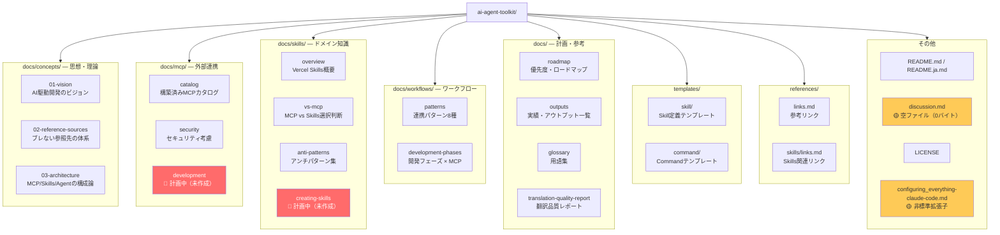
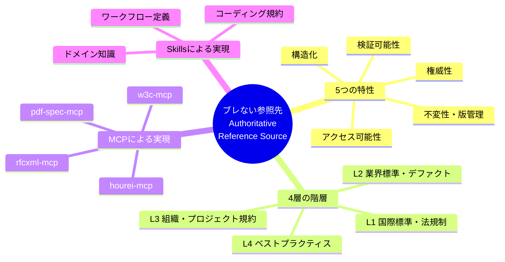
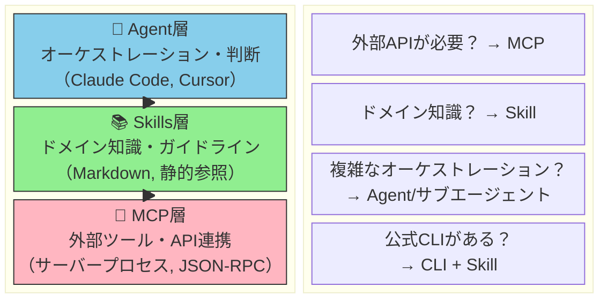
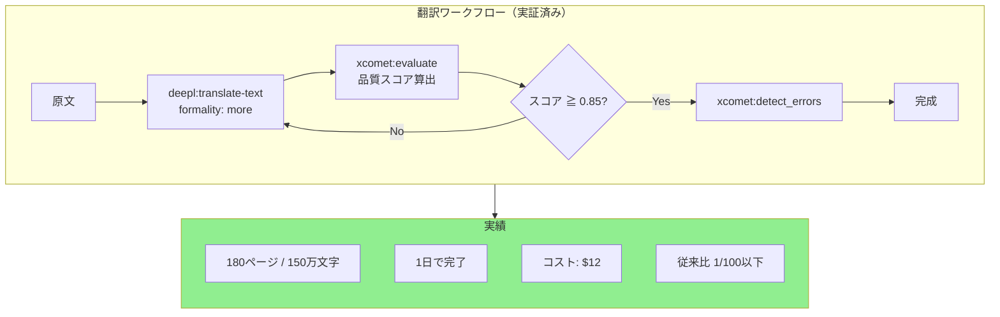
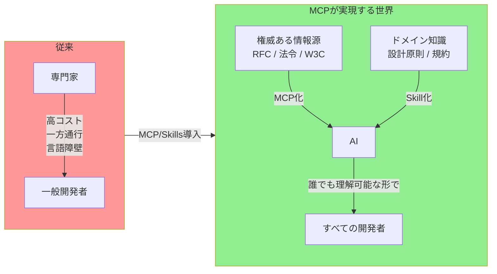
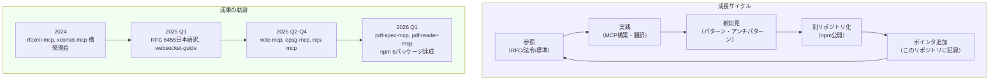
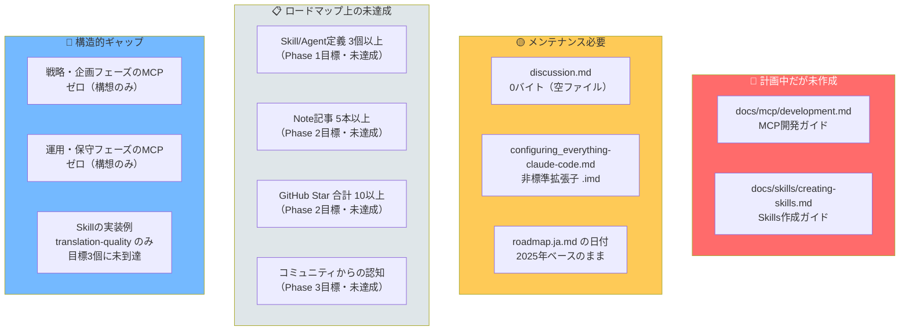
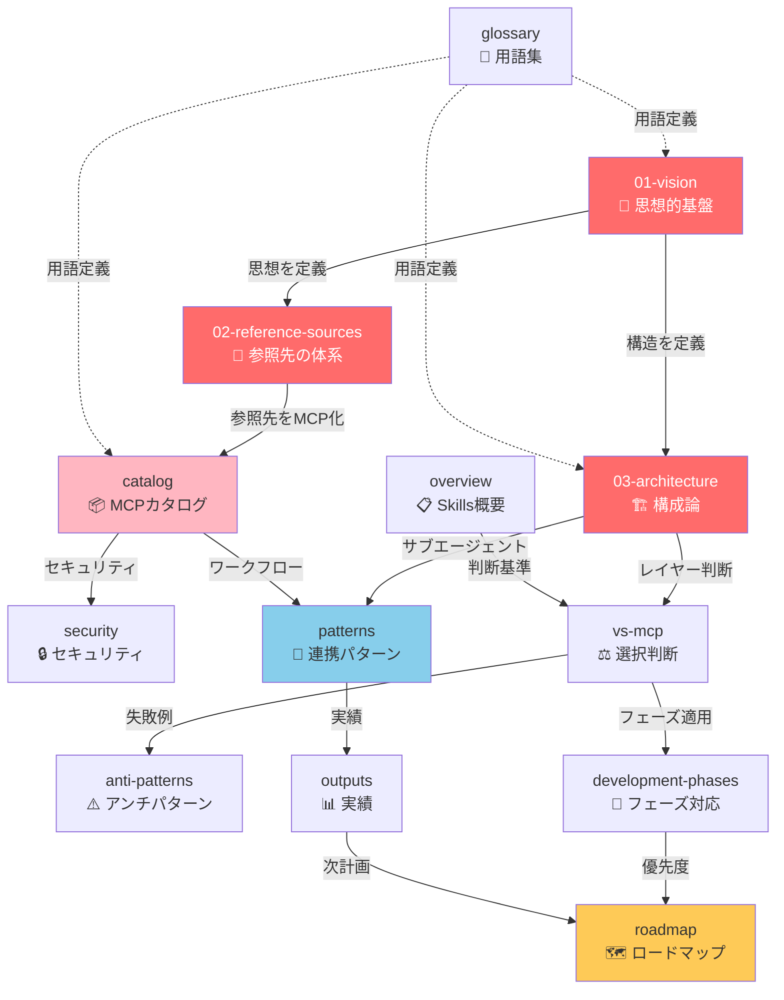
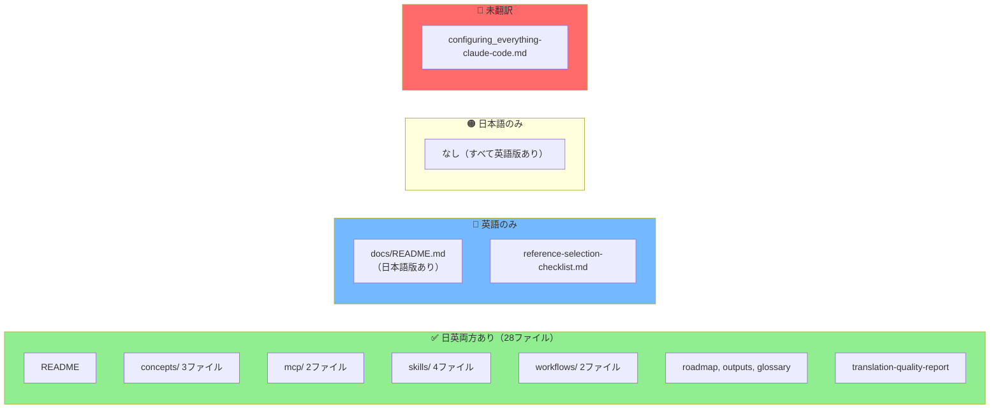
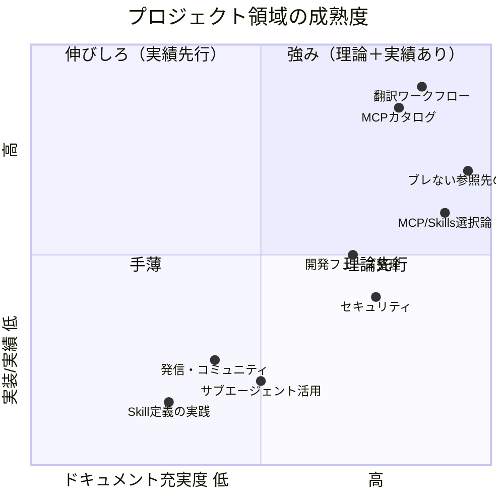

# AI Agent Toolkit 構造分析レポート

> 59ファイル（.git除く）を横断分析し、プロジェクトの構造・テーマ・ギャップを可視化する。

## 基本情報

| 項目                 | 値                                                       |
| -------------------- | -------------------------------------------------------- |
| **総ファイル数**     | 59（.git除く）                                           |
| **日付範囲**         | 2026年1月中旬 〜 2026年2月8日                            |
| **コンテンツ種別**   | Markdown（日英バイリンガル）、テンプレート、設定ファイル |
| **ドキュメント構造** | v2リストラクチャリング済み                               |
| **Gitリポジトリ**    | あり（コミット履歴管理中）                               |

## ドキュメント構成マップ

## パターン1: 「ブレない参照先」— プロジェクトの思想的基盤

プロジェクト全体を貫く最も強いテーマ。12ファイル以上で繰り返し言及されている。

### 具体的な登場箇所

| ドキュメント                 | 文脈                                                           |
| ---------------------------- | -------------------------------------------------------------- |
| `01-vision.ja.md`            | 核心メッセージとして定義：「AIの判断にはブレない参照先が必要」 |
| `02-reference-sources.ja.md` | 680行にわたる体系的解説（5特性・4層モデル・判定基準）          |
| `03-architecture.ja.md`      | MCPとSkillsを「ブレない参照先」を実現する2手段として位置づけ   |
| `README.ja.md`               | リポジトリ冒頭で「MCPだけでは不十分」と宣言                    |
| `catalog.ja.md`              | 各MCPが「ブレない参照先」のどの層に対応するか整理              |
| `security.ja.md`             | OWASP MCP Top 10を「ブレない参照先」として活用                 |

## パターン2: MCP / Skills / Agent 三層アーキテクチャ

プロジェクトの構造的骨格。「何をどのレイヤーで実装するか」の判断基準が一貫して示されている。

### 具体的な登場箇所

| ドキュメント               | 役割                                                 |
| -------------------------- | ---------------------------------------------------- |
| `03-architecture.ja.md`    | 構成論の詳細（MCP/A2A/Skill/サブエージェント比較）   |
| `vs-mcp.ja.md`             | MCP vs Skills の本質的な違いと選択判断フロー         |
| `anti-patterns.ja.md`      | over-MCPization / over-Skillization のアンチパターン |
| `development-phases.ja.md` | 開発フェーズごとにどの層を使うか整理                 |
| `README.ja.md`             | 冒頭の比較表で概要提示                               |

## パターン3: 翻訳ワークフローの確立

DeepL + xCOMET による翻訳品質保証は、最も具体的な成功事例として繰り返し語られている。

### 具体的な登場箇所

| ドキュメント      | 文脈                                                           |
| ----------------- | -------------------------------------------------------------- |
| `patterns.ja.md`  | パターン1（技術文書翻訳）・パターン2（大規模バッチ）として定義 |
| `catalog.ja.md`   | xcomet-mcp-server と deepl-mcp の連携として記述                |
| `outputs.ja.md`   | RFC 6455日本語訳・大規模翻訳の成果数値                         |
| `roadmap.ja.md`   | 翻訳ワークフローSkill作成がPhase 1タスク                       |
| `01-vision.ja.md` | AI→人間の知識変換例として言及                                  |

## パターン4: 「知識の民主化」— 社会的ビジョン

技術的手段を超えた社会的価値観として、プロジェクト全体の動機を形成している。

### 具体的な登場箇所

| ドキュメント                 | 文脈                                                    |
| ---------------------------- | ------------------------------------------------------- |
| `01-vision.ja.md`            | 「知識の民主化」セクションで体系的に解説                |
| `02-reference-sources.ja.md` | 参照先MCPの価値として「知識へのアクセスが民主化される」 |
| `roadmap.ja.md`              | 発信戦略の記事テーマ「知識の民主化 — MCPの本質的価値」  |
| `outputs.ja.md`              | 翻訳成果を「民主化」の具体例として位置づけ              |

## パターン5: 実証ベースの成長サイクル

ドキュメント群全体に「参照→実践→新知見→別リポジトリ化→ポインタ追加」という成長パターンが見られる。

## ギャップ分析

プロジェクトの構造から特定できる未完了・不整合な部分。

### ギャップ詳細

| カテゴリ     | 項目                        | 影響度 | 対策案                                                                                             |
| ------------ | --------------------------- | ------ | -------------------------------------------------------------------------------------------------- |
| 未作成       | `mcp/development.md`        | 中     | MCP開発の実践知を蓄積しているので、既存知見からまとめられる                                        |
| 未作成       | `skills/creating-skills.md` | 高     | Skills推進の障壁。テンプレートは存在するので接続が必要                                             |
| 空ファイル   | `discussion.md`             | 低     | 用途を明確化するか、削除して整理                                                                   |
| 非標準       | `.imd` 拡張子               | 低     | `.md` にリネームすべき                                                                             |
| ロードマップ | 日付が2025年ベース          | 中     | 現在2026年。Phase 1/2のタイムラインを更新すべき                                                    |
| 実装不足     | Skill/Agent定義             | 中     | `.claude/skills/translation-quality/` に1つ実装あり。ただしロードマップ目標の「3個以上」には未到達 |
| カバレッジ   | 戦略・運用フェーズ          | 低     | 本プロジェクトのスコープ外と明言されているが、意識はしておく                                       |

## ドキュメント間の関連性マップ

## 日英バイリンガル構成の網羅性

バイリンガル対応は非常に良好。ほぼ全ファイルが日英両方存在する。

## 総合評価

### まとめ

このプロジェクトは「AI駆動開発の基盤となるブレない参照先の構築戦略」というビジョンが極めて明確で、理論（concepts/）→手段（mcp/, skills/）→実践（workflows/）→実績（outputs/）→計画（roadmap/）という流れがきれいに整理されています。

**最大の強み**: 理論と実績の両方が揃っている翻訳ワークフロー、MCPカタログの充実度、MCP/Skills/Agent三層モデルの論理的整合性。

**最大のギャップ**: Skills/サブエージェントの理論は充実しているが、実装は `translation-quality` Skill の1つのみ。テンプレート・アンチパターン・8つの連携パターンが揃っているのに、実際の `.claude/skills/` と `.claude/agents/` がほぼ空。ロードマップ目標の「3個以上」に未到達。

_分析日: 2026年2月11日 | 対象: ai-agent-toolkit リポジトリ全59ファイル_
