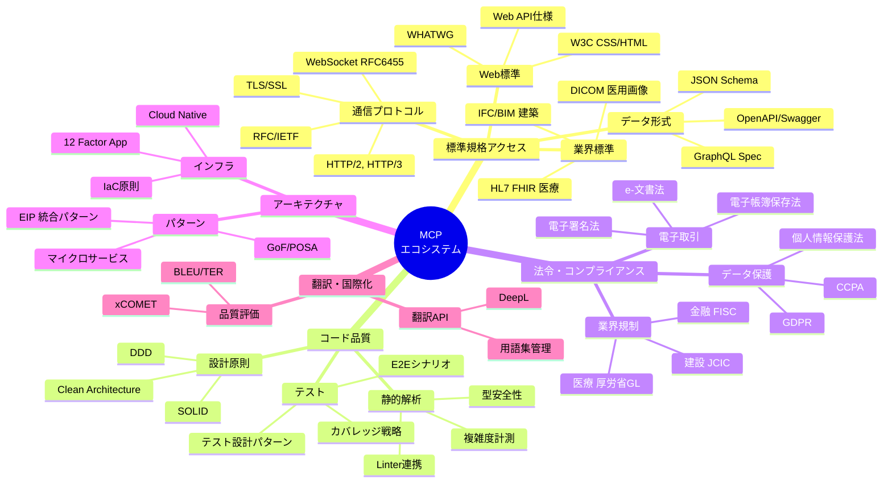
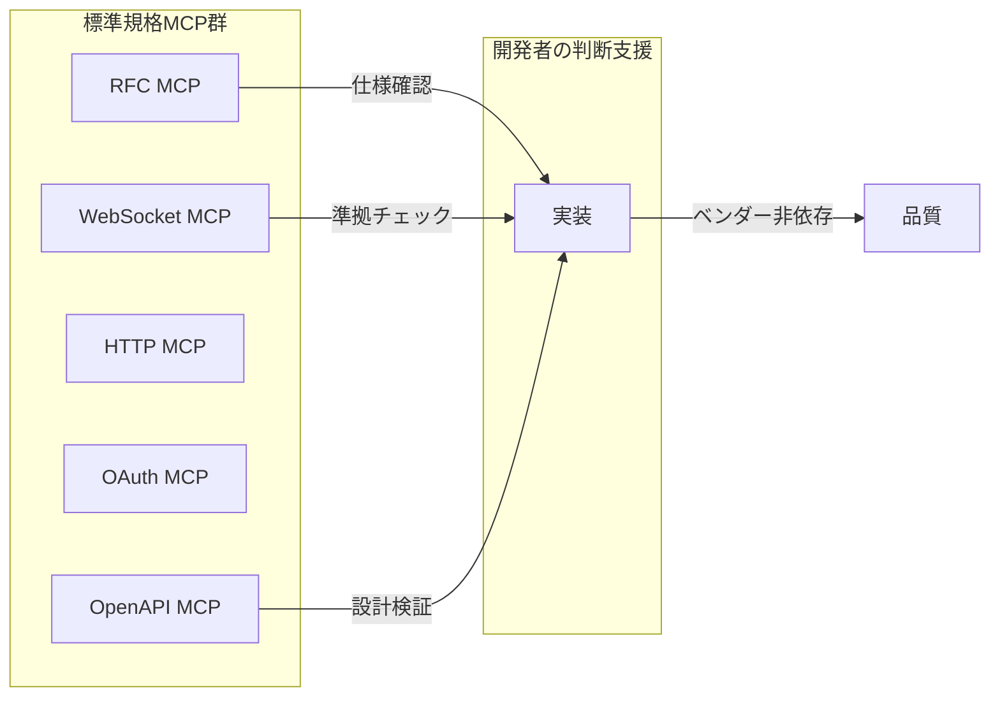
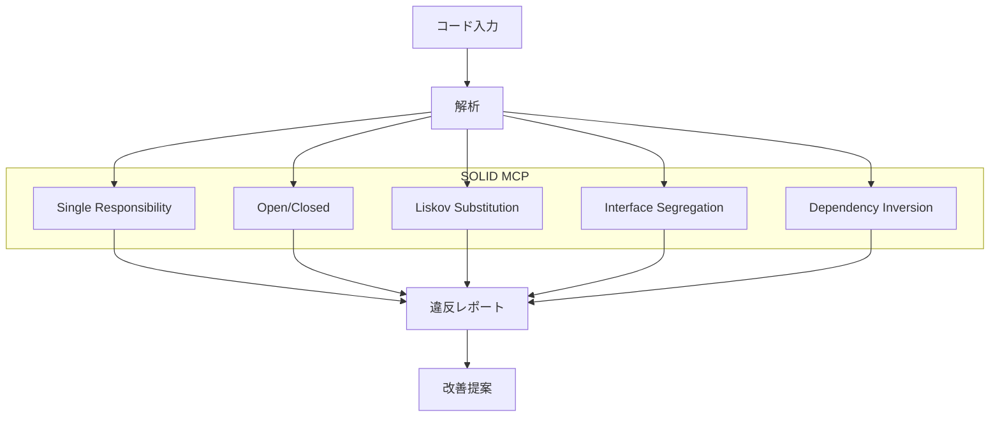
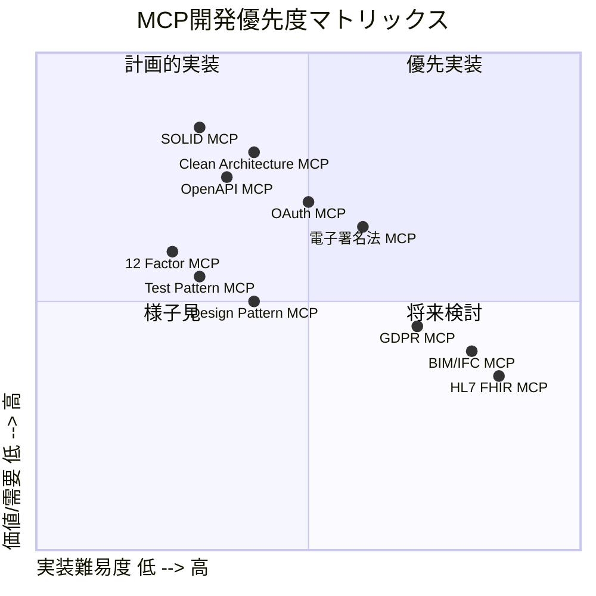

# MCP構築戦略マップ

## 全体像



## カテゴリ別 MCP開発ロードマップ

### 1. 標準規格アクセス系（ベンダーロックイン防止）

現在Shujiさんが取り組んでいる領域。「仕様に基づいて実装する」ための知識民主化。

| MCP名               | 目的                    | 対象仕様              | 優先度 |
| ------------------- | ----------------------- | --------------------- | ------ |
| **RFC MCP** ✅      | 通信プロトコル仕様参照  | IETF RFC全般          | 実装済 |
| **WebSocket MCP**   | RFC 6455の要件チェック  | RFC 6455              | 高     |
| **HTTP MCP**        | HTTP/1.1, 2, 3仕様参照  | RFC 7230-7235, 9110等 | 高     |
| **CSS MCP**         | CSS仕様・プロパティ参照 | W3C CSS Spec          | 中     |
| **HTML MCP**        | HTML Living Standard    | WHATWG                | 中     |
| **OpenAPI MCP**     | API設計の仕様準拠確認   | OpenAPI 3.x Spec      | 高     |
| **JSON Schema MCP** | スキーマ検証・設計支援  | JSON Schema Draft     | 中     |
| **OAuth MCP**       | 認証フロー仕様確認      | RFC 6749, 7636等      | 高     |
| **JWT MCP**         | トークン仕様・検証      | RFC 7519              | 中     |



### 2. コード品質・設計原則系

「良いコードとは何か」をAIと共有するためのMCP。

| MCP名                      | 目的                     | 対象原則/パターン | 優先度 |
| -------------------------- | ------------------------ | ----------------- | ------ |
| **SOLID MCP**              | 設計原則違反の検出・提案 | SOLID原則         | 高     |
| **Clean Code MCP**         | コード品質チェック       | Robert C. Martin  | 高     |
| **Design Pattern MCP**     | パターン適用提案         | GoF 23パターン    | 中     |
| **Refactoring MCP**        | リファクタリング手法提案 | Fowler Catalog    | 中     |
| **DDD MCP**                | ドメイン駆動設計支援     | Eric Evans DDD    | 中     |
| **Clean Architecture MCP** | レイヤー設計確認         | Uncle Bob         | 高     |

#### SOLID MCP の想定機能



**想定ツール例**:

- `check_srp`: クラス/関数の責務分析
- `check_ocp`: 拡張ポイントの確認
- `check_lsp`: 継承関係の妥当性
- `check_isp`: インターフェース肥大化検出
- `check_dip`: 依存方向の確認
- `suggest_refactoring`: 原則に基づく改善提案

### 3. テスト設計・品質保証系

| MCP名                     | 目的                   | 対象              | 優先度 |
| ------------------------- | ---------------------- | ----------------- | ------ |
| **Test Pattern MCP**      | テストパターン提案     | xUnit Patterns    | 高     |
| **BDD MCP**               | シナリオ設計支援       | Gherkin/Cucumber  | 中     |
| **Coverage Strategy MCP** | カバレッジ戦略         | 境界値/同値分割等 | 中     |
| **TDD MCP**               | Red-Green-Refactor支援 | TDD原則           | 中     |

### 4. 法令・コンプライアンス系

「この実装は法的に大丈夫か？」を確認するためのMCP。

| MCP名                  | 目的                     | 対象法令       | 優先度                |
| ---------------------- | ------------------------ | -------------- | --------------------- |
| **GDPR MCP**           | EU個人データ保護確認     | GDPR条文       | 中                    |
| **個人情報保護法 MCP** | 日本の個人情報対応       | 個人情報保護法 | 高                    |
| **電子署名法 MCP**     | 電子署名要件確認         | 電子署名法     | 高（Shujiさんの専門） |
| **電子帳簿保存法 MCP** | 電子保存要件             | 電帳法         | 中                    |
| **セキュリティGL MCP** | セキュリティガイドライン | OWASP, IPA等   | 高                    |

### 5. アーキテクチャ・インフラ系

| MCP名                 | 目的                   | 対象                            | 優先度 |
| --------------------- | ---------------------- | ------------------------------- | ------ |
| **12 Factor MCP**     | クラウドネイティブ原則 | 12 Factor App                   | 高     |
| **EIP MCP**           | 統合パターン参照       | Enterprise Integration Patterns | 中     |
| **Microservices MCP** | マイクロサービス設計   | Sam Newman等                    | 中     |
| **IaC Pattern MCP**   | インフラ設計パターン   | Terraform/Pulumi等              | 低     |

### 6. 業界特化系

Shujiさんが検討されていた領域。

| MCP名            | 目的                 | 対象仕様          | 優先度           |
| ---------------- | -------------------- | ----------------- | ---------------- |
| **BIM/IFC MCP**  | 建築情報モデル       | buildingSMART IFC | 検討中           |
| **HL7 FHIR MCP** | 医療情報交換         | HL7 FHIR R4       | 検討中           |
| **DICOM MCP**    | 医用画像             | DICOM Standard    | 低               |
| **PDF MCP**      | PDF仕様（ISO 32000） | ISO 32000-2:2020  | 検討中（取得済） |

## 開発優先度マトリックス



## 推奨開発順序

### Phase 1: 基盤固め（即座に価値を発揮）

```
1. SOLID MCP          - 日常的なコードレビュー支援
2. Clean Architecture MCP - レイヤー設計の確認
3. OpenAPI MCP        - API設計の標準準拠
```

### Phase 2: 標準規格拡充

```
4. OAuth MCP          - 認証実装の仕様準拠
5. HTTP MCP           - プロトコル理解の深化
6. 12 Factor MCP      - クラウドネイティブ対応
```

### Phase 3: 専門領域

```
7. 電子署名法 MCP     - Shujiさんの専門活用
8. Test Pattern MCP   - テスト品質向上
9. PDF MCP            - ISO仕様活用
```

## 議論ポイント

1. **SOLID MCP の実装アプローチ**
   - 静的解析ベース vs パターンマッチング vs LLM判断支援？
   - TypeScript/Angular特化 vs 汎用？

2. **法令系MCPの粒度**
   - 条文参照のみ vs 判断支援まで含む？
   - 免責事項の扱い

3. **業界特化MCPの需要検証**
   - DeepL Bridgesコミュニティでの反応確認？
   - オープンライセンスの確保
