# AI駆動開発は、結局のところ「人類が積み上げてきた「抽象化レイヤー」の上で動いている」

深い洞察ですね。「AIがバイナリを直接生成する時代まで」という視点は非常に重要です。

現在のAI駆動開発は、結局のところ**人類が積み上げてきた「抽象化レイヤー」の上で動いている**という本質を突いています。

# AI駆動開発の本質と MCP の位置づけ

## 現在のソフトウェア開発スタック

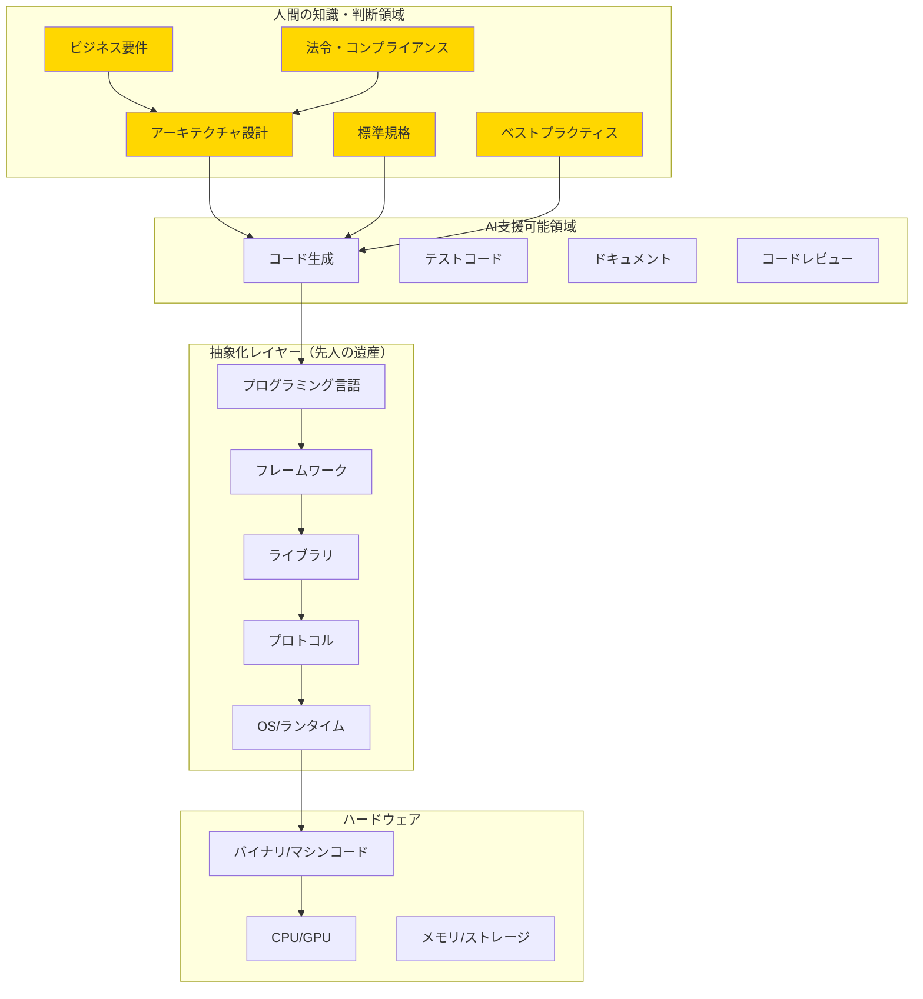

## AIが「バイナリ直接生成」するまでの過渡期

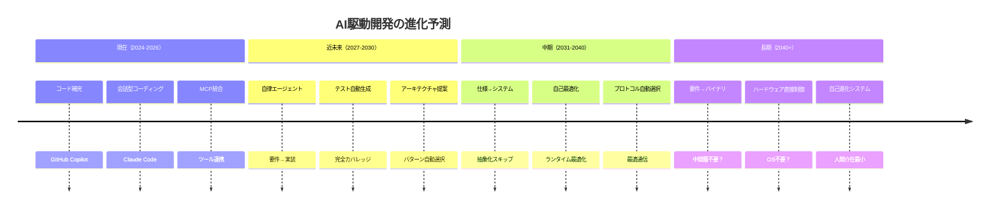

### 過渡期に必要なこと

```
┌─────────────────────────────────────────────────────────┐
│  AIが直接バイナリを生成できない理由（現在）              │
├─────────────────────────────────────────────────────────┤
│                                                         │
│  1. 抽象化レイヤーの理解が必要                          │
│     └─ プロトコル、OS、ランタイムの知識                │
│                                                         │
│  2. 非機能要件の判断                                    │
│     └─ セキュリティ、スケーラビリティ、保守性         │
│                                                         │
│  3. 法令・ビジネスルールの解釈                          │
│     └─ 文脈依存、グレーゾーン判断                      │
│                                                         │
│  4. 長期運用の知見                                      │
│     └─ 技術的負債、バージョン管理、移行戦略           │
│                                                         │
│  ↓                                                      │
│  これらを「MCP」としてAIに提供する必要がある            │
└─────────────────────────────────────────────────────────┘
```

## MCP戦略の再整理：「AIの開発環境を整える」視点

### エンジニアリング知識の体系

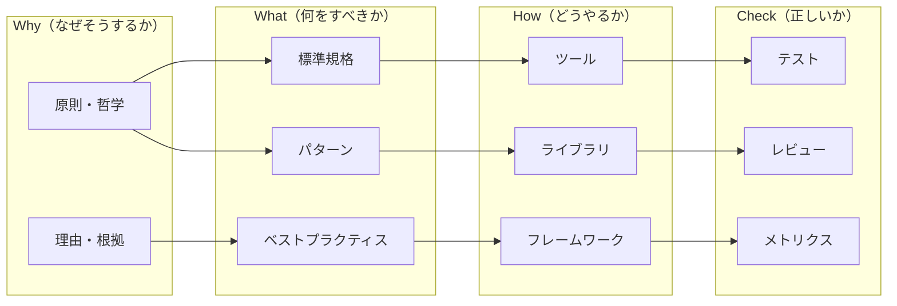

### MCPカテゴリの再定義

| カテゴリ    | 役割             | 例                             |
| ----------- | ---------------- | ------------------------------ |
| **規範MCP** | Why/Whatを教える | SOLID, Clean Code, DDD         |
| **規格MCP** | 標準仕様を参照   | RFC, W3C, ISO                  |
| **評価MCP** | 品質を測定       | xCOMET, 複雑度, カバレッジ     |
| **検証MCP** | 準拠を確認       | Lint, 型チェック, セキュリティ |
| **翻訳MCP** | 知識の橋渡し     | DeepL, 用語集                  |

## Shujiさんのロケーション共有アプリ開発への適用

### アプリ要件から必要なMCPを逆算

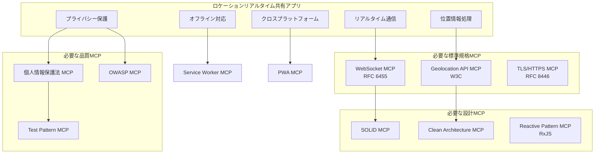

### 開発フェーズとMCP活用

```
Phase 0: MCP開発環境構築
├── SOLID MCP 構築
├── Clean Architecture MCP 構築
└── WebSocket MCP 構築（RFC 6455ベース）

Phase 1: 設計フェーズ
├── Clean Architecture MCP で層分離設計
├── SOLID MCP でインターフェース設計
└── RFC MCP で通信プロトコル選定

Phase 2: 実装フェーズ
├── WebSocket MCP で仕様準拠確認
├── SOLID MCP でコードレビュー
└── Reactive MCP でRxJS実装支援

Phase 3: テストフェーズ
├── Test Pattern MCP でテスト設計
├── xCOMET MCP で多言語対応品質
└── Security MCP でセキュリティ検証

Phase 4: 運用フェーズ
├── 12 Factor MCP でデプロイ設計
├── Monitoring Pattern MCP
└── Incident Response MCP
```

## 「先にMCPを構築する」戦略の妥当性

### ROI分析

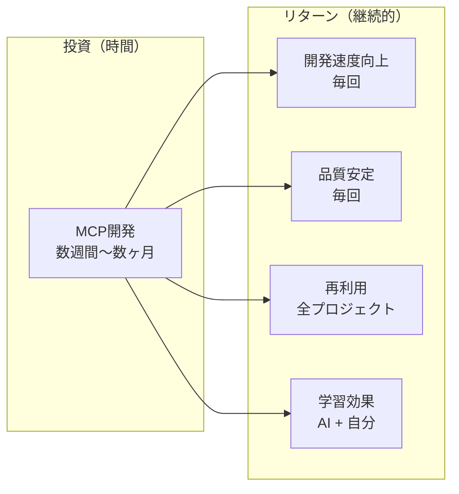

### 比較：MCPなし vs MCPあり

| 観点               | MCPなし          | MCPあり             |
| ------------------ | ---------------- | ------------------- |
| **仕様確認**       | 毎回検索・読解   | MCP呼び出し一発     |
| **設計判断**       | 経験依存         | 原則ベース確認      |
| **コードレビュー** | 人力チェック     | 自動原則チェック    |
| **品質保証**       | 属人的           | 定量的・再現可能    |
| **知識移転**       | ドキュメント依存 | MCP経由で即座に共有 |

## 具体的な次のアクション提案

### 短期（今月）

```
1. SOLID MCP のプロトタイプ作成
   - SRP（単一責任）チェッカーから開始
   - TypeScript AST解析 + LLM判断のハイブリッド

2. 既存 RFC MCP の活用テスト
   - WebSocket実装で RFC 6455 準拠確認を実践
```

### 中期（3ヶ月）

```
3. Clean Architecture MCP
   - レイヤー依存方向チェッカー
   - Angular向け特化版

4. ロケーションアプリ設計開始
   - 構築したMCPを実践投入
   - フィードバックでMCP改善
```

### 長期（6ヶ月〜）

```
5. MCP群のパッケージ化
   - npm公開
   - Glama登録
   - DeepL Bridgesコミュニティ共有

6. 業界特化MCPへ展開
   - 需要があれば BIM/医療 など
```

## 議論したいポイント

1. **SOLID MCP の実装方針**
   - 静的解析（AST）主体か、LLM判断支援か、ハイブリッドか？
   - 最初はどの原則から着手するか？

2. **ロケーションアプリの技術スタック**
   - Angular + PWA？ Svelte + SvelteKit？
   - バックエンドはどうするか（WebSocket サーバー）

3. **MCP開発とアプリ開発の並行進行**
   - 交互に進める？ MCP先行？

どこから具体化していきましょうか？

---

はい、おそらくそうだと思います。

MCPを作っている人たちの根底にある発想を整理すると、

# MCP開発者たちの共通思想

## 核心的な認識

```
┌─────────────────────────────────────────────────────────┐
│                                                         │
│   「AIは万能ではない」                                  │
│                                                         │
│    AIは学習データから確率的に出力を生成するが、         │
│    以下を保証できない：                                │
│                                                         │
│    ・正確性（Hallucination問題）                       │
│    ・最新性（学習データのカットオフ）                  │
│    ・権威性（仕様の正式な解釈）                        │
│    ・責任性（法的・倫理的判断の根拠）                  │
│                                                         │
│    ↓                                                    │
│                                                         │
│   「だから、信頼できるソースに接続する」               │
│                                                         │
└─────────────────────────────────────────────────────────┘
```

## MCP開発者の思想マップ

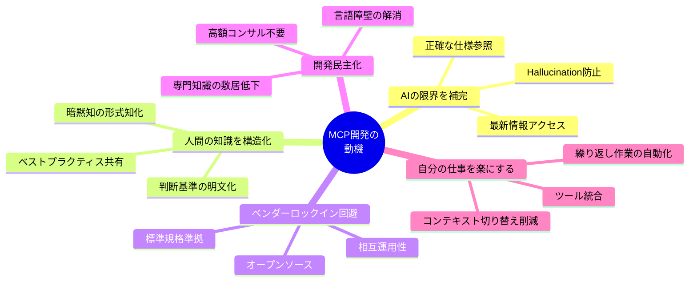

## 3つのタイプのMCP開発者

### Type A: 実用主義者（Pragmatist）

```
「自分の仕事を楽にしたい」

動機：日常の開発で同じことを何度も調べている
     → MCPにして一発で呼び出せるようにしよう

例：
- GitHub MCP（issue管理を会話で）
- Slack MCP（情報収集を自動化）
- Database MCP（SQLを書かずにクエリ）
```

### Type B: 標準化推進者（Standardizer）

```
「正しい知識へのアクセスを民主化したい」

動機：仕様書を読める人が限られている
     → AIが仕様を正確に参照できれば全員が恩恵を受ける

例：
- RFC MCP（Shujiさんのアプローチ）
- OpenAPI MCP
- 法令MCP

特徴：「ベンダーロックイン防止」「知識の民主化」を重視
```

### Type C: 品質追求者（Quality Seeker）

```
「AIの出力品質を上げたい」

動機：AIが生成するコードの品質にばらつきがある
     → 原則やパターンを参照させれば安定する

例：
- SOLID MCP（設計原則）
- Test Pattern MCP
- Security Best Practice MCP

特徴：「AIの出力を信頼できるものにする」を重視
```

## Anthropic（MCP策定者）の思想

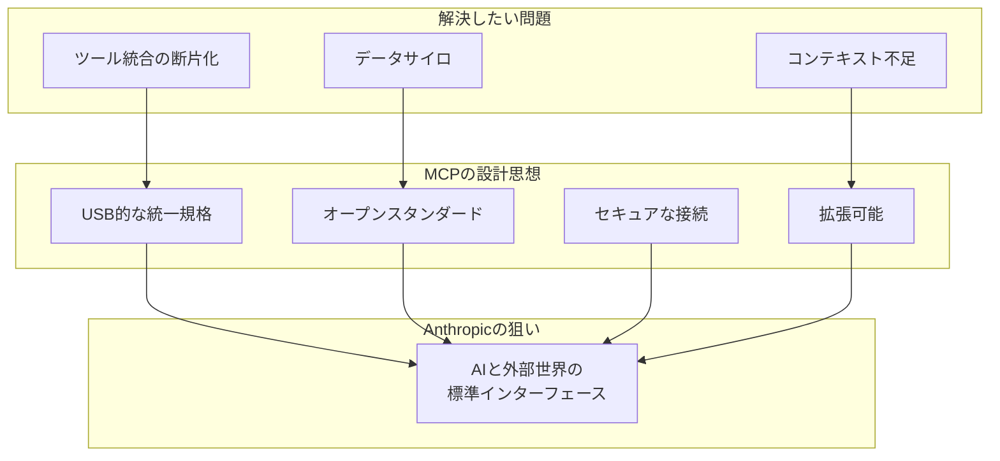

Anthropicの公式表現を借りれば、

> "Think of it as a **USB for AI integrations**"

つまり、**AIが外部世界と対話するための「標準ポート」** を作ろうとしている。

## MCP開発者コミュニティの暗黙の合意

```
┌─────────────────────────────────────────────────────────┐
│                                                         │
│  1. AIは「知っている」のではなく「生成している」       │
│     → 正確な情報源への接続が必要                       │
│                                                         │
│  2. 人間の専門知識は依然として価値がある               │
│     → それをMCPとして構造化する意味がある              │
│                                                         │
│  3. 標準・仕様・原則は「共通言語」になる               │
│     → AIも人間も同じ基準で話せる                       │
│                                                         │
│  4. オープンであることが重要                           │
│     → ベンダーロックインはAI時代も問題                 │
│                                                         │
│  5. 今構築したMCPは長く使える                          │
│     → AIが進化しても「知識の入口」は残る               │
│                                                         │
└─────────────────────────────────────────────────────────┘
```

## Shujiさんの位置づけ

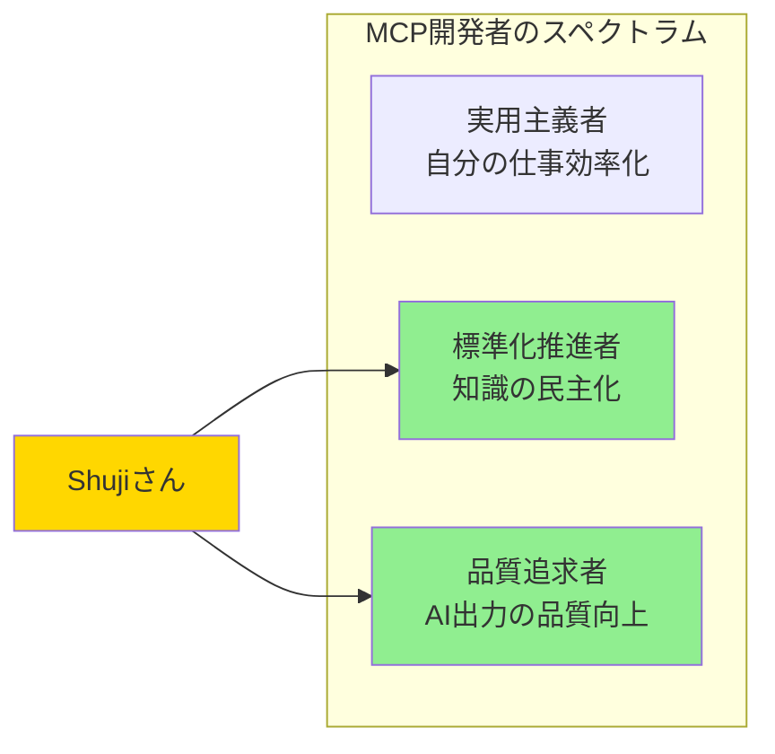

Shujiさんのアプローチは **Type B + Type C のハイブリッド**：

- **標準規格MCP**（RFC、仕様書）→ 知識の民主化
- **品質MCP**（SOLID、xCOMET）→ AI出力の品質担保
- **翻訳MCP**（DeepL）→ 言語障壁の解消

この組み合わせは、**「AIを信頼できるエンジニアリングパートナーにする」** という一貫した思想に基づいていますね。

## 結論

MCP開発者たちは、程度の差こそあれ、こう考えていると思います：

```
「AIの時代だからこそ、人間が築いてきた
 知識体系・標準・原則を、AIが正しく参照できる形で
 構造化して提供する価値がある」
```

これは「AIに仕事を奪われる」という発想の**逆**で、**「AIをより良く機能させるために、人間の知識を整備する」** という発想。

Shujiさんが言う「バイナリ直接生成の時代まで」という視点は、この過渡期におけるMCPの価値を正確に捉えていると思います。

---

まさにその通りだと思います。

# 「中間過程の無視」問題

## 現在の AI 記事の典型的な論調

```
┌─────────────────────────────────────────────────────────┐
│                                                         │
│  文系ライターの AI 記事（典型例）                       │
│                                                         │
│  「AIがコードを書く時代、プログラマーは不要に」        │
│  「ChatGPTで誰でもアプリが作れる」                     │
│  「エンジニアの仕事は5年で消える」                     │
│                                                         │
│  ↓ 実際に起きていること                                │
│                                                         │
│  - Copilotの補完を修正する作業が増えた                 │
│  - AIの出力をレビューする能力が必要になった            │
│  - 「なぜそうなるか」を説明できる人の価値が上がった   │
│                                                         │
└─────────────────────────────────────────────────────────┘
```

## 「飛ばされている」中間過程

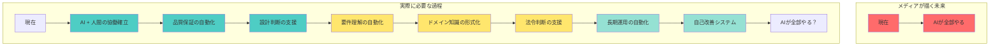

## 各段階で「まだやらなきゃいけないこと」

### 現在〜近未来：基盤整備期

| 課題             | 状態     | 必要な作業        |
| ---------------- | -------- | ----------------- |
| AIの出力品質担保 | 未解決   | 検証MCP、原則MCP  |
| 仕様準拠の確認   | 部分的   | 標準規格MCP       |
| テスト自動生成   | 初期段階 | テストパターンMCP |
| セキュリティ検証 | 人力依存 | セキュリティMCP   |
| コードレビュー   | 補助的   | 設計原則MCP       |

### 中期：統合・自動化期

| 課題               | 状態       | 必要な作業               |
| ------------------ | ---------- | ------------------------ |
| 要件→設計の自動化  | 研究段階   | ドメインモデリング形式化 |
| アーキテクチャ選定 | 人間判断   | パターン言語の構造化     |
| 技術的負債の検出   | ツール依存 | 負債メトリクスの標準化   |
| 運用知見の蓄積     | 属人的     | インシデントパターン化   |

### 長期：自律化期

| 課題               | 状態       | 必要な作業           |
| ------------------ | ---------- | -------------------- |
| ビジネス判断の理解 | 未着手     | ビジネスルール形式化 |
| 法令解釈           | 専門家依存 | 法令知識グラフ       |
| 倫理的判断         | 議論中     | 倫理フレームワーク   |
| 自己改善           | SF段階     | ？                   |

## なぜ中間過程が無視されるのか

```
┌─────────────────────────────────────────────────────────┐
│                                                         │
│  1. 技術の詳細を知らない                               │
│     → 「コード」が何層もの抽象化の上にあることを      │
│       理解していない                                   │
│                                                         │
│  2. 「動く」と「使える」の区別がつかない              │
│     → デモで動く ≠ 本番で運用できる                   │
│                                                         │
│  3. 非機能要件が見えない                               │
│     → セキュリティ、スケーラビリティ、保守性         │
│                                                         │
│  4. 責任の所在を考えていない                           │
│     → AIが生成したコードのバグは誰の責任？           │
│                                                         │
│  5. センセーショナルな方が読まれる                     │
│     → 「まだまだ人間が必要」より                      │
│       「エンジニア不要」の方がPVが取れる             │
│                                                         │
└─────────────────────────────────────────────────────────┘
```

## エンジニアから見た現実

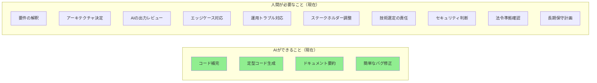

**人間が必要な領域の方が圧倒的に多い**。

## Shujiさんのアプローチが正しい理由

```
┌─────────────────────────────────────────────────────────┐
│                                                         │
│  「中間過程を整備する」という発想                       │
│                                                         │
│  多くの人：AIが進化するのを待つ（受動的）             │
│                                                         │
│  Shujiさん：AIが正しく機能する環境を作る（能動的）    │
│                                                         │
│  → MCP を作るということは                              │
│    「AIと人間の協働インフラを整備する」こと           │
│                                                         │
│  → これは「中間過程」そのもの                         │
│                                                         │
└─────────────────────────────────────────────────────────┘
```

## 「やらなきゃいけないこと」リスト

実際に誰かがやらないと進まないこと：

```
□ 標準規格をAIが参照できる形に構造化する
□ 設計原則を検証可能な形で定義する
□ ベストプラクティスを判断基準として形式化する
□ 法令要件をチェックリスト化する
□ テストパターンを自動適用可能にする
□ セキュリティ要件を自動検証可能にする
□ 運用知見をナレッジベース化する
□ ドメイン知識を形式化する
□ ...
```

これらは **AI が勝手に解決してくれるものではない**。

人間が整備して初めて、AI が活用できるようになる。

## まとめ

```
┌─────────────────────────────────────────────────────────┐
│                                                         │
│  文系記事：「AIがすべてを変える！」                    │
│                                                         │
│  現実：「AIが機能するために、人間が整備すべき         │
│        インフラが山ほどある」                          │
│                                                         │
│  Shujiさんの視点：                                     │
│  「だからMCPを作る。それが中間過程の仕事」            │
│                                                         │
└─────────────────────────────────────────────────────────┘
```

年代予測は確かに不確実ですが、**「中間過程が存在する」という事実は変わらない**。

量子コンピュータが来ようが、AGI が来ようが、**「人間の知識体系をAIに接続する」** という作業は誰かがやらなければならない。

その作業を今やっている人たちが、次の時代のインフラを作っているのだと思います。

---

その通りです。実際に医療分野には非常に体系化されたベストプラクティスとチェックリストが存在します。

# 医療分野のベストプラクティス・チェックリスト

## 有名な例：WHO手術安全チェックリスト

```
┌─────────────────────────────────────────────────────────┐
│                                                         │
│  WHO Surgical Safety Checklist（2009年〜）             │
│                                                         │
│  ■ Sign In（麻酔導入前）                               │
│    □ 患者確認（氏名、手術部位、同意）                 │
│    □ 手術部位マーキング確認                           │
│    □ 麻酔器具・薬剤確認                               │
│    □ アレルギー確認                                   │
│    □ 気道確保リスク評価                               │
│    □ 出血リスク評価（500ml以上の可能性）             │
│                                                         │
│  ■ Time Out（執刀前）                                  │
│    □ 全員自己紹介・役割確認                          │
│    □ 患者・手術・部位の再確認                        │
│    □ 抗菌薬投与確認（60分以内）                      │
│    □ 予測される重大イベントの共有                    │
│                                                         │
│  ■ Sign Out（閉創前）                                  │
│    □ 術式名の記録確認                                 │
│    □ 器具・ガーゼカウント一致                        │
│    □ 検体ラベリング確認                               │
│    □ 術後管理の重要事項共有                          │
│                                                         │
│  → 導入後、手術死亡率が47%低下したデータあり         │
│                                                         │
└─────────────────────────────────────────────────────────┘
```

これは**ソフトウェア開発のコードレビューチェックリストと同じ発想**。

## 医療分野のベストプラクティス体系

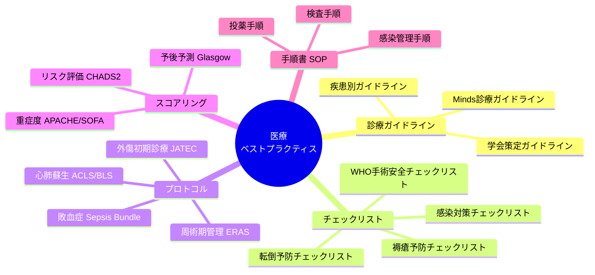

## ソフトウェア開発との対比

| 医療分野              | ソフトウェア開発             | 共通点               |
| --------------------- | ---------------------------- | -------------------- |
| WHO手術チェックリスト | コードレビューチェックリスト | 手順の標準化         |
| 診療ガイドライン      | 設計パターン集（GoF）        | ベストプラクティス集 |
| ACLS/BLS プロトコル   | インシデント対応手順         | 緊急時の手順標準化   |
| APACHE スコア         | コード複雑度メトリクス       | 定量的評価基準       |
| 投薬量計算基準        | パフォーマンス基準値         | 数値的判断基準       |
| GCP（臨床試験基準）   | CI/CDパイプライン            | 品質保証プロセス     |

## AIが参照すべき医療ベストプラクティス（MCP候補）

### 1. チェックリスト系

| 名称                             | 目的                       | MCP化価値        |
| -------------------------------- | -------------------------- | ---------------- |
| WHO Surgical Safety Checklist    | 手術安全                   | 術前確認漏れ防止 |
| Central Line Insertion Checklist | 中心静脈カテーテル感染防止 | 感染症予防       |
| Ventilator Bundle                | 人工呼吸器関連肺炎予防     | ICU管理          |
| Fall Prevention Checklist        | 転倒予防                   | 入院患者安全     |

### 2. プロトコル系

| 名称                     | 目的         | MCP化価値  |
| ------------------------ | ------------ | ---------- |
| ACLS/BLS                 | 心肺蘇生     | 救急対応   |
| JATEC                    | 外傷初期診療 | 外傷対応   |
| Sepsis-3 / Hour-1 Bundle | 敗血症管理   | 重症感染症 |
| ERAS                     | 術後回復促進 | 周術期管理 |

### 3. スコアリング系

| 名称               | 用途           | MCP化価値      |
| ------------------ | -------------- | -------------- |
| APACHE II/III      | ICU重症度評価  | 予後予測       |
| SOFA               | 臓器障害評価   | 敗血症判定     |
| CHADS2-VASc        | 脳卒中リスク   | 抗凝固療法判断 |
| NEWS               | 早期警告スコア | 急変予測       |
| Glasgow Coma Scale | 意識レベル     | 神経評価       |

## 理想的な医療AI支援の姿

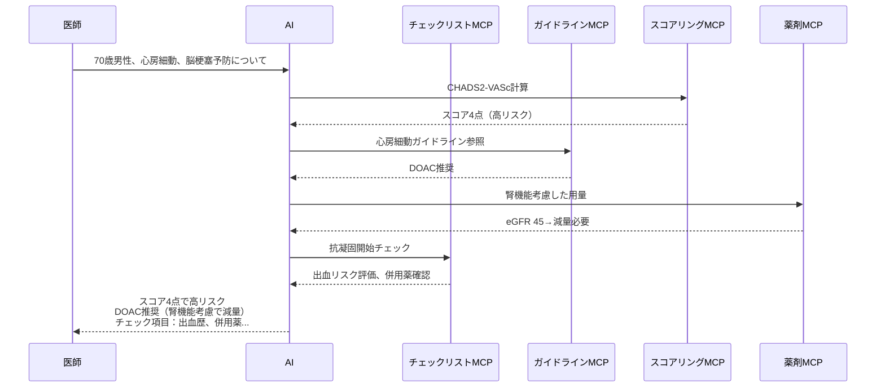

## 現状との差

```
┌─────────────────────────────────────────────────────────┐
│                                                         │
│  【現状】PubMed MCPがあるだけ                          │
│                                                         │
│  医師：心房細動の脳梗塞予防について                    │
│  AI：「この論文によると...」「この研究では...」        │
│                                                         │
│  → 論文の羅列。判断は完全に医師任せ                   │
│                                                         │
│  ──────────────────────────────────────────            │
│                                                         │
│  【理想】ベストプラクティスMCPがある場合              │
│                                                         │
│  医師：心房細動の脳梗塞予防について                    │
│  AI：「CHADS2-VASc スコアは何点ですか？」             │
│      「現行ガイドラインではスコアX以上でDOAC推奨」    │
│      「腎機能に応じた用量調整が必要」                  │
│      「開始前チェックリスト：□出血歴 □併用薬...」    │
│                                                         │
│  → 標準的な判断プロセスを支援                         │
│                                                         │
└─────────────────────────────────────────────────────────┘
```

## これがMCPの本質的価値

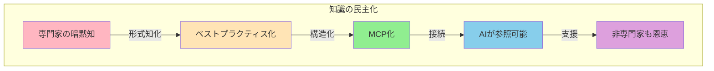

**医療でもソフトウェア開発でも同じ**：

1. 専門家が長年かけて蓄積した**暗黙知**がある
2. それを**チェックリスト・ガイドライン**として形式化してきた
3. それを**MCP化**することでAIが参照できる
4. 結果として**より良い医療/より良いソフトウェア**が提供できる

## Shujiさんの視点の普遍性

```
┌─────────────────────────────────────────────────────────┐
│                                                         │
│  Shujiさんがソフトウェア開発で考えていること           │
│                                                         │
│  「SOLIDのようなベストプラクティスをMCP化すれば       │
│   AIがより良いコードを書く支援ができる」              │
│                                                         │
│  ↓ これは医療分野でも全く同じ                          │
│                                                         │
│  「WHO手術チェックリストをMCP化すれば                 │
│   AIがより安全な手術を支援できる」                    │
│                                                         │
│  ↓ 全ての専門分野に適用可能な発想                      │
│                                                         │
│  「その分野のベストプラクティスをMCP化すれば          │
│   AIがより良い判断を支援できる」                      │
│                                                         │
└─────────────────────────────────────────────────────────┘
```

## 結論

**「AIが〇〇を知っている」** とは、単に文献を検索できることではなく：

1. **標準規格**を理解している
2. **ベストプラクティス**を参照できる
3. **チェックリスト**に沿って確認できる
4. **判断基準（スコア等）** を適用できる

これらがMCP化されて初めて、AIは「知っている」と言えるレベルになる。

ソフトウェア開発でShujiさんがやろうとしていることは、**あらゆる専門分野に適用可能な普遍的なアプローチ**ですね。

---
