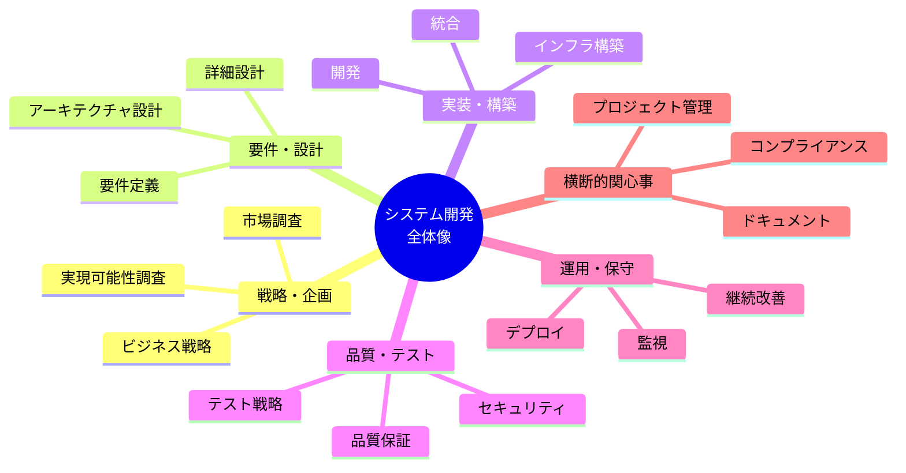
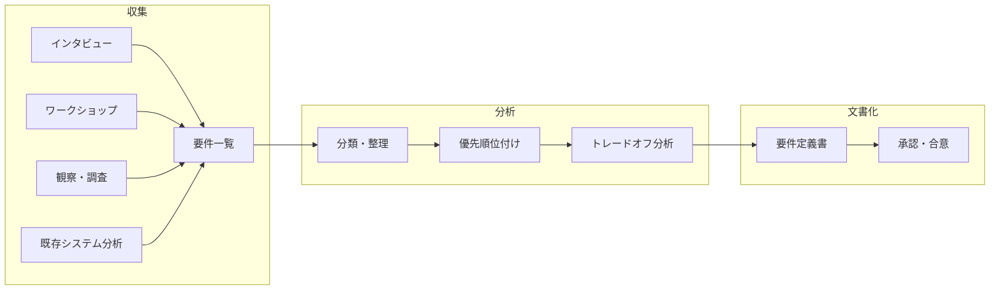
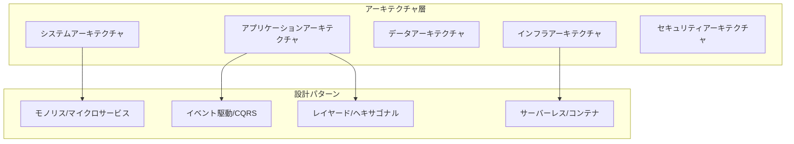
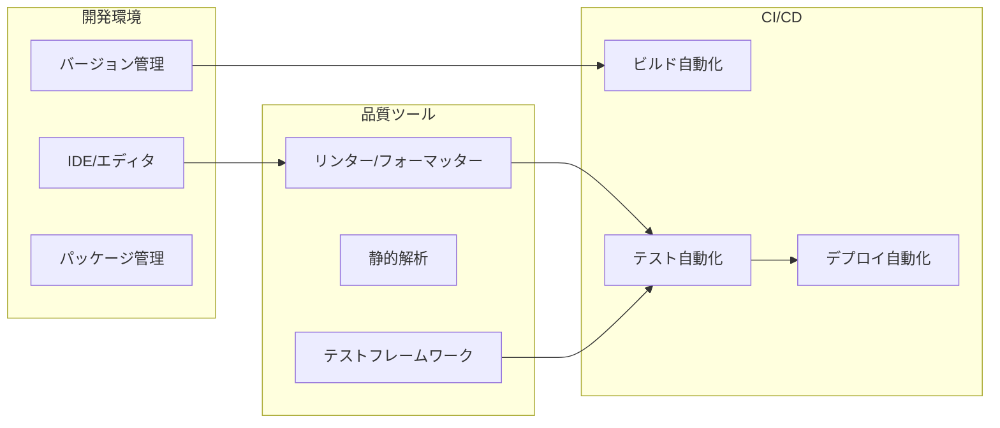
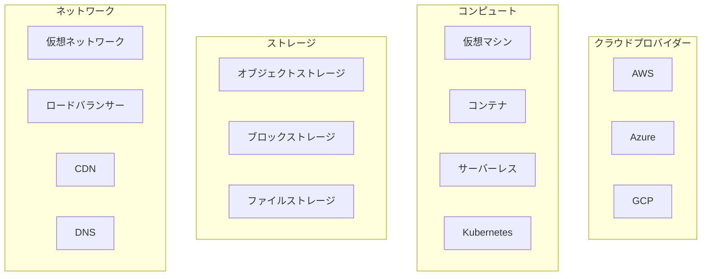
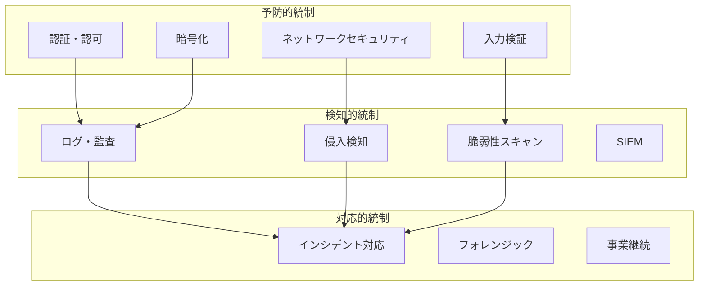
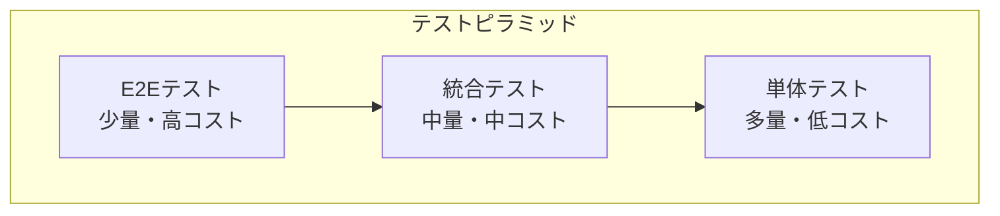
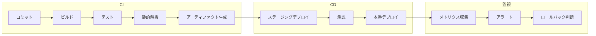
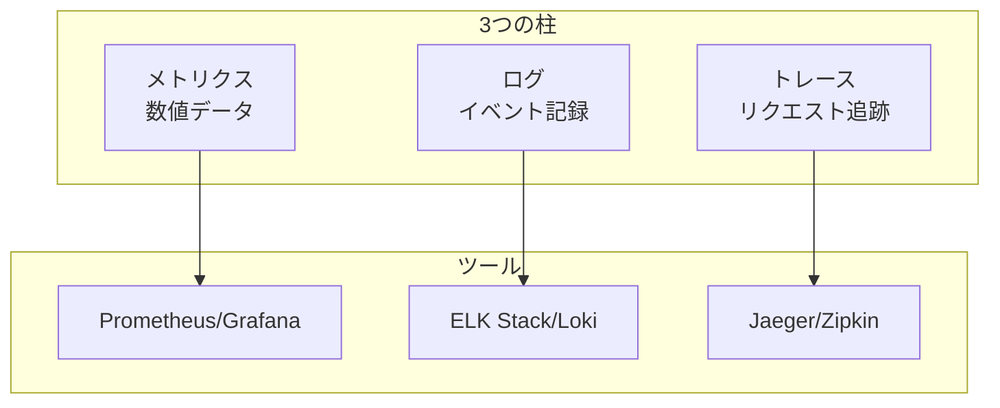
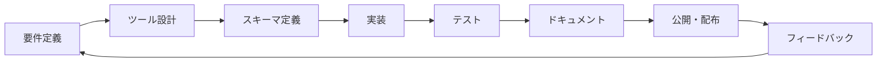

# MCP開発を含むシステム・アプリケーション開発に必要な全プロセス・タスク・技術を網羅的に整理

## システム・アプリケーション開発 全体像



## 1. 戦略・企画フェーズ

### 1.1 ビジネス戦略・目標設定

| カテゴリ             | 項目                                                        |
| -------------------- | ----------------------------------------------------------- |
| **ビジョン定義**     | ミッション・ビジョン策定、目標設定（OKR/KPI）、成功基準定義 |
| **市場分析**         | 市場規模調査、競合分析、SWOT分析、ポーターの5つの力分析     |
| **ステークホルダー** | 利害関係者特定、期待値管理、コミュニケーション計画          |
| **投資判断**         | ROI分析、TCO算出、投資回収期間、予算策定                    |

### 1.2 実現可能性調査（Feasibility Study）

| 種別                       | 評価項目                                                            |
| -------------------------- | ------------------------------------------------------------------- |
| **技術的実現可能性**       | 技術スタック評価、技術成熟度、プロトタイプ検証（PoC）、技術的リスク |
| **経済的実現可能性**       | コスト見積もり、収益予測、損益分岐点分析                            |
| **運用的実現可能性**       | 組織能力、スキルギャップ、変更管理                                  |
| **スケジュール実現可能性** | タイムライン妥当性、マイルストーン設定                              |
| **法的実現可能性**         | 規制要件、ライセンス、知的財産権                                    |

### 1.3 プロダクト戦略

| 項目                   | 内容                                      |
| ---------------------- | ----------------------------------------- |
| **プロダクトビジョン** | 製品コンセプト、差別化要因、価値提案      |
| **ロードマップ**       | 短期・中期・長期計画、機能優先順位付け    |
| **リリース戦略**       | MVP定義、段階的リリース計画、市場投入戦略 |

## 2. 要件定義フェーズ

### 2.1 要件収集・分析



### 2.2 機能要件

| カテゴリ                 | 詳細項目                                                             |
| ------------------------ | -------------------------------------------------------------------- |
| **ユーザーストーリー**   | ペルソナ定義、ユースケース、ユーザージャーニー、受入基準             |
| **機能仕様**             | 機能一覧、入出力定義、ビジネスルール、計算ロジック                   |
| **データ要件**           | データモデル、マスターデータ、トランザクションデータ、データ品質基準 |
| **インターフェース要件** | API仕様、外部連携、ファイル形式、プロトコル                          |

### 2.3 非機能要件（NFR）

| 品質特性           | 要件項目                                           |
| ------------------ | -------------------------------------------------- |
| **性能**           | 応答時間、スループット、同時接続数、リソース使用量 |
| **可用性**         | 稼働率（SLA）、計画停止、災害復旧（RTO/RPO）       |
| **拡張性**         | スケールアップ/アウト、負荷増加対応、将来拡張      |
| **保守性**         | コード品質、ドキュメント、デバッグ容易性           |
| **移植性**         | プラットフォーム互換性、環境依存性                 |
| **セキュリティ**   | 認証・認可、暗号化、監査、脆弱性対策               |
| **ユーザビリティ** | アクセシビリティ、多言語対応、レスポンシブ設計     |

## 3. 設計フェーズ

### 3.1 アーキテクチャ設計



#### アーキテクチャ決定記録（ADR）

| 項目             | 内容                         |
| ---------------- | ---------------------------- |
| **コンテキスト** | 背景、制約、前提条件         |
| **決定**         | 選択したアプローチとその理由 |
| **結果**         | 影響、トレードオフ、リスク   |
| **代替案**       | 検討した他の選択肢           |

### 3.2 詳細設計

| 設計領域               | 成果物                                              |
| ---------------------- | --------------------------------------------------- |
| **コンポーネント設計** | クラス図、シーケンス図、状態遷移図                  |
| **API設計**            | OpenAPI仕様、エンドポイント定義、エラーハンドリング |
| **データベース設計**   | ER図、テーブル定義、インデックス戦略                |
| **UI/UX設計**          | ワイヤーフレーム、モックアップ、デザインシステム    |
| **セキュリティ設計**   | 脅威モデリング、認証フロー、暗号化方式              |

### 3.3 規格・標準・プロトコル

#### 通信プロトコル

| カテゴリ           | 規格・プロトコル                                     |
| ------------------ | ---------------------------------------------------- |
| **Web標準**        | HTTP/1.1, HTTP/2, HTTP/3, WebSocket, WebRTC          |
| **API標準**        | REST, GraphQL, gRPC, JSON-RPC, OpenAPI, AsyncAPI     |
| **認証・認可**     | OAuth 2.0, OpenID Connect, SAML, JWT, FIDO2/WebAuthn |
| **メッセージング** | AMQP, MQTT, STOMP, Kafka Protocol                    |
| **データ形式**     | JSON, XML, Protocol Buffers, MessagePack, CBOR       |

#### 業界標準・規格

| 分野                 | 規格                                        |
| -------------------- | ------------------------------------------- |
| **Web**              | W3C標準（HTML, CSS, DOM）、ECMAScript       |
| **セキュリティ**     | OWASP、CWE、CVE、NIST                       |
| **データ**           | ISO 8601（日時）、ISO 4217（通貨）、Unicode |
| **アクセシビリティ** | WCAG 2.1、ARIA                              |
| **品質**             | ISO 25010、ISO 9001                         |

## 4. 開発フェーズ

### 4.1 開発環境・ツールチェーン



### 4.2 フロントエンド技術スタック

| レイヤー           | 技術・ツール                               |
| ------------------ | ------------------------------------------ |
| **フレームワーク** | Angular, React, Vue, Svelte, SvelteKit     |
| **状態管理**       | NgRx, Redux, Vuex, Zustand, Signals        |
| **スタイリング**   | CSS, SCSS, Tailwind, CSS-in-JS             |
| **ビルドツール**   | Vite, Webpack, esbuild, Turbopack          |
| **テスト**         | Jasmine, Jest, Vitest, Playwright, Cypress |

### 4.3 バックエンド技術スタック

| レイヤー               | 技術・ツール                               |
| ---------------------- | ------------------------------------------ |
| **ランタイム/言語**    | Node.js, Deno, Bun, .NET, Python, Go, Rust |
| **フレームワーク**     | Express, Fastify, NestJS, ASP.NET Core     |
| **ORM/データアクセス** | Prisma, TypeORM, Drizzle, Entity Framework |
| **認証**               | Passport.js, NextAuth, Auth0, Keycloak     |
| **キャッシュ**         | Redis, Memcached                           |

### 4.4 データベース

| 種別             | 技術                                   |
| ---------------- | -------------------------------------- |
| **RDBMS**        | PostgreSQL, MySQL, SQL Server, SQLite  |
| **NoSQL**        | MongoDB, DynamoDB, Cassandra           |
| **検索エンジン** | Elasticsearch, OpenSearch, Meilisearch |
| **時系列DB**     | InfluxDB, TimescaleDB                  |
| **グラフDB**     | Neo4j, Amazon Neptune                  |

### 4.5 コーディング規約・ベストプラクティス

| カテゴリ               | 項目                                |
| ---------------------- | ----------------------------------- |
| **命名規則**           | 変数、関数、クラス、ファイル、定数  |
| **コード構造**         | モジュール分割、依存関係、層の分離  |
| **エラーハンドリング** | 例外処理、ログ出力、リトライ戦略    |
| **設計原則**           | SOLID、DRY、KISS、YAGNI             |
| **デザインパターン**   | GoFパターン、アーキテクチャパターン |

## 5. インフラストラクチャ

### 5.1 クラウド・インフラ



### 5.2 コンテナ・オーケストレーション

| 技術              | 用途                               |
| ----------------- | ---------------------------------- |
| **Docker**        | コンテナランタイム、イメージビルド |
| **Kubernetes**    | オーケストレーション、スケーリング |
| **Helm**          | パッケージ管理                     |
| **Istio/Linkerd** | サービスメッシュ                   |

### 5.3 Infrastructure as Code（IaC）

| ツール             | 用途                       |
| ------------------ | -------------------------- |
| **Terraform**      | マルチクラウドインフラ定義 |
| **AWS CDK/Pulumi** | プログラマティックIaC      |
| **Ansible**        | 構成管理、プロビジョニング |
| **CloudFormation** | AWS固有IaC                 |

## 6. セキュリティ

### 6.1 セキュリティ体系



### 6.2 セキュリティ対策一覧

| レイヤー             | 対策項目                                                       |
| -------------------- | -------------------------------------------------------------- |
| **アプリケーション** | OWASP Top 10対策、入力検証、出力エンコーディング、CSRF/XSS対策 |
| **認証・認可**       | MFA、セッション管理、最小権限原則、RBAC/ABAC                   |
| **データ**           | 保存時暗号化、通信時暗号化（TLS）、鍵管理、データマスキング    |
| **インフラ**         | ファイアウォール、WAF、DDoS対策、ネットワーク分離              |
| **運用**             | パッチ管理、脆弱性管理、ペネトレーションテスト                 |

### 6.3 コンプライアンス・規制

| 規制・標準         | 対象                         |
| ------------------ | ---------------------------- |
| **GDPR**           | EU個人データ保護             |
| **個人情報保護法** | 日本の個人情報               |
| **PCI DSS**        | クレジットカード情報         |
| **HIPAA**          | 米国医療情報                 |
| **SOC 2**          | サービス組織の統制           |
| **ISO 27001**      | 情報セキュリティマネジメント |

## 7. テスト・品質保証

### 7.1 テストピラミッド



### 7.2 テスト種別

| テスト種別                 | 目的                       | ツール例              |
| -------------------------- | -------------------------- | --------------------- |
| **単体テスト**             | 個別関数・メソッドの検証   | Jasmine, Jest, Vitest |
| **統合テスト**             | コンポーネント間連携の検証 | Testing Library       |
| **E2Eテスト**              | ユーザーシナリオの検証     | Playwright, Cypress   |
| **性能テスト**             | 負荷・ストレス検証         | k6, JMeter, Gatling   |
| **セキュリティテスト**     | 脆弱性検出                 | OWASP ZAP, Burp Suite |
| **アクセシビリティテスト** | WCAG準拠検証               | axe, Lighthouse       |

### 7.3 品質メトリクス

| カテゴリ         | メトリクス                                   |
| ---------------- | -------------------------------------------- |
| **コード品質**   | カバレッジ、複雑度、技術的負債、コードスメル |
| **信頼性**       | MTBF、MTTR、障害率                           |
| **性能**         | レイテンシ、スループット、エラー率           |
| **ユーザー体験** | Core Web Vitals（LCP, FID, CLS）             |

## 8. CI/CD・DevOps

### 8.1 CI/CDパイプライン



### 8.2 DevOpsツールチェーン

| カテゴリ             | ツール                                       |
| -------------------- | -------------------------------------------- |
| **ソース管理**       | Git, GitHub, GitLab, Bitbucket               |
| **CI/CD**            | GitHub Actions, GitLab CI, Jenkins, CircleCI |
| **アーティファクト** | Docker Registry, npm, Artifactory            |
| **構成管理**         | Ansible, Chef, Puppet                        |
| **シークレット管理** | Vault, AWS Secrets Manager                   |

### 8.3 デプロイ戦略

| 戦略                   | 特徴                         |
| ---------------------- | ---------------------------- |
| **ローリング**         | 段階的な置き換え             |
| **ブルー/グリーン**    | 環境切り替え                 |
| **カナリア**           | 少数ユーザーへの先行リリース |
| **フィーチャーフラグ** | 機能単位の制御               |

## 9. 運用・監視

### 9.1 オブザーバビリティ



### 9.2 監視項目

| レイヤー             | 監視項目                            |
| -------------------- | ----------------------------------- |
| **インフラ**         | CPU、メモリ、ディスク、ネットワーク |
| **アプリケーション** | 応答時間、エラー率、スループット    |
| **ビジネス**         | トランザクション数、コンバージョン  |
| **セキュリティ**     | 不正アクセス、異常パターン          |

### 9.3 インシデント管理

| フェーズ       | アクティビティ                                |
| -------------- | --------------------------------------------- |
| **検知**       | アラート、監視、レポート                      |
| **トリアージ** | 重大度判定、エスカレーション                  |
| **対応**       | 調査、緩和、復旧                              |
| **事後分析**   | RCA（根本原因分析）、ポストモーテム、再発防止 |

## 10. プロジェクト管理

### 10.1 開発方法論

| 方法論                  | 特徴                                       |
| ----------------------- | ------------------------------------------ |
| **ウォーターフォール**  | 順次進行、計画重視、変更に弱い             |
| **アジャイル（Scrum）** | イテレーティブ、適応性重視、短期デリバリー |
| **カンバン**            | フロー最適化、WIP制限、可視化              |
| **SAFe**                | 大規模アジャイル、複数チーム連携           |

### 10.2 プロジェクト管理要素

| カテゴリ             | 項目                                             |
| -------------------- | ------------------------------------------------ |
| **スコープ管理**     | WBS、要件トレーサビリティ、変更管理              |
| **スケジュール管理** | ガントチャート、クリティカルパス、マイルストーン |
| **コスト管理**       | 予算、実績、EVM（アーンドバリュー）              |
| **リスク管理**       | リスク識別、評価、対応計画                       |
| **品質管理**         | 品質計画、品質保証、品質管理                     |
| **リソース管理**     | チーム編成、スキル管理、負荷調整                 |

## 11. ドキュメンテーション

### 11.1 ドキュメント種別

| 種別                     | 内容                                         |
| ------------------------ | -------------------------------------------- |
| **要件ドキュメント**     | 要件定義書、ユースケース、ユーザーストーリー |
| **設計ドキュメント**     | アーキテクチャ設計書、API仕様書、DB設計書    |
| **開発ドキュメント**     | コーディング規約、README、コードコメント     |
| **運用ドキュメント**     | 運用手順書、障害対応手順、監視設定           |
| **ユーザードキュメント** | ユーザーガイド、FAQ、チュートリアル          |

### 11.2 ドキュメント as Code

| ツール               | 用途               |
| -------------------- | ------------------ |
| **Markdown**         | 汎用ドキュメント   |
| **OpenAPI/Swagger**  | API仕様            |
| **Mermaid/PlantUML** | 図表               |
| **JSDoc/TSDoc**      | コードドキュメント |
| **Storybook**        | UIコンポーネント   |

## 12. MCP開発固有の考慮事項

### 12.1 MCP特有の要素

| カテゴリ           | 項目                               |
| ------------------ | ---------------------------------- |
| **プロトコル理解** | JSON-RPC、ツール定義、リソース定義 |
| **セキュリティ**   | 権限管理、入力検証、サンドボックス |
| **相互運用性**     | 標準準拠、バージョン互換性         |
| **パフォーマンス** | レスポンス時間、リソース効率       |

### 12.2 MCP開発フロー



## まとめ：チェックリスト形式

```
□ 戦略・企画
  □ ビジネス目標定義
  □ 実現可能性調査
  □ ROI分析

□ 要件定義
  □ 機能要件
  □ 非機能要件
  □ 制約条件

□ 設計
  □ アーキテクチャ設計
  □ 詳細設計
  □ セキュリティ設計

□ 開発
  □ 環境構築
  □ コーディング
  □ コードレビュー

□ テスト
  □ 単体テスト
  □ 統合テスト
  □ E2Eテスト

□ インフラ
  □ 環境構築
  □ IaC
  □ 監視設定

□ セキュリティ
  □ 脆弱性対策
  □ 認証・認可
  □ コンプライアンス

□ 運用
  □ デプロイ
  □ 監視・アラート
  □ インシデント対応

□ ドキュメント
  □ 設計書
  □ 運用手順
  □ ユーザーガイド
```

---

上記は、AI駆動開発に必要なものでもある。
現在、AIがCI/CDをも含め、いきなりバイナリを出力して実装できるようになるまで、これまでのエンジニアリングの導入は不可欠と考える。
AIは最もらしい生成は行なってくれるが、判断するための指針が必要です。
そのためにブレない参照先が必要になってくる。

> AI駆動開発の本質は、コード生成だけでなく、全工程でAIを「知的アシスタント」として活用し、人間はより高次の判断・創造に集中できる環境を作ることです。

そのためにブレない参照先が必要になってくる。
