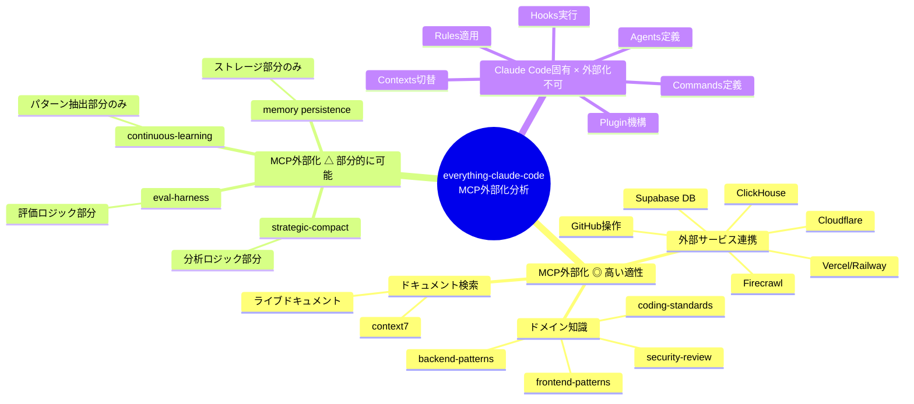
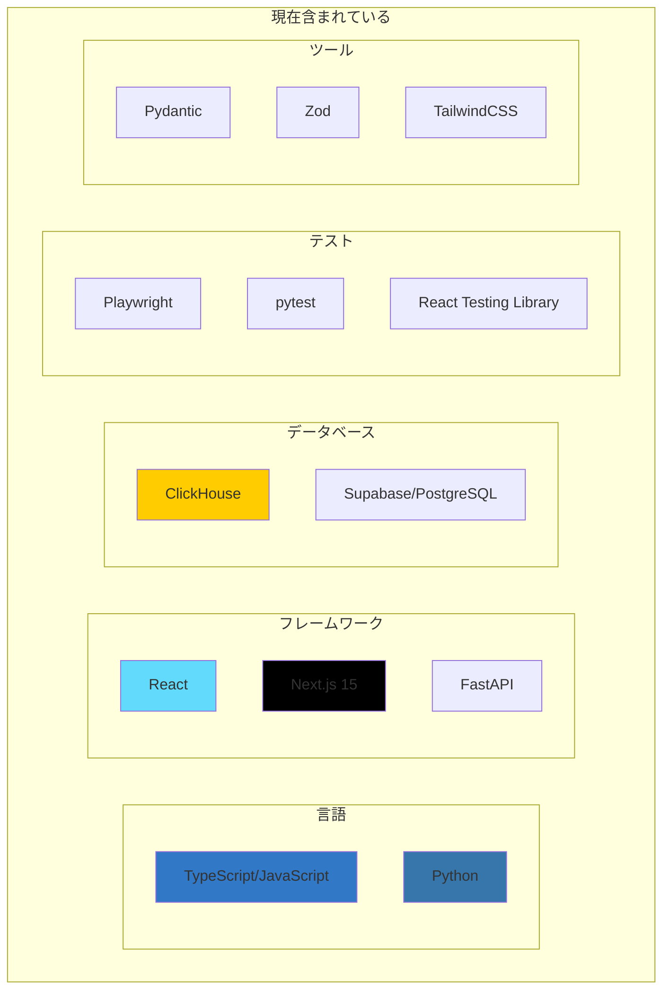
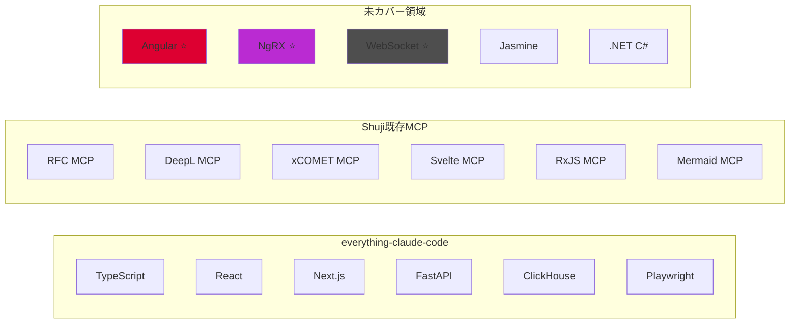

# everything-claude-code の機能 と MCP外部化の可能性

記事の内容を確認して、MCP外部化できる機能を分析します。記事の内容を確認しました。次にGitHubリポジトリも確認して、より詳細な情報を得ます。記事とリポジトリの内容を確認しました。MCP外部化できる機能を分析して一覧を作成します。

https://github.com/affaan-m/everything-claude-code

## everything-claude-code の機能 と MCP外部化の可能性

この記事で紹介されている設定は非常に体系的で、Claude Codeの使い方として素晴らしいテンプレートです。ただし、**MCPサーバーとして外部化できるもの**と**Claude Code固有の設定として残すべきもの**は明確に分かれます。

### 📊 MCP外部化できる機能の一覧

### ✅ MCP外部化の**適性が高い**機能

| カテゴリ             | 機能              | MCP化の理由                | 既存MCPの有無                            |
| -------------------- | ----------------- | -------------------------- | ---------------------------------------- |
| **外部サービス連携** | GitHub操作        | API呼び出しの抽象化        | ✅ `@modelcontextprotocol/server-github` |
|                      | Supabase          | DB操作のMCP化              | ✅ 公式MCP存在                           |
|                      | Vercel            | デプロイ管理               | ✅ 公式MCP存在                           |
|                      | Railway           | デプロイ管理               | ✅ 公式MCP存在                           |
|                      | Cloudflare        | エッジサービス             | ✅ 複数MCP存在                           |
|                      | ClickHouse        | 分析クエリ                 | ✅ 公式MCP存在                           |
|                      | Firecrawl         | Webスクレイピング          | ✅ 公式MCP存在                           |
| **ドキュメント検索** | Context7          | ライブドキュメント         | ✅ 公式MCP存在                           |
|                      | Magic UI          | UIコンポーネント           | ✅ 公式MCP存在                           |
| **ドメイン知識**     | coding-standards  | 言語別ベストプラクティス   | 🔨 **新規作成可能**                      |
|                      | backend-patterns  | API/DB/キャッシュパターン  | 🔨 **新規作成可能**                      |
|                      | frontend-patterns | React/Next.jsパターン      | 🔨 **新規作成可能**                      |
|                      | security-review   | セキュリティチェックリスト | 🔨 **新規作成可能**                      |
|                      | tdd-workflow      | TDD方法論                  | 🔨 **新規作成可能**                      |

### 🔨 新規MCP化の**候補として興味深い**もの

| Skills/機能             | MCP化すると何ができるか                                                                                                       | 実装難易度 |
| ----------------------- | ----------------------------------------------------------------------------------------------------------------------------- | ---------- |
| **coding-standards**    | 言語・フレームワーク別のベストプラクティスをツールとして提供。`get_standard("typescript", "error-handling")` のような呼び出し | ⭐⭐       |
| **backend-patterns**    | 設計パターンの検索・提案。`suggest_pattern("caching", "redis")`                                                               | ⭐⭐       |
| **frontend-patterns**   | React/Next.jsのパターン集。状態管理、コンポーネント設計など                                                                   | ⭐⭐       |
| **security-review**     | セキュリティチェックリストの自動適用。`check_security("api-endpoint", code)`                                                  | ⭐⭐⭐     |
| **tdd-workflow**        | TDDサイクルのガイダンス。テストテンプレート生成など                                                                           | ⭐⭐       |
| **continuous-learning** | セッションからのパターン抽出・保存                                                                                            | ⭐⭐⭐⭐   |
| **eval-harness**        | コード評価・検証ロジック                                                                                                      | ⭐⭐⭐⭐   |

### ❌ MCP外部化が**適さない**機能（Claude Code固有）

| カテゴリ       | 理由                                                                                       |
| -------------- | ------------------------------------------------------------------------------------------ |
| **Agents**     | Claude Codeのサブエージェント機構に依存。モデル選択、ツール制限などはClaude Code内部で処理 |
| **Commands**   | `/tdd`などのスラッシュコマンドはClaude CodeのUI/UX機能                                     |
| **Contexts**   | 開発/リサーチ/レビューモードの切替はセッション状態管理                                     |
| **Rules**      | 常時適用ガイドラインはシステムプロンプトレベルの設定                                       |
| **Hooks**      | PreToolUse/PostToolUseなどのイベントトリガーはClaude Code内部機構                          |
| **Plugin機構** | `.claude-plugin`の仕組み自体がClaude Code固有                                              |

### 💡 Shuji的に面白そうなMCP化候補

Shujiさんの「知識の民主化」という方向性と、すでに構築しているMCPエコシステム（RFC、DeepL、xCOMET、Svelte、RxJS等）を考えると：

1. **Design Patterns MCP**
   - GoFパターン、DDD、Clean Architectureなどの設計パターンを検索・適用提案
   - RFC MCPと同様のアプローチで、標準的なパターン集をMCP化

2. **Security Standards MCP**
   - OWASP、CWE、各種セキュリティガイドラインをMCP化
   - `check_vulnerability("sql-injection", code)` のような検査ツール

3. **Framework Best Practices MCP**
   - Angular/Svelte/Reactなどのフレームワーク別ベストプラクティス
   - すでに持っているSvelte MCPの拡張版として

4. **Code Quality Metrics MCP**
   - 循環的複雑度、凝集度、結合度などの計算
   - xCOMETの翻訳品質評価と同様のコンセプトで、コード品質評価

### 📋 まとめ

| 分類                            | 数  | 備考                                             |
| ------------------------------- | --- | ------------------------------------------------ |
| **既にMCPとして存在**           | 10+ | GitHub, Supabase, Vercel, Context7など           |
| **新規MCP化の価値あり**         | 5-7 | coding-standards, security-reviewなど            |
| **Claude Code固有で外部化不可** | 6   | Agents, Commands, Hooks, Rules, Contexts, Plugin |

この記事のリポジトリは、MCPサーバーの設定（`mcp-configs/`）と、Claude Code固有の設定（それ以外）が明確に分かれている点が優れています。MCPを外部化することで、Claude Code以外のAIツールでも同じ外部サービス連携が使えるようになるのがメリットですね。

---

良い質問です！リポジトリの中身をもう少し詳しく確認して、言語・フレームワーク固有のものを探します。ファイル内容が取得できないので、rawファイルを試します。これで詳細が把握できました。整理します。

## 📚 プログラミング言語・フレームワーク固有の機能一覧

リポジトリを調査した結果、**現状含まれている言語・フレームワーク固有のもの**と、**READMEで募集している（まだない）もの**に分かれます。

### ✅ 現在リポジトリに含まれている言語・技術固有のもの

| カテゴリ           | 技術                    | ファイル                                      | MCP外部化  |
| ------------------ | ----------------------- | --------------------------------------------- | ---------- |
| **言語**           | TypeScript              | `coding-standards.md`                         | 🔨 可能    |
|                    | JavaScript              | `coding-standards.md`                         | 🔨 可能    |
|                    | Python                  | `project-guidelines-example.md`               | 🔨 可能    |
| **フロントエンド** | React                   | `frontend-patterns.md`                        | 🔨 可能    |
|                    | Next.js 15 (App Router) | `frontend-patterns.md`, `backend-patterns.md` | 🔨 可能    |
| **バックエンド**   | FastAPI                 | `project-guidelines-example.md`               | 🔨 可能    |
|                    | Node.js/Express         | `backend-patterns.md`                         | 🔨 可能    |
| **データベース**   | ClickHouse              | `clickhouse-io.md`                            | ✅ 既存MCP |
|                    | Supabase (PostgreSQL)   | `project-guidelines-example.md`               | ✅ 既存MCP |
| **テスト**         | Playwright              | `e2e-runner.md`                               | 🔨 可能    |
|                    | pytest                  | `project-guidelines-example.md`               | 🔨 可能    |
|                    | React Testing Library   | `project-guidelines-example.md`               | 🔨 可能    |
| **バリデーション** | Pydantic                | `project-guidelines-example.md`               | 🔨 可能    |
|                    | Zod                     | `project-guidelines-example.md`               | 🔨 可能    |

### 📝 READMEで「コントリビューション募集中」とされているもの

> **まだリポジトリにない**が、READMEで明示的に募集されている技術：

| カテゴリ           | 募集されている技術     | MCP化の可能性 |
| ------------------ | ---------------------- | ------------- |
| **言語**           | Python パターン        | 🔨 可能       |
|                    | Go パターン            | 🔨 可能       |
|                    | Rust パターン          | 🔨 可能       |
| **フレームワーク** | Django                 | 🔨 可能       |
|                    | Rails                  | 🔨 可能       |
|                    | Laravel                | 🔨 可能       |
| **DevOps**         | Kubernetes             | 🔨 可能       |
|                    | Terraform              | 🔨 可能       |
|                    | AWS パターン           | 🔨 可能       |
| **ドメイン**       | ML / 機械学習          | 🔨 可能       |
|                    | データエンジニアリング | 🔨 可能       |
|                    | モバイル開発           | 🔨 可能       |

### 🎯 Shujiさん向け：MCP化価値が高い言語・フレームワーク固有機能

Shujiさんの専門領域と「知識の民主化」を考慮すると：

| 優先度     | 技術                 | MCP化の価値 | 備考                                                                       |
| ---------- | -------------------- | ----------- | -------------------------------------------------------------------------- |
| ⭐⭐⭐⭐⭐ | **Angular**          | 非常に高い  | リポジトリに**ない**。Shuji専門領域。日本のAngularコミュニティにも貢献可能 |
| ⭐⭐⭐⭐⭐ | **RxJS**             | 非常に高い  | すでにMCP持ってる！skills拡張で連携可能                                    |
| ⭐⭐⭐⭐   | **Svelte/SvelteKit** | 高い        | すでにMCP持ってる。パターン集の追加                                        |
| ⭐⭐⭐⭐   | **WebSocket**        | 高い        | RFC 6455連携。Shuji専門領域                                                |
| ⭐⭐⭐     | **NgRX**             | 中〜高      | 現プロジェクト使用中。状態管理パターン                                     |
| ⭐⭐⭐     | **.NET C# WebAPI**   | 中〜高      | バックエンド経験活かせる                                                   |
| ⭐⭐       | **Jasmine**          | 中          | テストパターン。pytest的な位置づけ                                         |

### 📊 比較：このリポジトリ vs Shujiさんの既存MCP

### 💡 結論

**このリポジトリは TypeScript + React + Next.js + FastAPI スタック向け**に最適化されています。

Shujiさんの得意領域である **Angular / RxJS / WebSocket** 系のパターンは**含まれていない**ので：

1. **Angular Patterns MCP** を作成して貢献 → 日本のAngularコミュニティにも価値
2. 既存の **RxJS MCP** に patterns skill を追加
3. **RFC MCP + WebSocket skill** の連携強化

これらは「知識の民主化」の観点でも、日本語圏・非英語圏の開発者に価値がありそうです。

---
