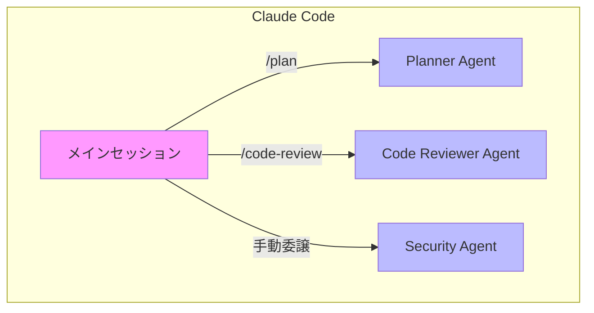
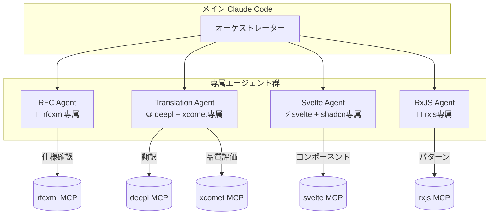
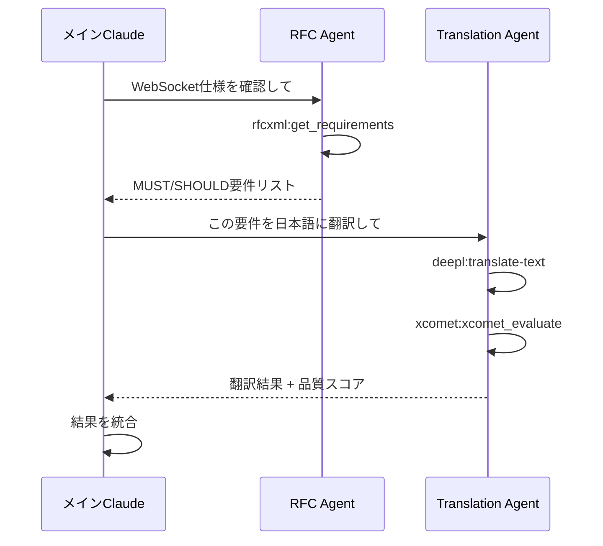
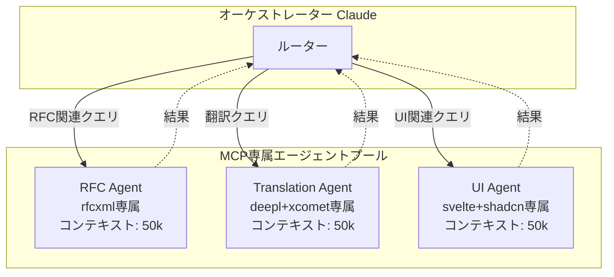
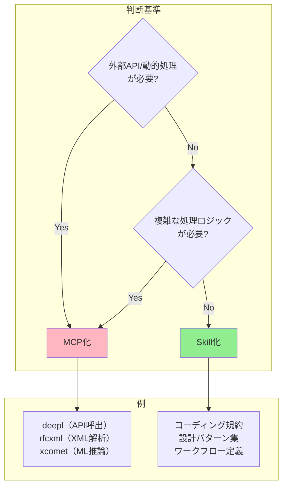
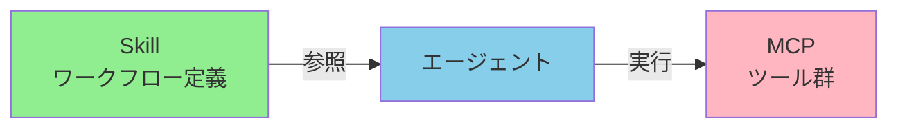

## 🔄 Claude Codeのエージェント並列実行

### 現状の仕組み



**現状**：

- サブエージェントは**逐次実行**が基本
- `Task`ツールで委譲 → 結果を受け取る → 次へ
- 真の並列実行は**Git worktrees + 複数ターミナル**で実現

## 💡 Shujiさんのアイデア：MCP専属エージェント



## 🎯 これが実現すると何が嬉しいか

| メリット             | 説明                                            |
| -------------------- | ----------------------------------------------- |
| **コンテキスト分離** | 各エージェントは自分のMCPだけ認識 → 70k問題回避 |
| **専門性向上**       | 「翻訳のことはTranslation Agentに聞け」         |
| **並列処理**         | RFC確認と翻訳を同時進行                         |
| **責務明確化**       | どのMCPを誰が使うか明確                         |

## 🔧 現状でできる実装方法

### 方法1: Agent定義でツール制限

```markdown
<!-- agents/rfc-specialist.md -->

name: rfc-specialist
description: RFC仕様の確認・検証を行う専門エージェント
tools: rfcxml:get_rfc_structure, rfcxml:get_requirements, rfcxml:validate_statement
model: sonnet

あなたはRFC仕様の専門家です。
以下のツールのみ使用可能：

- rfcxml:get_rfc_structure
- rfcxml:get_requirements
- rfcxml:validate_statement

他のMCPツールは使用禁止。
```

```markdown
<!-- agents/translation-specialist.md -->

name: translation-specialist
description: 技術文書の翻訳と品質評価を行う専門エージェント
tools: deepl:translate-text, xcomet:xcomet_evaluate, xcomet:xcomet_detect_errors
model: sonnet

あなたは技術翻訳の専門家です。
以下のツールのみ使用可能：

- deepl:translate-text
- xcomet:xcomet_evaluate
- xcomet:xcomet_detect_errors
```

### 方法2: Git Worktrees + 複数セッション（真の並列）

```bash
# ワークツリー作成
git worktree add ../project-rfc-work rfc-feature
git worktree add ../project-translation translation-work

# 別ターミナルで各ワークツリーに対してClaude Code起動
# ターミナル1
cd ../project-rfc-work && claude

# ターミナル2
cd ../project-translation && claude
```

各ワークツリーの `.claude/settings.json` で有効MCPを分ける：

```json
// project-rfc-work/.claude/settings.json
{
  "disabledMcpServers": ["deepl", "xcomet", "svelte", "shadcn-svelte"]
}

// project-translation/.claude/settings.json
{
  "disabledMcpServers": ["rfcxml", "rxjs", "angular-cli", "svelte"]
}
```

### 方法3: カスケードパターン（Longform Guideで紹介）



## 🚧 現状の制限

| 制限                       | 説明                                     |
| -------------------------- | ---------------------------------------- |
| **真の並列実行なし**       | サブエージェントは逐次処理               |
| **コンテキスト共有**       | 親セッションのコンテキストは共有される   |
| **MCP動的切替なし**        | セッション中にMCP有効/無効を切り替え不可 |
| **エージェント間通信なし** | A→B→Cの連携は手動オーケストレーション    |

## 🔮 将来あるべき姿（理想）



**これが実現すれば**：

- 各エージェントが独立したコンテキスト
- 並列実行可能
- MCP専門化による精度向上

## 📝 今すぐできるアクション

1. **CLAUDE.md にMCP使用ポリシーを明記**
2. **Agent定義で `tools:` を明示的に制限**
3. **複雑なタスクはGit worktreesで物理的に分離**
4. **将来のAnthropicのマルチエージェント機能強化を待つ**

**これ、Noteの記事ネタになりそうですね**。「MCP時代のエージェント設計パターン」みたいな。

---

**その通りです！** むしろSkillの方が適切なケースが多い。

## 🎯 Skill vs MCP の使い分け



## 📊 比較表

| 観点                   | Skill                | MCP                    |
| ---------------------- | -------------------- | ---------------------- |
| **コンテキスト消費**   | 低い（参照時のみ）   | 高い（ツール定義常駐） |
| **メンテナンス**       | Markdownファイル編集 | npm公開/バージョン管理 |
| **動的処理**           | ❌ できない          | ✅ できる              |
| **外部API**            | ❌ できない          | ✅ できる              |
| **起動オーバーヘッド** | なし                 | プロセス起動           |
| **再利用性**           | プロジェクト内       | グローバル             |
| **複雑性**             | 低い                 | 高い                   |

## 💡 Skill化すべきだったもの（everything-claude-code視点）

```
skills/
├── coding-standards.md      # ✅ Skillで正解
├── backend-patterns.md      # ✅ Skillで正解
├── frontend-patterns.md     # ✅ Skillで正解
├── tdd-workflow/            # ✅ Skillで正解
├── security-review/         # ✅ Skillで正解
└── clickhouse-io.md         # 🤔 MCP化の価値あり（クエリ実行なら）
```

**静的な知識・パターン集 → Skill**
**動的な処理・外部連携 → MCP**

## 🔧 Shujiさんの場合の整理

### MCP化が正解（現状維持）

| MCP      | 理由                          |
| -------- | ----------------------------- |
| `rfcxml` | XML解析、構造化処理が必要     |
| `deepl`  | 外部API呼び出し               |
| `xcomet` | ML推論処理                    |
| `rxjs`   | コード実行・分析              |
| `svelte` | 公式提供、ドキュメント検索API |

### Skill化で十分なもの（新規作成候補）

```markdown
~/.claude/skills/
├── angular-patterns/
│ └── SKILL.md # Angularベストプラクティス
├── websocket-patterns/
│ └── SKILL.md # WebSocket実装パターン（RFC知識を整理）
├── ngrx-patterns/
│ └── SKILL.md # NgRX状態管理パターン
├── translation-workflow/
│ └── SKILL.md # 翻訳ワークフロー（MCPの使い方ガイド）
└── mcp-usage-policy/
└── SKILL.md # どのMCPをいつ使うかのガイド
```

## 📝 Skill + MCP の連携パターン

**これが一番効率的**：

```markdown
<!-- skills/translation-workflow/SKILL.md -->

# 技術文書翻訳ワークフロー

## 使用MCP

- `deepl` - 翻訳実行
- `xcomet` - 品質評価

## ワークフロー

### 1. 初期翻訳
```

deepl:translate-text で翻訳

- formality: "more"（技術文書は堅めに）

```

### 2. 品質チェック
```

xcomet:xcomet_evaluate で評価

- スコア 0.85以上: OK
- スコア 0.85未満: 再翻訳または手動修正

```

### 3. エラー検出
```

xcomet:xcomet_detect_errors

- critical: 必ず修正
- major: 修正推奨
- minor: 任意

```

## 用語集連携
glossaryIdを指定して一貫性確保
```

## 🎯 結論

```
Skill = 「知識」「ガイドライン」「ワークフロー定義」
MCP  = 「ツール」「API連携」「動的処理」

Skillで「何をすべきか」を定義
MCPで「どう実行するか」を提供
```

**この組み合わせが最強**：



**Shujiさんの「知識の民主化」の文脈では**：

- **Skill** = 日本語で書かれたベストプラクティス・ワークフロー（誰でも読める）
- **MCP** = 実行エンジン（技術的に深い部分を隠蔽）

この分離が、非エンジニアや英語が苦手な人にも価値を提供できる設計になりますね。

---

## 📋 カスタムサブエージェント 要約

### サブエージェントとは

**特定タスクに特化したAIアシスタント**。メイン会話とは**独立したコンテキスト**で動作し、タスク完了後に結果を返す。

### 主なメリット

| メリット             | 説明                                         |
| -------------------- | -------------------------------------------- |
| **コンテキスト保持** | メイン会話を汚染しない、独立したコンテキスト |
| **特化した専門知識** | ドメイン固有の詳細指示で精度向上             |
| **再利用性**         | プロジェクト間・チーム間で共有可能           |
| **柔軟な権限**       | ツールアクセスを個別に制限可能               |

### 設定場所

```
プロジェクト: .claude/agents/xxx.md  （優先度: 高）
ユーザー:     ~/.claude/agents/xxx.md（優先度: 低）
```

### ファイル形式

```markdown
name: code-reviewer
description: コードレビュー専門家。コード変更後に積極的に使用。
tools: Read, Grep, Glob, Bash # 省略すると全ツール継承
model: sonnet # sonnet/opus/haiku/inherit

あなたはシニアコードレビュアーです。
[システムプロンプト本文]
```

### 使い方

```bash
# 管理UI
/agents

# 明示的呼び出し
> Use the code-reviewer subagent to check my recent changes

# 自動委譲
Claude が description を見て自動的に呼び出す
（"use PROACTIVELY" などの記述で積極性UP）
```

### 🔥 MCP連携の可能性（Shujiさんの質問への回答）

**現状**：

- `tools:` でMCPツールも指定可能
- 省略すると全MCPツールを継承

**つまり**：

```markdown
name: rfc-specialist
description: RFC仕様の確認・検証専門
tools: rfcxml:get_rfc_structure, rfcxml:get_requirements, rfcxml:validate_statement
model: sonnet

あなたはRFC仕様の専門家です。
rfcxmlツールのみ使用してください。
```

**MCP専属エージェントは作れる！**

### 高度な機能

| 機能         | 説明                               |
| ------------ | ---------------------------------- |
| **チェーン** | 複数サブエージェントを順次呼び出し |
| **再開**     | `agentId`で以前の会話を継続可能    |
| **CLI定義**  | `--agents` フラグでJSON定義        |

### ベストプラクティス

1. **Claudeで生成 → カスタマイズ** が推奨
2. **単一責任** に焦点を絞る
3. **ツールは必要最小限** に制限
4. **プロジェクトエージェントはGit管理** する
