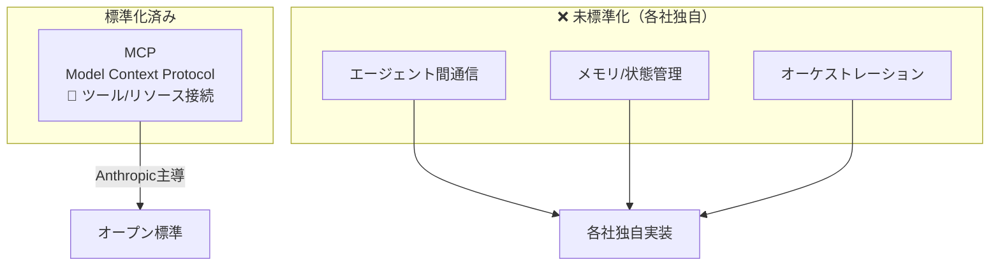
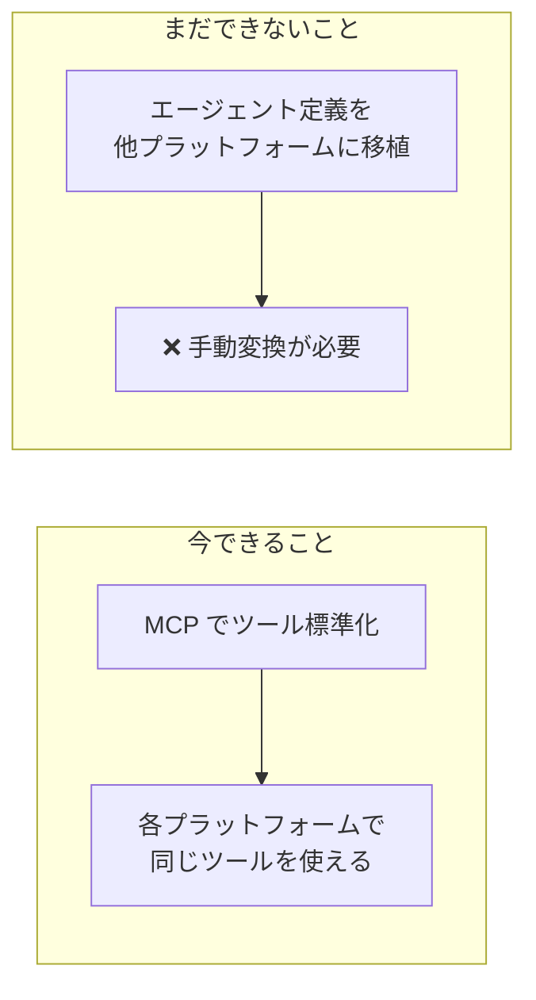
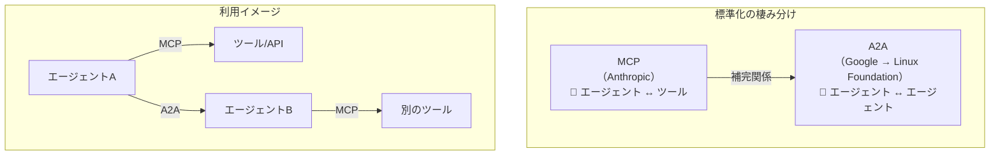
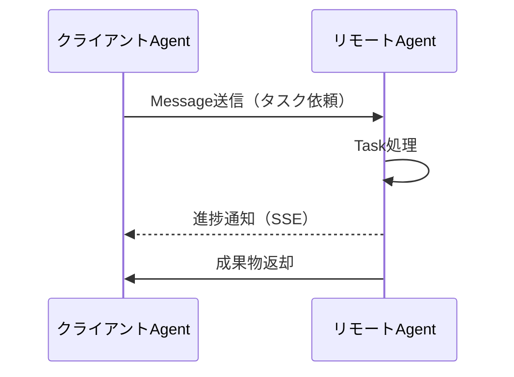
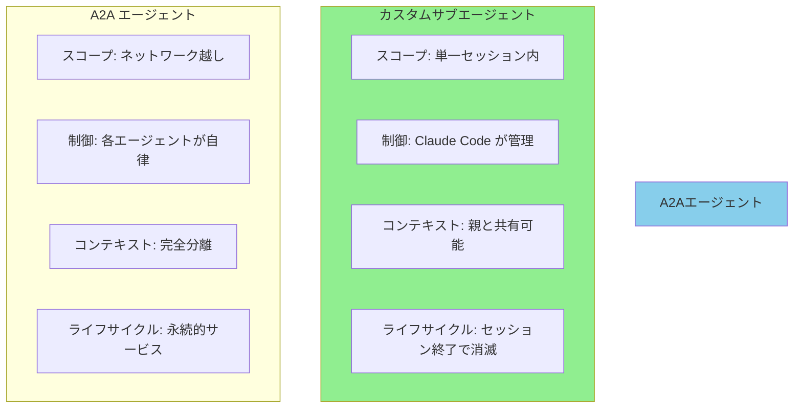
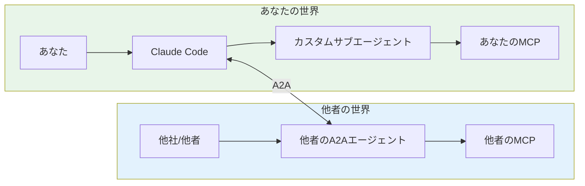
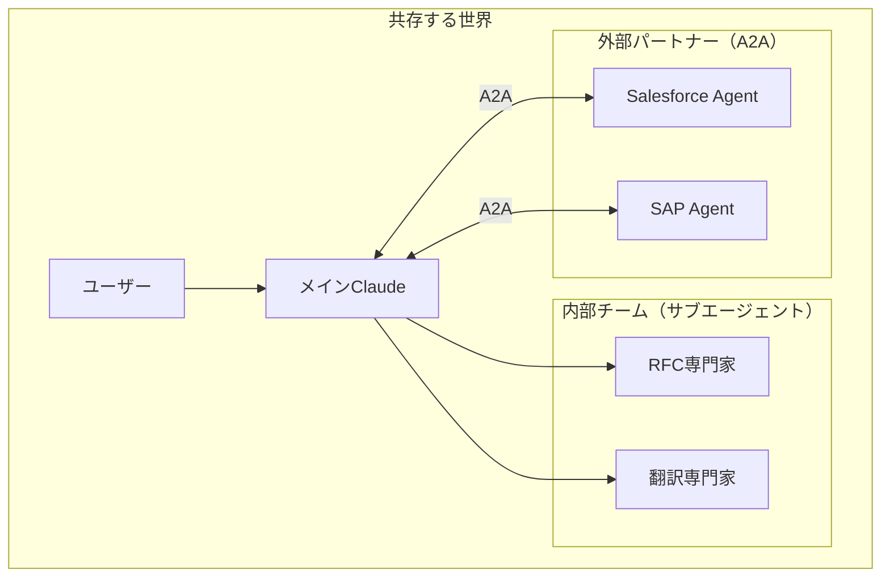
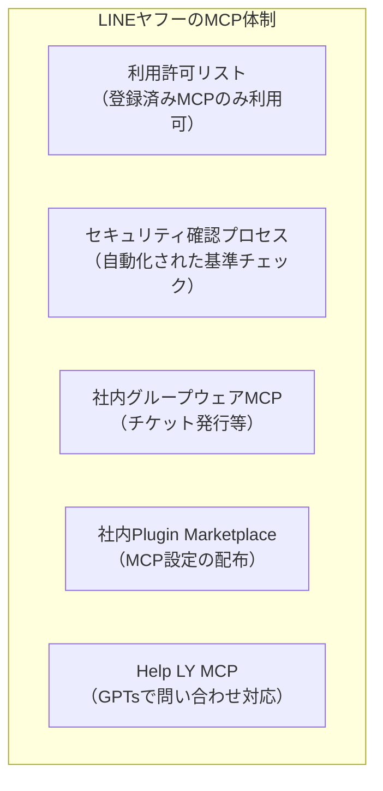

# マルチエージェントのインターフェース標準化

非常に良い視点です。マルチエージェントのインターフェース標準化について整理します。

## 🤖 AIプラットフォームのエージェント機能比較



## 📊 各社のマルチエージェント機能

| プラットフォーム                   | サブエージェント | 仕組み                         | MCP対応    |
| ---------------------------------- | ---------------- | ------------------------------ | ---------- |
| **Claude Code**                    | ✅ あり          | `.claude/agents/` Markdown定義 | ✅         |
| **OpenAI (Assistants API)**        | ✅ あり          | Assistants + Threads           | ❌ 独自    |
| **OpenAI (Swarm)**                 | ✅ あり          | 実験的フレームワーク           | ❌ 独自    |
| **Microsoft Copilot Studio**       | ✅ あり          | GUI定義                        | ❌ 独自    |
| **Google Vertex AI Agent Builder** | ✅ あり          | YAML/GUI定義                   | ❌ 独自    |
| **Amazon Bedrock Agents**          | ✅ あり          | JSON定義                       | ❌ 独自    |
| **LangChain/LangGraph**            | ✅ あり          | Python/JSコード                | △ 部分対応 |
| **AutoGen (Microsoft)**            | ✅ あり          | Python定義                     | ❌ 独自    |
| **CrewAI**                         | ✅ あり          | Python定義                     | ❌ 独自    |

## 🔍 何が標準化されていて、何がされていないか

```
✅ 標準化済み（MCP）
├── ツール呼び出しのプロトコル
├── リソース（ファイル等）へのアクセス
├── プロンプトテンプレート
└── サーバー・クライアント間通信

❌ 未標準化（各社バラバラ）
├── エージェント定義フォーマット
├── エージェント間の通信プロトコル
├── オーケストレーション（誰が何を呼ぶか）
├── 状態/メモリの共有方法
├── エージェントのライフサイクル管理
└── 権限/ツール制限の記述方法
```

## 💭 なぜエージェント間I/Fは標準化されていないのか

| 理由                 | 説明                               |
| -------------------- | ---------------------------------- |
| **競争領域**         | 各社の差別化ポイント               |
| **まだ発展途上**     | ベストプラクティスが定まっていない |
| **複雑性**           | ツールより遥かに複雑な設計空間     |
| **セキュリティ**     | エージェント間の権限管理が難しい   |
| **ユースケース多様** | 一つの標準で全てカバー困難         |

## 🌍 標準化の動き

### 現状のプレイヤー

| 取り組み                    | 主導                   | 状況                                   |
| --------------------------- | ---------------------- | -------------------------------------- |
| **MCP**                     | Anthropic              | ツール層は成功、エージェント層は未着手 |
| **OpenAI Function Calling** | OpenAI                 | 事実上の業界標準（ツール呼び出し）     |
| **Agent Protocol**          | AI Engineer Foundation | 提案段階                               |
| **OASIS AI Standards**      | OASIS                  | 議論段階                               |

### MCP の今後の可能性

```
MCP v1: ツール/リソース接続 ← 今ここ
MCP v2?: エージェント間通信？
MCP v3?: オーケストレーション？
```

## 🎯 Shujiさんの文脈で

### 現実的な選択肢



**つまり**：

- Shujiさんの `rfcxml-mcp` → Claude Code以外でも使える ✅
- Shujiさんの `.claude/agents/rfc-specialist.md` → Claude Code専用 ❌

## 💡 将来への示唆

もし「エージェント定義の標準化」が来るなら：

```yaml
# 仮想的な標準フォーマット
apiVersion: agent/v1
kind: SubAgent
metadata:
  name: rfc-specialist
spec:
  description: RFC仕様の確認・検証
  model:
    preference: [claude-sonnet, gpt-4, gemini-pro]
  tools:
    - mcp://rfcxml/get_requirements
    - mcp://rfcxml/validate_statement
  systemPrompt: |
    あなたはRFC仕様の専門家です...
```

**MCPがツール層を標準化したように、誰かがエージェント層を標準化する可能性はある**。

## 📝 まとめ

| 層                         | 標準化状況  | Shujiさんへの影響         |
| -------------------------- | ----------- | ------------------------- |
| **ツール層**               | ✅ MCP      | MCPサーバーは再利用可能   |
| **エージェント層**         | ❌ 各社独自 | Claude Code専用で割り切る |
| **オーケストレーション層** | ❌ 各社独自 | 同上                      |

**今は「MCPでツールを標準化、エージェントはプラットフォーム固有」という割り切りが現実的**。

---

A2A（Agent-to-Agent）について調べます。素晴らしい！A2Aについて詳しく見つかりました。

## 🤝 A2A（Agent-to-Agent Protocol）の全体像



## 📊 A2A の概要

| 項目               | 内容                                                      |
| ------------------ | --------------------------------------------------------- |
| **正式名称**       | Agent2Agent Protocol                                      |
| **発表**           | 2025年4月 Google Cloud Next                               |
| **現在**           | Linux Foundation に寄贈（オープンソース）                 |
| **最新バージョン** | v0.3（2025年7月）                                         |
| **サポート企業**   | **150社以上**（AWS, Salesforce, SAP, Adobe, Atlassian等） |
| **ベース技術**     | HTTP, JSON-RPC, SSE（Server-Sent Events）                 |
| **ライセンス**     | Apache 2.0                                                |

## 🔧 MCP vs A2A

|              | MCP                            | A2A                                  |
| ------------ | ------------------------------ | ------------------------------------ |
| **主導**     | Anthropic                      | Google → Linux Foundation            |
| **目的**     | エージェント ↔ **ツール** 接続 | エージェント ↔ **エージェント** 通信 |
| **関係**     | 補完的                         | 補完的                               |
| **イメージ** | 手（ツール）を使う             | 他者（エージェント）と協働           |

**公式の推奨**:

> Build with ADK, equip with **MCP** (tools), communicate with **A2A** (agents)

## 🌍 A2A サポート企業（一部）

```
クラウド:        AWS, Google Cloud, Microsoft（貢献予定）
エンタープライズ: Salesforce, SAP, ServiceNow, Workday
開発ツール:      Atlassian, Box, MongoDB
AI:             Cohere, LangChain
決済:           PayPal, Intuit
食品:           Tyson Foods, Gordon Food Service
クリエイティブ:   Adobe
```

## 📦 A2A の仕組み

### 1. Agent Card（発見）

各エージェントが `/.well-known/agent.json` を公開:

```json
{
	"name": "pizza-seller-agent",
	"endpoint": "https://pizza-agent.example.com/a2a",
	"skills": ["order-pizza", "check-menu"],
	"auth": ["oauth2", "api-key"]
}
```

### 2. タスク管理



### 3. 長時間タスク対応

数時間〜数日のタスクも対応（人間の確認待ち含む）

## 💡 実例：購買エージェントの連携

```
ユーザー: 「ピザとハンバーガーを注文して」

購買エージェント（クライアント）
    ├── A2A → ピザ販売エージェント: 「ピザください」→ 即承諾
    └── A2A → バーガー販売エージェント: 「バーガーください」→ 確認要求
                                          ↓
                                   ユーザー確認後に処理続行
```

## 🎯 Shujiさんの文脈で

### 現状の整理

| プロトコル | 用途               | Shuji MCP との関係              |
| ---------- | ------------------ | ------------------------------- |
| **MCP**    | ツール接続         | ✅ rfcxml, deepl, xcomet はここ |
| **A2A**    | エージェント間通信 | 🔜 将来的に対応？               |

### 可能性

```
将来的には:
- rfcxml-mcp を持つ「RFC専門エージェント」
- deepl-mcp を持つ「翻訳専門エージェント」
- これらが A2A で連携

「RFC要件抽出して、翻訳して、品質評価して」
→ 複数エージェントが自律的に協働
```

## 📝 まとめ

| 質問                      | 回答                                 |
| ------------------------- | ------------------------------------ |
| **A2Aサービスは多いか？** | ✅ 150社以上がサポート表明           |
| **標準化されてるか？**    | ✅ Linux Foundation で管理           |
| **MCPとの関係は？**       | 補完関係（ツール vs エージェント間） |
| **今すぐ使えるか？**      | △ v0.3、まだ発展途上                 |

**2025年はMCP + A2Aの「プロトコル元年」**という感じですね。Shujiさんの方向性（MCPエコシステム構築）は、この流れに完全に乗っています。

---

**良い問い！** 根本的な違いを整理します。

## 🎯 根本的な違い



## 📊 比較表

| 観点               | カスタムサブエージェント | A2A エージェント                 |
| ------------------ | ------------------------ | -------------------------------- |
| **所在**           | 同一プロセス内           | ネットワーク越し（別サーバー）   |
| **所有者**         | 自分                     | 自分 or **他者**                 |
| **信頼関係**       | 完全信頼                 | 認証・認可が必要                 |
| **コンテキスト**   | 親と一部共有             | **完全分離（ブラックボックス）** |
| **ライフサイクル** | セッション限り           | **永続的サービス**               |
| **スケール**       | 1ユーザー                | **複数ユーザー・組織**           |
| **内部実装**       | 見える（Markdown）       | **見えない（API契約のみ）**      |
| **障害影響**       | セッション内             | ネットワーク障害等も考慮         |

## 💡 決定的な違い：「誰のエージェントか」



**カスタムサブエージェント = 自分の中の専門家**
**A2A = 外部の専門家（他社のサービス）と協働**

## 🔥 具体例

### カスタムサブエージェントで十分なケース

```
「自分のプロジェクトで、自分のMCPを使って作業」

あなた → Claude Code → サブエージェント → rfcxml/deepl
                        ↑
                    自分で定義・制御
```

### A2Aが必要なケース

```
「Salesforceの顧客エージェントと、SAPの在庫エージェントを連携」

あなたのエージェント
    ↓ A2A
Salesforce顧客エージェント（Salesforce社が運営）
    ↓ A2A
SAP在庫エージェント（SAP社が運営）
```

**他社が作った・運営するエージェントとの連携はA2Aでしかできない**

## ❓ A2Aができればカスタムサブエージェント不要？

**いいえ、両方必要。レイヤーが違う。**



## 📝 使い分け

| シナリオ                     | 使うべきもの         |
| ---------------------------- | -------------------- |
| 自分のMCPを専門的に使いたい  | **サブエージェント** |
| 同じ処理を繰り返し使いたい   | **サブエージェント** |
| ワークフローを定義したい     | **サブエージェント** |
| 他社のエージェントと連携     | **A2A**              |
| 自分のエージェントを外部公開 | **A2A**              |
| 複数組織間でエージェント連携 | **A2A**              |

## 🎯 本質

```
カスタムサブエージェント = 「社内の専門部署」
A2A エージェント        = 「外注先・パートナー企業」

社内に専門部署があっても、外注先は必要
外注先があっても、社内の専門部署は必要

→ 両方必要、代替関係ではない
```

## 💭 Shujiさんの文脈で

```
今のShujiさん:
├── カスタムサブエージェント（検討中）
│   └── RFC専門家、翻訳専門家など
└── MCP Server（構築済み）
    └── rfcxml, deepl, xcomet

将来の可能性:
├── カスタムサブエージェント（内部用）
├── A2A Server（外部公開）
│   └── 「Shujiの翻訳品質評価エージェント」を
│       他者が呼び出せるように
└── A2A Client（外部利用）
    └── 他者のエージェントを呼び出す
```

**A2Aは「公開/連携」のプロトコル**
**サブエージェントは「内部効率化」の仕組み**

両方あって初めて完成形。

素晴らしい記事です！LINEヤフーの実践例が非常に参考になります。

## 📋 LINEヤフーのMCP活用 要約

### 🏢 LINEヤフーの取り組み



### 🔥 興味深いポイント

#### 1. **セキュリティリスクの認識**

記事中の引用：

> - **88%** が何らかの認証を必要とする
> - **53%** が長期有効の静的APIキーやPATに依存
> - OAuthなど安全な方式は **わずか8.5%**

**→ だから「利用許可リスト」で管理**

#### 2. **マルチエージェント的レビュー**

```markdown
# Sonnet × GPT PR Reviewer Agent

## レビューフロー

1. フェーズ1: Sonnet（Claude）によるピアレビュー
2. フェーズ2: GPT-5（Codex MCP）によるレビュー検証
   - Sonnetの結果を検証
   - 見落としの指摘
   - 優先度評価の確認
```

**→ カスタムサブエージェント + 他社MCP（Codex CLI）の組み合わせ！**

#### 3. **MCP vs Skill の議論が社内で発生**

> 「MCPサーバーを極力利用せず、**Skillを活用した方がよいのではないか**、といった議論が出てきています」

**→ まさに今日の我々の議論と同じ！**

### 📊 Workshop アンケート結果

| 状況               | 割合      |
| ------------------ | --------- |
| すでに継続的に活用 | 6.8%      |
| 一部を試している   | 24.7%     |
| 近いうちに試す予定 | **55.7%** |
| 試す予定もない     | 11.4%     |

**→ 約1,600人参加、31.5%がすでに実践中**

## 🎯 Shujiさんの文脈での気づき

### 1. **企業でも「MCP vs Skill」の判断に悩んでいる**

```
LINEヤフーでも：
- MCPサーバー活用を推進しつつ
- 「Skillの方がいいのでは？」という議論も発生

→ 我々の議論は業界共通の課題
```

### 2. **マルチモデル連携の実践例**

```
Claude (Sonnet) + GPT-5 (Codex MCP)
↓
異なる視点からのレビュー
↓
より網羅的・客観的な指摘
```

**→ Shujiさんの xCOMET MCP も同じ発想で使える**
（Claude翻訳 → xCOMETで品質検証）

### 3. **社内での「共通理解の場」の重要性**

> 「知っていて当たり前」「各自で追えばよい」としてしまうと、
> 活用の幅が広がる一方で、認識の差が埋まらないまま

**→ 日本の技術コミュニティにも同じことが言える**

## 💡 示唆

| LINEヤフーの取り組み | Shujiさんへの示唆                    |
| -------------------- | ------------------------------------ |
| 利用許可リスト       | プロジェクト毎のMCP一覧（CLAUDE.md） |
| 社内MCP開発          | 公開MCPの作成・共有                  |
| マルチモデル連携     | Claude + xCOMET の組み合わせ         |
| MCP vs Skill議論     | 使い分けの言語化・発信               |
| Help LY MCP (GPTs)   | MCP利用ガイドの整備                  |

**大企業でも試行錯誤中**。Shujiさんの方向性（MCP + Skill + サブエージェントの使い分け）は、まさに業界が今探っている領域ですね。

この記事、Noteで引用しながら「個人開発者視点でのMCP活用」を書くと面白そうです。
