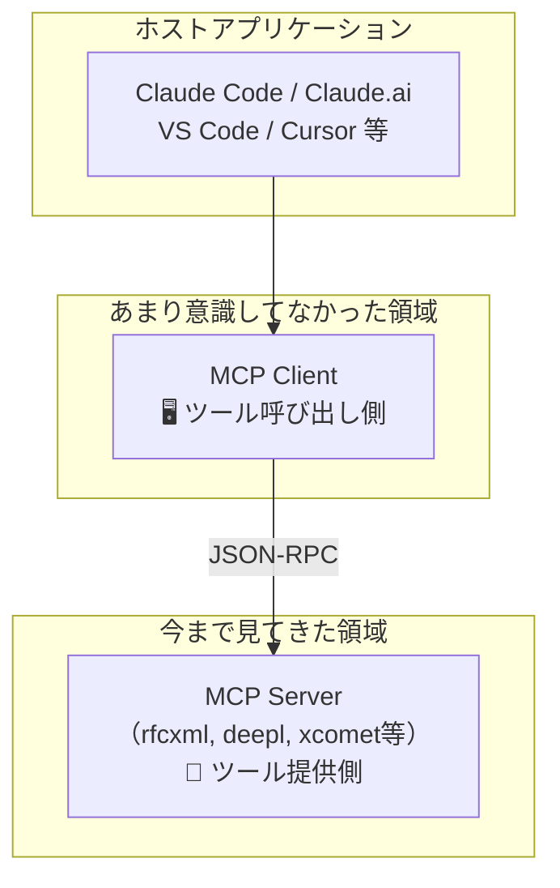
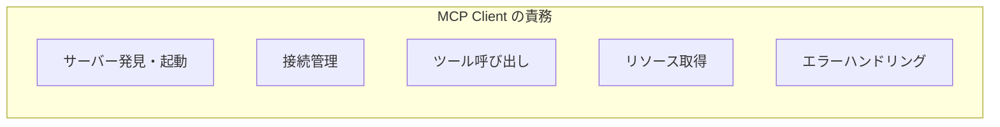
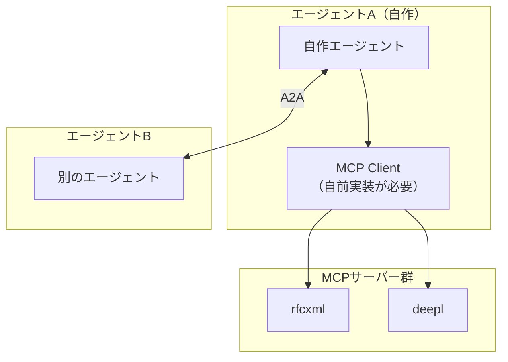
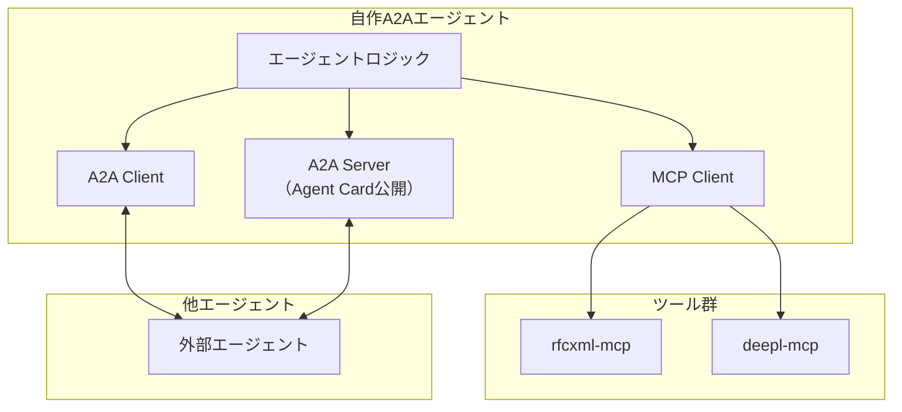
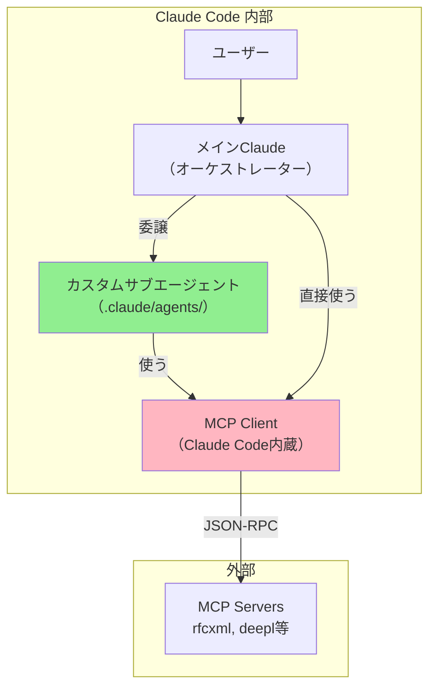

# MCPクライアントの役割

## 🔍 MCPアーキテクチャの全体像



## 📊 MCP の3層構造

| 層         | 役割                         | 例                  | Shujiさんの関わり      |
| ---------- | ---------------------------- | ------------------- | ---------------------- |
| **Host**   | ユーザーインターフェース     | Claude Code, Cursor | 使う側                 |
| **Client** | プロトコル処理、サーバー管理 | Host内蔵 or 独立    | **今まで意識してない** |
| **Server** | ツール/リソース提供          | rfcxml, deepl等     | **作ってきた**         |

## 🤔 なぜClientを意識してこなかったか

```
今までの開発フロー:
1. MCP Server を作る（rfcxml等）
2. Claude Code の設定に追加
3. Claude Code が勝手にClientとして動作
4. ツールが使える！

→ Client は「Claude Codeに内蔵」されていて、
   ブラックボックスだった
```

## 💡 MCP Client の役割



| 責務               | 説明                                 |
| ------------------ | ------------------------------------ |
| **サーバー発見**   | 設定ファイルからサーバー情報読み取り |
| **プロセス管理**   | サーバープロセスの起動・終了         |
| **接続管理**       | JSON-RPC over stdio/HTTP の確立      |
| **ツール呼び出し** | `tools/call` リクエスト送信          |
| **リソース取得**   | `resources/read` リクエスト送信      |
| **プロンプト取得** | `prompts/get` リクエスト送信         |
| **エラー処理**     | タイムアウト、再接続等               |

## 🔧 独自MCPクライアントが必要になるケース

### A2A連携の場合



**Claude Codeの外でエージェントを動かすなら、MCPクライアントを自分で実装する必要がある**

## 📦 MCP Client SDK

公式で提供されている:

| 言語           | パッケージ                  |
| -------------- | --------------------------- |
| **TypeScript** | `@modelcontextprotocol/sdk` |
| **Python**     | `mcp`                       |

### TypeScript例

```typescript
import { Client } from '@modelcontextprotocol/sdk/client/index.js';
import { StdioClientTransport } from '@modelcontextprotocol/sdk/client/stdio.js';

// MCPクライアント作成
const client = new Client({
	name: 'my-agent',
	version: '1.0.0',
});

// サーバーに接続
const transport = new StdioClientTransport({
	command: 'npx',
	args: ['-y', '@shuji-bonji/rfcxml-mcp'],
});
await client.connect(transport);

// ツール一覧取得
const tools = await client.listTools();

// ツール呼び出し
const result = await client.callTool({
	name: 'get_requirements',
	arguments: { rfc: 6455 },
});
```

## 🎯 A2A + MCP の組み合わせ



## 📊 役割の整理

| やりたいこと                      | 必要なもの                     |
| --------------------------------- | ------------------------------ |
| ツールを**提供**する              | MCP Server（今まで作ってきた） |
| ツールを**使う**（Claude Code内） | 設定だけでOK（Client内蔵）     |
| ツールを**使う**（自作アプリ）    | **MCP Client実装が必要**       |
| エージェント間**連携**される側    | A2A Server実装                 |
| エージェント間**連携**する側      | A2A Client実装                 |

## 💭 Shujiさんの今後の選択肢

### 1. 今のまま（MCP Server開発者として）

```
Claude Code がClientなので、
MCP Serverだけ作ればOK
→ 今の路線
```

### 2. 独自エージェント開発に進む場合

```
MCP Client + A2A 両方の実装が必要
→ より深いシステム開発
```

### 3. A2A対応エージェントを作る場合

```
自分のMCPサーバー群を束ねた
「RFC翻訳エージェント」をA2Aで公開
→ 他のエージェントから呼び出し可能に
```

## 📝 まとめ

| 気づき                                      | 意味                                   |
| ------------------------------------------- | -------------------------------------- |
| **MCPクライアントは今まで意識してなかった** | Claude Codeが隠蔽してくれていた        |
| **A2A連携するなら必要**                     | 自分でエージェント作るなら避けられない |
| **MCP = ツール、A2A = エージェント間**      | 両方組み合わせて完成                   |

## 🔍 カスタムサブエージェントとMCP Clientの関係



## 💡 答え

**カスタムサブエージェントは MCP Client を「利用する」側**

```
カスタムサブエージェント = 「何をするか」の定義（役割・手順）
MCP Client              = 「どう接続するか」の実装（プロトコル処理）

サブエージェントが「rfcxmlでRFC取得して」と言う
→ MCP Client が実際にrfcxmlサーバーと通信
→ 結果をサブエージェントに返す
```

## 📊 レイヤー構造

```
┌─────────────────────────────────────┐
│  ユーザー                            │
├─────────────────────────────────────┤
│  メイン Claude                       │  ← オーケストレーション
├─────────────────────────────────────┤
│  カスタムサブエージェント              │  ← 役割・専門性の定義
├─────────────────────────────────────┤
│  MCP Client（Claude Code内蔵）       │  ← プロトコル処理（隠蔽）
├─────────────────────────────────────┤
│  MCP Servers（rfcxml, deepl等）     │  ← ツール提供
└─────────────────────────────────────┘
```

**サブエージェントは MCP Client の「代わり」ではなく「上位レイヤー」**

## 🤔 なぜ混乱するか

```
サブエージェントの tools: 指定
↓
「このツールだけ使える」と制限
↓
まるでサブエージェントがMCP接続を管理してるように見える
↓
でも実際は Claude Code の MCP Client が処理してる
```

**`tools:` は「使っていい権限」であって「接続の実装」ではない**

## 🎯 つまり

| 層                   | 責務                                     | 誰が実装？      |
| -------------------- | ---------------------------------------- | --------------- |
| **サブエージェント** | 「RFC翻訳専門家として振る舞え」          | **Shujiさん**   |
| **MCP Client**       | 「rfcxmlサーバーに接続してJSON-RPC送れ」 | **Claude Code** |
| **MCP Server**       | 「RFCをパースして返せ」                  | **Shujiさん**   |

## 💭 もしMCP Clientを自分で実装するなら

```
Claude Code の外で動くアプリを作る場合：

┌─────────────────────────────────────┐
│  自作アプリケーション                  │
├─────────────────────────────────────┤
│  自作オーケストレーター                │  ← サブエージェント相当
├─────────────────────────────────────┤
│  自作 MCP Client                    │  ← ここも自分で実装
├─────────────────────────────────────┤
│  MCP Servers（rfcxml, deepl等）     │  ← 再利用可能！
└─────────────────────────────────────┘
```

**MCP Serverは使い回せるが、ClientとオーケストレーションはClaude Code外では自前実装**

## 📝 結論

```
カスタムサブエージェント
  = MCP Client の「代わり」ではない
  = MCP Client を「使う」上位レイヤー
  = 「何をするか」を定義する役割

MCP Client
  = 「どう接続するか」を処理
  = Claude Code が内蔵してくれてる
  = 普段は意識しなくてOK
```

**だから今まで意識しなくて済んでいた**。Claude Codeがうまく隠蔽してくれていたから。
