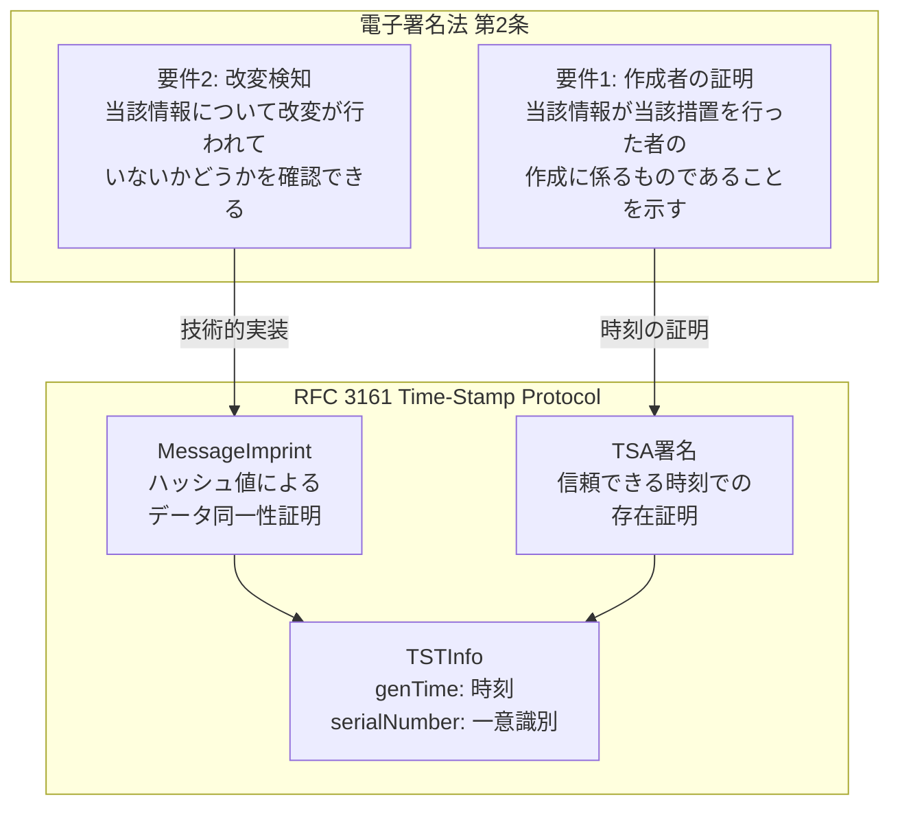
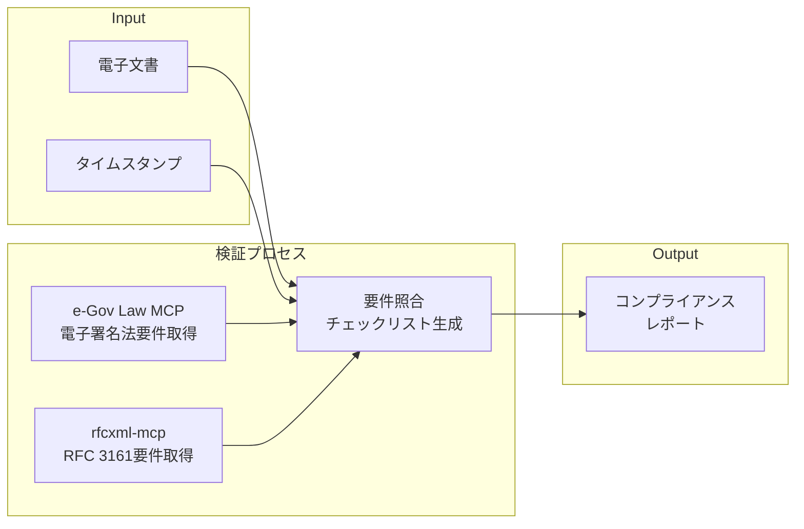
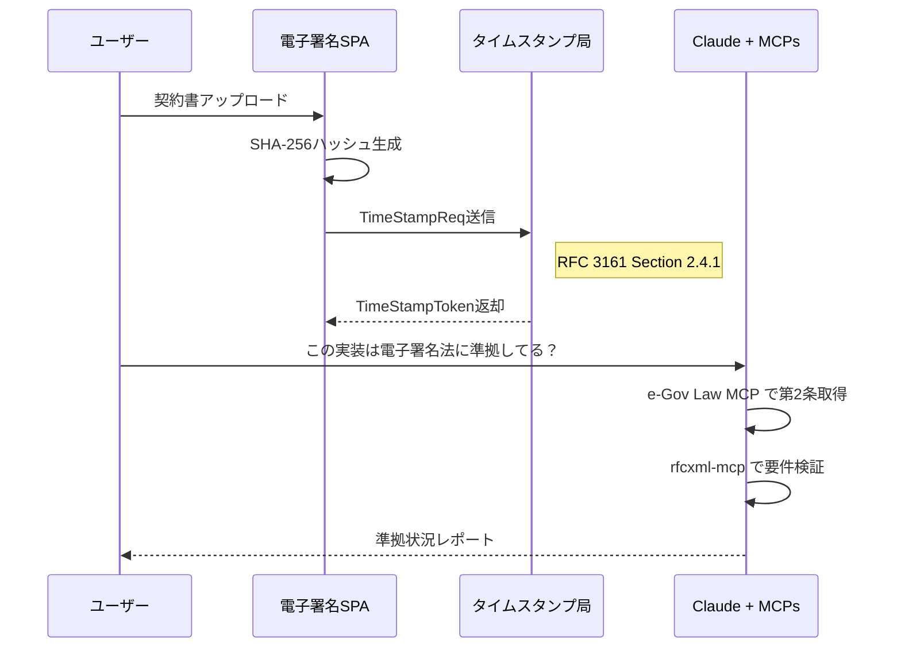
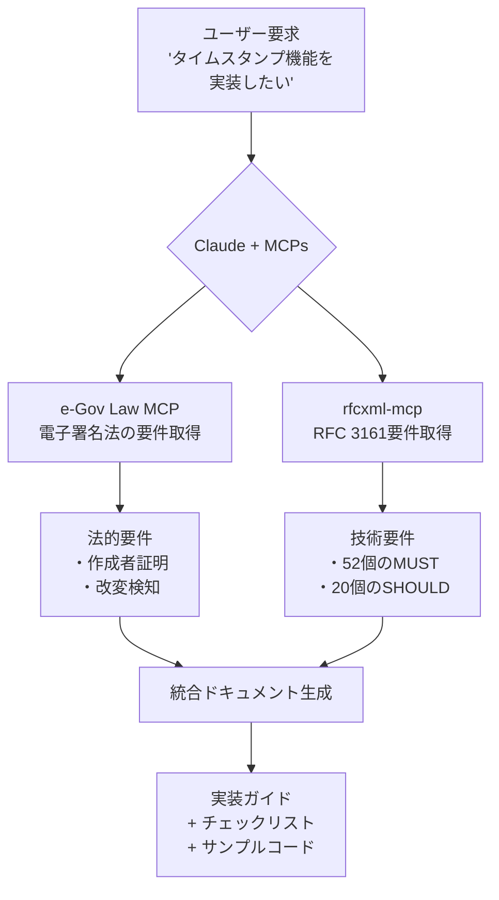
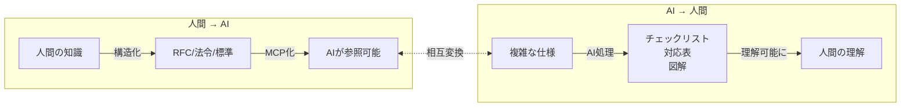
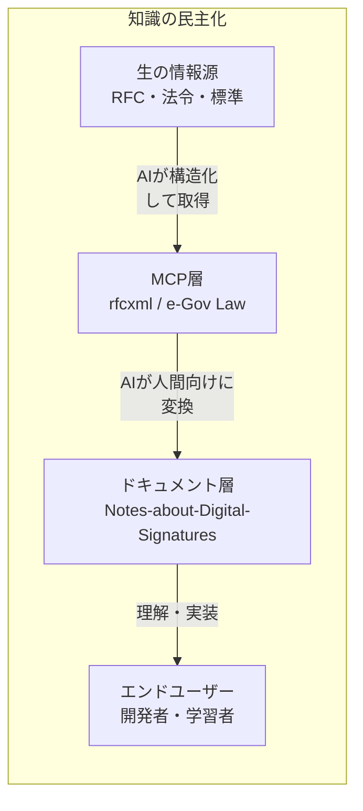

# 電子署名法 × RFC 3161

https://github.com/ryoooo/e-gov-law-mcp
https://github.com/shuji-bonji/rfcxml-mcp

## 電子署名法 × RFC 3161 の接点

### 法的定義と技術仕様の対応関係



### 重要な要件の対応表

| 電子署名法   | RFC 3161 要件                                                            | 技術的意味           |
| ------------ | ------------------------------------------------------------------------ | -------------------- |
| 改変検知     | `messageImprint MUST have the same value`                                | ハッシュ値の一致確認 |
| 作成時刻証明 | `genTime` (GeneralizedTime)                                              | UTC時刻での存在証明  |
| 信頼性       | `TSA MUST sign each time-stamp message with a key reserved specifically` | 専用鍵による署名     |
| 検証可能性   | `ESSCertID of the TSA certificate MUST be included`                      | 証明書チェーン検証   |

## 実用的なユースケース案

### 1. コンプライアンス検証ツール



**実装例のコンセプト**:

```typescript
// AI に法的・技術的要件を両方確認させるワークフロー
const workflow = {
	// Step 1: 法的要件を取得
	legalRequirements: await eGovLaw.findLawArticle('電子署名法', '2'),

	// Step 2: 技術要件を取得
	technicalRequirements: await rfcxml.getRequirements(3161),

	// Step 3: 実装チェックリスト生成
	checklist: await rfcxml.generateChecklist(3161, { role: 'both' }),
};
```

### 2. 電子契約システムの設計支援

Shujiさんの電子署名SPA開発経験を活かして：



### 3. 法令×技術仕様のクロスリファレンス文書

```typescript
// 生成される文書の構造イメージ
interface ComplianceDocument {
	legalBasis: {
		law: '電子署名法';
		article: '第2条';
		requirements: ['作成者証明', '改変検知'];
	};
	technicalSpec: {
		rfc: 3161;
		mustRequirements: 52; // 52個のMUST要件
		keyRequirements: [
			'TSA MUST sign each time-stamp message',
			'messageImprint MUST have the same value',
			'certificate MUST contain extended key usage',
		];
	};
	implementationChecklist: string[]; // 実装チェックリスト
}
```

## 具体的な組み合わせ例

### デモ: 実装チェックリスト生成75個のMUST要件、23個のSHOULD要件が出てきました！

## 実際にできそうなこと

### 案1: 「タイムスタンプ実装ガイド」自動生成



### 案2: 電子署名SPA機能拡張の設計レビュー

Shujiさんの過去の経験を活かすと：

| フェーズ | e-Gov Law MCP              | rfcxml-mcp                          |
| -------- | -------------------------- | ----------------------------------- |
| 要件定義 | 電子署名法の法的要件確認   | RFC 3161の技術仕様確認              |
| 設計     | 認証業務の要件（第2条2項） | TSA要件（Section 2.1）              |
| 実装     | -                          | TimeStampReq/Resp形式               |
| テスト   | 改変検知要件の検証         | クライアント検証要件（Section 2.2） |

### 案3: Note記事ネタ

「日本の電子署名法とRFC 3161の対応関係」というテーマで：

1. **法律側から見た技術要件** - e-Gov Law MCPで条文取得
2. **技術側から見た法的準拠** - rfcxml-mcpで要件リスト
3. **実装者向けチェックリスト** - 両方組み合わせて生成

興味があれば、実際に「タイムスタンプ実装ガイド」のドラフトを生成してみることもできますが、どうでしょう？

---

- **「AIに理解させるために、人間がどう構造化すべきか」**
- **「人間に理解させるために、AIをどう使うべきか**



## 双方向の知識変換

### 方向1: 人間 → AI（構造化）

| 人間の知識 | 構造化形式 | AIが使える形   |
| ---------- | ---------- | -------------- |
| 法律の条文 | e-Gov API  | e-Gov Law MCP  |
| 技術仕様   | RFC XML    | rfcxml-mcp     |
| 翻訳ルール | 用語集     | DeepL Glossary |
| 暗黙知     | Markdown   | Skills         |

**目的**: AIが「揺らがない参照元」にアクセスできるようにする

### 方向2: AI → 人間（理解支援）

| 複雑な情報源       | AI処理     | 人間が理解できる形 |
| ------------------ | ---------- | ------------------ |
| RFC 3161 (135要件) | 抽出・分類 | チェックリスト     |
| 電子署名法 + RFC   | 対応付け   | マッピング表       |
| 技術仕様           | 可視化     | Mermaid図          |
| 英語RFC            | 翻訳       | 日本語解説         |

**目的**: 人間が専門家でなくても正確な知識にアクセスできる

## このリポジトリの位置づけ



このリポジトリは**中間層**として機能する：

- **上方向**: RFC・法令という「揺らがない参照元」に根拠を持つ
- **下方向**: 開発者が実際に理解・実装できる形で提供する

## Shujiさんの活動の本質

```
従来: 専門家 → 書籍/講演 → 一般開発者（一方通行、高コスト）

MCP時代:
  標準仕様(RFC/法令)
    ↓ MCP化（構造化）
  AI
    ↓ 変換・解説
  ドキュメント/チェックリスト
    ↓
  誰でもアクセス可能な知識
```

これは「知識の民主化」そのもの。高額なコンサルや専門家に頼らなくても、正確な情報に基づいた開発ができるようになる。

## Note記事のネタになりそう

**タイトル案**: 「AIに理解させる構造化、AIで人間に理解させる変換 — MCPが実現する知識の双方向ブリッジ」

1. 従来の知識伝達の問題点（専門家依存、高コスト）
2. MCPによる「上流」の構造化（RFC、法令）
3. AIによる「下流」への変換（チェックリスト、図解）
4. 具体例：電子署名法 × RFC 3161
5. 知識の民主化への展望

このリポジトリの拡充作業自体が、この概念の実証
