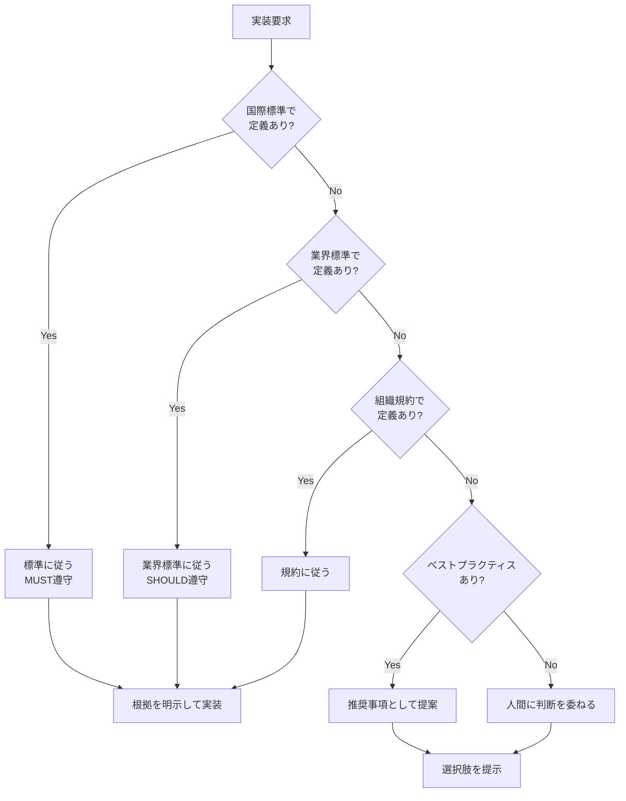
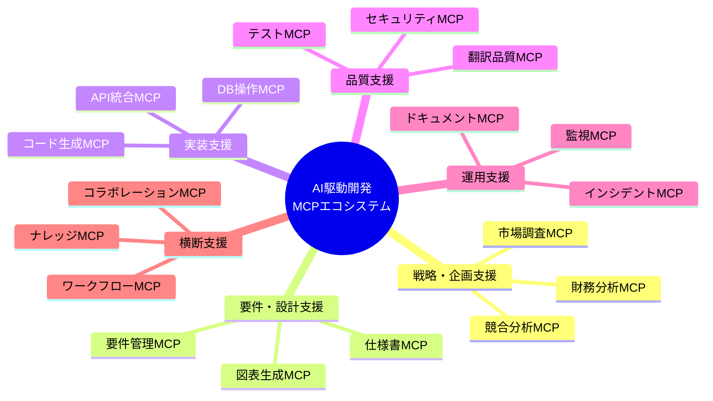

# AI駆動開発を支えるMCPエコシステム

> 議論日: 2025-01-19
> トピック: AI駆動開発の本質、全工程を支えるMCP体系、ブレない参照先

---

## 議論の背景

MCP開発において、システム・アプリケーション開発に必要な全プロセス・タスク・技術を網羅的に整理し、AI駆動開発を支えるMCPサーバー体系を検討した。

---

## 1. 核心的な洞察

### AI駆動開発の本質

> AI駆動開発の本質は、コード生成だけでなく、**全工程でAIを「知的アシスタント」として活用**し、人間はより高次の判断・創造に集中できる環境を作ることである。

```
AI駆動開発 ≠ AIにコードを書かせること
AI駆動開発 = 全工程でAIを活用し、人間は判断・創造に集中
```

### 過渡期における課題

> 現在、AIがCI/CDをも含め、いきなりバイナリを出力して実装できるようになるまで、AI駆動開発には、これまでの人々が培ってきたエンジニアリングの導入は不可欠と考える。AIは判断するための指針が必要です。

**結論**: AIの判断にブレない参照先を与えることが、AI駆動開発の信頼性の基盤となる。

---

## 2. 人間とAIの役割分担

```mermaid
graph TB
    subgraph 人間の役割
        A[意思決定]
        B[創造性]
        C[品質判断]
        D[ステークホルダー対話]
    end
    
    subgraph AIの役割（MCP経由）
        E[情報収集・分析]
        F[定型作業自動化]
        G[品質チェック]
        H[ドキュメント生成]
    end
    
    subgraph 成果
        I[開発速度向上]
        J[品質向上]
        K[ナレッジ蓄積]
        L[属人化解消]
    end
    
    A --> E
    B --> F
    C --> G
    D --> H
    E --> I
    F --> I
    G --> J
    H --> K
    I --> L
    J --> L
    K --> L
```

---

## 3. 「ブレない参照先」の体系

### 参照先の階層

| レベル | 権威 | 例 | 遵守度 |
|--------|------|-----|--------|
| **国際標準・法規制** | 最高 | IETF RFC, W3C, ISO, GDPR | MUST |
| **業界標準・デファクト** | 高 | OpenAPI, OWASP, OAuth 2.0 | SHOULD |
| **組織・プロジェクト規約** | 中 | コーディング規約、ADR | ローカル |
| **ベストプラクティス** | 参考 | デザインパターン、経験則 | 推奨 |

### AIの判断フロー



### なぜ参照先が必要か

| AIの限界 | 参照先が解決すること |
|----------|---------------------|
| 学習データの時点固定 | 権威ある最新情報源 |
| ハルシネーション | 検証可能な根拠 |
| 文脈による解釈のブレ | 一貫した判断基準 |
| 最新情報の欠如 | 最新仕様の取得 |

### 参照先MCPの価値

1. **AIの判断が検証可能になる**
2. **一貫性のある品質が担保される**
3. **ベンダーロックインを回避できる**
4. **知識へのアクセスが民主化される**

---

## 4. 開発フェーズ全体像

### フェーズ一覧

```
1. 戦略・企画
   ├── ビジネス戦略・目標設定
   ├── 実現可能性調査（Feasibility Study）
   └── プロダクト戦略

2. 要件定義
   ├── 要件収集・分析
   ├── 機能要件
   └── 非機能要件（NFR）

3. 設計
   ├── アーキテクチャ設計
   ├── 詳細設計
   └── 規格・標準・プロトコル

4. 実装
   ├── 開発環境・ツールチェーン
   ├── フロントエンド/バックエンド
   └── コーディング規約

5. テスト・品質保証
   ├── テスト種別
   └── 品質メトリクス

6. セキュリティ
   ├── セキュリティ対策
   └── コンプライアンス

7. インフラ
   ├── クラウド・コンテナ
   ├── IaC
   └── CI/CD

8. 運用・保守
   ├── 監視・オブザーバビリティ
   └── インシデント管理

9. ドキュメント
   └── 各種ドキュメント

10. プロジェクト管理
    ├── 方法論（ウォーターフォール/アジャイル）
    └── 管理要素
```

---

## 5. AI駆動開発を支えるMCPサーバー体系

### 全体像



### フェーズ別MCP一覧

#### 1. 戦略・企画フェーズ

| MCPサーバー | 機能 | 既存/構想 |
|-------------|------|-----------|
| Market Research MCP | 市場規模データ取得、トレンド分析 | 構想 |
| Competitor Analysis MCP | 競合製品比較、機能マトリクス | 構想 |
| Financial Modeling MCP | ROI計算、TCO算出 | 構想 |

#### 2. 要件定義フェーズ

| MCPサーバー | 機能 | 既存/構想 |
|-------------|------|-----------|
| Requirements Extraction MCP | 会議録からの要件抽出 | 構想 |
| **RFC MCP** | IETF RFC検索・解析・要件抽出 | ✅ 開発中 |
| W3C Spec MCP | Web標準仕様の検索・解説 | 構想 |
| ISO Standard MCP | ISO規格の検索・要約 | 構想 |
| OpenAPI Spec MCP | API仕様の検証・生成 | 構想 |

#### 3. 設計フェーズ

| MCPサーバー | 機能 | 既存/構想 |
|-------------|------|-----------|
| Pattern Advisor MCP | 設計パターン推奨 | 構想 |
| ADR Generator MCP | 決定記録生成 | 構想 |
| Schema Designer MCP | DB設計支援 | 構想 |

#### 4. 実装フェーズ

| MCPサーバー | 機能 | 既存/構想 |
|-------------|------|-----------|
| Context7 | ライブラリドキュメント検索 | ✅ 既存 |
| Svelte MCP | Svelte/SvelteKit開発支援 | ✅ 既存 |
| **RxJS MCP** | RxJSパターン・デバッグ支援 | ✅ 既存 |
| Angular MCP | Angular開発支援 | 構想 |

#### 5. 品質・テストフェーズ

| MCPサーバー | 機能 | 既存/構想 |
|-------------|------|-----------|
| Test Generator MCP | テストコード生成 | 構想 |
| **xCOMET MCP** | 翻訳品質評価 | ✅ 既存 |
| DeepL MCP | 翻訳実行 | ✅ 既存 |

#### 6. セキュリティフェーズ

| MCPサーバー | 機能 | 既存/構想 |
|-------------|------|-----------|
| OWASP MCP | OWASP Top 10チェック | 構想 |
| CVE/NVD MCP | 脆弱性データベース検索 | 構想 |
| GDPR Compliance MCP | GDPR要件チェック | 構想 |

#### 7. インフラ・運用フェーズ

| MCPサーバー | 機能 | 既存/構想 |
|-------------|------|-----------|
| IaC Generator MCP | Terraform/CDK生成 | 構想 |
| Pipeline Generator MCP | CI/CD設定生成 | 構想 |
| Monitoring Config MCP | 監視設定生成 | 構想 |

---

## 6. 参照先MCPの設計方針

### 各MCPが提供すべき機能

| 機能 | 説明 | 例 |
|------|------|-----|
| **検索** | 仕様内のキーワード検索 | 「WebSocket close frame」 |
| **構造取得** | 章立て・セクション階層 | RFC 6455の目次 |
| **要件抽出** | MUST/SHOULD/MAY抽出 | 規範性要件の一覧 |
| **用語定義** | 専門用語の定義取得 | 「Origin」の定義 |
| **参照関係** | 依存する他の仕様 | RFC 6455 → RFC 2616 |
| **チェックリスト生成** | 実装確認項目の生成 | クライアント実装チェック |
| **検証** | 実装が仕様に準拠しているか | 主張の検証 |

### RFC MCP のツール例

```typescript
interface RfcMcpTools {
  // 検索・取得
  searchRfc(keyword: string): RfcSummary[];
  getRfcStructure(rfcNumber: number): Section[];
  getRfcSection(rfcNumber: number, section: string): Content;
  
  // 要件抽出
  getRequirements(rfcNumber: number, level?: RequirementLevel): Requirement[];
  getDefinitions(rfcNumber: number, term?: string): Definition[];
  
  // 関係性
  getDependencies(rfcNumber: number): Dependency[];
  getRelatedSections(rfcNumber: number, section: string): RelatedSection[];
  
  // 実装支援
  generateChecklist(rfcNumber: number, role: 'client' | 'server'): Checklist;
  validateStatement(rfcNumber: number, statement: string): ValidationResult;
}
```

---

## 7. 戦略的ポジションと優先度

### Shujiさんの強み

```
現在の強み
├── RFC MCP 開発中
├── xCOMET MCP 開発済
├── 翻訳ワークフロー経験
└── 標準仕様への深い理解

独自価値
├── 「使う」ではなく「創る」側
├── 日本語圏への橋渡し
└── オープン標準の推進
```

### MCP開発優先度

#### 高優先度（即効性が高い）

1. **RFC/規格MCP群** ← 強みを活かす
   - IETF RFC MCP（開発中）
   - W3C Spec MCP
   - OpenAPI Spec MCP

2. **翻訳・品質MCP群** ← 既存資産活用
   - xCOMET MCP（既存）
   - Terminology MCP（用語管理）

3. **フレームワークMCP群** ← コミュニティ貢献
   - Angular MCP
   - NgRx MCP

#### 中優先度（基盤整備）

4. ドキュメント生成MCP群
5. テスト支援MCP群
6. セキュリティMCP群

#### 長期（エコシステム構築）

7. ワークフロー統合MCP
8. ナレッジ管理MCP
9. プロジェクト管理MCP

---

## 8. まとめ

### 核心メッセージ

1. **AI駆動開発はコード生成だけではない** - 全工程でAIを活用
2. **AIには判断の指針が必要** - ブレない参照先の重要性
3. **人間のエンジニアリング知識を体系化** - MCPとして形式知化
4. **標準規格MCPが基盤** - RFC, W3C, ISO等へのアクセス民主化

### 次のアクション

- [ ] RFC MCP の機能拡充（チェックリスト生成、検証機能）
- [ ] W3C Spec MCP の設計検討
- [ ] OpenAPI Spec MCP の設計検討
- [ ] このドキュメントを `docs/` に体系化（熟成後）

---

## 参考リンク

- [Claude Code MCPドキュメント](https://code.claude.com/docs/ja/mcp)
- [DeepL API](https://developers.deepl.com/docs/getting-started/intro)
- [DeepL MCP Server Guide](https://developers.deepl.com/docs/learning-how-tos/examples-and-guides/deepl-mcp-server-how-to-build-and-use-translation-in-llm-applications)
- [MCP Registry](https://github.com/mcp)
- [Awesome MCP Servers](https://github.com/punkpeye/awesome-mcp-servers)
