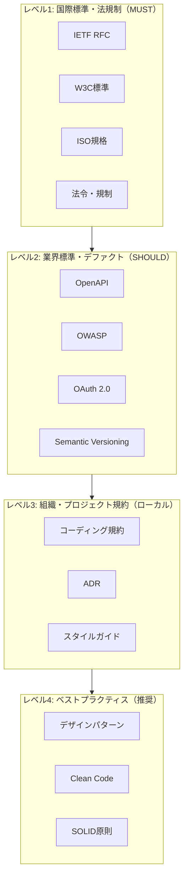
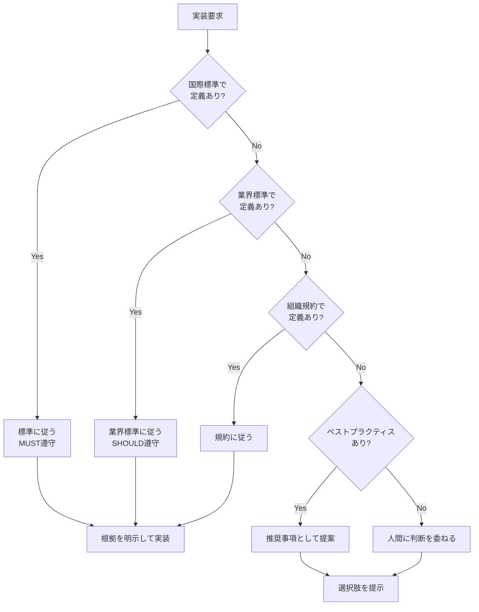
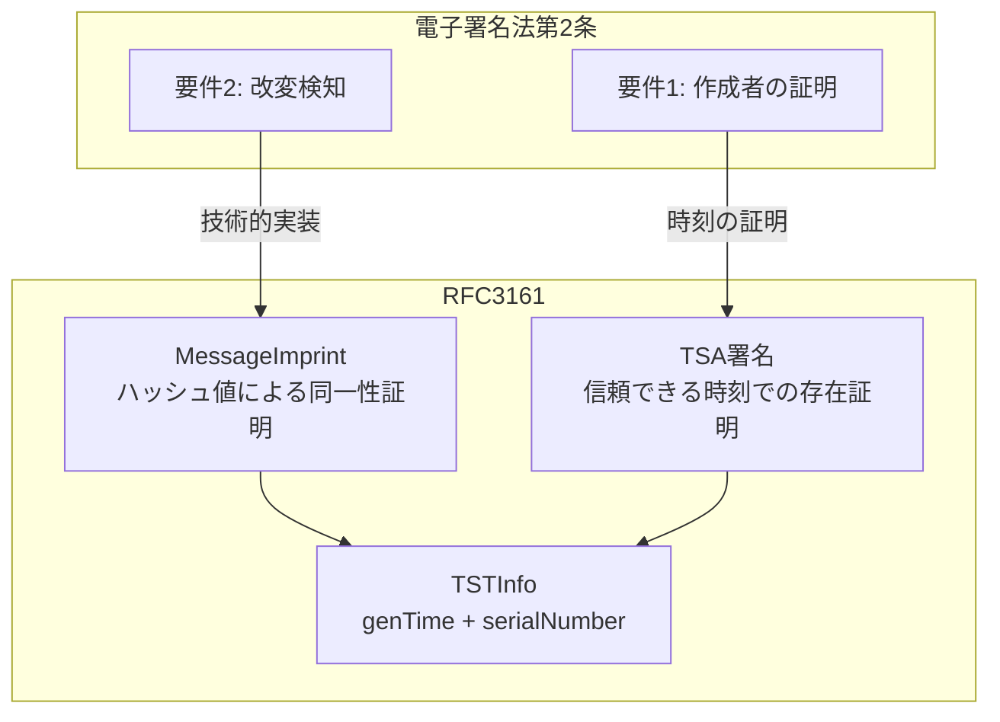
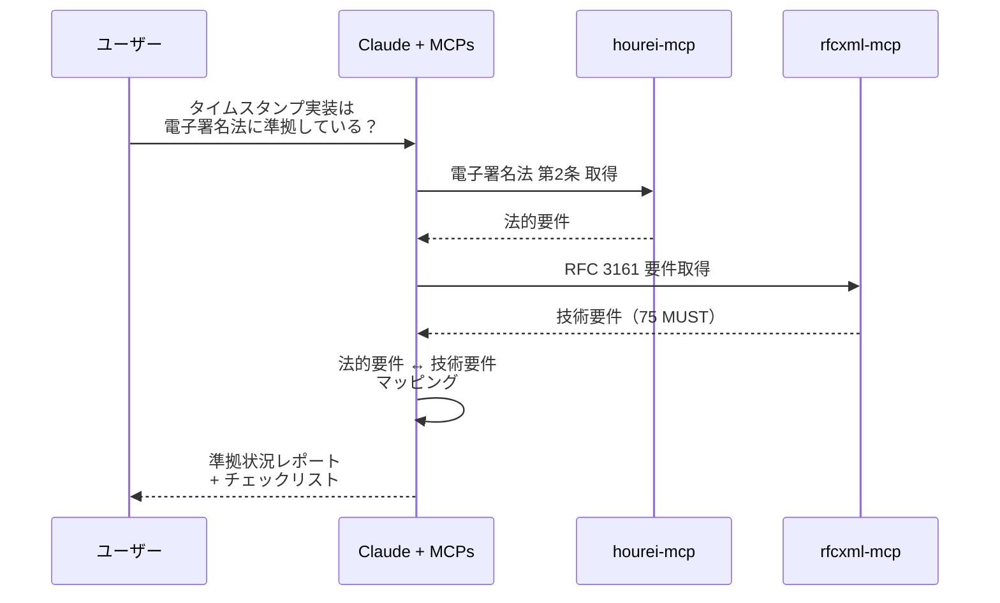

# 「ブレない参照先」の体系

> AIの判断にブレない参照先を与えることが、AI駆動開発の信頼性の基盤となる。

## このドキュメントについて

AI駆動開発において、AIの出力品質は「何を参照するか」で決まる。このドキュメントでは、AIが判断の根拠とすべき「ブレない参照先」を4つの階層に整理し、それぞれの適用場面と優先度を明確にする。

RFC、W3C、法令といった権威ある情報源をMCP化することで、AIの出力に**検証可能な根拠**を持たせることができる。これにより、「AIが言っていることは本当か？」という疑問に対して、常に原典を示せる開発体制が構築できる。

## 参照先の階層構造



## 階層別の詳細

### レベル1: 国際標準・法規制（MUST遵守）

最高権威の参照先。違反すると相互運用性の欠如や法的問題を引き起こす。

| カテゴリ           | 参照先       | 例                                    | MCP化状況     |
| ------------------ | ------------ | ------------------------------------- | ------------- |
| **通信プロトコル** | IETF RFC     | RFC 6455 (WebSocket), RFC 9110 (HTTP) | ✅ rfcxml-mcp |
| **Web標準**        | W3C / WHATWG | HTML, CSS, DOM, Web API               | ✅ w3c-mcp    |
| **国際規格**       | ISO          | ISO 8601 (日時), ISO 32000 (PDF)      | 🔜 検討中     |
| **日本法令**       | e-Gov        | 電子署名法, 個人情報保護法            | ✅ hourei-mcp |
| **EU規制**         | EUR-Lex      | GDPR, eIDAS                           | 📋 構想       |

### レベル2: 業界標準・デファクト（SHOULD遵守）

広く採用されている標準。準拠しないと業界内での互換性に問題。

| カテゴリ           | 参照先           | 用途                        | MCP化状況 |
| ------------------ | ---------------- | --------------------------- | --------- |
| **API設計**        | OpenAPI Spec     | REST API仕様記述            | 📋 構想   |
| **セキュリティ**   | OWASP            | Webセキュリティガイドライン | 📋 構想   |
| **認証**           | OAuth 2.0 / OIDC | 認可・認証フロー            | 📋 構想   |
| **メッセージング** | AsyncAPI         | 非同期API仕様               | 📋 構想   |

### レベル3: 組織・プロジェクト規約（ローカル遵守）

チーム・プロジェクト内で統一すべきルール。

| カテゴリ             | 形式                  | 用途                     |
| -------------------- | --------------------- | ------------------------ |
| **コーディング規約** | Markdown / Linter設定 | コードスタイル統一       |
| **ADR**              | Markdown              | アーキテクチャ決定記録   |
| **CLAUDE.md**        | Markdown              | プロジェクト固有のAI指示 |

### レベル4: ベストプラクティス（推奨）

経験則に基づく推奨事項。状況に応じて適用を判断。

| カテゴリ             | 参照先             | 内容                       |
| -------------------- | ------------------ | -------------------------- |
| **設計原則**         | SOLID, DRY, KISS   | オブジェクト指向設計の原則 |
| **デザインパターン** | GoF, POSA          | 再利用可能な設計解法       |
| **クリーンコード**   | Robert C. Martin   | 可読性・保守性の高いコード |
| **アーキテクチャ**   | Clean Architecture | レイヤー分離の原則         |

## AIの判断フロー



## 参照先MCPが提供すべき機能

各MCPが提供すべき共通機能

| 機能                   | 説明                       | 例                        |
| ---------------------- | -------------------------- | ------------------------- |
| **検索**               | 仕様内のキーワード検索     | 「WebSocket close frame」 |
| **構造取得**           | 章立て・セクション階層     | RFC 6455の目次            |
| **要件抽出**           | MUST/SHOULD/MAY抽出        | 規範性要件の一覧          |
| **用語定義**           | 専門用語の定義取得         | 「Origin」の定義          |
| **参照関係**           | 依存する他の仕様           | RFC 6455 → RFC 2616       |
| **チェックリスト生成** | 実装確認項目の生成         | クライアント実装チェック  |
| **検証**               | 実装が仕様に準拠しているか | 主張の検証                |

## 具体例：電子署名法 × RFC 3161

法令と技術仕様の接点を示す例。

### 法的要件と技術仕様の対応



### MCP連携による検証ワークフロー



## 参照先の優先度と競合解決

### 競合時のルール

1. **上位レベルが優先** - 法令 > 業界標準 > 組織規約
2. **新しい版が優先** - RFC 9110 > RFC 7230（obsolete）
3. **より具体的な仕様が優先** - WebSocket RFC > 一般的なTCP仕様
4. **矛盾がある場合は人間に判断を委ねる**

### 例：HTTP仕様の参照

```
❌ RFC 2616 (HTTP/1.1 - obsolete)
✅ RFC 9110 (HTTP Semantics - current)
✅ RFC 9111 (HTTP Caching - current)
```

## 構築済み参照先MCP一覧

| MCP            | 対象                    | 主要機能                               | リポジトリ                                          |
| -------------- | ----------------------- | -------------------------------------- | --------------------------------------------------- |
| **rfcxml-mcp** | IETF RFC                | 構造取得、要件抽出、チェックリスト生成 | [GitHub](https://github.com/shuji-bonji/rfcxml-mcp) |
| **w3c-mcp**    | W3C/WHATWG/IETF Web標準 | WebIDL、CSS、HTML要素                  | [GitHub](https://github.com/shuji-bonji/w3c-mcp)    |
| **hourei-mcp** | 日本法令（e-Gov）       | 法令検索、条文取得                     | [GitHub](https://github.com/ryoooo/e-gov-law-mcp)   |

## 今後の拡張候補

### 高優先度

| 候補            | 対象             | 価値                     |
| --------------- | ---------------- | ------------------------ |
| **OpenAPI MCP** | OpenAPI Spec     | API設計の標準準拠確認    |
| **OWASP MCP**   | OWASP Top 10等   | セキュリティ要件チェック |
| **OAuth MCP**   | OAuth 2.0 / OIDC | 認証フロー実装支援       |

### 中優先度

| 候補             | 対象              | 価値           |
| ---------------- | ----------------- | -------------- |
| **ISO MCP**      | ISO規格           | 国際標準参照   |
| **PDF Spec MCP** | ISO 32000         | PDF仕様参照    |
| **BIM/IFC MCP**  | buildingSMART IFC | 建築情報モデル |
| **HL7 FHIR MCP** | HL7 FHIR          | 医療情報交換   |
