# 「ブレない参照先」の体系

> AIの判断にブレない参照先を与えることが、AI駆動開発の信頼性の基盤となる。

## このドキュメントについて

AI駆動開発において、AIの出力品質は「何を参照するか」で決まる。このドキュメントでは、AIが判断の根拠とすべき「ブレない参照先」を体系的に整理し、なぜそれが必要なのか、どのような特性を持つべきか、そしてMCPを通じてどのように接続すべきかを明確にする。

RFC、W3C、法令といった権威ある情報源をMCP化することで、AIの出力に**検証可能な根拠**を持たせることができる。これにより、「AIが言っていることは本当か？」という疑問に対して、常に原典を示せる開発体制が構築できる。

## 第1章：なぜAIは「ブレる」のか

### 1.1 確率的生成の本質

大規模言語モデル（LLM）は、本質的に**確率的なテキスト生成システム**である。

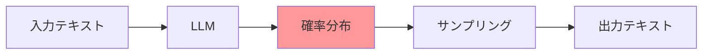

| 特性                       | 説明                                                         | AIへの影響                                 |
| -------------------------- | ------------------------------------------------------------ | ------------------------------------------ |
| **統計的パターン学習**     | 学習データ中の共起パターンから「次に来やすいトークン」を予測 | 「正しい」ではなく「もっともらしい」を出力 |
| **サンプリングの非決定性** | 同じ入力でも異なる出力が生成されうる                         | 一貫性の保証が困難                         |
| **コンテキスト依存性**     | プロンプトの微細な違いで出力が変化                           | 再現性の問題                               |

### 1.2 AIの4つの根本的限界

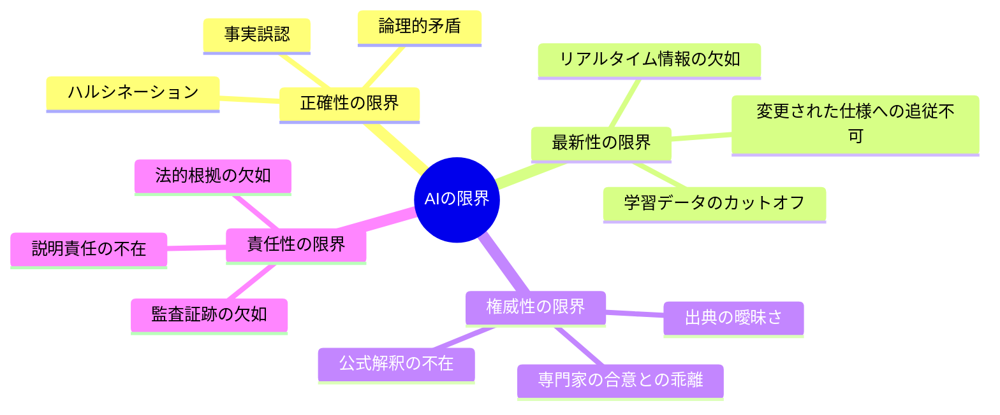

#### 1.2.1 正確性の限界（Hallucination問題）

AIは「知っている」のではなく「生成している」。

```
ユーザー: RFC 6455のセクション5.5.1で定義されているClose frameの
         ステータスコード1006の意味は？

AIの可能性A: 「1006は予期しない切断を示します」（正しい）
AIの可能性B: 「1006はプロトコルエラーを示します」（誤り - それは1002）
AIの可能性C: 「セクション5.5.1には1006の定義があります」（誤り - 7.4.1が正しい）
```

**ハルシネーションの発生メカニズム**

| 原因                     | 説明                                 | 例                             |
| ------------------------ | ------------------------------------ | ------------------------------ |
| **学習データの希薄性**   | 稀な情報は学習不足                   | マイナーなRFCの詳細            |
| **類似パターンとの混同** | 似た概念を混同                       | Close code 1002と1006          |
| **自信過剰な補完**       | 不明な部分を「もっともらしく」埋める | 存在しないセクション番号の生成 |
| **コンテキスト汚染**     | 会話中の誤情報を真実として扱う       | ユーザーの誤解を増幅           |

#### 1.2.2 最新性の限界

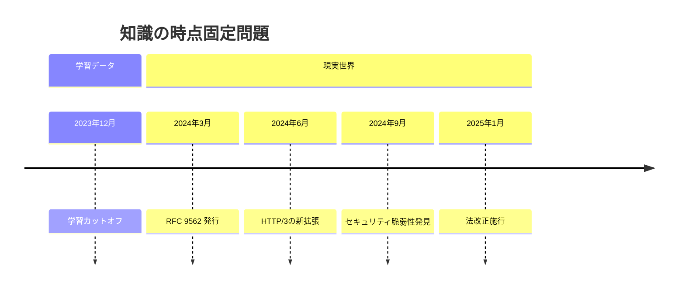

**具体的な影響**

| カテゴリ         | 問題                     | 例                                 |
| ---------------- | ------------------------ | ---------------------------------- |
| **新規RFC**      | 存在を知らない           | RFC 9562（UUIDv7）を知らない       |
| **法改正**       | 旧法に基づく回答         | 改正前の個人情報保護法で回答       |
| **廃止・更新**   | 古い仕様を現行として扱う | RFC 2616をHTTP/1.1の標準として参照 |
| **セキュリティ** | 既知の脆弱性を知らない   | 発見後のCVEを知らない              |

#### 1.2.3 権威性の限界

AIの出力は「一つの解釈」であり、**公式な見解ではない**。

```
問題の構造:

RFC 6455 原文
    ↓
    複数の解釈可能性
    ├── 解釈A（厳格）
    ├── 解釈B（寛容）
    └── 解釈C（文脈依存）

AIの出力
    ↓
    どれかの解釈を「もっともらしく」出力
    ↓
    それが正しい解釈である保証はない
```

**権威性の欠如が問題となる場面**

| 場面             | リスク               | 必要な対応             |
| ---------------- | -------------------- | ---------------------- |
| **仕様の実装**   | 非準拠な実装         | RFC原文の確認          |
| **法的判断**     | コンプライアンス違反 | 法令原文の確認         |
| **セキュリティ** | 脆弱性の見落とし     | 公式アドバイザリの確認 |
| **契約・SLA**    | 誤った解釈による紛争 | 契約原文の確認         |

#### 1.2.4 責任性の限界

AIの出力には**説明責任（Accountability）の主体がない**。

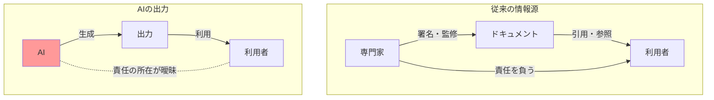

| 問題               | 説明                     | 結果           |
| ------------------ | ------------------------ | -------------- |
| **出典の不透明性** | 何を根拠に生成したか不明 | 検証不能       |
| **改訂の追跡不能** | いつの情報に基づくか不明 | 監査不能       |
| **誤りの帰責**     | 誰が責任を負うか曖昧     | リスク管理困難 |

## 第2章：「ブレない参照先」とは何か

### 2.1 定義

**ブレない参照先（Authoritative Reference Source）** とは、以下の特性を満たす情報源である。

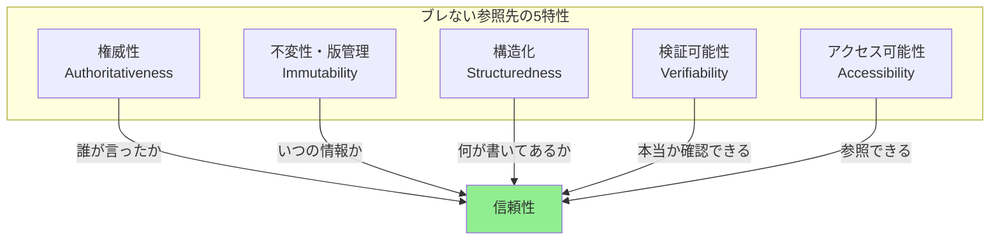

### 2.2 5つの特性

#### 2.2.1 権威性（Authoritativeness）

情報の発信元が、その領域において**正式な決定権または専門性を持つ**こと。

| 権威の種類         | 説明                                   | 例                          |
| ------------------ | -------------------------------------- | --------------------------- |
| **制度的権威**     | 法律や条約で定められた正式な機関       | IETF、W3C、ISO、各国政府    |
| **デファクト権威** | 業界で事実上の標準として認められた主体 | OWASP、Ecma International   |
| **学術的権威**     | 査読プロセスを経た学術コミュニティ     | IEEE、ACM                   |
| **技術的権威**     | 技術の開発元・管理者                   | 各OSSプロジェクト、ベンダー |

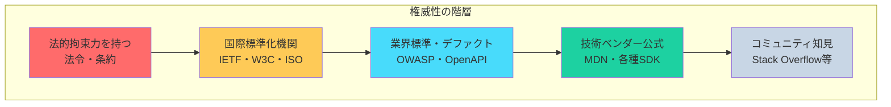

#### 2.2.2 不変性・版管理（Immutability & Versioning）

一度公開された内容は**変更されない**か、変更される場合は**明確な版管理**が行われること。

| パターン           | 説明                         | 例                    |
| ------------------ | ---------------------------- | --------------------- |
| **完全不変**       | 一度発行されたら変更されない | RFC（Errataを除く）   |
| **版管理付き変更** | 新版発行で旧版を置き換え     | ISO規格、W3C勧告      |
| **明示的廃止**     | 古い版を明示的に廃止         | RFC obsoletes/updates |

```
RFC の不変性モデル:

RFC 2616 (HTTP/1.1, 1999)
    ↓ obsoleted by
RFC 7230-7235 (2014)
    ↓ obsoleted by
RFC 9110-9114 (2022)

→ 各RFCは発行後変更されない
→ 新しいRFCが古いRFCを「置き換え」る
→ どの時点の仕様かが明確
```

#### 2.2.3 構造化（Structuredness）

情報が**体系的に組織化**され、特定の情報を正確に参照できること。

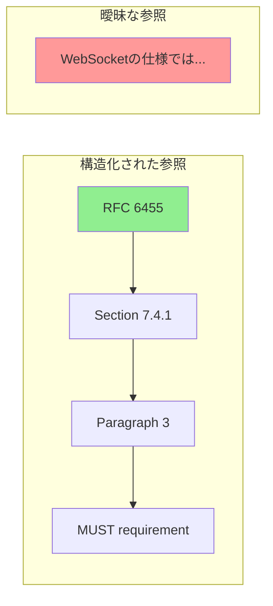

| 構造化の要素     | 説明                                 | AIへの恩恵           |
| ---------------- | ------------------------------------ | -------------------- |
| **階層構造**     | 章・節・項の明確な階層               | 特定箇所の正確な参照 |
| **識別子**       | 一意なセクション番号・条項番号       | 曖昧さのない引用     |
| **相互参照**     | 他の文書・セクションへの明示的リンク | 関連情報の追跡       |
| **インデックス** | 用語索引、要件一覧                   | 効率的な検索         |

#### 2.2.4 検証可能性（Verifiability）

AIの出力が**原典と照合して正しいか確認**できること。

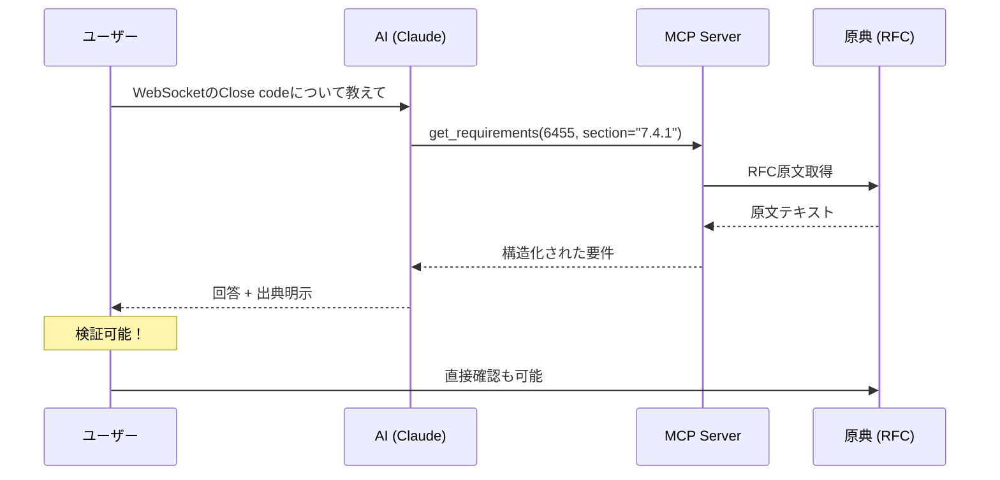

**検証可能性を確保する要素**

| 要素               | 説明                     | 実装                     |
| ------------------ | ------------------------ | ------------------------ |
| **永続的URI**      | 参照先が消えない         | DOI、RFC番号、法令番号   |
| **版指定**         | どの版を参照したか明示   | RFC 9110、ISO 27001:2022 |
| **セクション指定** | どの箇所を参照したか明示 | Section 7.4.1            |
| **原文引用**       | 参照元の文言を示す       | MUST/SHOULD/MAYの原文    |

#### 2.2.5 アクセス可能性（Accessibility）

AIが**プログラムで参照できる**形式で提供されていること。

| レベル             | 説明                            | 例                 |
| ------------------ | ------------------------------- | ------------------ |
| **構造化API**      | 機械可読な形式でアクセス可能    | RFC XML、e-Gov API |
| **HTML/PDF**       | Webで公開されているがパース必要 | W3C仕様、多くのISO |
| **有料・制限付き** | アクセスに制約がある            | 一部のISO規格      |

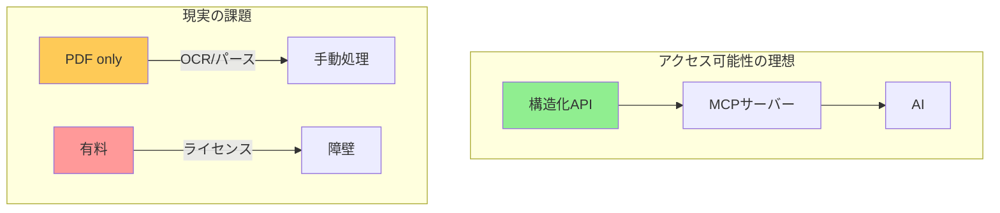

### 2.3 「ブレない参照先」の判定基準

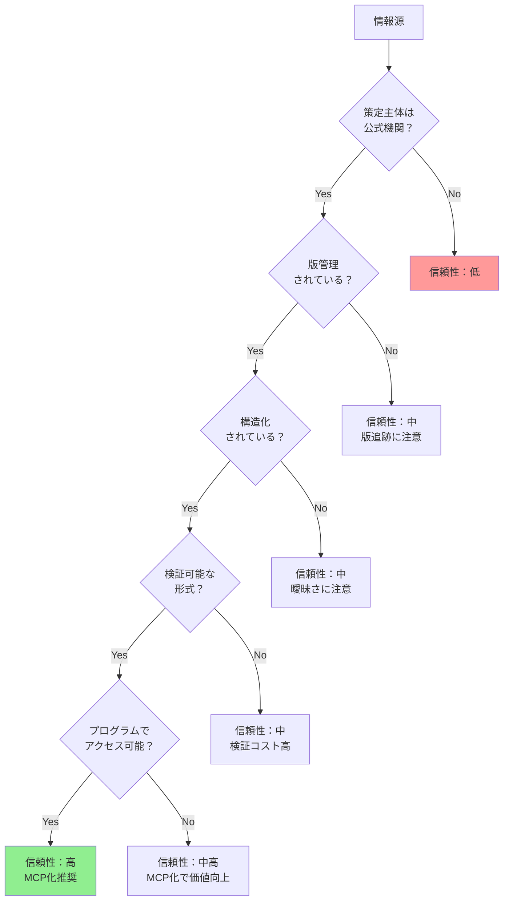

## 第3章：参照先の階層構造

### 3.1 4層モデル


### 3.2 レベル別詳細

#### レベル1: 国際標準・法規制（MUST遵守）

最高権威の参照先。違反すると**相互運用性の欠如や法的問題**を引き起こす。

| カテゴリ           | 参照先       | 5特性評価 | MCP化状況     |
| ------------------ | ------------ | --------- | ------------- |
| **通信プロトコル** | IETF RFC     | ◎◎◎◎◎     | ✅ rfcxml-mcp |
| **Web標準**        | W3C / WHATWG | ◎◎◎◎○     | ✅ w3c-mcp    |
| **国際規格**       | ISO          | ◎◎◎○△     | 🔜 検討中     |
| **日本法令**       | e-Gov        | ◎◎◎◎◎     | ✅ hourei-mcp |
| **EU規制**         | EUR-Lex      | ◎◎◎◎○     | 📋 構想       |

**IETF RFCの特性**

```
権威性:     ◎ IETFによる公式発行、WGでのコンセンサス
不変性:     ◎ 発行後変更なし、obsoletes/updatesで管理
構造化:     ◎ セクション番号、MUST/SHOULD/MAYの明確な定義
検証可能性: ◎ RFC番号、セクション番号で一意特定
アクセス性: ◎ RFC XML形式で公開、無料アクセス
```

#### レベル2: 業界標準・デファクト（SHOULD遵守）

広く採用されている標準。準拠しないと**業界内での互換性に問題**。

| カテゴリ           | 参照先           | 特徴                                | MCP化価値 |
| ------------------ | ---------------- | ----------------------------------- | --------- |
| **API設計**        | OpenAPI Spec     | REST APIの事実上の標準              | 高        |
| **セキュリティ**   | OWASP            | Webセキュリティのベストプラクティス | 高        |
| **認証**           | OAuth 2.0 / OIDC | 認可の事実上の標準                  | 高        |
| **メッセージング** | AsyncAPI         | 非同期API仕様                       | 中        |

#### レベル3: 組織・プロジェクト規約（ローカル遵守）

チーム・プロジェクト内で統一すべきルール。

| 種別                 | 特性                       | 管理方法               |
| -------------------- | -------------------------- | ---------------------- |
| **コーディング規約** | プロジェクト固有のスタイル | Markdown / Linter設定  |
| **ADR**              | アーキテクチャ決定の記録   | Git管理されたMarkdown  |
| **CLAUDE.md**        | Claude固有の指示           | プロジェクトルート配置 |

#### レベル4: ベストプラクティス（推奨）

経験則に基づく推奨事項。**状況に応じて適用を判断**。

| 種別                 | 出典             | 適用判断             |
| -------------------- | ---------------- | -------------------- |
| **設計原則**         | SOLID, DRY, KISS | 状況に応じて         |
| **デザインパターン** | GoF, POSA        | 問題に適合する場合   |
| **クリーンコード**   | Robert C. Martin | チームで合意した範囲 |

## 第4章：AIの判断フロー

### 4.1 参照先に基づく判断アルゴリズム


### 4.2 出力テンプレート

**参照先が見つかった場合:**

```markdown
## 回答

WebSocketのClose frameのステータスコード1006は「異常クロージャ」を示します。

### 根拠

- **出典**: RFC 6455, Section 7.4.1
- **原文**: "1006 is a reserved value and MUST NOT be set as a status code
  in a Close control frame by an endpoint. It is designated for use in
  applications expecting a status code to indicate that the connection
  was closed abnormally"
- **要件レベル**: MUST NOT（実装で設定してはならない）

### 補足

このコードはアプリケーションが異常終了を検知するためのもので、
実際のClose frameに含めて送信することはできません。
```

**参照先が見つからなかった場合:**

```markdown
## 回答

この件について、権威ある参照先を特定できませんでした。

### 確認した情報源

- RFC 6455: 該当する記述なし
- W3C WebSocket API: 該当する記述なし

### 推測

一般的な実装慣行としては〜という傾向がありますが、
これは標準で定められたものではありません。

### 推奨

正確な仕様が必要な場合は、〜を確認することをお勧めします。
```

## 第5章：参照先MCPの設計要件

### 5.1 必須機能

| 機能                   | 説明                       | 例                        |
| ---------------------- | -------------------------- | ------------------------- |
| **検索**               | 仕様内のキーワード検索     | 「WebSocket close frame」 |
| **構造取得**           | 章立て・セクション階層     | RFC 6455の目次            |
| **要件抽出**           | MUST/SHOULD/MAY抽出        | 規範性要件の一覧          |
| **用語定義**           | 専門用語の定義取得         | 「Origin」の定義          |
| **参照関係**           | 依存する他の仕様           | RFC 6455 → RFC 2616       |
| **チェックリスト生成** | 実装確認項目の生成         | クライアント実装チェック  |
| **検証**               | 実装が仕様に準拠しているか | 主張の検証                |

### 5.2 RFC MCP のツール設計

```typescript
interface RfcMcpTools {
	// 検索・取得
	searchRfc(keyword: string): RfcSummary[];
	getRfcStructure(rfcNumber: number): Section[];
	getRfcSection(rfcNumber: number, section: string): Content;

	// 要件抽出
	getRequirements(rfcNumber: number, level?: RequirementLevel): Requirement[];
	getDefinitions(rfcNumber: number, term?: string): Definition[];

	// 関係性
	getDependencies(rfcNumber: number): Dependency[];
	getRelatedSections(rfcNumber: number, section: string): RelatedSection[];

	// 実装支援
	generateChecklist(rfcNumber: number, role: 'client' | 'server'): Checklist;
	validateStatement(rfcNumber: number, statement: string): ValidationResult;
}
```

## 第6章：具体例 — 電子署名法 × RFC 3161

### 6.1 法的要件と技術仕様の対応

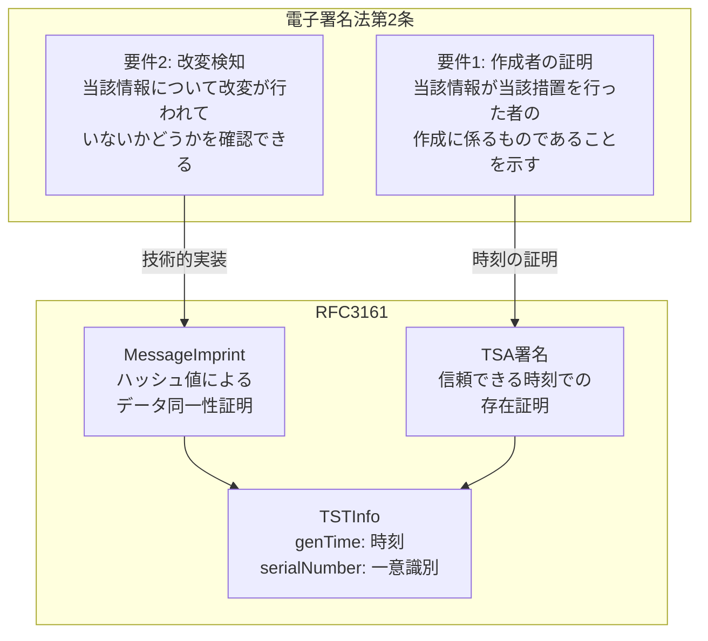

### 6.2 MCP連携による検証ワークフロー


## 第7章：参照先の競合解決

### 7.1 競合時のルール

1. **上位レベルが優先** - 法令 > 業界標準 > 組織規約
2. **新しい版が優先** - RFC 9110 > RFC 7230（obsolete）
3. **より具体的な仕様が優先** - WebSocket RFC > 一般的なTCP仕様
4. **矛盾がある場合は人間に判断を委ねる**

### 7.2 例：HTTP仕様の参照

```
❌ RFC 2616 (HTTP/1.1 - obsolete)
✅ RFC 9110 (HTTP Semantics - current)
✅ RFC 9111 (HTTP Caching - current)
```

## 第8章：構築済み参照先MCP一覧

| MCP            | 対象                    | 主要機能                               | リポジトリ                                          |
| -------------- | ----------------------- | -------------------------------------- | --------------------------------------------------- |
| **rfcxml-mcp** | IETF RFC                | 構造取得、要件抽出、チェックリスト生成 | [GitHub](https://github.com/shuji-bonji/rfcxml-mcp) |
| **w3c-mcp**    | W3C/WHATWG/IETF Web標準 | WebIDL、CSS、HTML要素                  | [GitHub](https://github.com/shuji-bonji/w3c-mcp)    |
| **hourei-mcp** | 日本法令（e-Gov）       | 法令検索、条文取得                     | [GitHub](https://github.com/ryoooo/e-gov-law-mcp)   |

## 第9章：今後の拡張候補

### 高優先度

| 候補            | 対象             | 価値                     |
| --------------- | ---------------- | ------------------------ |
| **OpenAPI MCP** | OpenAPI Spec     | API設計の標準準拠確認    |
| **OWASP MCP**   | OWASP Top 10等   | セキュリティ要件チェック |
| **OAuth MCP**   | OAuth 2.0 / OIDC | 認証フロー実装支援       |

### 中優先度

| 候補             | 対象              | 価値           |
| ---------------- | ----------------- | -------------- |
| **ISO MCP**      | ISO規格           | 国際標準参照   |
| **PDF Spec MCP** | ISO 32000         | PDF仕様参照    |
| **BIM/IFC MCP**  | buildingSMART IFC | 建築情報モデル |
| **HL7 FHIR MCP** | HL7 FHIR          | 医療情報交換   |

## まとめ

### 核心メッセージ

1. **AIは「ブレる」** - 確率的生成、学習データの制約、権威性の欠如
2. **「ブレない参照先」が必要** - 権威性、不変性、構造化、検証可能性、アクセス可能性
3. **階層的に整理する** - 国際標準 > 業界標準 > 組織規約 > ベストプラクティス
4. **MCPで接続する** - AIが参照できる形式で提供
5. **常に根拠を明示する** - 出典、セクション、原文を示す

### 「ブレない参照先」の価値

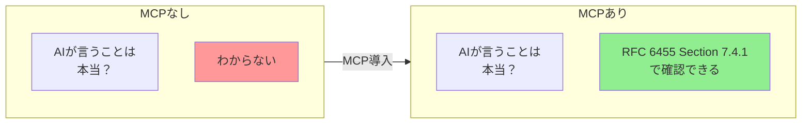

**AIの判断にブレない参照先を与えることで、出力の信頼性と検証可能性が確保される。**
