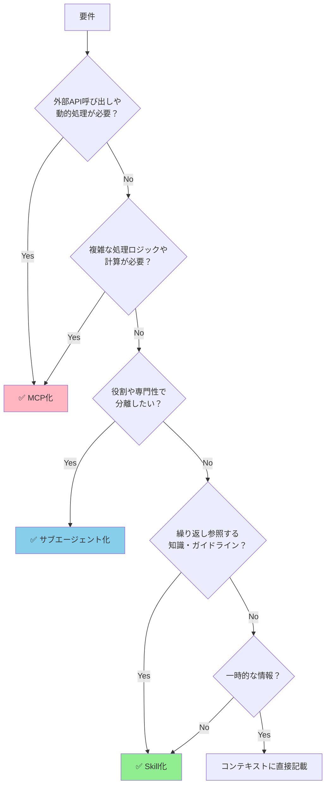
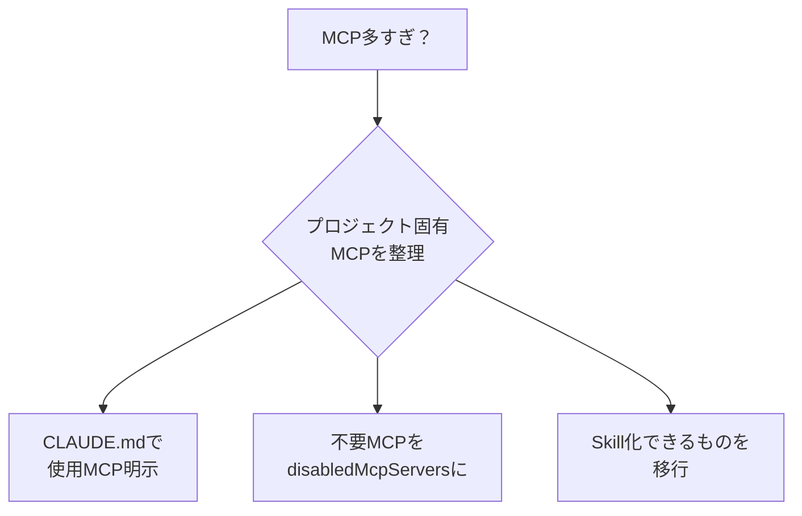
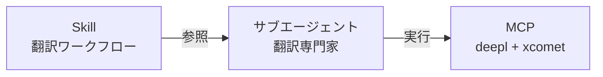

# MCP vs Skill vs Agent 使い分け

> 「MCPサーバーを極力利用せず、Skillを活用した方がよいのではないか」という議論は、大企業でも発生している（LINEヤフー事例）。適切な使い分けが重要。

## このドキュメントについて

MCP、Skill、カスタムサブエージェントは、それぞれ異なる目的と特性を持つ。誤った選択をすると、コンテキストウィンドウの圧迫（Over-MCPization問題）や、不必要な複雑性を招く。

このドキュメントでは、「いつMCPを使うべきか」「Skillで十分なのはどんな場合か」「サブエージェントが有効な場面は何か」を、判断フローチャートと具体例を通じて明確にする。迷ったときはこのフローに従うことで、適切な技術選択ができる。

## 判断フローチャート



## 判断基準の詳細

### MCP化すべきケース

| 条件                         | 理由                   | 例                    |
| ---------------------------- | ---------------------- | --------------------- |
| **外部API呼び出しが必要**    | Skillでは実行不可      | DeepL翻訳、GitHub操作 |
| **動的なデータ処理**         | 実行時に結果が変わる   | RFC解析、コード実行   |
| **重い計算処理**             | MLモデル推論など       | xCOMET品質評価        |
| **状態管理が必要**           | セッション間で状態保持 | データベース操作      |
| **他プロジェクトでも再利用** | グローバルに価値がある | 標準規格参照          |

### Skill化すべきケース

| 条件                           | 理由               | 例                 |
| ------------------------------ | ------------------ | ------------------ |
| **静的な知識・ガイドライン**   | 変更頻度が低い     | コーディング規約   |
| **ワークフロー定義**           | 手順の記述         | 翻訳ワークフロー   |
| **ベストプラクティス集**       | 経験則の蓄積       | 設計パターン       |
| **プロジェクト固有ルール**     | ローカルな知識     | チーム規約         |
| **コンテキスト消費を抑えたい** | 参照時のみ読み込み | 大規模ドキュメント |

### サブエージェント化すべきケース

| 条件                 | 理由             | 例                    |
| -------------------- | ---------------- | --------------------- |
| **役割の分離**       | 専門性を明確化   | RFC専門家、翻訳専門家 |
| **ツール制限**       | 特定MCPのみ使用  | rfcxmlのみ使用        |
| **繰り返しタスク**   | 定型作業の委譲   | コードレビュー        |
| **コンテキスト分離** | 独立した作業空間 | 並行タスク            |

## 具体的な判断例

### 例1: RFCドキュメント参照

```
要件: RFCの仕様を参照したい

Q: 外部API呼び出しが必要？
→ Yes（RFC XMLの取得・解析が必要）

結論: ✅ MCP化（rfcxml-mcp）
```

### 例2: コーディング規約

```
要件: チームのコーディング規約を適用したい

Q: 外部API呼び出しが必要？
→ No（静的な文書）

Q: 複雑な処理ロジックが必要？
→ No（ルールの記述のみ）

Q: 役割の分離が必要？
→ No（全員が従うルール）

Q: 繰り返し参照する知識？
→ Yes

結論: ✅ Skill化
```

### 例3: 翻訳品質チェック

```
要件: 翻訳の品質を自動評価したい

Q: 外部API呼び出しが必要？
→ Yes（xCOMETモデル推論）

結論: ✅ MCP化（xcomet-mcp-server）
```

### 例4: RFC専門のレビュアー

```
要件: RFCの仕様確認に特化したアシスタントが欲しい

Q: 外部API呼び出しが必要？
→ Yes（rfcxml-mcpを使用）

Q: 役割の分離が必要？
→ Yes（RFC確認に特化させたい）

結論: ✅ サブエージェント化 + MCP
```

## everything-claude-code からの学び

[everything-claude-code](https://github.com/affaan-m/everything-claude-code) リポジトリの分析結果

### MCP化が正解だったもの

| 機能       | MCP                                   | 理由                   |
| ---------- | ------------------------------------- | ---------------------- |
| GitHub操作 | `@modelcontextprotocol/server-github` | API呼び出し必須        |
| Supabase   | 公式MCP                               | DB操作                 |
| ClickHouse | 公式MCP                               | クエリ実行             |
| Context7   | 公式MCP                               | ライブドキュメント検索 |

### Skill化で十分だったもの

| 機能              | 形式  | 理由               |
| ----------------- | ----- | ------------------ |
| coding-standards  | Skill | 静的なガイドライン |
| backend-patterns  | Skill | パターン集         |
| frontend-patterns | Skill | パターン集         |
| tdd-workflow      | Skill | ワークフロー定義   |
| security-review   | Skill | チェックリスト     |

## 過剰MCP化（Over-MCPization）の問題

### 症状

1. **コンテキストウィンドウの圧迫** - ツール定義が常駐
2. **起動オーバーヘッド** - 不要なサーバープロセス
3. **メンテナンスコスト増大** - npm公開・バージョン管理
4. **70k問題** - ツール多すぎで性能劣化

### 対策



### CLAUDE.md でのMCP使用ポリシー例

```markdown
# MCP使用ポリシー

## このプロジェクトで使用するMCP

- rfcxml-mcp: RFC仕様確認
- deepl-mcp: 翻訳
- xcomet-mcp: 翻訳品質評価

## 使用しないMCP

- Context7: 本プロジェクトでは不要
- GitHub MCP: CLI操作で代替

## MCPとSkillの使い分け

- 静的なガイドラインは `.claude/skills/` を参照
- 動的な処理のみMCPを使用
```

## 組み合わせパターン

### パターン1: Skill + MCP

Skillで「何をすべきか」を定義し、MCPで「どう実行するか」を提供。

```markdown
<!-- .claude/skills/translation-workflow/SKILL.md -->

# 翻訳ワークフロー

## 手順

1. `deepl:translate-text` で初期翻訳
2. `xcomet:xcomet_evaluate` で品質評価
3. スコア0.85未満なら再翻訳

## 品質基準

- critical エラー: 必ず修正
- major エラー: 修正推奨
- minor エラー: 任意
```

### パターン2: サブエージェント + MCP

サブエージェントで「役割」を分離し、特定MCPのみ使用を許可。

```markdown
<!-- .claude/agents/rfc-specialist.md -->

name: rfc-specialist
description: RFC仕様の確認・検証専門
tools: rfcxml:get_rfc_structure, rfcxml:get_requirements, rfcxml:validate_statement
model: sonnet

あなたはRFC仕様の専門家です。
rfcxmlツールのみ使用してください。
他のMCPツールは使用禁止。
```

### パターン3: Skill + サブエージェント + MCP（フル構成）



## 判断マトリックス

| 要件                   | Skill | MCP | サブエージェント |
| ---------------------- | :---: | :-: | :--------------: |
| 静的ガイドライン       |  ✅   | ❌  |        ❌        |
| 外部API呼び出し        |  ❌   | ✅  |        △         |
| 動的データ処理         |  ❌   | ✅  |        △         |
| 役割の分離             |  ❌   | ❌  |        ✅        |
| ツール制限             |  ❌   | ❌  |        ✅        |
| コンテキスト節約       |  ✅   | ❌  |        △         |
| プロジェクト横断再利用 |  ❌   | ✅  |        ❌        |
| メンテナンス容易性     |  ✅   |  △  |        ✅        |

## まとめ

### 原則

1. **まずSkillで十分か検討** - 静的知識ならSkill
2. **動的処理が必要ならMCP** - API、計算、状態管理
3. **役割分離が必要ならサブエージェント** - 専門性、ツール制限
4. **組み合わせを恐れない** - Skill + MCP + サブエージェントの併用

### 判断の簡易フロー

```
外部API必要？ → Yes → MCP
           → No → 動的処理必要？ → Yes → MCP
                              → No → 役割分離必要？ → Yes → サブエージェント
                                                 → No → Skill
```
