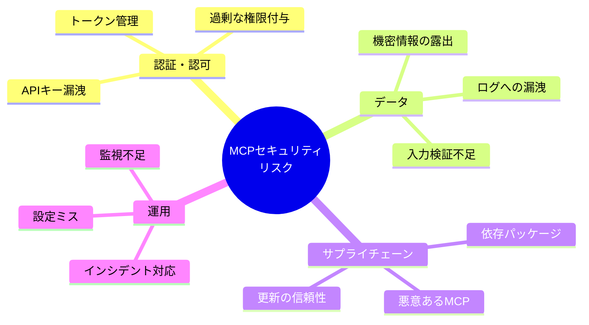
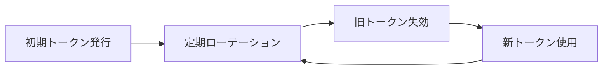
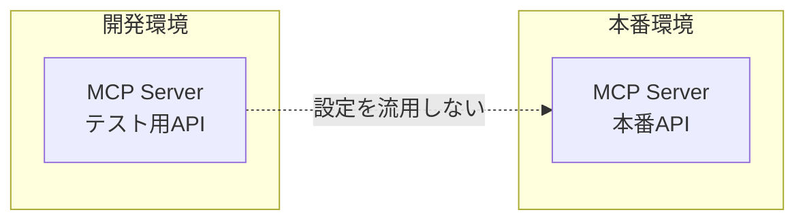
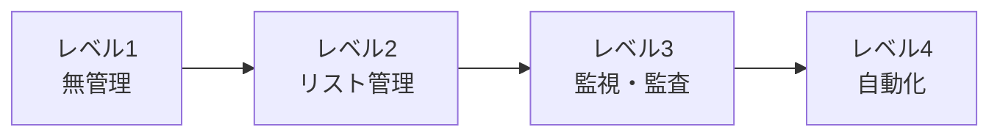

# MCP開発時のセキュリティ考慮

> MCPサーバーの開発・運用におけるセキュリティリスクと対策を整理する。

## このドキュメントについて

MCPサーバーは外部APIやデータベースに接続するため、適切なセキュリティ対策なしには重大なリスクを招く可能性がある。LINEヤフーの調査によれば、多くのMCPが静的APIキーに依存しており、セキュリティ面では発展途上にある。

このドキュメントでは、MCPサーバーの開発・運用における主要なリスクカテゴリを整理し、それぞれの対策を具体的に示す。また、開発時に使えるチェックリストを提供し、セキュリティを意識した開発を支援する。

## MCPセキュリティの現状

### LINEヤフーの調査結果

LINEヤフーがMCPエコシステムを調査した結果

| 項目                  | 割合     | リスク                         |
| --------------------- | -------- | ------------------------------ |
| 何らかの認証が必要    | **88%**  | 認証情報の管理が必要           |
| 静的APIキー/PATに依存 | **53%**  | 長期有効なトークンの漏洩リスク |
| OAuth等の安全な方式   | **8.5%** | ほとんどが旧来の方式           |

**結論**: MCPサーバーの認証は発展途上であり、慎重な管理が必要。

## リスクカテゴリ



## リスク1: 認証・認可

### 問題

- **静的APIキーの長期使用** - 漏洩時の影響が大きい
- **過剰な権限** - 必要以上のスコープを要求
- **認証情報のハードコード** - ソースコードに直接記載

### 対策

#### 1. 認証情報の安全な管理

```bash
# ❌ 悪い例：ハードコード
export API_KEY="sk-1234567890abcdef"

# ✅ 良い例：環境変数（.envファイルは.gitignoreに）
# .env
DEEPL_API_KEY=${DEEPL_API_KEY}

# さらに良い例：シークレット管理サービス
# AWS Secrets Manager, HashiCorp Vault等
```

#### 2. 最小権限の原則

```markdown
## MCPツール設計時の権限確認

- [ ] 本当にその権限が必要か？
- [ ] 読み取りのみで済む場合は書き込み権限を要求しない
- [ ] スコープを最小限に絞る
```

#### 3. トークンのローテーション



## リスク2: データセキュリティ

### 問題

- **機密情報のMCP経由送信** - 意図しないデータ露出
- **入力検証の不足** - インジェクション攻撃
- **ログへの機密情報漏洩** - デバッグログに認証情報

### 対策

#### 1. 入力検証

```typescript
// MCPツール実装時の入力検証例
export const getRfcRequirements = {
	name: 'get_requirements',
	description: 'RFC要件を取得',
	inputSchema: {
		type: 'object',
		properties: {
			rfc: {
				type: 'number',
				minimum: 1,
				maximum: 99999, // 妥当な範囲を設定
				description: 'RFC番号',
			},
			level: {
				type: 'string',
				enum: ['MUST', 'SHOULD', 'MAY'], // 許可値を限定
				description: '要件レベル',
			},
		},
		required: ['rfc'],
	},
};
```

#### 2. ログのサニタイズ

```typescript
// ❌ 悪い例
console.log(`API呼び出し: key=${apiKey}, query=${query}`);

// ✅ 良い例
console.log(`API呼び出し: key=*****, query=${query}`);
```

#### 3. 機密データの分類

```markdown
## データ分類

### 送信してはいけないデータ

- 認証情報（APIキー、パスワード）
- 個人情報（PII）
- 社内機密情報

### 送信可能なデータ

- 公開仕様書の参照
- 一般的な技術情報
- 匿名化されたデータ
```

## リスク3: サプライチェーン

### 問題

- **悪意あるMCPサーバー** - マルウェア混入
- **依存パッケージの脆弱性** - npm/pipの依存関係
- **更新の信頼性** - 乗っ取られたパッケージ

### 対策

#### 1. MCP利用許可リスト

LINEヤフーのアプローチを参考に

```markdown
## 承認済みMCPサーバー一覧

### 公式・信頼できるソース

- @modelcontextprotocol/\* （Anthropic公式）
- DeepL公式MCP

### 自作（内部監査済み）

- @shuji-bonji/rfcxml-mcp
- @shuji-bonji/xcomet-mcp-server

### 承認待ち

- （セキュリティレビュー中）

### 禁止

- 出所不明のMCP
- 認証情報を外部送信するMCP
```

#### 2. 依存関係の監査

```bash
# npm audit で脆弱性チェック
npm audit

# 定期的な更新
npm update

# 重大な脆弱性は即座に対応
npm audit fix
```

#### 3. ソースコードレビュー

```markdown
## MCPサーバー導入前チェックリスト

- [ ] ソースコードが公開されているか
- [ ] 認証情報の扱いは適切か
- [ ] 外部への不審な通信はないか
- [ ] 依存パッケージは信頼できるか
- [ ] メンテナンスは継続されているか
```

## リスク4: 運用セキュリティ

### 問題

- **設定ミス** - 本番環境での誤設定
- **監視不足** - 異常の検知遅れ
- **インシデント対応** - 対応手順の不備

### 対策

#### 1. 環境分離



#### 2. ログ・監視

```markdown
## 監視すべき項目

- [ ] API呼び出し回数の異常増加
- [ ] エラー率の上昇
- [ ] 認証失敗の頻発
- [ ] 想定外のエンドポイントへのアクセス
```

#### 3. インシデント対応手順

```markdown
## MCPセキュリティインシデント対応

### 1. 検知

- 監視アラート
- ユーザー報告
- 外部通報

### 2. 初動対応

- 該当MCPの即時無効化
- APIキー/トークンの失効
- 影響範囲の特定

### 3. 調査

- ログ分析
- 侵入経路の特定
- 漏洩データの特定

### 4. 復旧

- 新しい認証情報の発行
- 設定の修正
- MCPの再有効化

### 5. 再発防止

- 原因分析
- 対策の実施
- 手順の更新
```

## MCP開発時のセキュリティチェックリスト

### 設計フェーズ

```markdown
- [ ] 最小権限の原則を適用しているか
- [ ] 認証方式は適切か（OAuth推奨）
- [ ] 機密データの扱いを定義しているか
```

### 実装フェーズ

```markdown
- [ ] 入力検証を実装しているか
- [ ] 認証情報をハードコードしていないか
- [ ] ログに機密情報を出力していないか
- [ ] エラーメッセージに内部情報を含めていないか
```

### テストフェーズ

```markdown
- [ ] セキュリティテストを実施したか
- [ ] 依存パッケージの脆弱性をチェックしたか
- [ ] 異常入力に対する動作を確認したか
```

### 運用フェーズ

```markdown
- [ ] 認証情報のローテーション計画があるか
- [ ] 監視・アラートを設定しているか
- [ ] インシデント対応手順があるか
- [ ] 定期的なセキュリティレビューを行っているか
```

## CLAUDE.md でのセキュリティポリシー記載例

```markdown
# セキュリティポリシー

## 使用禁止MCP

- 出所不明のMCPサーバー
- 認証情報を外部送信するMCP

## 認証情報の扱い

- APIキーは環境変数から取得
- ログに認証情報を出力しない
- コードに認証情報をハードコードしない

## データの扱い

- 個人情報をMCP経由で送信しない
- 社内機密情報は匿名化してから処理
```

## まとめ

### 重要な原則

1. **信頼できるMCPのみ使用** - 利用許可リストで管理
2. **最小権限** - 必要な権限のみ付与
3. **認証情報の安全な管理** - ハードコード禁止、ローテーション
4. **入力検証** - すべての入力を検証
5. **監視とログ** - 異常検知、ただし機密情報は除外
6. **インシデント対応** - 手順を事前に準備

### MCPセキュリティの成熟度



現在は**レベル2（リスト管理）** を目指すのが現実的。
