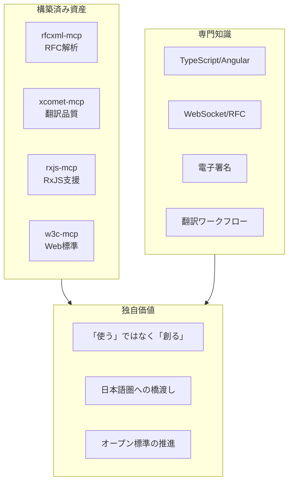
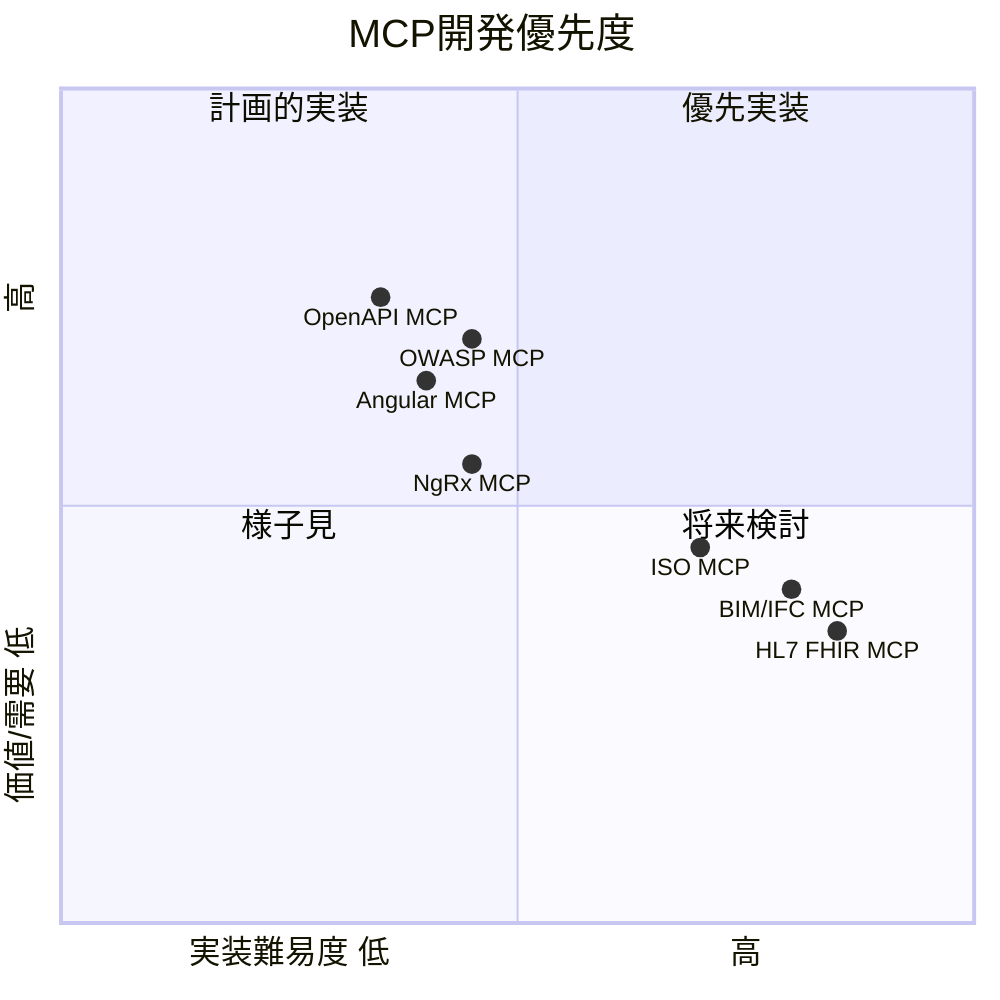
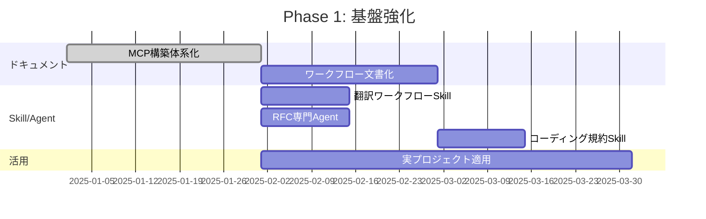
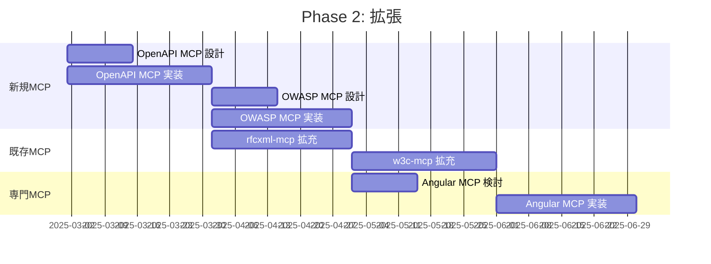

# 優先度・ロードマップ

> MCP開発の優先順位と時間軸を整理する。

## このドキュメントについて

限られたリソースの中で最大の価値を生むためには、何を優先的に開発するかの判断が重要である。このドキュメントでは、現在の強み、市場の需要、実装難易度を考慮した優先度マトリックスを示し、短期・中期・長期のロードマップを整理する。

また、Grokによるプロジェクト評価や、発信戦略（Note/Qiita/Zenn/GitHub）についても言及し、技術開発だけでなくエコシステム全体の成長戦略を描く。

## 現在の強み

## MCP開発優先度マトリックス

## フェーズ別ロードマップ

### Phase 1: 基盤強化（短期 1-3ヶ月）

**目標**: 既存MCPの活用最大化、Skill/Agent整備

| タスク                      | 状況      | 優先度     |
| --------------------------- | --------- | ---------- |
| 既存MCP活用ドキュメント整備 | 🔄 進行中 | ⭐⭐⭐⭐⭐ |
| 翻訳ワークフローSkill作成   | 📋 TODO   | ⭐⭐⭐⭐   |
| RFC専門サブエージェント定義 | 📋 TODO   | ⭐⭐⭐⭐   |
| CLAUDE.mdテンプレート整備   | 📋 TODO   | ⭐⭐⭐     |

### Phase 2: 拡張（中期 3-6ヶ月）

**目標**: 新規MCP構築、エコシステム拡大

| タスク              | 状況    | 優先度   |
| ------------------- | ------- | -------- |
| OpenAPI MCP 構築    | 📋 構想 | ⭐⭐⭐⭐ |
| OWASP MCP 構築      | 📋 構想 | ⭐⭐⭐⭐ |
| Angular MCP 構築    | 📋 構想 | ⭐⭐⭐   |
| rfcxml-mcp 機能拡充 | 📋 TODO | ⭐⭐⭐   |

### Phase 3: 展開（長期 6ヶ月以上）

**目標**: コミュニティ貢献、専門領域拡大

| タスク                | 状況    | 優先度 |
| --------------------- | ------- | ------ |
| ISO規格MCP            | 📋 構想 | ⭐⭐   |
| BIM/IFC MCP           | 📋 構想 | ⭐⭐   |
| 医療系MCP（HL7 FHIR） | 📋 構想 | ⭐     |
| Note記事シリーズ完成  | 📋 TODO | ⭐⭐⭐ |

## 詳細ロードマップ

### Phase 1 詳細

### Phase 2 詳細

## 優先度決定の基準

### 評価軸

| 軸               | 説明                       | 重み |
| ---------------- | -------------------------- | ---- |
| **強みとの適合** | 既存知識・経験を活かせるか | 30%  |
| **即効性**       | すぐに価値を発揮できるか   | 25%  |
| **需要**         | 利用者が見込めるか         | 20%  |
| **実装難易度**   | 実現可能性                 | 15%  |
| **独自性**       | 競合の有無                 | 10%  |

### 評価例

| MCP         | 強み | 即効性 | 需要 | 難易度 | 独自性 |  総合  |
| ----------- | :--: | :----: | :--: | :----: | :----: | :----: |
| OpenAPI MCP |  ◎   |   ◎    |  ◎   |   ○    |   △    | **85** |
| OWASP MCP   |  ○   |   ◎    |  ◎   |   ○    |   ○    | **80** |
| Angular MCP |  ◎   |   ○    |  ○   |   ○    |   ◎    | **75** |
| ISO MCP     |  △   |   △    |  ○   |   △    |   ○    | **50** |
| BIM/IFC MCP |  △   |   △    |  △   |   △    |   ◎    | **45** |

## 構築済みMCPの活用計画

### rfcxml-mcp

| 施策             | 内容                           | 時期    |
| ---------------- | ------------------------------ | ------- |
| ドキュメント強化 | READMEにより多くの使用例を追加 | Phase 1 |
| 機能拡充         | 複数RFC横断検索                | Phase 2 |
| 連携強化         | w3c-mcpとの統合ワークフロー    | Phase 2 |

### xcomet-mcp-server

| 施策           | 内容                       | 時期    |
| -------------- | -------------------------- | ------- |
| 認知度向上     | 翻訳ワークフロー事例の発信 | Phase 1 |
| パフォーマンス | GPU利用のドキュメント化    | Phase 1 |
| 連携           | DeepL MCPとの統合Skill     | Phase 1 |

### rxjs-mcp-server

| 施策         | 内容                           | 時期    |
| ------------ | ------------------------------ | ------- |
| パターン拡充 | より多くのユースケースパターン | Phase 2 |
| Angular連携  | Angular MCPとの連携            | Phase 2 |

## Grokの評価を踏まえた戦略

### xcomet-mcp-server の可能性

> 「今後1年以内に化ける可能性が十分ある」（Grok評価）

**アクション**:

- 翻訳ワークフロー事例の発信（Note）
- DeepL + Claude + xCOMET のデモ
- 日本語圏・欧州圏への訴求

### rfcxml-mcp の可能性

> 「2027年以降にプロトコル理解エージェントブームが来たら急浮上」（Grok評価）

**アクション**:

- ホットなRFC（QUIC, HTTP/3, TLS 1.3）でのデモ
- チェックリスト生成例の拡充
- 実装支援ワークフローの確立

## 発信戦略

### Note記事計画

| テーマ               | 内容                      | 時期    |
| -------------------- | ------------------------- | ------- |
| **RFC × AI**         | MCPでRFCを読む/対話する   | Phase 1 |
| **翻訳ワークフロー** | DeepL + xCOMET 実践       | Phase 1 |
| **知識の民主化**     | MCPの本質的価値           | Phase 1 |
| **エージェント設計** | Skill/Agent/MCPの使い分け | Phase 2 |

### 技術発信の原則

1. **概念→実装→成果** の流れで記事化
2. **具体的な成果物**（コード、チェックリスト）を示す
3. **日本語圏への価値**を明確に

## リスクと対策

| リスク        | 影響               | 対策                               |
| ------------- | ------------------ | ---------------------------------- |
| MCP仕様変更   | 既存MCPの改修      | 公式仕様をウォッチ、早期対応       |
| 競合MCPの登場 | 差別化困難         | 独自価値（日本語、専門性）で差別化 |
| 時間不足      | 計画遅延           | Phase優先度で調整                  |
| 需要読み違い  | 作っても使われない | 小さく作って検証                   |

## 成功指標

### 短期（Phase 1）

- [ ] ドキュメント体系化完了
- [ ] Skill/Agent定義 3個以上
- [ ] 実プロジェクトでの活用実績

### 中期（Phase 2）

- [ ] 新規MCP 2個以上リリース
- [ ] GitHub Star 合計 10以上
- [ ] Note記事 5本以上

### 長期（Phase 3）

- [ ] MCPエコシステムの確立
- [ ] コミュニティからの認知
- [ ] 外部からの問い合わせ・貢献

## 次のアクション

### 今すぐやること

1. **このドキュメントのGitHub反映**
2. **翻訳ワークフローSkillの作成**
3. **RFC専門サブエージェントの定義**

### 今月中にやること

1. **xcomet活用事例のNote記事**
2. **既存MCPのREADME改善**
3. **CLAUDE.mdテンプレート作成**
