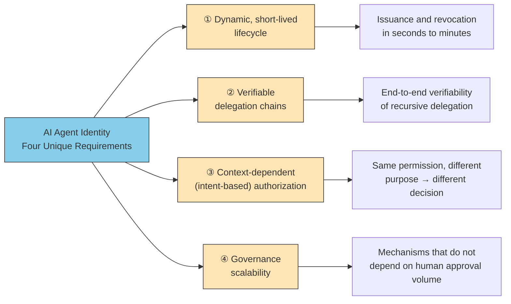
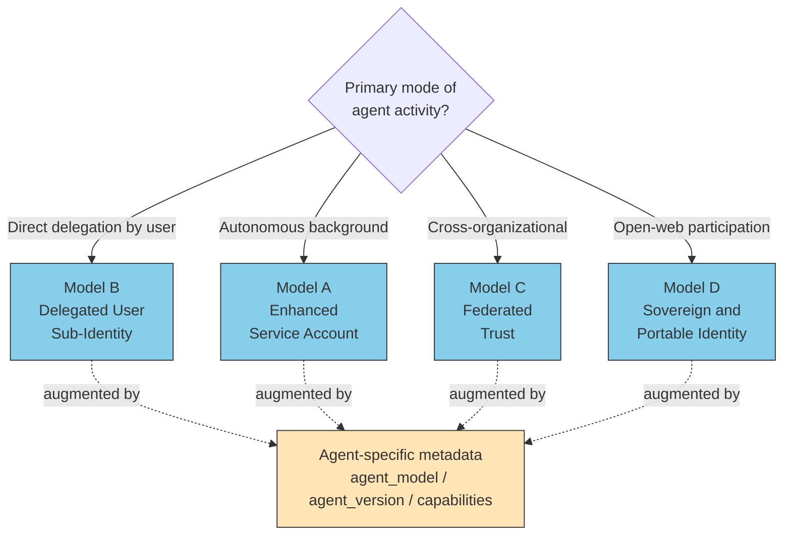
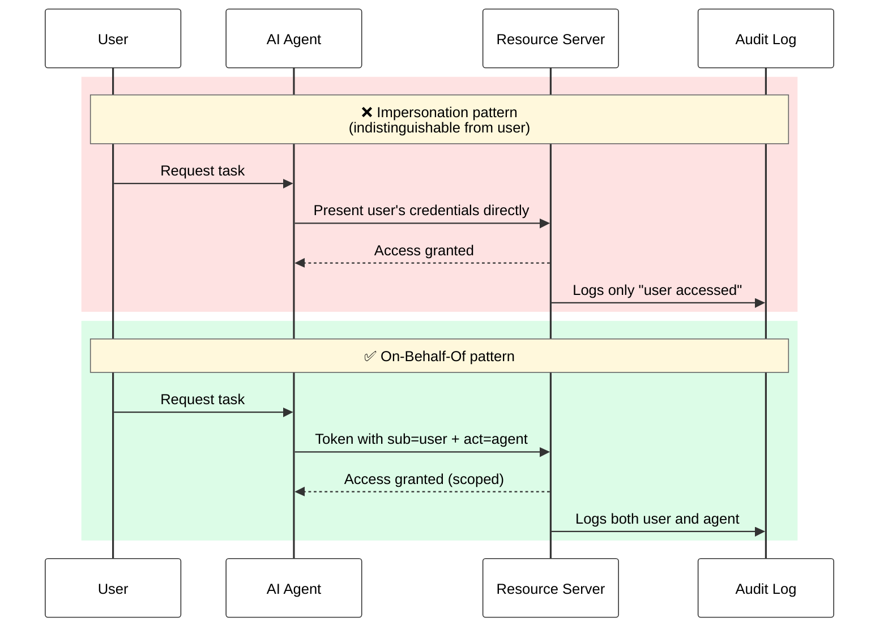
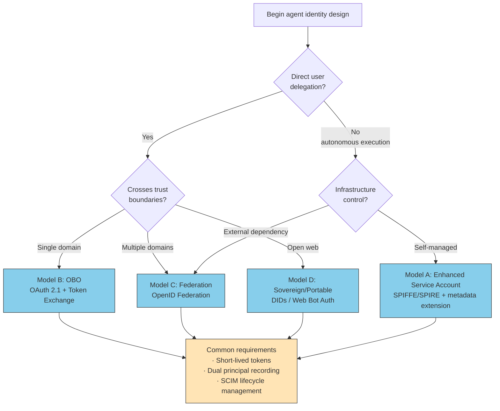

# Agent Identity — A New Category of Non-Human Identity

> Why AI agents require their own identity model rather than an extension of service accounts, organized around the four architectural models presented by the OpenID Foundation.

::: warning About This Page
[Agent taxonomy](./agent-taxonomy) (**WHAT KIND** — what type of agent it is)
→ **This Page (IDENTITY — how to identify, and on whose behalf)**
→ *Permissions: RBAC/ABAC/JIT (planned)* (**ACCESS** — what it is allowed to do)

This page defines the **"Who"** for agents. Given the agent types catalogued in the prior page, it covers how to assign identifiers and affiliation. Authorization (what permissions look like) is addressed separately.
:::

::: details Meta Information

| | |
| --- | --- |
| **What this chapter fixes** | The four architectural models for agent identity, the distinction between impersonation and delegation, the current state of commercial implementations |
| **Out of scope** | Detailed authorization (→ permissions page), authentication during A2A communication (→ [What is A2A](./what-is-a2a)), separation of concerns with Skills/MCP (→ [II.1 Five layers](../part-2/layers)) |
| **Depends on** | [Agent taxonomy](./agent-taxonomy), [II.1 Five layers](../part-2/layers) |
| **Common misuse** | Managing AI agents under the same framework as traditional NHIs (service accounts, API keys), applying static and long-lived assumptions to them |
:::

## About This Document

During 2025–2026, identity assignment for AI agents moved from "discussion" to "production deployment." Major IAM vendors have shipped dedicated agent identity products — Microsoft Entra Agent ID (GA April 2026), Okta for AI Agents (GA April 30, 2026), AWS Bedrock Agents — and A2A v1.0 has entered production as a Linux Foundation–hosted project with broad enterprise participation (AWS, Cisco, Google, IBM, Microsoft, Salesforce, SAP, ServiceNow, and many others)[^a2a-lf]. The OpenID Foundation published "Identity Management for Agentic AI" v1.1 in October 2025, systematizing both the solutions available today and the open challenges ahead.

[^a2a-lf]: According to the Linux Foundation's April 2026 announcement, the A2A protocol project has surpassed 150 supporting organizations ([A2A Protocol Surpasses 150 Organizations](https://www.linuxfoundation.org/press/a2a-protocol-surpasses-150-organizations-lands-in-major-cloud-platforms-and-sees-enterprise-production-use-in-first-year)).

This page explains **why neither reusing human identities nor extending service accounts is sufficient for AI agents**, and presents the four architectural models that the OpenID Foundation has identified as the starting points for agent identity design.

::: tip OpenID Foundation Whitepaper as the Primary Source
The most important citation for this page is "Identity Management for Agentic AI" v1.1 (October 2025), edited by Tobin South, published by the OpenID Foundation. Both the English original and a Japanese translation are publicly available, together forming the most authoritative reference on this subject at present. For the full catalog of standards and implementations, see [references/links.md](https://github.com/shuji-bonji/ai-agent-architecture/blob/main/references/links.md#agentic-ai--アイデンティティとガバナンス).
:::

## Why Existing Identity Management Falls Short

When the need to assign IDs to agents first arises, the natural impulse is to reuse an existing identity model. None of them fit cleanly.

| Existing model | Intended subject | Where it breaks for AI agents |
| --- | --- | --- |
| **Human ID** (AD / LDAP / IdP) | Individual user | Agent actions become indistinguishable from user actions; auditability and accountability collapse |
| **Service Account** | Deterministic batch jobs and services | Cannot express dynamic delegation; "on whose behalf is the agent acting now?" goes unrecorded |
| **API Key** | Client applications | Long-lived and static; the blast radius on compromise is large, and the model contradicts least privilege |
| **Workload ID** (SPIFFE / SPIRE) | Containers and processes | Not designed to cross trust boundaries; verifiability is lost when working across organizations |

The OpenID Foundation whitepaper identifies the root cause as follows:

> "AI agents differ fundamentally from traditional software; they take autonomous actions on external services, exhibiting non-deterministic, flexible behavior that adapts in real-time, rather than simply executing predetermined instructions."
> — OpenID Foundation, "Identity Management for Agentic AI" v1.1, Executive Summary (Section 1.1)

That is, an agent identity must encode not only **what** the agent is, but also **the context it is currently acting in and on whose behalf**. This is the central departure from prior identity models.

## Four Requirements Unique to AI Agent Identity

Distilling Sections 1 and 3 of the whitepaper, agent identity has four requirements that no prior identity model fully satisfies.



The whitepaper itself explicitly states that no single model exists today that satisfies all four:

> "While it is possible to securely connect one agent to many tools within a single organization's control, the broader vision of autonomous agents seamlessly operating across the open web remains largely unsolved."
> — Ibid., Section 2.14

Even in production deployments today, agent identity design therefore requires understanding **the boundary between what can be solved now and what remains open**.

## The Four Architectural Models

The core models identified by the OpenID Foundation define **where to begin** designing agent identity.

> "Fragmentation is already a risk, with vendors developing proprietary systems. To avoid a future where agents require dozens of identities to operate, a few key models exist that are worth considering."
> — Ibid., Section 3.1

### Model A: The Enhanced Service Account

> "The most likely near-term enterprise pattern is that this model extends the familiar concept of workload identity. An agent is treated like a service, but its identity token is enriched with agent-specific metadata (e.g., agent_model, agent_provider, agent_version), asserted via standards like SPIFFE/SPIRE or proprietary extensions."
> — Ibid., Section 3.1

This model extends existing workload identity with AI-specific metadata. It fits best with **autonomously running background agents** — nightly batches, scheduled jobs, internal bots.

### Model B: The Delegated User Sub-Identity (On-Behalf-Of)

> "Foundational for agents acting directly on behalf of a user, this model creates an identity that is intrinsically linked to and derived from that user's session. It is the formal implementation of the 'on-behalf-of' (OBO) flow, where the agent's identity is distinct but inseparable from the user's authority."
> — Ibid., Section 3.1

This model fits best with interactive agents triggered by a user (coding assistants, browser-using agents). It is built on OAuth 2.0 Token Exchange.

### Model C: Federated Trust and Interoperability

> "Agents require an interoperable trust fabric to operate across diverse domains without a central IdP."
> — Ibid., Section 3.1

This model is required for cross-organizational collaboration and conversation with third-party agents via A2A. It leverages OpenID Federation and X.509 certificates.

### Model D: Sovereign and Portable Agent Identity

> "Each agent instance can be assigned a globally unique and verifiable identifier for accountability, using schemes like DIDs or others currently being standardized."
> — Ibid., Section 3.1

This model fits open-web agents and peer-to-peer agent interactions. Web Bot Auth (IETF) belongs to this family.

### Mapping the Four Models



::: tip Do not fix on a single model
In real systems, a single agent typically uses multiple models depending on context. Claude Code, for instance, uses **Model B (OBO)** for user-initiated code edits while combining it with **Model A (Enhanced Service Account)** for autonomous delegation to sub-agents. Design starts by choosing the primary context, then composing the auxiliary flows.
:::

## Impersonation vs Delegation (On-Behalf-Of)

The most commonly misunderstood aspect of agent identity design is the implementation of user delegation. Many current implementations are still effectively **impersonation**.

> "Currently, agents often impersonate users in a manner that is opaque to external services (e.g., via screen scraping and browser use), creating significant accountability gaps and security risks."
> — Ibid., Section 3.2

A correct delegation structure includes **two distinct identities** in the access token.

> "This is critically different from impersonation because it results in an access token containing two distinct identities: the user who delegated authority (e.g., in the sub claim) and the agent authorized to act (e.g., in the act or azp claim). This creates a clear, auditable link from the very first step."
> — Ibid., Section 3.2



## Dual Principal Recording in Audit Logs

The difference between impersonation and delegation flows directly into the audit log.

> "Today, an API call made by an agent on a user's behalf is often logged indistinguishably from an action taken directly by the user, creating a black hole for accountability and forensics. By implementing true delegated authority, the credential presented to the PEP contains distinct identifiers for both the human principal and the agent actor."
> — Ibid., Section 2.11

The design check is simple: **if an audit log record contains only one principal, the system cannot fulfil its accountability obligation**. At minimum, the structure must look like:

```json
{
  "timestamp": "2026-05-24T10:30:00Z",
  "principal": {
    "user":  { "sub": "user_12345" },
    "agent": { "act": "claude-code-prod-v1", "agent_version": "4.6" }
  },
  "action": "GET /api/customers/789",
  "resource": "/customers",
  "delegation_chain": [
    { "from": "user_12345", "to": "claude-code-prod-v1", "scope": ["customers:read"] }
  ]
}
```

With this structure, "**who authorized, and which agent executed**" is always traceable. When recursive delegation occurs, `delegation_chain` lengthens accordingly.

## Commercial Implementations (as of May 2026)

Major IAM vendors are moving toward treating agents as first-class entities, on par with human users.

| Vendor | Product | Status | Model classification | Key feature |
| --- | --- | --- | --- | --- |
| **Microsoft** | Entra Agent ID | GA (April 2026) | A + B | First-class entity in Entra ID. Conditional Access integration, SCIM schema extension |
| **Okta** | Okta for AI Agents | GA (April 30, 2026) | A + B | Universal Directory and Agent Gateway for AI agent registration, access control, and audit |
| **AWS** | Bedrock Agents + IAM | GA | A | Per-agent IAM roles |
| **Google** | A2A v1.0 Signed Agent Cards | GA (early 2026) | C | Cryptographic signing of agent cards for authenticity |

The whitepaper is candid about the current limits, however:

> "The interoperability between these agent identity systems remains limited, with vendors developing proprietary approaches unless they converge to common standards."
> — Ibid., Section 2.8

In practical terms, **wholesale dependence on a single vendor's agent identity platform is a viable near-term solution but carries lock-in risk**.

## Standardization Landscape

Layered above vendor-specific implementations, multiple standardization efforts are advancing in parallel to ensure interoperability.

| Domain | Spec / WG | Status | What it covers |
| --- | --- | --- | --- |
| OIDC-based agent identification | **OIDC-A (OpenID Connect for Agents)** | Proposed | Core identity claims, capabilities, discovery |
| Workload identity | **SPIFFE / SPIRE** | Mature | Short-lived, auto-rotated identities |
| Lifecycle management | **SCIM Agentic Identity Schema** | Proposed (experimental) | Centralized creation/update/deletion of agents in the IdP |
| Browser-using agent auth | **Web Bot Auth (IETF)** | Draft | HTTP message signing for agent verification |
| Enterprise profile | **IPSIE WG** (OpenID Foundation) | In progress | Enterprise security profile |
| Authorization API | **AuthZEN WG** (OpenID Foundation) | In progress | PEP/PDP communication protocol |
| Revocation propagation | **Shared Signals Framework** | In progress | Near-real-time security event propagation |
| Commerce | **AP2 (Agent Payments Protocol)** | In specification | Verifying user intent in agent-led payments |
| High-risk APIs | **FAPI 1.0 / 2.0** | Mature | Financial-grade API protection profile |

## Decision Flow for Identity Selection

The flow below provides a starting point for choosing among the four models in practice.



## Anti-Patterns

Common failure modes in agent identity design:

| Anti-pattern | Why it's a problem | Correct alternative |
| --- | --- | --- |
| **Reusing human identity** | User's personal token passed to the agent; compromise blast radius spreads to the whole user | OBO with separation between sub and act |
| **Long-lived API keys** | Month- or year-scale keys given to agents; contradicts least privilege | Short-lived tokens with JIT issuance |
| **Single-principal audit logs** | Agent and user actions become indistinguishable | Always record both sub and act |
| **Wholesale dependence on a vendor identity system** | Lock-in and lack of interoperability | Layer standard protocols (OIDC, SCIM) underneath |
| **No scope attenuation for recursive delegation** | Sub-agents inherit the parent's full authority | Scope attenuation via Token Exchange or Macaroons |
| **No design for revocation propagation** | Revoking in one place does not reach the leaves | Use Shared Signals Framework and similar |

## Remaining Challenges

What we have covered above is the "currently solvable" area. The unresolved problems are also clear.

> "[T]he challenges multiply exponentially with recursive delegation (agents spawning sub-agents), scope attenuation across delegation chains, true on-behalf-of user flows that maintain accountability, and the interoperability nightmare of different agent identity systems attempting to communicate."
> — Ibid., Section 2.14

The following are areas where even production systems must adopt a **"no complete solution exists yet; mitigate through operational practice"** posture.

| Unresolved area | Current mitigation | Related chapter |
| --- | --- | --- |
| Scope attenuation in recursive delegation | OAuth Token Exchange (centralized) or Macaroons / Biscuits (distributed) | → *Permissions: RBAC/ABAC/JIT (planned)* |
| Cross-domain revocation propagation | Shared Signals Framework, execution-count-constrained tokens | → *Permissions: RBAC/ABAC/JIT (planned)* |
| Authentication of browser-using agents | Web Bot Auth draft | → [What is A2A](./what-is-a2a), *Governance (planned)* |
| Scalable governance and consent fatigue | Policy-as-Code, intent-based authorization, risk-based dynamic authorization | → *Permissions / Governance (planned)* |
| Cross-vendor interoperability | Awaiting standardization (OIDC-A, IPSIE, AuthZEN) | — |

## Summary

The argument of this page can be summarized as follows.

1. **AI agents constitute a new category of NHI** that requires its own identity management approach. Static service account models are structurally inadequate.
2. **The four architectural models** (Enhanced Service Account / OBO / Federation / Sovereign Portable) are the starting points. Choose by agent activity pattern; combine as needed.
3. **Choose delegation over impersonation**. Tokens with separated sub and act claims, plus dual-principal audit logs, are the minimum requirement.
4. **Commercial implementations are in production** (Entra Agent ID GA, Okta for AI Agents GA, A2A v1.0, AWS Bedrock). Cross-vendor interoperability remains limited, with standardization (OIDC-A, IPSIE, AuthZEN) advancing in parallel.
5. **Recursive delegation, revocation propagation, and governance scalability are unresolved**. Design with the assumption that complete solutions do not yet exist; mitigate operationally.

Building on the **"Who"** defined here (agent identifiers and delegation chains), the next chapter designs **what they are allowed to access** through permission models (RBAC / ABAC / JIT). Keeping identity and authorization as separate layers is the prerequisite for designs that survive long-term operation.

---

> **Next**: *Permissions: RBAC/ABAC/JIT (planned)*
> **Previous**: *Hybrid Local/Cloud LLMs (planned)*
