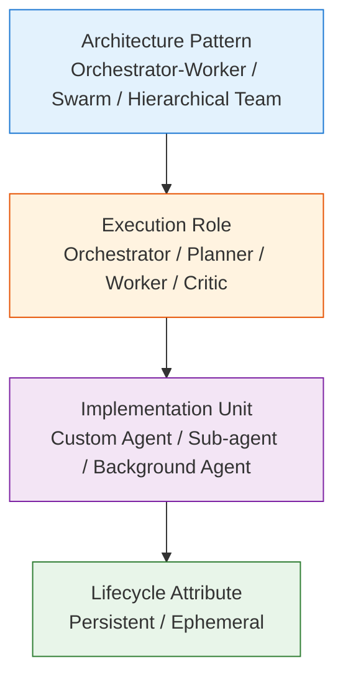
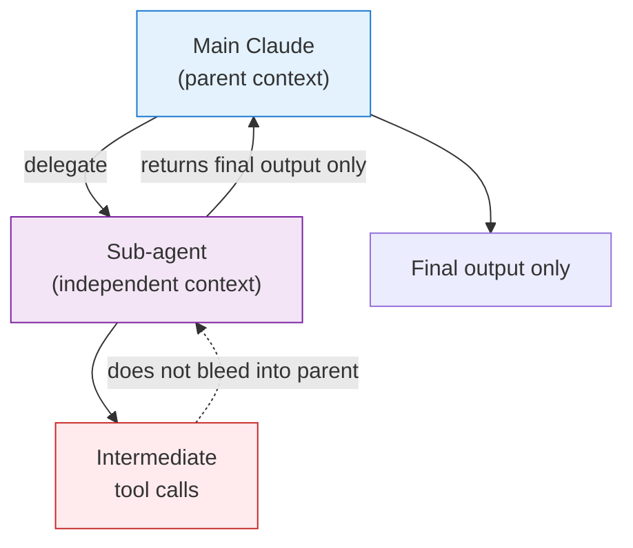

# Agent Taxonomy

> Organizing multi-agent system terminology by abstraction level

## About This Document

LLM-based multi-agent systems are flooded with overlapping terms — **custom agents**, **sub-agents**, **meta-agents**, **orchestrators**, **Swarm** — each used differently across frameworks. This document organizes them into **four abstraction layers**, making the overlaps and independent axes explicit.

For Claude Code-specific implementation details, see [what-is-subagent.md](./what-is-subagent.md). For agent-to-agent communication protocols, see [what-is-a2a.md](./what-is-a2a.md).

## Why a Taxonomy is Needed

### Common Confusion

Agent terminology often suffers from **the same word meaning different things** depending on the framework or article.

- "Meta-agent" referring to a design pattern in one article, to a specific product feature in another
- "Custom agent" and "sub-agent" being listed in parallel when they actually have an inclusion relationship
- "Swarm" being used both as a framework name and as a design pattern name

These confusions stem from **flat-listing terms that belong to different abstraction levels**.

### Making Abstraction Levels Explicit

Organizing terms into four layers as shown below clarifies the picture.

| Abstraction Level | Example Terms | Nature |
| --- | --- | --- |
| **Architecture Pattern** | Orchestrator-Worker, Swarm, Hierarchical Team, Meta-Agent | Pattern names |
| **Execution Role** | Orchestrator / Supervisor, Planner, Worker, Critic | Position and responsibility within a pattern |
| **Implementation Unit** | Custom Agent, Sub-agent, Background Agent | Concrete implementation form |
| **Lifecycle Attribute** | Persistent / Ephemeral, Spawned / Forked | Adjectives that modify implementation units |

In other words, **"custom agent" and "sub-agent" are not parallel concepts**. A sub-agent is usually implemented as a custom agent (defined by the user in Markdown, etc.). "Meta-agent" is similarly not a specific product feature — it's a conceptual term referring to patterns where an Orchestrator dynamically generates sub-agents.

### Concept Map

## Definitions per Layer

### 1. Architecture Pattern

Architectural patterns describing how agents are composed.

| Pattern | Definition | Representative Example |
| --- | --- | --- |
| **Orchestrator-Worker** | A coordinator delegates tasks to multiple sub-agents (Workers) in a hierarchical structure | Anthropic Multi-Agent Research System, Claude Code |
| **Hierarchical Team** | An explicit hierarchy with fixed roles | CrewAI, AutoGen |
| **Swarm** | Minimizes hierarchy; agents collaborate via handoffs in an autonomous decentralized model | OpenAI Swarm (experimental; succeeded by Agents SDK) |
| **Meta-Agent** | A design concept of "an agent that generates/manages other agents" | A general term — not a product feature name |

While some articles treat "Meta-Agent" as a product feature name, no established product feature with that name currently exists. **Use it as a conceptual term** to stay safe.

### 2. Execution Role

The responsibilities each agent takes on within an architecture pattern.

| Role | Responsibility |
| --- | --- |
| **Orchestrator / Supervisor / Lead Agent** | Task decomposition, delegation decisions, result aggregation, dynamic coordination |
| **Planner** | Planning, step decomposition |
| **Worker / Specialist** | Executes individual specialized tasks |
| **Critic / Reviewer / Evaluator** | Validates outputs, scores them, decides on re-runs |

Anthropic's Multi-Agent Research System calls the Orchestrator the **"lead agent."** Note that the same responsibility may have different names across frameworks.

### 3. Implementation Unit

Forms in which agents actually exist as code or configuration files.

| Implementation Unit | Definition | Representative Mechanism |
| --- | --- | --- |
| **Custom Agent** | An agent declaratively defined by the user (prompt, available tools, permissions, model). A superset that includes sub-agents | Claude Code's `.claude/agents/*.md`, GitHub Copilot's `.agent.md` |
| **Sub-agent** | A child agent delegated by a parent, executing in an **independent context window**. Intermediate tool calls don't bleed into the parent — only the final output returns | Claude Code Subagents, Claude Agent SDK Subagents |
| **Background Agent** | An asynchronous, long-running agent that persists state across sessions | GitHub Copilot Cloud Agents |

For Claude Code-specific definition details, see [what-is-subagent.md](./what-is-subagent.md).

### 4. Lifecycle Attribute

Properties that modify implementation units in terms of "how they are created and destroyed."

| Attribute | Meaning |
| --- | --- |
| **Persistent** | Maintains state across sessions. Typical of background agents |
| **Ephemeral** | Destroyed upon task completion. Common behavior of sub-agents. Helps prevent context pollution |
| **Spawned / Forked** | Dynamically generated from a parent. Often combined with Ephemeral |

## Why Independent Context Matters

The biggest advantage of sub-agents is that they **protect the parent session's context window**.

Independent contexts deliver:

- **Token efficiency**: Exploratory tool-call intermediate results don't crowd the parent's context
- **Error isolation**: Sub-agent failures are less likely to propagate to the parent
- **Parallelism**: Multiple sub-agents can run concurrently. In Anthropic's Multi-Agent Research System, the lead spawns 3–5 sub-agents in parallel

## Cross-Framework Mapping

| Concept | Claude Code | GitHub Copilot / VS Code | OpenAI Agents SDK | CrewAI | LangGraph |
| --- | --- | --- | --- | --- | --- |
| Implementation unit definition | `.claude/agents/*.md` | `.github/agents/*.agent.md` | Python (`Agent` class) | Python (`Agent`) | Graph nodes |
| Sub-execution with independent context | ✅ Subagents | ✅ Custom Agents | ✅ Handoff | ✅ Task delegation | ✅ Sub-graphs |
| Hierarchical pattern | Orchestrator + Subagents | Coordinator + Worker | Triage + Specialist | Crew (Manager + Workers) | State Machine |
| Inter-agent communication protocol | A2A support under consideration | — | — | — | — |
| Background execution | △ (as tasks) | ✅ Cloud Agents | △ | — | △ |

Note that `.agent.md` and `AGENTS.md` are different:

- **`.agent.md`**: GitHub Copilot / VS Code's **individual custom agent definition** file (formerly Custom Chat Modes)
- **`AGENTS.md`**: A repository-root **README for coding agents**. In December 2025, OpenAI and Anthropic donated it to the Linux Foundation (Agentic AI Foundation), establishing it as an industry standard

## Selection Guide

| Scenario | Recommended Pattern | Implementation Unit |
| --- | --- | --- |
| Simple single task | Single agent | Custom agent |
| Context protection needed (exploratory research, cross-codebase work) | Orchestrator-Worker | Sub-agent (Ephemeral) |
| Complex coordination and task decomposition | Hierarchical Team | Orchestrator + multiple Workers |
| Long-running async work | Background Job | Background agent (Persistent) |
| Emergent, flexible collaboration | Swarm | Handoff-based |

### Trade-offs

Hierarchy and parallelism improve robustness and accuracy, but **token cost and latency increase**. Anthropic's Multi-Agent Research System reports that a configuration with Claude Opus 4 as the lead and Claude Sonnet 4 as subagents **outperformed a single Opus 4 by 90.2% on their internal research eval**. However, the same report notes that **token consumption explains 80% of the performance variance**, making the cost trade-off significant.

A multi-agent setup is **not always better** — choose based on task characteristics and cost constraints.

## Related Protocols

Several protocols exist around agents and are easy to confuse. Here's a quick disambiguation.

| Protocol | Origin | Purpose |
| --- | --- | --- |
| **MCP (Model Context Protocol)** | Anthropic | Standard for LLMs to connect to external tools / data sources. **Tool connectivity inside an agent.** See [what-is-mcp.md](../mcp/what-is-mcp.md) |
| **A2A (Agent-to-Agent Protocol)** | Google → Linux Foundation | Peer-to-peer communication **between agents.** See [what-is-a2a.md](./what-is-a2a.md) |
| **AGENTS.md** | OpenAI / Anthropic (donated to Linux Foundation) | Repository-root README for coding agents |

**MCP and A2A are complementary.** If MCP is the "vertical" connection between an agent and its tools, A2A is the "horizontal" connection between agents.

## References

### Primary Sources

- [Anthropic — How we built our multi-agent research system](https://www.anthropic.com/engineering/multi-agent-research-system) (the 90.2% figure, Orchestrator-Worker pattern)
- [Claude Code Docs — Create custom subagents](https://code.claude.com/docs/en/sub-agents)
- [Claude Agent SDK — Subagents in the SDK](https://platform.claude.com/docs/en/agent-sdk/subagents)
- [VS Code Docs — Custom agents in VS Code](https://code.visualstudio.com/docs/copilot/customization/custom-agents)
- [GitHub Docs — About custom agents (Copilot cloud agent)](https://docs.github.com/en/copilot/concepts/agents/cloud-agent/about-custom-agents)
- [AGENTS.md official site](https://agents.md/)
- [OpenAI — Agentic AI Foundation announcement](https://openai.com/index/agentic-ai-foundation/)
- [OpenAI Swarm repository (experimental; redirects to Agents SDK)](https://github.com/openai/swarm)

### Secondary Sources (commentary)

- [Simon Willison — Anthropic: How we built our multi-agent research system](https://simonwillison.net/2025/Jun/14/multi-agent-research-system/)

## What to Read Next

| Purpose | Document |
| --- | --- |
| Claude Code-specific sub-agent implementation | [what-is-subagent.md](./what-is-subagent.md) |
| Inter-agent communication protocol | [what-is-a2a.md](./what-is-a2a.md) |
| MCP details | [what-is-mcp.md](../mcp/what-is-mcp.md) |
| Three-layer architecture (Agent / Skills / MCP) | [03-architecture.md](../concepts/03-architecture.md) |
| Implementation patterns | [patterns.md](../workflows/patterns.md) |
