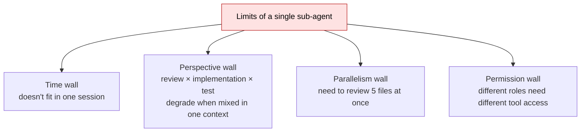
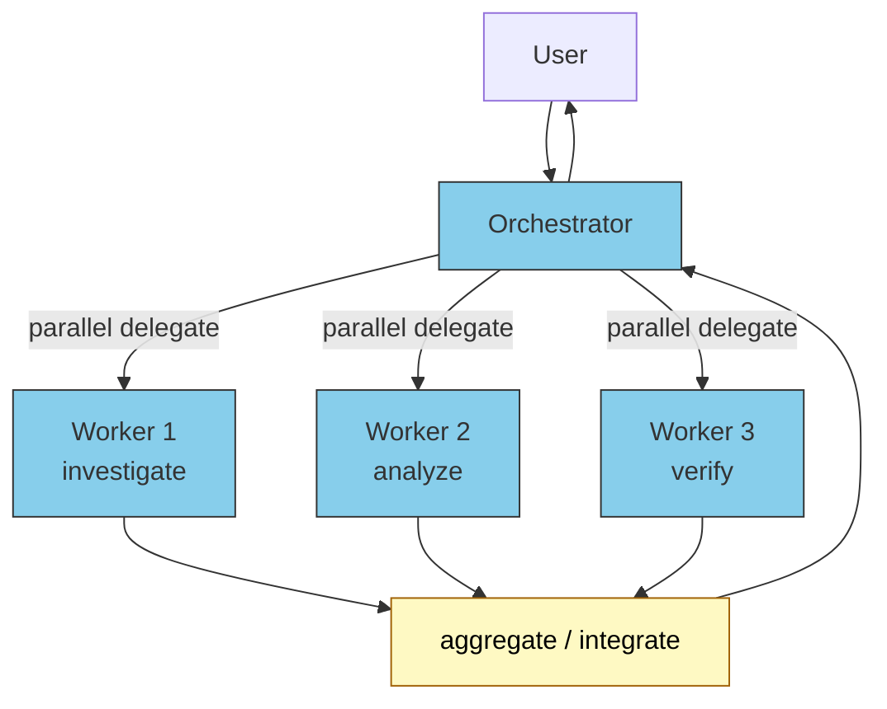
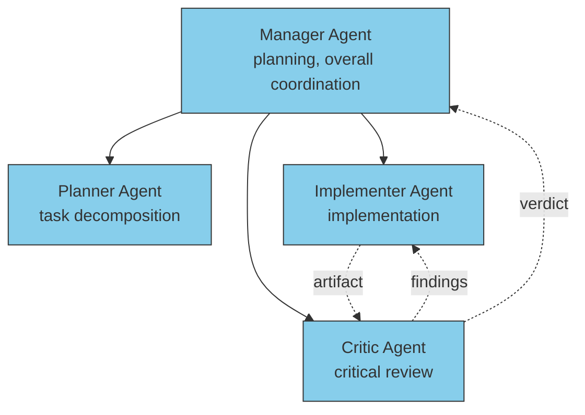
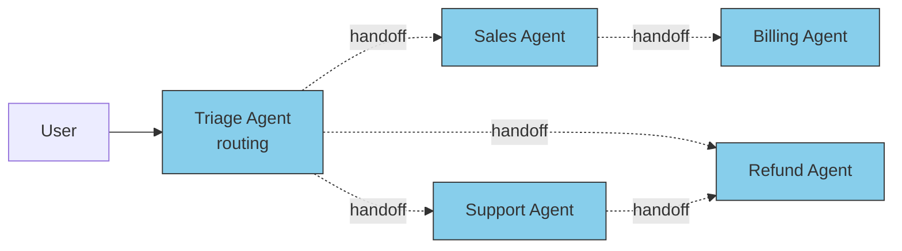
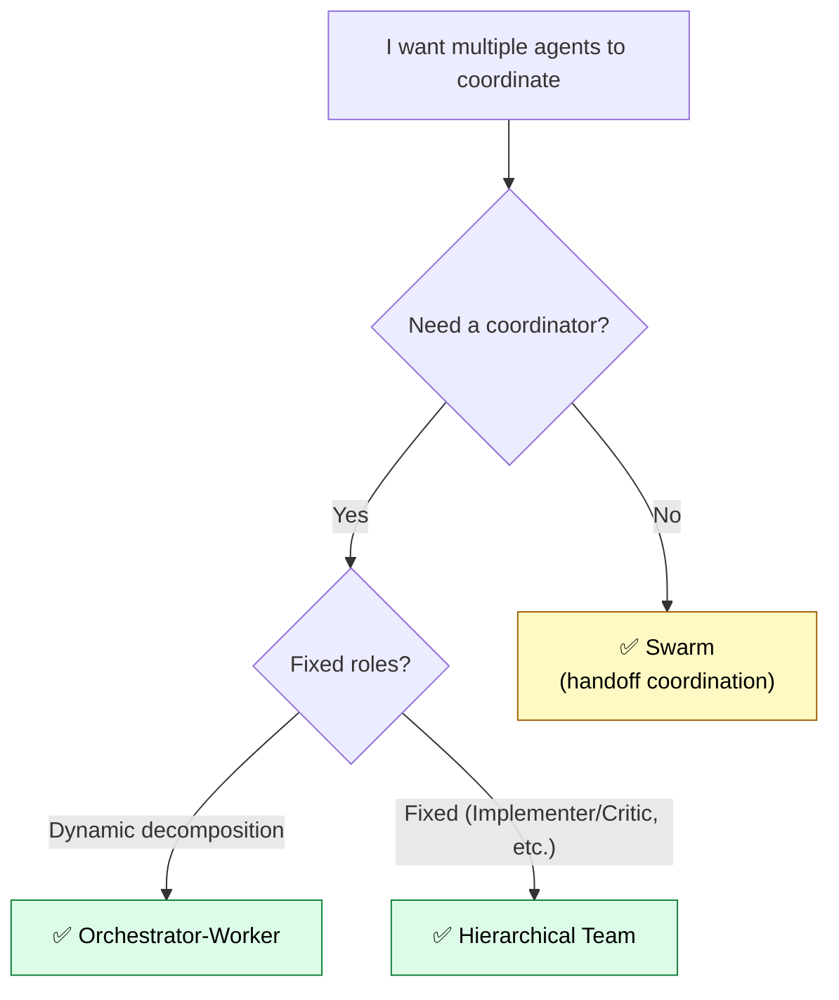
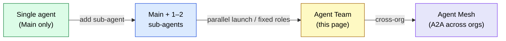
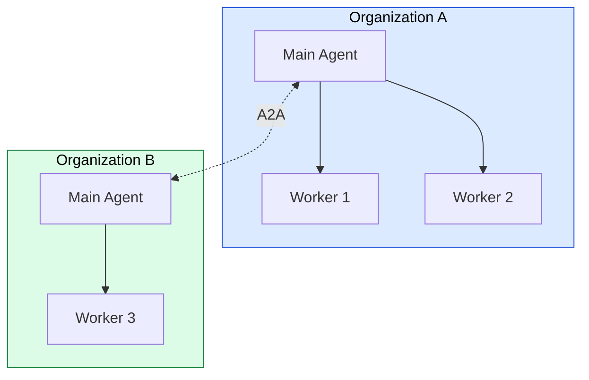

# Multi-Agent / Agent Teams — Scaling Beyond a Single Agent

> When 1–2 sub-agents in series can't solve the problem, organize agents into a **team**. Orchestrator-Worker, Hierarchical Team, Swarm — the three basic patterns and how to choose between them from an implementation perspective.

## About This Document

Sub-agent basics are covered in [Custom Sub-agent](./what-is-subagent). This page focuses on **designing multiple agents to coordinate**. Grounded in Anthropic's Multi-Agent Research System and OpenAI Agents SDK patterns, it offers practical guidance on "when an Agent Team becomes necessary."

> [!TIP] Answered in 3 lines
> - Consider an Agent Team **when processing time explodes or perspectives bleed together** in a single sub-agent
> - Three basic patterns: **Orchestrator-Worker** (centralized lead) / **Hierarchical Team** (fixed roles) / **Swarm** (handoff-based)
> - **Cost scales super-linearly** in both parallelism and tokens. Introduce only **after exhausting simpler approaches**

Related: [Agent Taxonomy](./agent-taxonomy) / [Custom Sub-agent](./what-is-subagent) / [Sub-agent vs Skills](./subagent-vs-skill) / [What is A2A](./what-is-a2a)

## Why "Single Sub-agent" Stops Being Enough

Sub-agents run in isolated contexts, yet still hit these walls:



The structural answer to all four is **organizing multiple agents** = Agent Teams.

> [!IMPORTANT]
> Agent Teams are **not "a more powerful sub-agent."** **Stay with sub-agents if sub-agents suffice.** Promotion signals appear later in this page.

## Three Basic Patterns

The design patterns from [Agent Taxonomy](./agent-taxonomy) — viewed from an **implementation lens**.

### Pattern 1: Orchestrator-Worker

A lead (Orchestrator) delegates tasks to multiple Worker sub-agents and aggregates results. **The standard pattern** — Anthropic's Multi-Agent Research System uses this.



| Property | Detail |
| --- | --- |
| Coordination | Centralized (Orchestrator handles all decomposition and aggregation) |
| Inter-worker comms | In principle, none (via Orchestrator) |
| Parallelism | High (Orchestrator launches multiple Workers concurrently) |
| Best for | Exploratory investigation, codebase-wide analysis, multi-source integration |
| Claude Code implementation | Main agent calls `Agent(subagent_type=...)` multiple times |

> [!NOTE]
> Anthropic reports that a config with Claude Opus 4 as lead and Claude Sonnet 4 as subagents outperformed a single Opus 4 by **90.2%** on their internal research eval, while **token consumption explained 80% of the performance gap**. Big quality gains, big cost increase.

### Pattern 2: Hierarchical Team

Agents with fixed roles organized hierarchically. CrewAI and AutoGen are representative. The difference from Orchestrator-Worker is **higher role fixation**.



| Property | Detail |
| --- | --- |
| Coordination | Manager is at the top, but members also interact |
| Inter-agent comms | Yes (Implementer ↔ Critic round-trip) |
| Parallelism | Medium (limited by fixed roles) |
| Best for | Iterative improvement loops; requirements → design → impl → review |
| Claude Code implementation | Custom sub-agents per role, Main as conductor |

### Pattern 3: Swarm

Minimal hierarchy; agents **hand off** tasks to the next handler — autonomous distributed. OpenAI Swarm (experimental, now part of Agents SDK) is representative.



| Property | Detail |
| --- | --- |
| Coordination | None (initiative moves dynamically via handoff) |
| Inter-agent comms | Handoff (payload + context passed to the next agent) |
| Parallelism | Low to medium (basically a sequential flow) |
| Best for | Customer support, workflow tasks (request → approve → notify) |
| Claude Code implementation | Hard to map directly today (awaits full A2A) |

> [!CAUTION]
> Swarm is a pattern name, distinct from the framework name (OpenAI Swarm). In Claude Code today, Swarm-like behavior requires full A2A support or a custom messaging substrate.

## Choosing Between the Three Patterns



| Criterion | Recommended pattern |
| --- | --- |
| Exploratory, dynamic decomposition | Orchestrator-Worker |
| Iterative improvement loop (impl → review) | Hierarchical Team |
| Workflow-type (request → approve → notify) | Swarm (future) / Orchestrator as interim |
| Pure speed (parallelism priority) | Orchestrator-Worker (parallel launches) |
| Cost-conscious | First try a single sub-agent |

## When to Adopt — Promotion Signals

> [!IMPORTANT]
> Agent Teams **scale cost super-linearly**. As Anthropic reports "**token consumption explains 80% of the performance gap**," casually going multi-agent has poor ROI.

### Adoption signals ✅

- A single sub-agent takes **10+ minutes per session**
- You need to **review/analyze 5+ files in parallel**
- Quality requirement: "**separate implementer and critic**"
- Different roles need **different tool permissions** (e.g., Write for Implementer, Read-only for Reviewer)
- A single agent's perspectives **bleed together**, degrading accuracy

### Defer-adoption signals ❌

- Only one task; no benefit from parallelization
- Tight cost constraints (limited token budget)
- You haven't fully tuned the single agent yet
- Lack of debugging / observability (Agent Teams make failure attribution hard)

## Boundary with Sub-agents — At what point is it a "Team"?

A natural question: "Is one sub-agent already an Agent Team?" Answer:



| Stage | Composition | Primary concerns |
| --- | --- | --- |
| **Single agent** | Main only | Prompt design |
| **+ sub-agent** | Main + 1–2 specialists | Context isolation, independence |
| **Agent Team** | Orchestrator + parallel Workers / fixed roles | Parallelism, role boundaries, cost management |
| **Agent Mesh** | Cross-org agent coordination | A2A protocol, AgentID, trust boundaries |

This page covers the **Agent Team** stage. Cross-org (Agent Mesh) is in [What is A2A](./what-is-a2a) and [Agent Identity](./agent-identity).

## Claude Code Implementation Patterns

Concrete patterns for implementing Agent Teams in a Claude Code environment.

### Parallel Worker launch (Orchestrator-Worker)

```markdown
<!-- CLAUDE.md or project instructions -->

## Instructions for multi-file review

When a review request involves 3+ files, execute in parallel:

1. Distribute the file list among Worker sub-agents
2. Launch `Agent(subagent_type="code-reviewer", description=..., prompt=...)` **multiple times in parallel within the same message**
3. Aggregate all Worker results and return review comments organized by perspective
```

> [!TIP]
> Parallel launch means **multiple `Agent(...)` tool calls in a single message**. Sequential launches lose the Orchestrator-Worker advantage.

### Implementer + Critic loop (Hierarchical Team)

```markdown
<!-- CLAUDE.md -->

## Generate → Review → Fix loop

1. Main implements via `Agent(subagent_type="implementer", ...)`
2. Main critiques via `Agent(subagent_type="critic", ...)`
3. If Critic returns "fail", pass findings to Implementer for revision
4. Up to 3 loops; if exceeded, Main escalates
```

For applied implementation patterns, see also [Using sub-agents as quality gates](./subagent-quality-gate).

### Sub-agent constraints — Patterns that break when Teamed

> [!WARNING]
> Current Claude Code spec: **sub-agents cannot invoke other sub-agents.** This affects Team composition:
> - **OK**: Main → multiple Workers (1 level)
> - **NG**: Main → Worker → Sub-Worker (2 levels)
> - **Workaround**: Main directly launches all Workers and integrates results (Orchestrator owns all responsibility)

For long-running / week-spanning tasks needing hierarchy, migrate from sub-agents to **Agent Teams (separate processes / Agent SDK / A2A)**. See the sister site [understanding-llm / Part 10: Multi-Session Coordination](https://shuji-bonji.github.io/understanding-llm-through-claude-code/10-multi-session/).

## Anti-patterns

### ❌ "Just go multi-agent"

- Teaming a task that a single agent handles fine — cost explodes
- Mitigation: confirm "3 attempts at single agent topped out" before considering Team

### ❌ Role overlap

- "Reviewer A" and "Reviewer B" review from the same perspective
- Result: 2× cost with no accuracy change
- Mitigation: make role perspectives **orthogonal** (Security / Performance / Style)

### ❌ Critic always returns "pass"

- The Implementer + Critic loop has a non-functional Critic
- Mitigation: declare Critic-specific pass criteria using the normative ladder from [Quality Gate Pattern](./subagent-quality-gate)

### ❌ Production without observability

- Cannot trace which Worker failed
- Mitigation: attach a correlation ID to every sub-agent invocation and aggregate logs

## Connection to the A2A Era

As cross-org agent coordination matures, Agent Teams expand into an **Agent Mesh**.



Within an org → Orchestrator-Worker (this page); across orgs → A2A protocol ([What is A2A](./what-is-a2a)); identity and delegation → [Agent Identity](./agent-identity). A three-stage rocket.

## Related Documents

- [Agent Taxonomy](./agent-taxonomy) — Terminology of Orchestrator-Worker / Hierarchical Team / Swarm
- [Custom Sub-agent](./what-is-subagent) — How to define the individual agents in a Team
- [Sub-agent vs Skills](./subagent-vs-skill) — Confirm a Skill isn't enough first
- [Quality Gate Pattern](./subagent-quality-gate) — Example of a Critic role
- [What is A2A](./what-is-a2a) — Entry to cross-org Agent Mesh
- [Agent Identity](./agent-identity) — Identifying and delegating among agents in a Team

## 🔗 Deeper: Why a single agent doesn't reach

This page covers the **implementation view (what/how)** of Agent Teams. For **why** a single agent hits a wall with Context Rot and why multi-session coordination is needed — grounded in LLM structure — see the sister site.

- [understanding-llm / Part 10: Multi-Session Coordination](https://shuji-bonji.github.io/understanding-llm-through-claude-code/10-multi-session/) — Foundations of scaling beyond a single agent
- [understanding-llm / Subagent vs Team](https://shuji-bonji.github.io/understanding-llm-through-claude-code/10-multi-session/subagent-vs-team) — The boundary between sub-agents and Teams
- [understanding-llm / Session Boundary Design](https://shuji-bonji.github.io/understanding-llm-through-claude-code/10-multi-session/session-boundary-design) — Designing session boundaries

## Sources

- [Anthropic — How we built our multi-agent research system](https://www.anthropic.com/engineering/multi-agent-research-system) — Orchestrator-Worker pattern, 90.2% performance, token cost
- [Claude Agent SDK — Subagents in the SDK](https://platform.claude.com/docs/en/agent-sdk/subagents)
- [OpenAI Agents SDK](https://github.com/openai/openai-agents-python) — Successor to Swarm
- [CrewAI Documentation](https://docs.crewai.com/) — Representative Hierarchical Team implementation

---

> **Previous**: [Using sub-agents as quality gates](./subagent-quality-gate)

> **Next**: [What is A2A (Agent-to-Agent Protocol)](./what-is-a2a)
