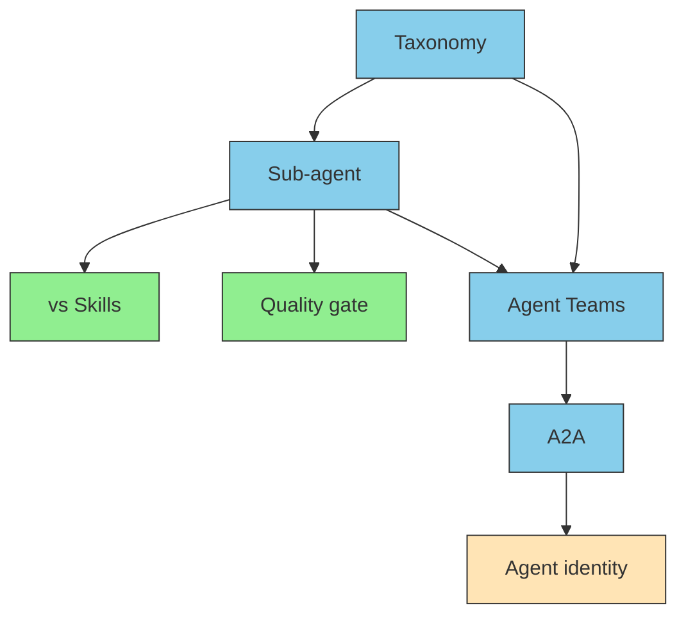

# III.5 Agent

> [!NOTE] Where this chapter sits
> Agent receives a request and, inside Doctrine's line, combines Skills, Memory, and MCP. Taxonomy, sub-agents, A2A, and identity remain in this section. Product how-tos belong to each host's docs.

## 5.1 What it owns

The user's one sentence is not the whole job. What to keep, which procedure, how it went last time, and what the source text is now, must be combined before work proceeds. That combining is Agent's job.

A sub-agent is a unit that splits roles inside Agent. Splitting the person who translates from the person who checks quality is typical. It is not a substitute for MCP. It is a way of splitting work. The cut is in [Sub-agent vs Skills](./subagent-vs-skill).

Whether it is done is not left to "done" said by the same role. Another role or a machine test looks. The quality-gate shape is in [Using a sub-agent as a quality gate](./subagent-quality-gate).

## 5.2 Roles inside, and parties outside

Splitting roles in the same process is a custom sub-agent. Talking to a party across the network is A2A (Agent-to-Agent Protocol). An in-house specialist desk versus an outside vendor is a useful picture. Both are sometimes needed. One does not suffice for the other.

Start taxonomy at [Agent taxonomy](./agent-taxonomy). Combining several is [Multi-agent / Agent Teams](./agent-teams). A2A itself is [What is A2A](./what-is-a2a).

## 5.3 On whose behalf

In production, "who" and "on whose behalf" are asked. That is identity of a non-human actor. The standard is still moving. What is settled now and what is not yet settled are written apart. Detail is [Agent identity](./agent-identity).

Fine-grained permission and a registry like a marketplace will be added later. Enter from the identity page.

## 5.4 How to read

| Aim | Order |
| --- | --- |
| First time | [Taxonomy](./agent-taxonomy) → [Sub-agents](./what-is-subagent) → [vs Skills](./subagent-vs-skill) |
| Raise quality | [Sub-agents](./what-is-subagent) → [Quality gate](./subagent-quality-gate) |
| Raise headcount | [Agent Teams](./agent-teams) → [A2A](./what-is-a2a) → [Agent identity](./agent-identity) |
| Identity in production | [Taxonomy](./agent-taxonomy) → [Agent identity](./agent-identity) → [A2A](./what-is-a2a) |

## 5.5 Summary

Agent understands the work and combines the other layers. A sub-agent is a split of roles, not another name for MCP. Outside agents are spoken to with A2A. In production, on whose behalf is designed separately.

## Related pages

- [II.1 Five layers](../part-2/layers)
- [III.3 Doctrine](../part-3/doctrine) / [III.4 Memory](../part-3/memory)
- [FAQ: four-way comparison](../faq/agent-vs-subagent-vs-skill)
- [understanding-llm / Part 5: On-demand context](https://shuji-bonji.github.io/understanding-llm-through-claude-code/05-on-demand-context/)

---

> **Previous**: [III.4 Memory](../part-3/memory)
>
> **Next**: [IV.1 Patterns](../part-4/patterns)
