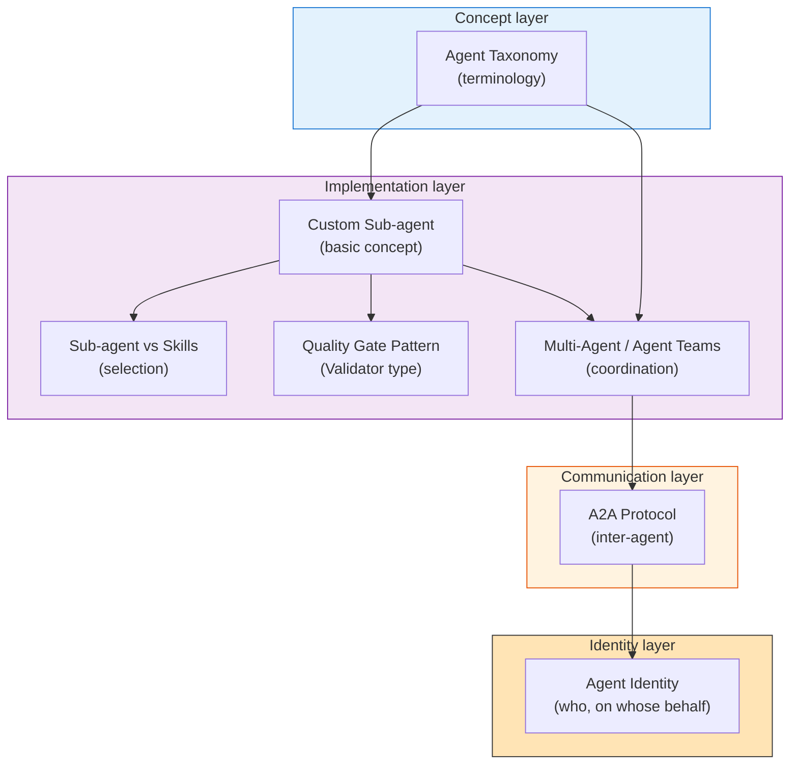
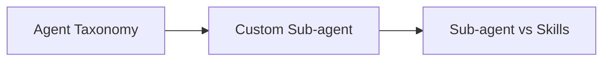
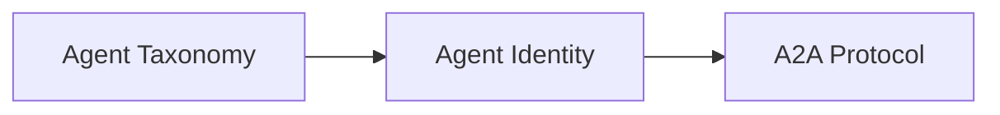
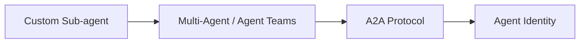
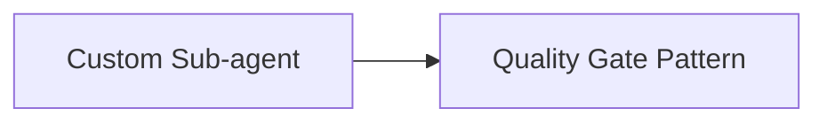

# Agents — Taxonomy, Communication, and Identity

> The section that addresses "**who, what, on whose behalf, and how they coordinate**." Deepens the Agent layer of the three-layer model ([03-architecture](../concepts/03-architecture)).

## Position of This Section

The Agents section is being grown incrementally toward the Agent ID era. It is organized: **terminology → implementation units → communication protocols → identity**.

## Page Overview

### Concept layer — Get terminology straight first

| Page | Theme | Best for |
| --- | --- | --- |
| [Agent Taxonomy](./agent-taxonomy) | Organize custom/sub/meta-agents, Orchestrator-Worker, Swarm, etc., into 4 abstraction levels | Anyone wanting cross-framework terminology |

### Implementation layer — What to build and how

| Page | Theme | Best for |
| --- | --- | --- |
| [Custom Sub-agent](./what-is-subagent) | Sub-agent definition, placement, and use in Claude Code | Foundational understanding before implementation |
| [Sub-agent vs Skills](./subagent-vs-skill) | Whether to implement as a Skill or a Sub-agent; composition patterns | When you're stuck on a design decision |
| [Quality Gate Pattern](./subagent-quality-gate) | Validator sub-agent implementation, CI/CD integration, pass criteria | When self-review keeps coming out too lenient |
| [Multi-Agent / Agent Teams](./agent-teams) | Beyond single sub-agents — Orchestrator-Worker, Hierarchical, Swarm patterns | When single agents hit a ceiling |

### Communication layer — How agents talk to each other

| Page | Theme | Best for |
| --- | --- | --- |
| [What is A2A (Agent-to-Agent Protocol)](./what-is-a2a) | A2A v1.0 overview, standardization under Linux Foundation, complementarity with MCP | Anyone exploring cross-org agent coordination |

### Identity layer — On whose behalf do they act?

| Page | Theme | Best for |
| --- | --- | --- |
| [Agent Identity](./agent-identity) | Non-Human Identity as a new category, OpenID Foundation's 4 architectural philosophies, commercial implementation status | Operators bringing agents to production |

## Roadmap Toward the Agent ID Era

This site grows alongside the **2025–2026 Agent ID standardization wave**. Here is the honest current status and what's coming.

| Topic | Status |
| --- | --- |
| Agent Taxonomy | ✅ Published |
| Custom Sub-agent (Claude Code) | ✅ Published |
| Sub-agent vs Skills | ✅ Published |
| Quality Gate Pattern | ✅ Published |
| Multi-Agent / Agent Teams | ✅ Published |
| A2A Protocol | ✅ Published |
| Agent Identity (identification & delegation) | ✅ Published |
| **Permission management (RBAC / ABAC / JIT)** | 🚧 Planned — referenced from agent-identity |
| **Agent governance** | 🚧 Planned |
| **A2A implementation patterns** (Web Bot Auth, Macaroons, etc.) | 🚧 Planned |
| **Agent Marketplace / Registry** | 🚧 Under consideration |

> [!IMPORTANT]
> The Agent ID area has rapidly moved into production-operation phase: **OpenID Foundation white paper v1.1 (October 2025), Microsoft Entra Agent ID GA (April 2026), Okta for AI Agents GA, A2A v1.0 under Linux Foundation**. Because specs remain fluid, this site distinguishes "**what is settled now**" from "**what remains open**."

## Recommended Reading Routes

### Route 1: Newcomer (foundation)

### Route 2: Production readiness (identity-first)

### Route 3: At scale (multi-agent coordination)

### Route 4: Raising quality (implementation techniques)

## Related Sections

| Section | Relation |
| --- | --- |
| [Concepts / 03-architecture](../concepts/03-architecture) | The whole three-layer model including the Agent layer |
| [Concepts / 07-doctrine-and-intent](../concepts/07-doctrine-and-intent) | Designing "constraints and objectives" given to agents |
| [Concepts / 08-memory-and-knowledge](../concepts/08-memory-and-knowledge) | The memory layer agents reference |
| [Skills](../skills/what-is-skills) | Static knowledge agents reference |
| [MCP](../mcp/what-is-mcp) | How agents connect to the outside world |
| [FAQ / Agent vs Sub-agent vs Skill vs MCP](../faq/agent-vs-subagent-vs-skill) | The 3-line answer for all four |

## 🔗 Deeper: From the context-management perspective

For agents' essential constraints — why isolated contexts matter, why Multi-[Session](../glossary#session) coordination is needed — grounded in LLM structure, see the sister site.

- [understanding-llm / Part 5: On-Demand Context (Skills & Agents)](https://shuji-bonji.github.io/understanding-llm-through-claude-code/05-on-demand-context/) — Agents that expand only when requested
- [understanding-llm / Part 10: Multi-Session Coordination (Agent Teams)](https://shuji-bonji.github.io/understanding-llm-through-claude-code/10-multi-session/) — Scaling beyond a single agent
