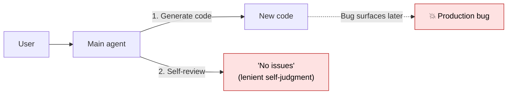
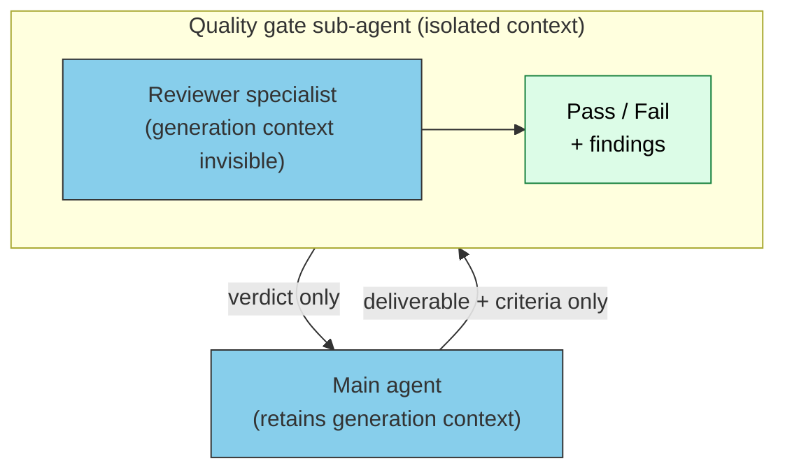
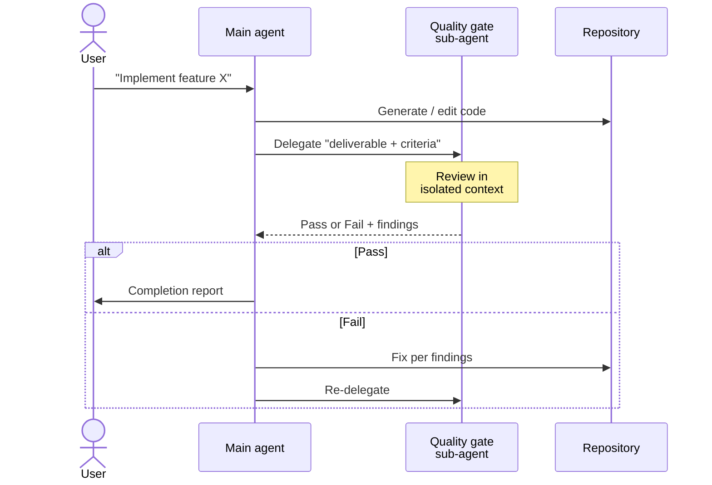
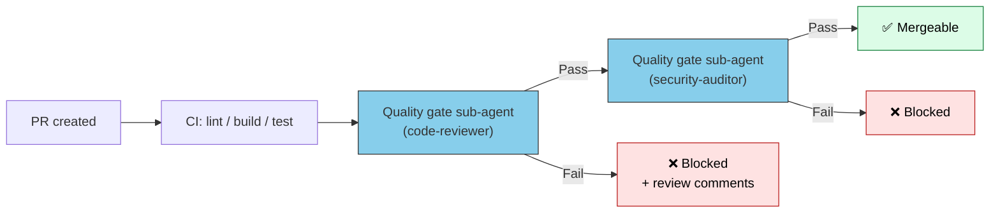

# Using Sub-agents as Quality Gates

> "Reviewing your own code makes you lenient" — solve this structural problem with **sub-agents that hold an isolated context**.

## About This Document

This page deepens the **Validator pattern** mentioned in [What is a Custom Sub-agent](./what-is-subagent) into a form that delivers real-world value: CI/CD integration, the delegation protocol with the main agent, and how to design pass criteria.

> [!TIP] Answered in 3 lines
> - **Quality gate** = a checkpoint that decides whether a deliverable proceeds to the next stage
> - Sub-agents excel because **isolated context = structurally guaranteed objectivity**
> - You can **enforce "do not self-review"** as a mechanism

Related: [What is a Custom Sub-agent](./what-is-subagent) / [Sub-agent vs Skills](./subagent-vs-skill) / [Workflow Patterns](../workflows/patterns)

## Why "Self-Review" Fails

When using LLM-based development agents, this failure recurs:



This stems from LLM structural properties:

| Structural problem | What happens |
| --- | --- |
| **[Sycophancy](../glossary#structural-problems)** | Tendency to avoid criticism that contradicts its own output |
| **[Context Rot](../glossary#structural-problems)** | Generation-time context lingers; objective evaluation is impossible |
| **[Priority Saturation](../glossary#structural-problems)** | With multiple instructions ("write code", "review it"), the latter loses priority |

See [understanding-llm / Sycophancy](https://shuji-bonji.github.io/understanding-llm-through-claude-code/01-llm-structural-problems/sycophancy) for details.

> [!WARNING]
> If you finish "generate → self-review → commit" in a single conversation, the Sycophancy + Context Rot one-two punch yields lenient judgments. To raise review precision, the only structural solution is to **physically separate the context**.

## Why Sub-agents Suit Quality Gates

Sub-agents **launch in an isolated context**, structurally guaranteeing:



| Property | Effect |
| --- | --- |
| **Isolated context** | Generation-time context, excuses, and intent are invisible → objective evaluation becomes possible |
| **Role fixation ([system prompt](../glossary#system-prompt))** | "You are a reviewer" is guaranteed |
| **Only final output to parent** | Pass / Fail + findings reach the parent cleanly |
| **Parallel execution** | Multiple perspectives (security / performance / style) can run in parallel |

> [!IMPORTANT]
> Quality gate sub-agents function as **"a mechanism that does not trust the main agent."** This is not a design that strips authority — it is **a design that compensates for the LLM's structural biases**.

## Five Typical Quality Gates

Five gates that recur in practice. Adopt them independently, or chain them in CI/CD.

### 1. Code Review Gate

```markdown
<!-- .claude/agents/code-reviewer.md -->
---
name: code-reviewer
description: Code review specialist. Returns categorized comments from an independent stance
tools: Read, Grep, Bash
model: sonnet
---

You are a code reviewer. Do not sympathize with the generator's intent.
Evaluate on these dimensions and return Pass / Needs Fix / Fail per dimension.

- Naming conventions and style
- Error handling completeness
- Security (SQL injection, XSS, secret leakage)
- Performance (N+1, complexity)
- Test coverage
```

### 2. Document Validation Gate

Independently evaluate technical accuracy, stylistic consistency, and internal link integrity.

```markdown
<!-- .claude/agents/doc-validator.md -->
---
name: doc-validator
description: Validates document technical accuracy, style, and links
tools: Read, Grep
---

Operate as a "reader's perspective" specialist.
Check each dimension, list locations that fail the pass criteria.

- Technical term accuracy (matches the cited source)
- Style consistency (no mixing of voice / register)
- Internal link existence
- Figure / table caption presence
```

### 3. Test Coverage Gate

Evaluate coverage thresholds, untested functions, missed boundary conditions.

```markdown
<!-- .claude/agents/test-coverage-gate.md -->
---
name: test-coverage-gate
description: Independently evaluates test coverage
tools: Bash, Read
---

Read test results and coverage reports; judge:

- Line coverage ≥ 80%
- Branch coverage ≥ 70%
- Any public functions without tests
- Missing boundary conditions (null, empty, max)
```

### 4. Security Gate

Independently evaluate code and architecture from a security-expert stance.

```markdown
<!-- .claude/agents/security-auditor.md -->
---
name: security-auditor
description: Security audit specialist
tools: Read, Grep, Bash
---

Evaluate against OWASP Top 10 and CWE Top 25.
Do not fear false positives — report all suspicious findings.
```

### 5. Compliance Gate

Mechanically evaluate organization-specific policies (PII handling, licensing, data residency).

```markdown
<!-- .claude/agents/compliance-gate.md -->
---
name: compliance-gate
description: Verifies adherence to organizational policies
tools: Read, Grep
---

Detect violations of these org policies:

- Logging of PII
- Inclusion of GPL-licensed code fragments
- API calls involving cross-border data transfer
```

## Delegation Protocol with the Main Agent

Place a **MUST-level delegation rule** in the main agent's system prompt to suppress the temptation of self-review.

```markdown
<!-- CLAUDE.md or project instructions -->

## Quality Gate Compliance (MUST)

The following deliverables MUST pass the corresponding quality gate sub-agent.
Self-review bypass is not allowed.

| Deliverable | Required gate |
| --- | --- |
| Code changes (PR) | `code-reviewer` |
| Documentation changes | `doc-validator` |
| Authentication / authorization code | `security-auditor` |
| Test additions | `test-coverage-gate` |

If a gate returns "Fail", address the findings and re-submit to the gate.
```

> [!IMPORTANT]
> Use the normative strength ladder (MUST / SHOULD / MAY) to explicitly forbid bypassing. See [III.3 Doctrine](../part-3/doctrine).

### Delegation Flow



## CI/CD Integration

Quality gate sub-agents can run as a stage in a CI/CD pipeline.



### Typical CI Composition

| Stage | Role | Implementation |
| --- | --- | --- |
| 1. Static analysis | lint / format / type checking | Existing tools (eslint, mypy, etc.) |
| 2. Unit tests | Functional correctness | jest / pytest, etc. |
| 3. Quality gate (structural) | Objective review | Sub-agent |
| 4. Quality gate (security) | Vulnerability detection | Security sub-agent + existing scanners |
| 5. Human review | Final decision | Pull request approval |

> [!TIP]
> Sub-agent gates sit **between static analysis and human review**. They catch design-level issues (naming inconsistency, responsibility blurring) invisible to the former, reducing the burden on the latter.

## Designing Pass Criteria

A gate's effectiveness depends on **criterion clarity**. Vague criteria yield "always pass," and the gate becomes hollow.

### Good vs Bad Criteria

| ❌ Bad criterion | ✅ Good criterion |
| --- | --- |
| "Code should be clean" | "Line coverage ≥ 80%, cyclomatic complexity ≤ 10" |
| "Should be secure" | "0 findings against OWASP Top 10 items" |
| "Should be readable prose" | "Every jargon term has a definition on first use" |

### Express Criteria with the Normative Ladder

Express pass criteria with the normative strength ladder (MUST / SHOULD / MAY) for consistent judgment.

```markdown
## Pass Criteria (code-reviewer)

### MUST (any violation → Fail)
- Every newly added public function has a test
- No hardcoded secrets / API keys
- All SQL queries are parameterized

### SHOULD (3+ violations → Fail)
- Functions ≤ 50 lines
- Files ≤ 300 lines
- Naming follows camelCase / PascalCase convention

### MAY (informational only)
- Performance optimization opportunities
- Refactoring candidates
```

## Anti-patterns

### ❌ Finishing "generate → review" in the same conversation

- Sycophancy makes it lenient
- Allowing "skip the sub-agent this time" leads to gradual erosion
- Mitigation: Make gate delegation explicit at MUST level in `CLAUDE.md`

### ❌ Leaving pass criteria to the sub-agent

- Writing "review nicely" in the system prompt
- Result: the sub-agent also returns vague verdicts
- Mitigation: apply "Express Criteria with the Normative Ladder" above

### ❌ The gate always returns "Pass"

- False negatives accumulate and trust erodes
- Periodically verify "is 0 findings healthy?"
- Mitigation: monthly, intentionally submit code with known bugs and check detection

### ❌ 10 sub-agent gates in series

- Latency grows linearly
- Criteria start to overlap
- Mitigation: parallelize where possible, merge nearby perspectives

## Adoption for Personal / Small Projects

For individuals or small teams who want quality gates without full CI/CD, start here:

```markdown
<!-- .claude/agents/quick-reviewer.md -->
---
name: quick-reviewer
description: Lightweight self-review surrogate. Checks minimum criteria before commit
tools: Read, Grep, Bash
model: haiku
---

Operate as a lightweight reviewer. Check:
1. Leftover console.log / debugger
2. Unresolved TODO / FIXME
3. Obvious typos (variable names)
4. Hardcoded secrets

Report only critical findings; skip minor ones.
```

- Use `haiku` for latency / cost
- Limit perspectives to 3–5
- Trigger as a "just before commit" hook on the main agent

## Related Documents

- [What is a Custom Sub-agent](./what-is-subagent) — Sub-agent basics including Validator type
- [Sub-agent vs Skills](./subagent-vs-skill) — Which to choose
- [Agent Taxonomy](./agent-taxonomy) — Critic / Reviewer / Evaluator roles
- [Workflow Patterns](../workflows/patterns) — Patterns including quality gates
- [III.3 Doctrine](../part-3/doctrine) — MUST / SHOULD / MAY normative ladder

## 🔗 Deeper: Why Sycophancy Happens

This page covers the **design and operation (what/how)** of quality gates. For **why** LLMs are lenient on their own output — as a structural problem — see the sister site.

- [understanding-llm / Sycophancy](https://shuji-bonji.github.io/understanding-llm-through-claude-code/01-llm-structural-problems/sycophancy) — The structure of agreement bias
- [understanding-llm / Context Rot](https://shuji-bonji.github.io/understanding-llm-through-claude-code/01-llm-structural-problems/context-rot) — How generation-time context distorts evaluation

---

> **Previous**: [Sub-agent vs Skills](./subagent-vs-skill)

> **Next**: [Agent Taxonomy](./agent-taxonomy)
