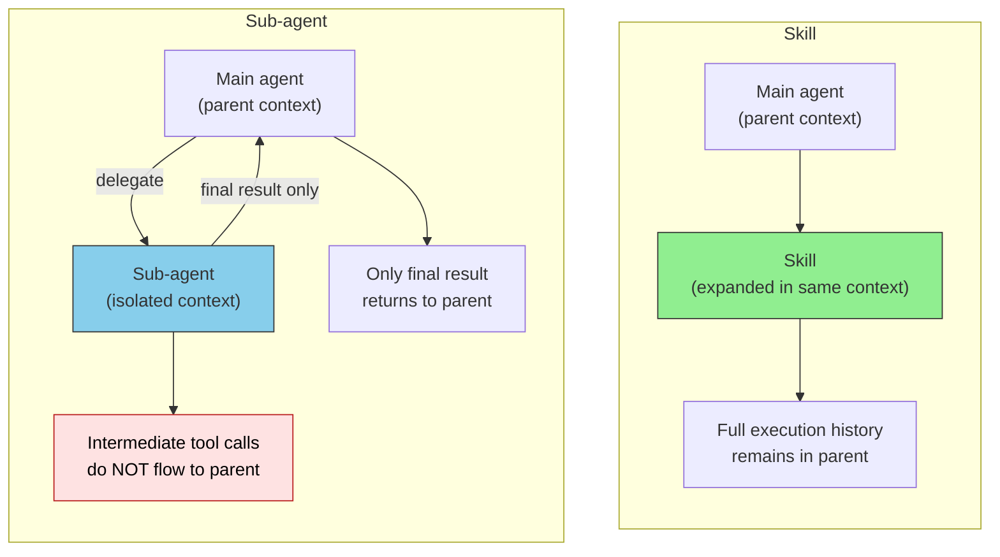
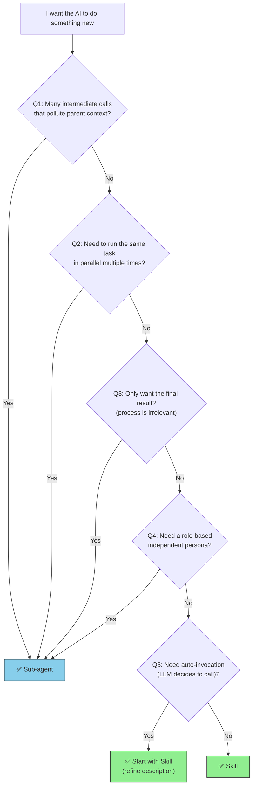
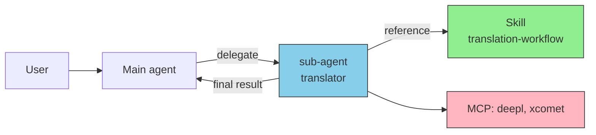

# Sub-agent vs Skills — Selection Criteria and Composition Patterns

> A guide to deciding "is a Skill enough, or do I need a sub-agent?" The two are complementary. The design question is not **which to choose**, but **where to draw the line**.

## About This Document

Sub-agents and Skills are often **combined**, not picked exclusively. But in practice, two anti-patterns are common: "building a sub-agent when a Skill would suffice" and "muscling through with a Skill when a sub-agent is required." This page focuses on selection and composition.

> [!TIP] Answered in 3 lines
> - **Skill** = an instruction sheet for "how to do something" (executed inside the parent context)
> - **Sub-agent** = a "specialist" launched in a separate context (intermediate results do not flow back to the parent)
> - **Run the same procedure in an isolated context, in parallel, or want only the final result** → sub-agent. Otherwise, start with a Skill.

Related: [What is a Custom Sub-agent](./what-is-subagent) / [Agent Taxonomy](./agent-taxonomy) / [What is Skills](../skills/what-is-skills) / [MCP vs Skills FAQ](../faq/mcp-vs-skills)

## The Essential Difference



The crux is whether **the context is separated or not**.

| Aspect | Skill | Sub-agent |
| --- | --- | --- |
| Definition unit | `.claude/skills/*/SKILL.md` | `.claude/agents/*.md` |
| Execution context | **Same as parent** | **Isolated** |
| Intermediate calls' effect on parent | Present (consumes parent context) | None (isolated) |
| Final output | Full history visible | Final output only |
| Parallel execution | Not possible (sequential expansion) | Possible (multiple instances at once) |
| Startup cost | Low (just Markdown loading) | Medium (launch separate session) |
| Host dependency | Medium (common spec across major tools) | High (mostly Claude Code-specific) |

> [!IMPORTANT]
> **A sub-agent is not "a more powerful Skill."** The essential difference is **whether context boundaries exist**, not feature superiority.

## Decision Flow (5 Questions)

Answer top-down; commit at the first **Yes**.



Why each question:

| Question | Rationale |
| --- | --- |
| **Q1: Many intermediate calls?** | Exploratory tool calls (e.g., codebase-wide search) generate hundreds to thousands of tokens of intermediate output. Letting them flow into the parent raises Context Rot risk → sub-agent |
| **Q2: Parallel execution?** | Skills can only expand sequentially. Anthropic Multi-Agent Research has a lead launching 3–5 sub-agents in parallel → sub-agent |
| **Q3: Final result only?** | "I just want the PR review conclusion" / "I just want the translation output" — raw intermediate data is not needed → sub-agent |
| **Q4: Role / persona?** | "As a security auditor" / "As a translator" — when role fixation directly affects quality → sub-agent (system prompt is isolated) |
| **Q5: Otherwise** | Simple template expansion, judgment criteria, conventions — **start with a Skill**. Promote later if needed |

## Same Goal, Different Mechanism

For the same goal — "have the AI do code review" — the Skill version and the sub-agent version differ sharply.

### Skill Version

```markdown
<!-- .claude/skills/code-review/SKILL.md -->
---
name: code-review
description: Teach the AI code review criteria
---

Review code from these angles:
1. Naming conventions (camelCase / PascalCase)
2. Missing error handling
3. Test coverage
4. Security (SQL injection, XSS)
```

- **Behavior**: User invokes via `/code-review`, or LLM auto-loads
- **Context**: Expanded in the parent context
- **Outcome**: The full process of reading code, applying criteria, generating comments stays in the parent

### Sub-agent Version

```markdown
<!-- .claude/agents/code-reviewer.md -->
---
name: code-reviewer
description: Code review specialist. Reviews from an objective, strict perspective
tools: Read, Grep, Bash
model: sonnet
---

You are a code review specialist.
Review from an independent stance, return organized comments by category.
Do not output intermediate results; return only the final review comments.
```

- **Behavior**: Parent agent invokes via `Agent(subagent_type="code-reviewer", ...)`
- **Context**: Isolated. File exploration and grep results do not flow to the parent
- **Outcome**: Parent receives only the formatted review comments

| Difference | Skill | Sub-agent |
| --- | --- | --- |
| Parent context consumption | Full process accumulates | Final output only |
| Objectivity | May be biased by parent's flow | Executes as independent persona |
| Parallel review | Not possible (sequential) | Possible (multiple files in parallel) |

> [!TIP]
> When **objectivity** is a requirement, sub-agents have the advantage. If the parent agent has just written code and is asked to review, the Skill version risks "being lenient on its own code."

## Anti-patterns

### ❌ Building a sub-agent when a Skill suffices

- Simple template expansion or naming-convention teaching gains little from sub-agentification
- The sub-agent's startup cost (separate session init) becomes net overhead
- **Rule of thumb**: If processing does not pollute the parent context by more than 1,000 tokens, a Skill is enough

### ❌ Muscling through with a Skill when a sub-agent is required

- Running "explore the entire codebase to find all impacts" as a Skill explodes the parent context
- Sequential expansion inflates latency when parallelism is needed
- **Signals**: Parent context inflates rapidly / the same investigation must run in multiple places concurrently

### ❌ Trying to launch a sub-agent from within a sub-agent

- Current Claude Code spec: **sub-agents cannot invoke other sub-agents**
- When nesting is needed, the parent agent must act as the Orchestrator
- See [What is a Custom Sub-agent / Important Constraints](./what-is-subagent)

## Composition Patterns

Sub-agents and Skills **coexist**. Three common combinations:

### Pattern 1: Skill = procedure, sub-agent = executor

The most standard combo. The Skill defines "what to do"; the sub-agent "executes as a specialist."



Example: translation workflow
- Skill `translation-workflow` defines "translate → quality evaluation → revision → re-evaluation"
- Sub-agent `translator` executes while referencing the Skill
- Parent receives only the result

### Pattern 2: Skill = criteria, sub-agent = validator

Write the "pass criteria" in a Skill; have the sub-agent evaluate objectively. The archetypical quality gate. See [Using sub-agents as quality gates](./subagent-quality-gate).

### Pattern 3: Skill alone / sub-agent alone

Often the right choice is to **not combine**.

- **Skill only**: coding conventions, document templates, naming rules
- **Sub-agent only**: exploratory codebase-wide investigation, lightweight one-shot tasks

> [!IMPORTANT]
> **You do not need to apply the 3-layer combo (Skill + sub-agent + MCP) everywhere.** Use only the layers each task needs — that yields better maintainability.

## When to Promote — Skill → Sub-agent

Start with a Skill, promote to a sub-agent later when warranted. Promotion signals:

- ✅ Each invocation of the Skill inflates the parent context noticeably
- ✅ The Skill calls external tools 5+ times
- ✅ A new requirement to "run 3 instances in parallel" appears
- ✅ Role-based objectivity (review, validation) starts driving quality
- ✅ The Skill's system-prompt-like section grows large enough that it deserves an independent persona

> [!TIP]
> Even after promotion, **the Skill can stay**. Reference the Skill from the sub-agent (Pattern 1) to avoid duplicating logic.

## Related Documents

- [What is a Custom Sub-agent](./what-is-subagent) — Basic concept and definition
- [Agent Taxonomy](./agent-taxonomy) — Organizing custom agents / sub-agents / meta-agents
- [Using sub-agents as quality gates](./subagent-quality-gate) — Deep dive into the Validator pattern
- [What is Skills](../skills/what-is-skills) — Basic Skill concept
- [MCP vs Skills](../skills/vs-mcp) — Selection vs MCP
- [Agent / Sub-agent / Skill / MCP comparison FAQ](../faq/agent-vs-subagent-vs-skill) — 3-line answer

## 🔗 Deeper: Why "isolated context" works

This page covers the **selection (what/how)** between sub-agents and Skills. For **why** isolated context mitigates Context Rot — grounded in LLM structural constraints — see the sister site.

- [understanding-llm / Part 5: On-Demand Context (Skills & Agents)](https://shuji-bonji.github.io/understanding-llm-through-claude-code/05-on-demand-context/) — Role separation between Skills and Agents, and Context Rot mitigation
- [understanding-llm / Part 10: Multi-Session Coordination (Subagent vs Team)](https://shuji-bonji.github.io/understanding-llm-through-claude-code/10-multi-session/subagent-vs-team) — Scaling beyond sub-agents

---

> **Previous**: [What is a Custom Sub-agent](./what-is-subagent)

> **Next**: [Using sub-agents as quality gates](./subagent-quality-gate)
