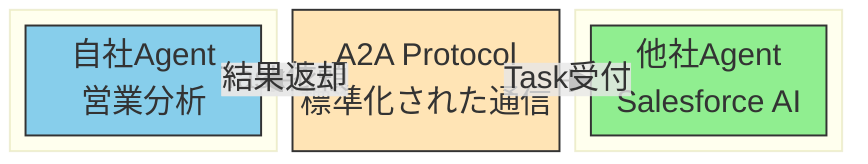
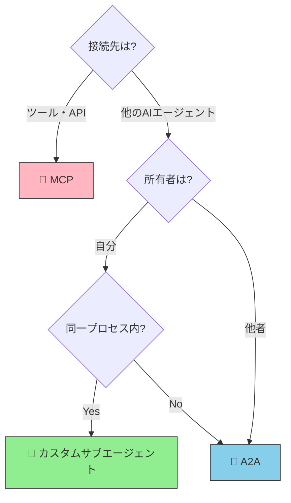

# A2A（Agent-to-Agent Protocol）とは何か

> エージェント同士がネットワーク越しに協調・委譲するための通信プロトコル

## このドキュメントについて

A2Aの基本概念、MCPとの違い、メリット・デメリット、将来展望を解説する。サブエージェントとの違いは [what-is-subagent.md](./what-is-subagent.md) も参照してください。

## A2Aとは何か

**A2A（Agent-to-Agent Protocol）** は、異なるAIエージェント同士がネットワーク越しに対等な関係で通信・協調するためのオープン標準プロトコルです。

### 背景と主導者

A2Aの誕生と標準化の経緯を以下にまとめる。

- **Google が主導** して 2025年4月に発表
- その後、**Linux Foundation** に移管され、オープン標準化される予定
- MCPと同じく、エージェント経済圏の基盤となるプロトコルとして位置づけられている

### A2A の本質

A2Aの最大の特徴は、**エージェント ↔ エージェント** の対等な通信を実現することです。

- **MCP**: AIエージェント ↔ **ツール/API** の接続（マスター・スレーブ関係）
- **A2A**: AIエージェント ↔ **AIエージェント** の接続（対等な関係）

### 一言で言うと

「異なるAIエージェントが互いに仕事を依頼し合うためのプロトコル」

### アーキテクチャモデル

エージェント開発の三層構造:

- **Build with ADK**: エージェント自体を構築
- **Equip with MCP**: ツール・APIを接続
- **Communicate with A2A**: 他のエージェントと通信

## なぜA2Aが必要か

### 現状の課題

AIエージェント技術が急速に進化する中で、各企業・組織は独自のエージェントを開発・運用しています。しかし、これらのエージェント間には標準的な通信手段がありません。

#### サイロ化の問題

- 自社の営業分析エージェント → Salesforceの AI Agent に問い合わせたい
- しかし、標準的な通信プロトコルがない
- MCP では「エージェント ↔ ツール」の接続は可能だが、「エージェント ↔ エージェント」は想定されていない
- 結果として、**エージェント同士が孤立**し、企業間の連携が困難

### A2A登場前後での変化

#### A2A以前

- エージェント間通信は各社が独自実装（API連携等）
- 標準がないため、連携ごとに仕様調整が必要
- スケーラブルでない

#### A2A以後

- 標準化されたプロトコルでエージェント間通信が可能
- 認証・認可・信頼モデルが統一される
- 異なる組織のエージェント同士でも連携可能

### 通信フロー図

異なる組織のエージェント同士がA2Aプロトコルを介して通信する基本的なフローを以下に示す。

## MCPとの根本的な違い

A2AとMCPは両方とも「接続」を実現するプロトコルですが、**接続先が根本的に異なります**。以下の比較表で違いを整理します。

### 機能比較表

MCPとA2Aの違いを以下の表で整理する。

| 項目                 | MCP                            | A2A                                |
| -------------------- | ------------------------------ | ---------------------------------- |
| **主導者**           | Anthropic                      | Google → Linux Foundation          |
| **目的**             | エージェント ↔ **ツール**      | エージェント ↔ **エージェント**    |
| **接続先**           | MCPサーバー（自分が管理）      | 他のエージェント（**他者含む**）   |
| **通信モデル**       | マスター・スレーブ（AIが指示） | **対等**（双方が依頼可能）         |
| **コンテキスト共有** | 親エージェントと共有可能       | **完全分離**（不透明な相手を想定） |
| **所有者**           | 自分                           | 自分 or **他者**                   |
| **信頼モデル**       | 暗黙的信頼                     | **認証・認可が必須**               |

### どれを選ぶべき？ - 決定フローチャート

MCP・A2A・カスタムサブエージェントの3つから適切な選択肢を判断するためのフローチャートを以下に示す。

## A2Aの主要概念

A2A で重要な概念は3つです。

### 1. Agent Card（エージェントカード）

エージェントの「自己紹介カード」です。他のエージェントや発見システムが、あるエージェントが何をできるのかを理解するための情報を提供します。

**形式**: JSON形式

**含まれる情報**:

- エージェント名・説明
- 提供できるCapabilities（機能）
- 認証方法
- サポートするA2Aバージョン
- エンドポイント

**配置**: `/.well-known/agent.json` に配置され、ディスカバリーが可能

### 2. Task（タスク）

エージェント間で依頼する「作業単位」です。一度のやり取りで完結しない長時間のタスクにも対応します。

**ライフサイクル**:

- `submitted`: タスク受け取り直後
- `working`: 処理中
- `input-required`: 追加情報が必要
- `completed`: 成功
- `failed`: 失敗

**特徴**:

- 非同期実行
- 長時間タスク対応
- ポーリングまたはコールバック機構

### 3. Artifact（成果物）

Taskの実行結果として生成されるデータです。テキストに限らず、ファイルや構造化データも含まれます。

**対応フォーマット**:

- テキスト（plain text、markdown等）
- ファイル（PDF、画像、など）
- 構造化データ（JSON、XML等）
- マルチモーダル（画像、音声も想定）

## A2Aのメリット

A2Aを採用することで、以下のメリットが得られる。

### ✅ 組織間連携の標準化

異なる組織のエージェント同士が、標準的なプロトコルで通信できます。これまでの「企業ごとのカスタム連携」から「標準ベースの連携」へシフトします。

### ✅ エージェント専門化と協業

各エージェントが得意分野に特化し、複雑なタスクは複数エージェントの協力で処理します。

例えば、

- 営業Agent ← 市場分析Agentから予測データを取得
- 営業Agent ← CRMAgentから顧客情報を取得

### ✅ マルチモーダル対応

テキストだけでなく、画像・音声・ファイルなど多様なフォーマットでの情報受け渡しが可能です。

### ✅ 非同期処理対応

レポート生成のような長時間タスクをバックグラウンドで実行し、結果を後から取得できます。

### ✅ ベンダー非依存性

Linux Foundationによるオープン標準なので、特定のベンダーに依存しません。

## A2Aのデメリット・課題

一方で、A2Aにはまだ克服すべき課題もある。

### ❌ 実装複雑性

認証・認可・暗号化の実装が必須です。MCPより要件が厳しくなります。

### ❌ ネットワーク依存

ネットワーク遅延、接続断等の問題に対応する必要があります。タイムアウト設定やリトライロジックの実装も必須です。

### ❌ デバッグが困難

エージェント間の通信トレースが複雑になり、問題の切り分けが難しくなります。ロギング戦略が重要です。

### ❌ 成熟度がまだ低い

MCP（2024年11月リリース）と比べても、A2Aはさらに新しい仕様です。実装パターンや運用ノウハウがまだ少ない状態です。

### ❌ エコシステムが発展途上

対応するエージェントやツールが限定的です。多くのエージェントがA2Aに対応するまで時間がかかると予想されます。

### ❌ 信頼の問題

他者が所有するエージェントの品質・セキュリティを完全に保証できません。不正なエージェントによる悪用のリスク等も考慮が必要です。

## サブエージェントとの使い分け

自分が管理するエージェント同士の連携には「カスタムサブエージェント」、他組織含む外部エージェントとの連携には「A2A」を使い分けます。

### 比較表

カスタムサブエージェントとA2Aエージェントの違いを以下に整理する。

| 観点               | カスタムサブエージェント | A2Aエージェント  |
| ------------------ | ------------------------ | ---------------- |
| **所在**           | 同一プロセス内           | ネットワーク越し |
| **所有者**         | 自分                     | 自分 or 他者     |
| **信頼関係**       | 完全信頼                 | 認証・認可が必要 |
| **コンテキスト**   | 親と一部共有             | 完全分離         |
| **ライフサイクル** | セッション限り           | 永続的サービス   |

### 比喩で理解する

- **サブエージェント** = 「社内の専門部署」
  - 同じ建物（プロセス）内にいる
  - 上司（親エージェント）の監督下
  - 完全に信頼できる

- **A2Aエージェント** = 「外注先・パートナー企業」
  - 別の拠点（別プロセス）にいる
  - ネットワークで通信
  - 契約（認証・認可）に基づく関係

### 代替関係ではなく補完関係

サブエージェントとA2Aエージェントは競合ではなく、補完関係です。多くのシステムでは、両方を組み合わせて使用します。

- 社内タスク分解 → **カスタムサブエージェント**
- 社外リソース活用 → **A2Aエージェント**

## 現状の成熟度と将来展望

### タイムライン

MCPとA2Aの登場から現在に至るまでの主要な出来事を時系列で整理する。

- **2024年11月**: Anthropic が MCP をリリース
- **2025年4月**: Google が A2A を発表
- **2025年**: Linux Foundation へ移管予定
- **2025年〜2026年**: エコシステム発展期

### 現時点での位置づけ

このリポジトリの [03-architecture.md](../concepts/03-architecture.md) に、A2Aのアーキテクチャ上の位置づけを記載しています。

### 将来予想

現時点ではA2Aの実装例はまだ少ないですが、以下のシナリオが予想されます。

1. **初期段階（2025年）**: 大規模プレイヤーがA2A対応を開始
2. **拡大段階（2025〜2026年）**: 中堅企業も対応し始める
3. **成熟段階（2026年以降）**: MCP + A2Aの併用が標準化

### 推奨アーキテクチャ

**Build with ADK, equip with MCP, communicate with A2A**

このモデルが、今後のエージェント開発の標準になると考えられます。

## 次に読むべきドキュメント

A2Aをより深く理解するために、以下のドキュメントをご参照ください。

| 目的                   | ドキュメント                                         |
| ---------------------- | ---------------------------------------------------- |
| サブエージェントの詳細 | [what-is-subagent.md](./what-is-subagent.md)         |
| MCPの詳細              | [what-is-mcp.md](../mcp/what-is-mcp.md)              |
| 全体アーキテクチャ     | [03-architecture.md](../concepts/03-architecture.md) |
| Skillsについて         | [what-is-skills.md](../skills/what-is-skills.md)     |

**最終更新**: 2025年4月
**ステータス**: 初版（A2A仕様発表直後）
