# A2A (Agent-to-Agent Protocol): What is it?

> An open standard protocol enabling agents to collaborate and delegate tasks over networks

## About This Document

This document explains A2A's core concepts, key differences from MCP, benefits and challenges, and future outlook. For detailed comparison with sub-agents, also refer to [what-is-subagent.md](./what-is-subagent.md).

## What is A2A?

**A2A (Agent-to-Agent Protocol)** is an open standard protocol that enables different AI agents to communicate and collaborate in peer-to-peer relationships over networks.

### Background and Leadership

Here is a brief history of A2A's origins and standardization.

- **Google led** the effort, announcing A2A in April 2025
- Subsequently, **Linux Foundation** will take over stewardship for open standardization
- Like MCP, it is positioned as foundational infrastructure for the agent economy

### The Essence of A2A

A2A's defining characteristic is enabling **agent ↔ agent** peer communication:

- **MCP**: AI agent ↔ **tools/APIs** (master-slave relationship)
- **A2A**: AI agent ↔ **AI agent** (peer relationship)

### In One Sentence

"A protocol allowing different AI agents to request work from each other"

### Architectural Model

Three-layer structure for agent development:

- **Build with ADK**: Construct the agent itself
- **Equip with MCP**: Connect tools and APIs
- **Communicate with A2A**: Communicate with other agents

## Why A2A?

### Current Challenges

As AI agent technology evolves rapidly, companies and organizations develop and operate their own agents. However, there is no standard communication mechanism between these agents.

**The Silo Problem**:

- Internal Sales Analysis Agent → wants to query Salesforce AI Agent
- But there's no standard communication protocol
- MCP enables "agent ↔ tools" but not "agent ↔ agent"
- Result: **agents operate in isolation**, making cross-organization collaboration difficult

### Before and After A2A

**Before A2A**:

- Agent-to-agent communication handled by custom implementations (API integration, etc.)
- Without standards, each integration requires custom specification negotiation
- Not scalable

**After A2A**:

- Standardized protocol enables agent-to-agent communication
- Authentication, authorization, and trust models are unified
- Agents from different organizations can collaborate seamlessly

### Communication Flow

The diagram below illustrates the basic flow of agents from different organizations communicating via the A2A protocol.

## Fundamental Differences from MCP

While both A2A and MCP enable "connections," their **connection targets are fundamentally different**. The comparison table below clarifies the distinctions.

### Feature Comparison

The following table contrasts MCP and A2A.

| Aspect                  | MCP                          | A2A                                           |
| ----------------------- | ---------------------------- | --------------------------------------------- |
| **Led by**              | Anthropic                    | Google → Linux Foundation                     |
| **Purpose**             | Agent ↔ **Tools**            | Agent ↔ **Agent**                             |
| **Connection Target**   | MCP servers (you manage)     | Other agents (**including external parties**) |
| **Communication Model** | Master-Slave (agent directs) | **Peer-to-peer** (both can request)           |
| **Context Sharing**     | Shareable with parent agent  | **Fully isolated** (expects opaque parties)   |
| **Owner**               | Self                         | Self or **others**                            |
| **Trust Model**         | Implicit trust               | **Authentication/authorization required**     |

### Decision Flowchart: Which Should You Choose?

Use the following flowchart to determine the right choice among MCP, A2A, and custom sub-agents.

```mermaid
flowchart TD
    Q1{What's the target?}
    Q1 -->|Tools/APIs| MCP["🔧 MCP"]
    Q1 -->|Other AI Agents| Q2{Who owns it?}
    Q2 -->|Self| Q3{Same process?}
    Q2 -->|Others| A2A["🤝 A2A"]
    Q3 -->|Yes| SUB["👥 Custom Sub-agent"]
    Q3 -->|No| A2A

    style MCP fill:#FFB6C1,color:#333,stroke:#333
    style A2A fill:#87CEEB,color:#333,stroke:#333
    style SUB fill:#90EE90,color:#333,stroke:#333
```

## Core Concepts of A2A

Three key concepts are essential in A2A.

### 1. Agent Card

An agent's "self-introduction card" that provides information helping other agents and discovery systems understand what capabilities an agent offers.

**Format**: JSON

**Included Information**:

- Agent name and description
- Supported Capabilities
- Authentication method
- Supported A2A versions
- Endpoint information

**Location**: Discoverable via `/.well-known/agent.json`

### 2. Task

A "unit of work" agents request from each other. Handles both brief interactions and extended processes.

**Lifecycle**:

- `submitted`: Immediately after task receipt
- `working`: Processing
- `input-required`: Additional information needed
- `completed`: Success
- `failed`: Failure

**Characteristics**:

- Asynchronous execution
- Long-running task support
- Polling or callback mechanisms

### 3. Artifact

Data generated as a task execution result. Not limited to text—includes files and structured data.

**Supported Formats**:

- Text (plain text, markdown, etc.)
- Files (PDF, images, etc.)
- Structured data (JSON, XML, etc.)
- Multimodal (images, audio anticipated)

## Benefits of A2A

Adopting A2A provides the following advantages.

### ✅ Standardized Cross-Organization Collaboration

Agents from different organizations can communicate via a standard protocol. This marks a shift from "custom per-company integration" to "standards-based collaboration."

### ✅ Agent Specialization and Cooperation

Each agent can specialize in its domain, while complex tasks benefit from multi-agent collaboration. For example:

- Sales Agent ← retrieves forecast data from Market Analysis Agent
- Sales Agent ← retrieves customer info from CRM Agent

### ✅ Multimodal Support

Information exchange isn't limited to text—images, audio, and files enable richer communication.

### ✅ Asynchronous Task Support

Long-running operations like report generation can execute in the background, with results retrieved later.

### ✅ Vendor Independence

As an open standard under Linux Foundation stewardship, there's no vendor lock-in.

## Drawbacks and Challenges

A2A also comes with challenges that remain to be addressed.

### ❌ Implementation Complexity

Authentication, authorization, and encryption are mandatory—requirements stricter than MCP.

### ❌ Network Dependency

Requires handling network latency, connection dropouts, and other failures. Timeout configuration and retry logic are essential.

### ❌ Debugging Difficulty

Tracing inter-agent communication is complex, making troubleshooting challenging. Logging strategy is critical.

### ❌ Maturity is Still Low

Compared to MCP (released November 2024), A2A is even newer. Implementation patterns and operational best practices remain limited.

### ❌ Nascent Ecosystem

Only a limited number of agents and tools support A2A yet. Broader adoption will take time.

### ❌ Trust Challenges

You cannot fully guarantee the quality or security of agents owned by others. Risks of misuse by malicious agents must be considered.

## Choosing Between Sub-agents and A2A

For collaboration between agents you manage, use "custom sub-agents." For external agent collaboration including other organizations, use "A2A."

### Comparison

The following table contrasts custom sub-agents with A2A agents.

| Dimension              | Custom Sub-agent             | A2A Agent                             |
| ---------------------- | ---------------------------- | ------------------------------------- |
| **Location**           | Within same process          | Over the network                      |
| **Owner**              | Self                         | Self or others                        |
| **Trust Relationship** | Full trust                   | Authentication/authorization required |
| **Context**            | Partially shared with parent | Fully isolated                        |
| **Lifecycle**          | Session-scoped               | Persistent service                    |

### Understanding via Metaphor

- **Sub-agents** = "In-house specialist department"
  - Located in the same building (process)
  - Under supervisor (parent agent) oversight
  - Fully trustworthy

- **A2A agents** = "Outsourced partner / vendor"
  - Located at separate facilities (separate processes)
  - Communicate over networks
  - Relationship based on contracts (authentication/authorization)

### Complementary, Not Competing

Sub-agents and A2A agents don't compete—they complement each other. Most systems use both:

- Internal task decomposition → **Custom sub-agents**
- External resource utilization → **A2A agents**

## Current Maturity and Future Outlook

### Timeline

Key milestones from the emergence of MCP and A2A to the present.

- **November 2024**: Anthropic releases MCP
- **April 2025**: Google announces A2A
- **2025**: Migration to Linux Foundation planned
- **2025–2026**: Ecosystem development phase

### Current Status

The [03-architecture.md](../concepts/03-architecture.md) document in this repository describes A2A's architectural positioning.

### Future Projections

While A2A implementations remain limited, these scenarios are anticipated:

1. **Early Stage (2025)**: Major players begin A2A support
2. **Growth Stage (2025–2026)**: Mid-market companies start adopting
3. **Maturity Stage (2026+)**: MCP + A2A combined use becomes standard

### Recommended Architecture

**Build with ADK, equip with MCP, communicate with A2A**

This model is expected to become the standard for future agent development.

## What to Read Next

Explore these documents to deepen your A2A understanding:

| Purpose              | Document                                             |
| -------------------- | ---------------------------------------------------- |
| Sub-agent details    | [what-is-subagent.md](./what-is-subagent.md)         |
| MCP details          | [what-is-mcp.md](../mcp/what-is-mcp.md)              |
| Overall architecture | [03-architecture.md](../concepts/03-architecture.md) |
| About Skills         | [what-is-skills.md](../skills/what-is-skills.md)     |

**Last Updated**: April 2025
**Status**: Initial Release (Post A2A Announcement)
