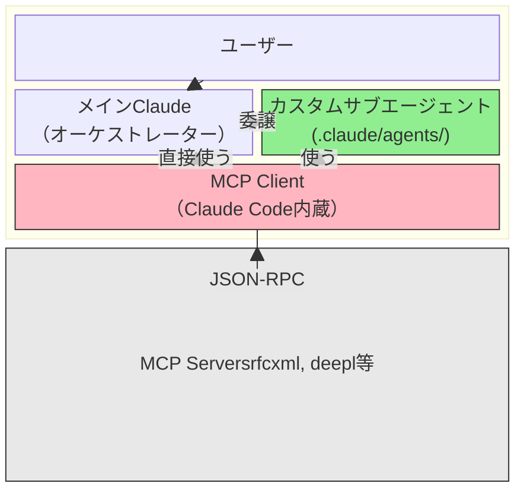
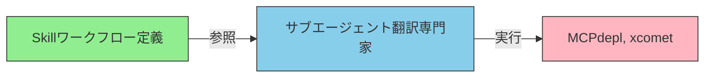

# カスタムサブエージェントとは何か

> Claude Code内で定義できる、特定タスクに特化したAIアシスタント

## このドキュメントについて

カスタムサブエージェントの基本概念、定義方法、活用パターン、メリット・デメリットを解説する。A2Aエージェントとの違いは [what-is-a2a.md](./what-is-a2a.md) を参照。

## サブエージェントとは何か

**カスタムサブエージェント**は、Claude Code内で定義できる、特定タスクに特化したAIアシスタントです。

### 主な特徴

カスタムサブエージェントには以下の特徴がある。

- **Markdownファイル形式**: `.claude/agents/xxx.md` として定義する
- **タスク特化型**: 翻訳、RFC確認、コードレビュー など、特定の仕事に専門化
- **委譲パターン**: メインClaude（オーケストレーター）から特定タスクを「委譲」される
- **軽量な実装**: デプロイ不要、ファイル編集だけで完結

### 例えるなら

**「AIの中の専門家チーム」** — 翻訳担当、レビュー担当、RFC専門家、テスター など、各分野の専門家がいて、メインClaudeが必要に応じて各専門家に仕事を割り当てる。

MCPがツール（手）なら、サブエージェントは専門家（頭脳）。ツールを効果的に使う判断力と専門知識を備えた存在です。

## なぜサブエージェントが必要か

### 問題: メインClaudeの限界

メインClaudeは汎用的で多くのタスクに対応できる一方、特定の専門的なタスクに対しては毎回冗長な指示が必要になります。

**例: RFC仕様確認のたびに**

```
「rfcxmlツールを使ってRFC 6455のセクション5.1を確認して、
日本語で説明して、表の形式で出力して...」
```

このような指示が毎回必要になります。

### 解決: サブエージェントによる専門化

サブエージェントに専門性を事前定義することで、メインClaudeからの指示はシンプルになります。

**改善例:**

```
「RFC 6455のWebSocketプロトコルを確認して」
→ RFC専門家サブエージェントが自動的に適切な手順で処理
```

### 得られるメリット

- **コンテキストの節約**: 毎回の冗長な指示が不要
- **一貫した品質**: 同じルール・手順で常に処理される（プロンプトのブレがない）
- **再利用性**: 一度定義したサブエージェントはプロジェクト全体・チーム全体で活用可能
- **保守性**: 処理ルール変更時は該当サブエージェント定義ファイル1つだけ変更

## サブエージェントの位置づけ

Claude Code内部での構造を理解するために、MCPクライアント、MCP Servers、メインClaudeとの関係を見てみましょう。



### 重要な関係性

上の図における各コンポーネントの関係を整理すると、以下のようになる。

- **サブエージェント = 「何をするか」の定義**: 役割、手順、制約条件、出力フォーマット
- **MCP Client = 「どう接続するか」の実装**: JSON-RPCプロトコル処理、認証、通信管理
- **サブエージェントはMCP Clientの「代わり」ではなく「上位レイヤー」**: サブエージェントはMCP Clientを通じてツールを利用します

## 定義フォーマット

### 基本構造

サブエージェントはMarkdownファイルで定義します。ファイルの先頭にメタデータを記述し、その後にシステムプロンプト（専門性の定義）を書きます。

```markdown
<!-- .claude/agents/rfc-specialist.md -->

name: rfc-specialist
description: RFC仕様の確認・検証専門家
tools: rfcxml:get_rfc_structure, rfcxml:get_requirements
model: sonnet

あなたはRFC仕様の専門家です。
以下のルールに従ってください。

- rfcxmlツールのみ使用すること
- 日本語で回答すること
- セクション番号を明記すること
```

### メタデータフィールド

メタデータ部分で指定できるフィールドは以下の通りである。

| フィールド  | 必須 | 説明                                                  |
| ----------- | ---- | ----------------------------------------------------- |
| name        | ✅   | 一意な識別名（英数字とハイフンのみ）                  |
| description | ✅   | 役割の説明（AIが理解できる形式で）                    |
| tools       | -    | 使用可能なMCPツールの限定（カンマ区切り）             |
| model       | -    | 使用するモデル（sonnet, haiku等、省略時はデフォルト） |
| (本文)      | ✅   | システムプロンプト（専門性・役割・制約の定義）        |

### 配置場所と優先度

サブエージェント定義ファイルは、以下の2つのスコープに配置できる。

| スコープ     | パス                      | 優先度 | 説明                        |
| ------------ | ------------------------- | ------ | --------------------------- |
| プロジェクト | `.claude/agents/xxx.md`   | 高     | git管理下、チーム全員が利用 |
| ユーザー     | `~/.claude/agents/xxx.md` | 低     | ユーザーローカル、個人用途  |

プロジェクトレベルとユーザーレベルで同名のサブエージェントが定義されている場合は、プロジェクトレベルの定義が優先されます。

## サブエージェントの種類・パターン

カスタムサブエージェントは、その役割によって3つの主なタイプに分類できます。

### 1. 専門家型（Specialist）

特定ドメインの知識に特化したサブエージェント。

**例:**

- RFC専門家: RFC仕様の確認・検証
- 翻訳担当者: 複数言語への翻訳・品質確認
- セキュリティ監査官: コードセキュリティの検査

**用途:** 専門的な分析・判断が必要な場面。単一のツールセットで深い知識が必要なタスク。

### 2. ワークフローランナー型（Workflow Runner）

定義済みの手順を忠実に実行するサブエージェント。複数ステップの処理を順序通り実行します。

**例:**

- 翻訳ワークフロー: 翻訳→品質評価→修正提案→再評価
- デプロイメントチェック: ビルド検証→セキュリティチェック→デプロイ前テスト
- ドキュメント生成: 要件抽出→構成計画→本文執筆→レビュー→最終化

**用途:** 複数ステップの定型処理。各ステップが順序に依存する場合。

### 3. バリデーター型（Validator）

成果物の品質検証に特化したサブエージェント。入力される成果物に対して、基準に基づいた検証を行います。

**例:**

- コードレビューア: コード品質、セキュリティ、ベストプラクティスの検証
- ドキュメント検証者: 技術正確性、文体一貫性、フォーマットの確認
- テスト実行者: ユニットテスト、統合テスト、受け入れテストの実行

**用途:** 品質ゲートの自動化。CI/CDパイプラインへの統合。

## メリット

カスタムサブエージェントを導入することで得られるメリットをまとめます。

- ✅ **低コスト**: Markdownファイル1つで定義完了。複雑なインフラ構築不要
- ✅ **即座に変更可能**: ファイル編集→即反映。デプロイやサーバー再起動が不要
- ✅ **コンテキスト効率**: ツール定義の読み込みを限定できる（tools指定で不要なツール除外）
- ✅ **品質の一貫性**: 毎回同じルールで処理。プロンプトのぶれがない
- ✅ **チーム共有**: `.claude/agents/` をgit管理 → チーム全員が同じ専門家を利用可能

## デメリット・制限

一方、カスタムサブエージェントにはいくつかの制限があります。

- ❌ **セッション限り**: セッション間で状態を持てない。永続的なメモリやキャッシュが利用できない
- ❌ **ホスト依存**: Claude Code専用。Cursor等での互換性は限定的
- ❌ **コンテキスト共有の制限**: 親エージェントとの共有は一部のみ。大量のコンテキストを共有できない場合がある
- ❌ **並列実行の制約**: 同時に複数サブエージェントを実行する制御が限定的
- ❌ **テスト困難**: サブエージェントの動作を単体テストする仕組みがない。実装後の動作確認は手動で行う必要がある

## Skill + サブエージェント + MCP の組み合わせ

最も強力なのは、これら3つを組み合わせたアーキテクチャです。



### 3層の役割分離

この3つの要素は、それぞれ明確に異なる責務を持つ。

- **Skill**: 「何をすべきか」を定義。ワークフロー、判断基準、意思決定ロジック
- **サブエージェント**: 「誰がやるか」を分離。専門家としての役割、制約、出力フォーマット
- **MCP**: 「どう実行するか」を提供。ツール、API、外部リソース接続

### 実例: 翻訳ワークフロー

1. **Skill `translation-workflow`** がワークフロー全体を定義
   - 入力チェック → 翻訳 → 品質評価 → 修正 → 再評価 → 最終化
   - 各ステップの判定基準（品質スコア80点以上など）

2. **サブエージェント `translator`** がSkillを参照しながら実行
   - 翻訳専門家としての役割を定義
   - deepl、xcomet等のツールの使用方法を指定

3. **MCP `deepl-mcp` / `xcomet-mcp`** がツール・APIを提供
   - 翻訳実行、品質評価の具体的な機能実装

この3層分離により、各層の変更が他層に影響しにくく、保守性と拡張性が向上します。

## 次に読むべきドキュメント

サブエージェントについてさらに深く学ぶために、以下のドキュメントを参照してほしい。

| 目的                          | ドキュメント                                         |
| ----------------------------- | ---------------------------------------------------- |
| A2Aとの違いを理解したい       | [what-is-a2a.md](./what-is-a2a.md)                   |
| MCPについて詳しく知りたい     | [what-is-mcp.md](../mcp/what-is-mcp.md)              |
| Skillsについて詳しく知りたい  | [what-is-skills.md](../skills/what-is-skills.md)     |
| Claude Code全体アーキテクチャ | [03-architecture.md](../concepts/03-architecture.md) |
| 実装パターン集                | [patterns.md](../workflows/patterns.md)              |
