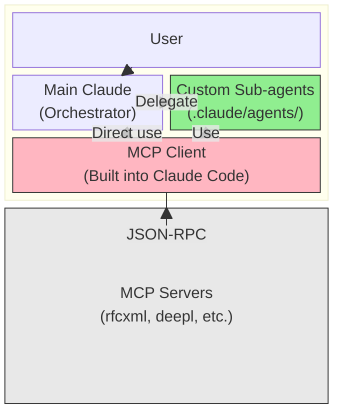
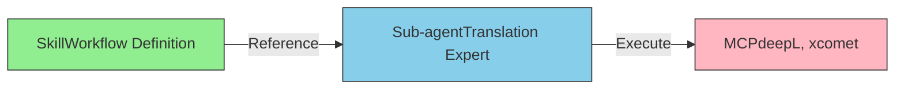

# What are Custom Sub-agents?

> Specialized AI assistants defined within Claude Code for specific tasks

## About This Document

This document explains the fundamental concepts, definition methods, use patterns, benefits, and limitations of custom sub-agents. For differences with A2A agents, see [what-is-a2a.md](./what-is-a2a.md).

## What are Sub-agents?

**Custom sub-agents** are specialized AI assistants defined within Claude Code that focus on specific tasks.

### Key Characteristics

Custom sub-agents have the following characteristics.

- **Markdown file format**: Defined as `.claude/agents/xxx.md`
- **Task-specialized**: Specialize in specific work like translation, RFC verification, code review, etc.
- **Delegation pattern**: Receive specific tasks "delegated" from the main Claude (Orchestrator)
- **Lightweight implementation**: No deployment needed—just file editing

### Think of it as

**"A team of expert specialists within AI"** — translators, reviewers, RFC experts, testers, and more. Each specialist has their domain expertise, and the main Claude delegates work to the appropriate specialist as needed.

If MCP is the tools (hands), then sub-agents are the specialists (brains). They are entities equipped with judgment and specialized knowledge to use tools effectively.

## Why Sub-agents?

### Problem: Main Claude's Limitations

While the main Claude is versatile and handles many tasks, specific expert tasks require repetitive, verbose instructions every time.

**Example: Every time RFC specifications are needed**

```
"Use the rfcxml tool to check Section 5.1 of RFC 6455,
explain in Japanese, output in table format..."
```

Such instructions become repetitive.

### Solution: Specialization Through Sub-agents

By pre-defining specialization in sub-agents, instructions from the main Claude become simpler.

**Improved example:**

```
"Check the WebSocket protocol in RFC 6455"
→ RFC expert sub-agent automatically handles with proper procedures
```

### Benefits Gained

- **Context savings**: No repetitive verbose instructions needed
- **Consistent quality**: Always processed by the same rules and procedures (no prompt drift)
- **Reusability**: Once defined, sub-agents can be used across the entire project and team
- **Maintainability**: When processing rules change, update just one sub-agent definition file

## Positioning of Sub-agents

To understand the structure within Claude Code, let's examine the relationship between MCP Client, MCP Servers, and main Claude.



### Key Relationships

The relationships between components shown in the diagram above can be summarized as follows.

- **Sub-agent = Definition of "what to do"**: Role, procedures, constraints, output format
- **MCP Client = Implementation of "how to connect"**: JSON-RPC protocol handling, authentication, communication management
- **Sub-agents are not a "replacement" for MCP Client but a "higher layer"**: Sub-agents access tools through the MCP Client

## Definition Format

### Basic Structure

Sub-agents are defined in Markdown files. Place metadata at the top of the file, followed by the system prompt (defining specialization).

```markdown
<!-- .claude/agents/rfc-specialist.md -->

name: rfc-specialist
description: RFC specification verification and validation expert
tools: rfcxml:get_rfc_structure, rfcxml:get_requirements
model: sonnet

You are an RFC specification expert.
Follow these rules:

- Use only rfcxml tools
- Answer in English
- Clearly indicate section numbers
```

### Metadata Fields

The fields available in the metadata section are as follows.

| Field       | Required | Description                                                    |
| ----------- | -------- | -------------------------------------------------------------- |
| name        | ✅       | Unique identifier (alphanumeric and hyphens only)              |
| description | ✅       | Role description (in a format AI can understand)               |
| tools       | -        | Restrict available MCP tools (comma-separated)                 |
| model       | -        | Model to use (sonnet, haiku, etc.; defaults if omitted)        |
| (body)      | ✅       | System prompt (defining specialization, role, and constraints) |

### Placement and Priority

Sub-agent definition files can be placed in two scopes.

| Scope   | Path                      | Priority | Description                      |
| ------- | ------------------------- | -------- | -------------------------------- |
| Project | `.claude/agents/xxx.md`   | High     | Under git, shared by entire team |
| User    | `~/.claude/agents/xxx.md` | Low      | User-local, personal use         |

When the same sub-agent is defined at both project and user levels, the project-level definition takes priority.

## Types and Patterns

Custom sub-agents can be classified into three main types based on their roles.

### 1. Specialist

Sub-agents specialized in knowledge of a specific domain.

**Examples:**

- RFC expert: Verify and validate RFC specifications
- Translator: Translate into multiple languages and verify quality
- Security auditor: Inspect code for security issues

**Use cases:** Situations requiring specialized analysis and judgment. Tasks needing deep knowledge within a single tool set.

### 2. Workflow Runner

Sub-agents that faithfully execute pre-defined procedures. Execute multi-step processing in order.

**Examples:**

- Translation workflow: Translate → Evaluate quality → Suggest fixes → Re-evaluate
- Deployment check: Build verification → Security check → Pre-deployment testing
- Document generation: Requirement extraction → Structure planning → Content writing → Review → Finalization

**Use cases:** Multi-step standardized processing. Cases where each step depends on the order.

### 3. Validator

Sub-agents specialized in quality validation of deliverables. Validate deliverables against defined standards.

**Examples:**

- Code reviewer: Verify code quality, security, and best practices
- Document validator: Verify technical accuracy, writing consistency, and format
- Test executor: Execute unit tests, integration tests, and acceptance tests

**Use cases:** Automated quality gates. Integration into CI/CD pipelines.

## Benefits

Benefits gained from implementing custom sub-agents:

- ✅ **Low cost**: Define with a single Markdown file. No complex infrastructure needed
- ✅ **Immediate changes**: File edit → instant effect. No deployment or server restart needed
- ✅ **Context efficiency**: Limit tool definition loading (exclude unnecessary tools via tools specification)
- ✅ **Quality consistency**: Always processed by the same rules. No prompt drift
- ✅ **Team sharing**: Place `.claude/agents/` under git → entire team uses the same specialists

## Drawbacks and Limitations

Custom sub-agents have some limitations:

- ❌ **Session-limited**: Cannot maintain state between sessions. Persistent memory and caching unavailable
- ❌ **Host-dependent**: Claude Code only. Limited compatibility with Cursor and others
- ❌ **Context sharing limitations**: Limited sharing with parent agent. Cannot share large context in some cases
- ❌ **Parallel execution constraints**: Limited control for simultaneous multi-sub-agent execution
- ❌ **Testing difficulty**: No framework for unit testing sub-agent behavior. Manual verification required after implementation

## Combining Skills + Sub-agents + MCP

The most powerful approach combines these three elements.



### Three-Layer Role Separation

Each of these three elements has a clearly distinct responsibility.

- **Skill**: Defines "what should be done". Workflows, decision criteria, decision logic
- **Sub-agent**: Separates "who does it". Role as specialist, constraints, output format
- **MCP**: Provides "how to execute". Tools, APIs, external resource connections

### Real-world Example: Translation Workflow

1. **Skill `translation-workflow`** defines the entire workflow
   - Input check → Translate → Quality evaluation → Correct → Re-evaluate → Finalize
   - Decision criteria for each step (quality score of 80 points or higher, etc.)

2. **Sub-agent `translator`** executes while referencing the Skill
   - Define role as translation expert
   - Specify how to use tools like deepL and xcomet

3. **MCP `deepl-mcp` / `xcomet-mcp`** provides tools and APIs
   - Concrete implementation of translation execution and quality evaluation

This three-layer separation minimizes the impact of changes in one layer on others, improving maintainability and extensibility.

## What to Read Next

To learn more about sub-agents and related concepts, explore the following documents.

| Purpose                          | Document                                             |
| -------------------------------- | ---------------------------------------------------- |
| Understand differences from A2A  | [what-is-a2a.md](./what-is-a2a.md)                   |
| Learn more about MCP             | [what-is-mcp.md](../mcp/what-is-mcp.md)              |
| Learn more about Skills          | [what-is-skills.md](../skills/what-is-skills.md)     |
| Claude Code overall architecture | [03-architecture.md](../concepts/03-architecture.md) |
| Implementation patterns          | [patterns.md](../workflows/patterns.md)              |
