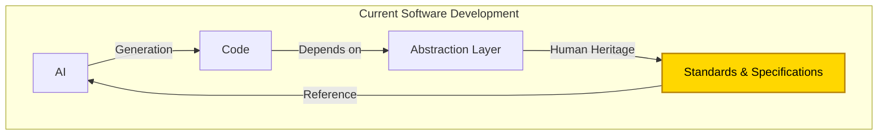
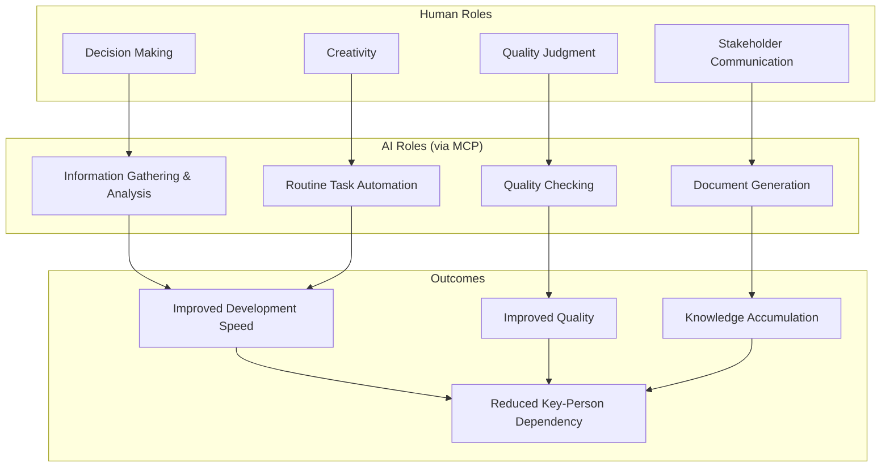
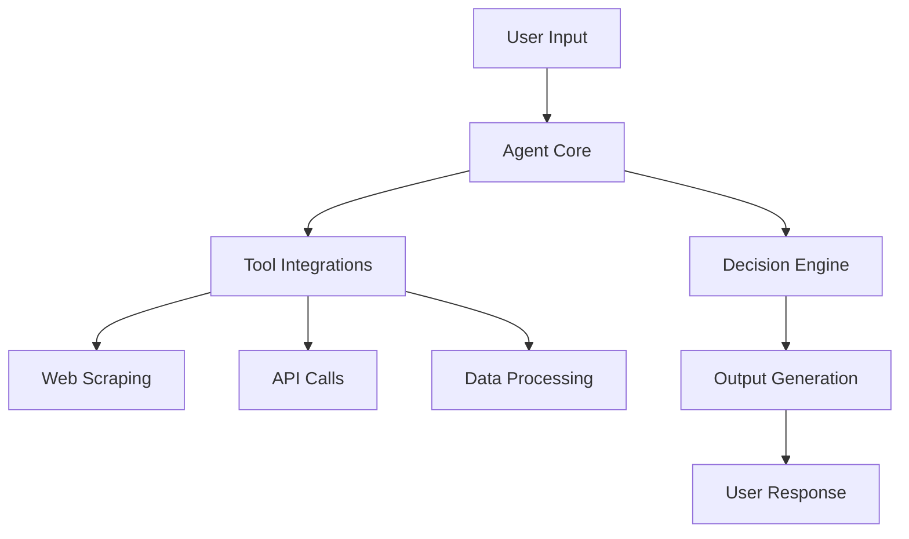
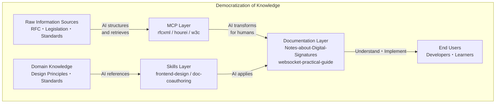

# Vision for AI-Driven Development

[日本語版 (Japanese)](/ja/concepts/01-vision)

This document outlines the philosophy underlying AI agent architecture (MCP, Skills, and Agent integration) and the fundamental approach to AI-driven development.

> The essence of AI-driven development is not just code generation, but **leveraging AI as an "intelligent assistant" throughout the entire process**, enabling humans to focus on higher-level decision-making and creativity.

## Core Understanding

### AI is "Not Omnipotent"

While AI capabilities are rapidly advancing, it is crucial to correctly recognize their limitations. To avoid over-reliance on AI and use it appropriately, we need to understand the following constraints.

AI generates outputs probabilistically from training data, but cannot guarantee the following:

| AI Limitation      | Description                                                              |
| ------------------ | ------------------------------------------------------------------------ |
| **Accuracy**       | Hallucination problem - may generate information that differs from facts |
| **Currency**       | Does not have information beyond the training data cutoff                |
| **Authority**      | Cannot guarantee official interpretation of specifications               |
| **Accountability** | Cannot provide grounds for legal or ethical judgments                    |

**Therefore, we need to connect to reliable sources.**

## The Essence of AI-Driven Development

```
AI-driven development ≠ Having AI write code
AI-driven development = Utilizing AI throughout all processes while humans focus on judgment and creativity
```

### The Reality During This Transitional Period

Until the future comes when AI (including CI/CD) can immediately output binaries and be implemented, AI-driven development will require the introduction of the engineering skills that people have cultivated up to now.

What are these necessary elements?

In other words, "AI can generate plausible outputs, but **guidelines for decision-making are needed**."

This is why **unwavering reference sources** are necessary.



## The Importance of "Unwavering Reference Sources"

### Why Reference Sources Are Needed

| AI Challenge                       | What Reference Sources Solve               |
| ---------------------------------- | ------------------------------------------ |
| Fixed point-in-time training data  | Access to authoritative up-to-date sources |
| Hallucination                      | Provision of verifiable evidence           |
| Interpretation variance by context | Consistent decision criteria               |
| Lack of latest information         | Retrieval of current specifications        |

### Two Means to Achieve "Unwavering Reference Sources"

**MCP** and **Skills** serve as means to provide AI with "unwavering reference sources."

| Means                                               | Role                                                   | Examples                                       |
| --------------------------------------------------- | ------------------------------------------------------ | ---------------------------------------------- |
| **[MCP](https://modelcontextprotocol.io/)**         | Dynamic access to external authoritative sources       | RFC, legislation, W3C standards                |
| **[Skills](https://github.com/vercel-labs/skills)** | Systematization of domain knowledge and best practices | Design principles, workflows, coding standards |

### Value of Reference MCP/Skills

1. **AI decisions become verifiable** - Can demonstrate the basis for outputs
2. **Consistent quality is ensured** - Standards-compliant outputs
3. **Vendor lock-in is avoided** - Based on open standards
4. **Access to knowledge is democratized** - Reach accurate information without being an expert
5. **Domain knowledge becomes reusable** - Formalize team know-how as Skills

## Democratization of Knowledge

### Problems with the Traditional Approach

```Mermaid
flowchart LR
    G[General Developers]
    Expert --> Books/Lectures --> G
```

- High cost
- One-way
- Language barriers

### The World MCP/Skills Enables

```Mermaid
flowchart TB
  A["External Authoritative Sources<br>(RFC/Legislation/W3C)"]
  B["Domain Knowledge <br>(Design Principles/Standards)" ]
  M["MCP-ified<br>(Dynamic Access)"]
  S["Skills-ified<br>(Systematization)"]
  K[Knowledge Accessible to Everyone]

  A --> M
  B --> S
  M --> AI
  S --> AI
  AI --> Documentation/Checklists --> K
```

**Development based on accurate information becomes possible** without relying on expensive consultants or specialists.

> For **how to distinguish between MCP and Skills**, see [skills/vs-mcp.md](../skills/vs-mcp.md).

## Human → AI (Structuring) Knowledge Transformation

Enable AI to access "unwavering reference sources."

### Structuring External Information Sources via MCP

| Human Knowledge          | Structured Format | AI-Usable Form |
| ------------------------ | ----------------- | -------------- |
| Legal text               | e-Gov API         | hourei-mcp     |
| Technical specifications | RFC XML           | rfcxml-mcp     |
| Web standards            | W3C/WHATWG        | w3c-mcp        |
| Translation rules        | Glossary          | DeepL Glossary |

### Systematizing Domain Knowledge via Skills

| Team Knowledge    | Format   | AI-Usable Form         |
| ----------------- | -------- | ---------------------- |
| Design principles | Markdown | frontend-design skill  |
| Coding standards  | Markdown | coding-standards skill |
| Workflows         | Markdown | doc-coauthoring skill  |

## AI → Human (Comprehension Support) Knowledge Transformation

Enable humans to access accurate knowledge even without being specialists.

| Complex Information Source  | AI Processing             | Human-Understandable Form      |
| --------------------------- | ------------------------- | ------------------------------ |
| RFC 3161 (135 requirements) | Extraction/Classification | Checklist                      |
| Digital Signature Law + RFC | Mapping                   | Correspondence table           |
| Technical specifications    | Visualization             | Mermaid diagrams               |
| English RFCs                | Translation               | Explanations in local language |

## Division of Roles Between Humans and AI

The diagram below illustrates how human capabilities and AI capabilities complement each other to achieve better development outcomes.



## Basic flow of MCP, Skills, and Agent

Here is the fundamental flow that shows how user input flows through the agent core and tool integrations to produce results:



This diagram illustrates a basic flow: inputs processed through an agent core, utilizing tools, and outputting results.

## Positioning of This Repository



This repository is a place to organize the design philosophy, architecture, and practical know-how of AI agent architecture (MCP, Skills, and Agent integration), and to document **strategies for building "unwavering reference sources" as the foundation of AI-driven development**.

## Core Messages

1. **AI-driven development is not just code generation** - Utilize AI throughout all processes
2. **AI needs guidelines for decision-making** - The importance of unwavering reference sources
3. **Systematize human engineering knowledge** - Formalize as MCP/Skills
4. **Standards-based MCPs are the foundation** - Democratize access to RFC, W3C, legislation, etc.
5. **Share domain knowledge via Skills** - Make team know-how reusable
6. **Bidirectional knowledge transformation** - Human→AI (structuring), AI→Human (comprehension support)
