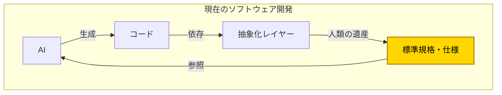
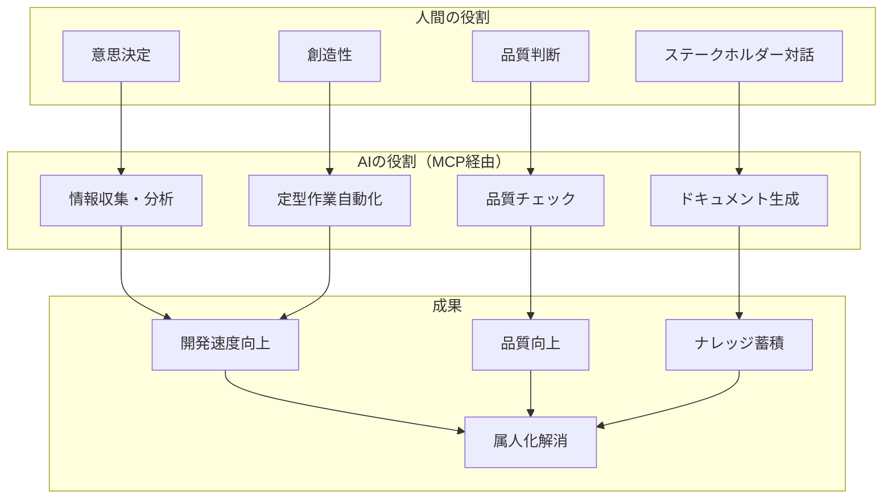
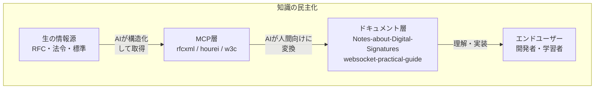

# AI駆動開発のビジョン

このドキュメントでは、MCP（Model Context Protocol）エコシステム構築の根底にある思想と、AI駆動開発に対する基本的な考え方を整理する。

> AI駆動開発の本質は、コード生成だけでなく、**全工程でAIを「知的アシスタント」として活用**し、人間はより高次の判断・創造に集中できる環境を作ることである。

## 核心的な認識

### AIは「万能ではない」

AIの能力が急速に向上している一方で、その限界を正しく認識することが重要である。AIを過信せず、適切に活用するためには、以下の制約を理解する必要がある。

AIは学習データから確率的に出力を生成するが、以下を保証できない。

| AIの限界   | 説明                                                 |
| ---------- | ---------------------------------------------------- |
| **正確性** | Hallucination問題 - 事実と異なる情報を生成する可能性 |
| **最新性** | 学習データのカットオフ以降の情報を持たない           |
| **権威性** | 仕様の正式な解釈を保証できない                       |
| **責任性** | 法的・倫理的判断の根拠を示せない                     |

**だから、信頼できるソースに接続する必要がある。**

## AI駆動開発の本質

```
AI駆動開発 ≠ AIにコードを書かせること
AI駆動開発 = 全工程でAIを活用し、人間は判断・創造に集中
```

### 過渡期における現実

現在、AIがCI/CDを含め、いきなりバイナリを出力して実装できるような未来が来るまで、**これまでの人々が培ってきたエンジニアリングの導入は不可欠**である。

その必要なものとな何か？

つまり、「AIは最もらしい生成は行なってくれるが、**判断するための指針が必要**」ということです。

そのために**ブレない参照先**が必要になる。



## 「ブレない参照先」の重要性

### なぜ参照先が必要か

| AIの課題             | 参照先が解決すること           |
| -------------------- | ------------------------------ |
| 学習データの時点固定 | 権威ある最新情報源へのアクセス |
| ハルシネーション     | 検証可能な根拠の提供           |
| 文脈による解釈のブレ | 一貫した判断基準               |
| 最新情報の欠如       | 最新仕様の取得                 |

### 参照先MCPの価値

1. **AIの判断が検証可能になる** - 出力の根拠を示せる
2. **一貫性のある品質が担保される** - 標準に準拠した出力
3. **ベンダーロックインを回避できる** - オープン標準に基づく
4. **知識へのアクセスが民主化される** - 専門家でなくても正確な情報に到達

## 知識の民主化

### 従来の問題点

```
専門家 → 書籍/講演 → 一般開発者
         ↑
    高コスト・一方通行・言語障壁
```

### MCPが実現する世界

```
標準仕様（RFC/法令/W3C）
    ↓ MCP化（構造化）
   AI
    ↓ 変換・解説
ドキュメント/チェックリスト
    ↓
誰でもアクセス可能な知識
```

高額なコンサルや専門家に頼らなくても、**正確な情報に基づいた開発ができるようになる**。

## 双方向の知識変換

### 方向1: 人間 → AI（構造化）

AIが「揺らがない参照元」にアクセスできるようにする。

| 人間の知識 | 構造化形式 | AIが使える形   |
| ---------- | ---------- | -------------- |
| 法律の条文 | e-Gov API  | hourei-mcp     |
| 技術仕様   | RFC XML    | rfcxml-mcp     |
| Web標準    | W3C/WHATWG | w3c-mcp        |
| 翻訳ルール | 用語集     | DeepL Glossary |

### 方向2: AI → 人間（理解支援）

人間が専門家でなくても正確な知識にアクセスできるようにする。

| 複雑な情報源        | AI処理     | 人間が理解できる形 |
| ------------------- | ---------- | ------------------ |
| RFC 3161（135要件） | 抽出・分類 | チェックリスト     |
| 電子署名法 + RFC    | 対応付け   | マッピング表       |
| 技術仕様            | 可視化     | Mermaid図          |
| 英語RFC             | 翻訳       | 日本語解説         |

## 人間とAIの役割分担



## このリポジトリの位置づけ



このリポジトリは、MCPエコシステムの設計思想・アーキテクチャ・実装方針を整理し、**AI駆動開発の基盤となる「ブレない参照先」の構築戦略**を記録する場所である。

## 核心メッセージ

1. **AI駆動開発はコード生成だけではない** - 全工程でAIを活用
2. **AIには判断の指針が必要** - ブレない参照先の重要性
3. **人間のエンジニアリング知識を体系化** - MCPとして形式知化
4. **標準規格MCPが基盤** - RFC, W3C, 法令等へのアクセス民主化
5. **双方向の知識変換** - 人間→AI（構造化）、AI→人間（理解支援）
