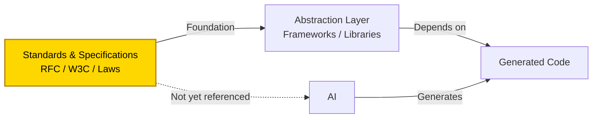
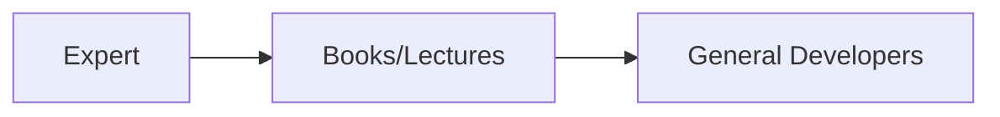
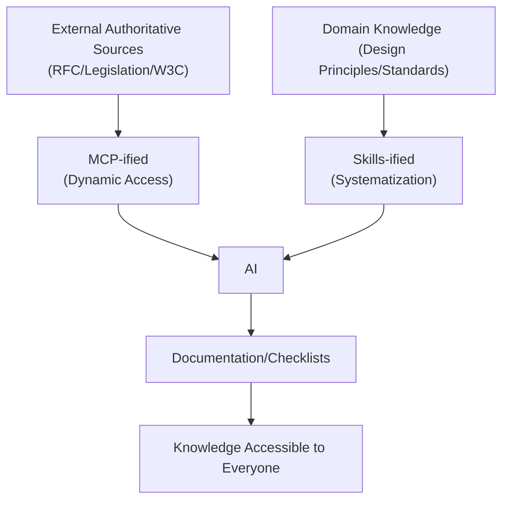
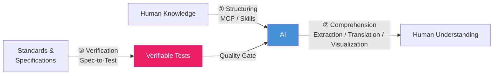
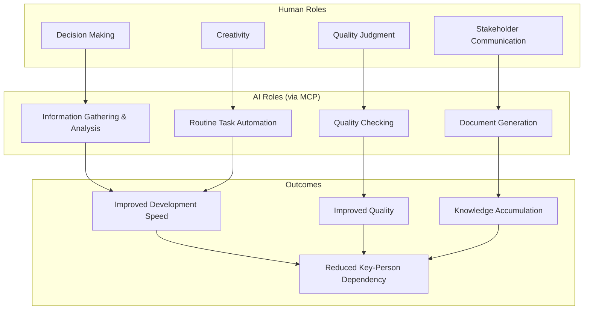
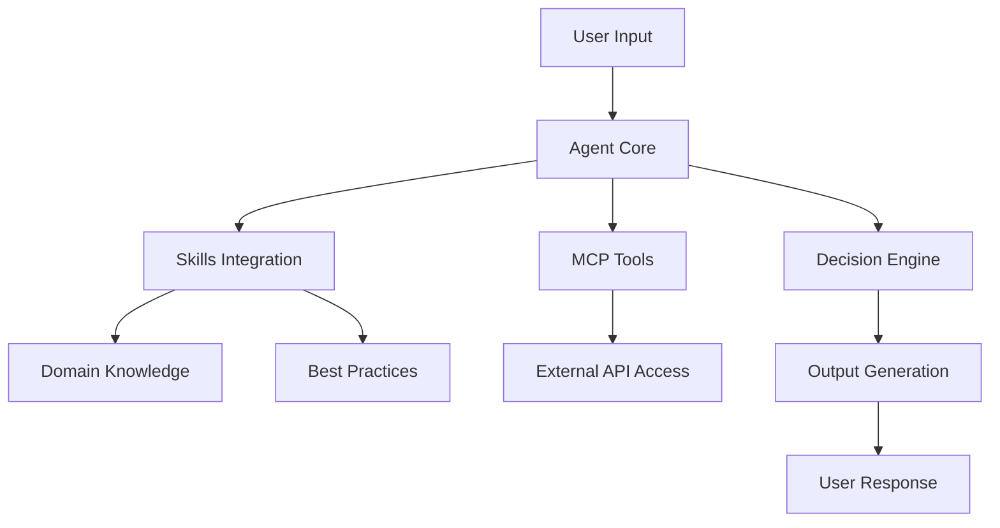
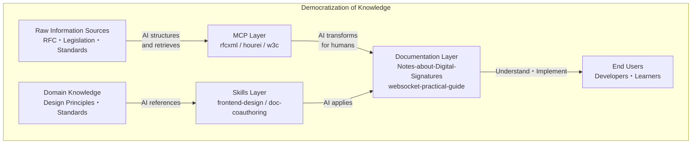

# Vision for AI-Driven Development

This document outlines the philosophy underlying AI agent architecture (MCP, Skills, and Agent integration) and the fundamental approach to AI-driven development.

> **Audience**: Engineers interested in AI-driven development. Whether you're a practitioner evaluating MCP/Skills adoption or a decision-maker considering team-wide integration, this document provides a foundational perspective.

## Core Understanding

### AI is "Not Omnipotent"

While AI capabilities are rapidly advancing, it is crucial to correctly recognize their limitations. To avoid over-reliance on AI and use it appropriately, we need to understand the following constraints.

AI generates outputs probabilistically from training data, but cannot guarantee the following:

| AI Limitation      | Description                                                              |
| ------------------ | ------------------------------------------------------------------------ |
| **Accuracy**       | Hallucination problem - may generate information that differs from facts |
| **Currency**       | Does not have information beyond the training data cutoff                |
| **Authority**      | Cannot guarantee official interpretation of specifications               |
| **Accountability** | Cannot provide grounds for legal or ethical judgments                    |

**Therefore, we need to connect to reliable sources.**

## The Essence of AI-Driven Development

```
AI-driven development ≠ Having AI write code
AI-driven development = Utilizing AI throughout all processes while humans retain judgment and creativity
```

::: info What "All Processes" Means
This is not limited to coding. It refers to the broad range of management domains involved in software development — including project management, product management, SRE, security, and data management — as outlined in [Management of Software Systems and Services](https://github.com/shuji-bonji/Management-of-software-systems-and-services).
:::

However, realizing this ideal requires a prerequisite. For AI to be truly useful "across all processes," it must be placed in an environment where it can make correct judgments.

### The Reality During This Transitional Period

The era where AI autonomously completes every process has not yet arrived. AI excels at "generating plausible output," but **it cannot judge on its own whether that output is correct**.

At the same time, the code AI generates today depends on abstraction layers — frameworks and libraries — whose foundations are the **standards and specifications** that humanity has accumulated over time.


```mermaid
graph LR
    Standards["Standards & Specifications<br>RFC / W3C / Laws"]
    Layer["Abstraction Layer<br>Frameworks / Libraries"]
    Code["Generated Code"]
    AI["AI"]

    Standards -->|"Foundation"| Layer
    Layer -->|"Depends on"| Code
    AI -->|"Generates"| Code
    Standards -.->|"Not yet referenced"| AI

    style Standards fill:#ffd700,color:#000,stroke:#b8860b,stroke-width:2px
```

Although the code AI generates is built on top of these standards, AI cannot directly reference them (dashed line). This is the core problem.

**For AI to function correctly, it must be able to reference the same standards and specifications that its generated code ultimately depends on.** This is why "unwavering reference sources" are necessary.

## The Importance of "Unwavering Reference Sources"

### Why Reference Sources Are Needed

| AI Challenge                       | What Reference Sources Solve               |
| ---------------------------------- | ------------------------------------------ |
| Fixed point-in-time training data  | Access to authoritative up-to-date sources |
| Hallucination                      | Provision of verifiable evidence           |
| Interpretation variance by context | Consistent decision criteria               |
| Lack of latest information         | Retrieval of current specifications        |

### Two Means to Achieve "Unwavering Reference Sources"

**MCP** and **Skills** serve as means to provide AI with "unwavering reference sources."

| Means                                               | Role                                                   | Examples                                       |
| --------------------------------------------------- | ------------------------------------------------------ | ---------------------------------------------- |
| **[MCP](https://modelcontextprotocol.io/)**         | Dynamic access to external authoritative sources       | RFC, legislation, W3C standards                |
| **[Skills](https://github.com/vercel-labs/skills)** | Systematization of domain knowledge and best practices | Design principles, workflows, coding standards |

::: tip A note on "Skills" terminology
In this document, "Skills" refers to **Markdown-based systematization of domain knowledge**, following the format defined by [vercel-labs/skills](https://github.com/vercel-labs/skills). Unlike OpenAI's "Actions" or LangChain's "Tools," Skills are not executable code — they are structured knowledge and judgment criteria that AI references.
:::

::: info Essential Definition of "Unwavering Reference Sources"

An "unwavering reference source" is **a fact retrieved from a verifiable information source, not an LLM's speculation**.

Based on this definition, reference sources can be classified into two types:

| Type | Characteristics | Examples | Verification Method |
| --- | --- | --- | --- |
| **Static Reference** | Content is fixed and immutable | RFCs, legislation, W3C specs | Version / section number |
| **Dynamic Reference** | Values change, but are factual at the time of retrieval | Sensors, APIs, real-time data | Timestamp + data source ID |

Both share the property of "not being speculatively generated by an LLM." Dynamic references require separate verification of the data source's authenticity, but retrieving them via MCP ensures clear provenance.

:::

### Value of Reference MCP/Skills

1. **AI decisions become verifiable** - Can demonstrate the basis for outputs
2. **Consistent quality is supported** - Standards-aligned outputs
3. **Vendor lock-in is avoided** - Based on open standards
4. **Access to knowledge is democratized** - Reach accurate information without being an expert
5. **Domain knowledge becomes reusable** - Formalize team know-how as Skills

## Democratization of Knowledge

### Problems with the Traditional Approach


```mermaid
flowchart LR
    G[General Developers]
    Expert --> Books/Lectures --> G
```

- High cost
- One-way
- Language barriers

### The World MCP/Skills Enables


```mermaid
flowchart TB
  A["External Authoritative Sources<br>(RFC/Legislation/W3C)"]
  B["Domain Knowledge <br>(Design Principles/Standards)" ]
  M["MCP-ified<br>(Dynamic Access)"]
  S["Skills-ified<br>(Systematization)"]
  K[Knowledge Accessible to Everyone]

  A --> M
  B --> S
  M --> AI
  S --> AI
  AI --> Documentation/Checklists --> K
```

**Development based on accurate information becomes possible** without relying on expensive consultants or specialists.

> For **how to distinguish between MCP and Skills**, see [skills/vs-mcp.md](../skills/vs-mcp.md).

## Three Axes of Knowledge Transformation

Knowledge transformation in AI-driven development is not one-directional. This architecture defines the following three transformation axes.


```mermaid
flowchart LR
    Human["Human Knowledge"]
    AI["AI"]
    Understanding["Human Understanding"]
    Spec["Standards &<br>Specifications"]
    Test["Verifiable Tests"]

    Human -->|"① Structuring<br>MCP / Skills"| AI
    AI -->|"② Comprehension<br>Extraction / Translation / Visualization"| Understanding
    Spec -->|"③ Verification<br>Spec-to-Test"| Test
    Test -->|"Quality Gate"| AI

    style AI fill:#4a90d9,color:#fff
    style Test fill:#e91e63,color:#fff
```

| Axis | Direction | Purpose | Example |
| --- | --- | --- | --- |
| **① Structuring** | Human → AI | Transform authoritative sources into AI-accessible formats | RFC → rfcxml-mcp |
| **② Comprehension** | AI → Human | Transform complex information into understandable formats | RFC 3161 → Checklist |
| **③ Verification** | Spec → Test | Convert specifications into verifiable criteria | EPUB 3.3 requirements → JSON test suite |

Axis ③ "Verification" differs from ① and ② in that it forms a quality **closed loop**. Simply passing specifications to AI does not make its output verifiable — converting specifications into tests is what makes "driving" possible.

## Human → AI (Structuring) Knowledge Transformation

Enable AI to access "unwavering reference sources."

### Structuring External Information Sources via MCP

| Human Knowledge          | Structured Format | AI-Usable Form |
| ------------------------ | ----------------- | -------------- |
| Legal text               | e-Gov API         | hourei-mcp     |
| Technical specifications | RFC XML           | rfcxml-mcp     |
| Web standards            | W3C/WHATWG        | w3c-mcp        |
| Translation rules        | Glossary          | DeepL Glossary |

### Systematizing Domain Knowledge via Skills

| Team Knowledge    | Format   | AI-Usable Form         |
| ----------------- | -------- | ---------------------- |
| Design principles | Markdown | frontend-design skill  |
| Coding standards  | Markdown | coding-standards skill |
| Workflows         | Markdown | doc-coauthoring skill  |

## AI → Human (Comprehension Support) Knowledge Transformation

Enable humans to access accurate knowledge even without being specialists.

| Complex Information Source  | AI Processing             | Human-Understandable Form      |
| --------------------------- | ------------------------- | ------------------------------ |
| RFC 3161 (135 requirements) | Extraction/Classification | Checklist                      |
| Digital Signature Law + RFC | Mapping                   | Correspondence table           |
| Technical specifications    | Visualization             | Mermaid diagrams               |
| English RFCs                | Translation               | Explanations in local language |

## Division of Roles Between Humans and AI

### The Responsibility Shift Model

As abstraction rises, the responsibilities of accuracy, reliability, and judgment do not disappear — **they shift who holds them**.

| Responsibility Phase | Owner | Scope | Verification Mechanism |
| --- | --- | --- | --- |
| **Design-time** | Human | Selection of reference sources, structural design, defining judgment criteria | Spec-to-Test conversion |
| **Execution-time** | Agent | Reasoning and task execution based on reference sources | Evaluation pipeline (probabilistic quality gate) |
| **Structural constraints** | System | Consistency of references, access control, audit trails | Guardrails (inviolable constraints) |

If these responsibility boundaries remain ambiguous as abstraction increases, a situation arises where "no one is accountable." This architecture aims to make these boundaries explicit at the design level, using two verification layers:

| Verification Layer | Nature | Example Criteria | Role |
| --- | --- | --- | --- |
| **Guardrails** | Inviolable (boundary-based) | ESLint errors = 0, type checks pass | Defines "lines that must not be crossed" |
| **Evaluation Pipeline** | Probabilistic (threshold-based) | xCOMET >= 0.85, test coverage >= 80% | Defines "acceptable ranges" |

> Traditional TDD (Red-Green-Refactor) does not apply directly, but **test-first thinking** — converting specifications into verifiable forms before implementation — remains fundamentally valuable in AI-driven development.

### Complementary Structure

The diagram below illustrates how human capabilities and AI capabilities complement each other to achieve better development outcomes.


```mermaid
graph TB
    subgraph Human Roles
        A[Decision Making]
        B[Creativity]
        C[Quality Judgment]
        D[Stakeholder Communication]
    end

    subgraph "AI Roles (via MCP)"
        E[Information Gathering & Analysis]
        F[Routine Task Automation]
        G[Quality Checking]
        H[Document Generation]
    end

    subgraph Outcomes
        I[Improved Development Speed]
        J[Improved Quality]
        K[Knowledge Accumulation]
        L[Reduced Key-Person Dependency]
    end

    A --> E
    B --> F
    C --> G
    D --> H
    E --> I
    F --> I
    G --> J
    H --> K
    I --> L
    J --> L
    K --> L
```

## Basic flow of MCP, Skills, and Agent

Here is the fundamental flow that shows how user input flows through the agent core and tool integrations to produce results. For the governance layer (judgment criteria, constraints, and objectives) that governs all these layers, see the [Doctrine Layer](./07-doctrine-and-intent).


```mermaid
graph TB
    A[User Input] --> B[Agent Core]
    B --> C[Skills Integration]
    C --> D[Domain Knowledge]
    C --> E[Best Practices]
    B --> F[MCP Tools]
    F --> G[External API Access]
    B --> H[Decision Engine]
    H --> I[Output Generation]
    I --> J[User Response]
```

## Positioning of This Repository


```mermaid
graph TB
    subgraph Democratization of Knowledge
        RAW[Raw Information Sources<br/>RFC・Legislation・Standards]
        DOMAIN[Domain Knowledge<br/>Design Principles・Standards]
        MCP[MCP Layer<br/>rfcxml / hourei / w3c]
        SKILLS[Skills Layer<br/>frontend-design / doc-coauthoring]
        DOC[Documentation Layer<br/>Notes-about-Digital-Signatures<br/>websocket-practical-guide]
        USER[End Users<br/>Developers・Learners]

        RAW -->|"AI structures<br/>and retrieves"| MCP
        DOMAIN -->|"AI references"| SKILLS
        MCP -->|"AI transforms<br/>for humans"| DOC
        SKILLS -->|"AI applies"| DOC
        DOC -->|"Understand・Implement"| USER
    end
```

This repository is a place to organize the design philosophy, architecture, and practical know-how of AI agent architecture (MCP, Skills, and Agent integration), and to document **strategies for building "unwavering reference sources" as the foundation of AI-driven development**.

## What This Document Does Not Guarantee (Non-goals)

To clarify the scope of this document, we state the following explicitly.

| What this document claims | What this document does NOT guarantee | What it provides instead |
| --- | --- | --- |
| Providing verifiable reference sources improves AI judgment quality | Factual correctness of all AI outputs | Spec-to-Test verification pipeline |
| MCP/Skills provide structural constraints | Elimination of human review | Two-layer structure: guardrails (inviolable constraints) + evaluation pipeline (probabilistic quality gate) |
| The design aims to clarify responsibility allocation | That the system assumes legal or ethical liability | Design-time responsibility boundaries + runtime audit trails |

> **Reader contract**: This document presents a design philosophy for "how to place AI in a trustworthy environment." It does not promise specific quality levels or safety guarantees. However, rather than leaving outputs unverifiable, it adopts an approach of **converting specifications into verifiable tests and ensuring quality through a two-layer system of guardrails and evaluation pipelines**. Final judgment and accountability always remain with humans.

## Core Messages

1. **AI-driven development is not just code generation** - Utilize AI throughout all processes
2. **AI needs guidelines for decision-making** - The importance of unwavering reference sources
3. **Systematize human engineering knowledge** - Formalize as MCP/Skills
4. **Standards-based MCPs are the foundation** - Democratize access to RFC, W3C, legislation, etc.
5. **Share domain knowledge via Skills** - Make team know-how reusable
6. **Bidirectional knowledge transformation** - Human→AI (structuring), AI→Human (comprehension support)
7. **Explicit judgment criteria** - Define constraints, objectives, and judgment criteria via the [Doctrine Layer](./07-doctrine-and-intent) to enable autonomous AI decision-making
