# The Framework of "Authoritative Reference Sources"

> Providing authoritative reference sources for AI decisions is the foundation of reliability in AI-driven development.

## About This Document

In AI-driven development, the quality of AI output is determined by "what it references." This document systematically organizes the "authoritative reference sources" that AI should use as the basis for its decisions, clarifying why they are necessary, what characteristics they should have, and how they should be connected.

By converting authoritative information sources such as RFCs, W3C specifications, and legislation into [MCP](https://modelcontextprotocol.io/) format, AI output can have **verifiable evidence**. This enables a development environment where the question "Is what the AI says really true?" can always be answered by pointing to the original source.

> **Note**: This document primarily covers "external authoritative information sources." For team domain knowledge and best practices, see [Skills](../skills/what-is-skills). For the distinction between MCP and Skills, see [vs-mcp.md](../skills/vs-mcp.md).

## Why Does AI "Fluctuate"?

### 1.1 The Nature of Probabilistic Generation

Large Language Models (LLMs) are fundamentally **probabilistic text generation systems**. The diagram below illustrates how this process works from input to output:

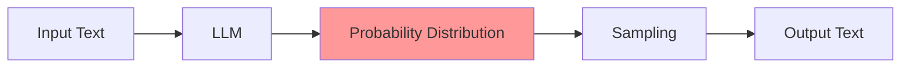

| Characteristic                   | Description                                                                | Impact on AI                              |
| -------------------------------- | -------------------------------------------------------------------------- | ----------------------------------------- |
| **Statistical Pattern Learning** | Predicts "likely next tokens" from co-occurrence patterns in training data | Outputs "plausible" rather than "correct" |
| **Non-deterministic Sampling**   | Same input can produce different outputs                                   | Consistency guarantees are difficult      |
| **Context Dependency**           | Subtle differences in prompts change output                                | Reproducibility issues                    |

### 1.2 The Four Fundamental Limitations of AI

Understanding these four core categories of limitations is essential for working with AI effectively:

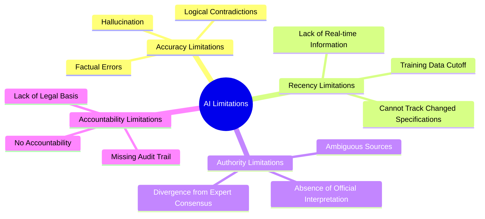

#### 1.2.1 Accuracy Limitations (Hallucination Problem)

AI doesn't "know" — it "generates."

```
User: What is the meaning of status code 1006 for Close frames
      as defined in Section 5.5.1 of RFC 6455?

AI Possibility A: "1006 indicates unexpected disconnection" (correct)
AI Possibility B: "1006 indicates a protocol error" (wrong - that's 1002)
AI Possibility C: "Section 5.5.1 contains the definition of 1006" (wrong - 7.4.1 is correct)
```

**Hallucination Generation Mechanisms**

The following table explains the primary causes that lead to hallucinated outputs:

| Cause                               | Description                                    | Example                                 |
| ----------------------------------- | ---------------------------------------------- | --------------------------------------- |
| **Sparse Training Data**            | Rare information is undertrained               | Details of minor RFCs                   |
| **Confusion with Similar Patterns** | Confuses similar concepts                      | Close code 1002 vs 1006                 |
| **Overconfident Completion**        | Fills in unknown parts "plausibly"             | Generating non-existent section numbers |
| **Context Contamination**           | Treats misinformation in conversation as truth | Amplifies user misunderstandings        |

#### 1.2.2 Recency Limitations

AI knowledge is fixed at a point in time, making it unable to reflect real-world changes that occur after training:

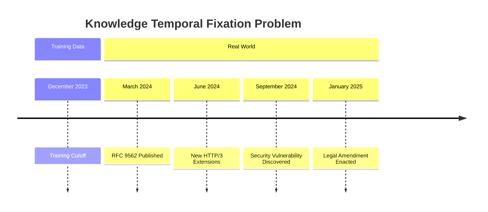

**Specific Impacts**

The following examples demonstrate how recency limitations manifest in practical scenarios:

| Category                | Problem                              | Example                                      |
| ----------------------- | ------------------------------------ | -------------------------------------------- |
| **New RFCs**            | Unaware of existence                 | Does not know RFC 9562 (UUIDv7)              |
| **Legal Amendments**    | Answers based on old law             | Answers based on pre-amendment privacy law   |
| **Deprecation/Updates** | Treats old specifications as current | References RFC 2616 as the HTTP/1.1 standard |
| **Security**            | Unaware of known vulnerabilities     | Does not know CVEs discovered after cutoff   |

#### 1.2.3 Authority Limitations

AI output is "one interpretation" and **not an official opinion**. When multiple interpretations of a specification are possible, AI may select one without guarantee of correctness:

```
Problem Structure:

RFC 6455 Original Text
    ↓
    Multiple Interpretation Possibilities
    ├── Interpretation A (Strict)
    ├── Interpretation B (Lenient)
    └── Interpretation C (Context-dependent)

AI Output
    ↓
    Outputs one interpretation "plausibly"
    ↓
    No guarantee that it is the correct interpretation
```

**Situations Where Lack of Authority Is Problematic**

These scenarios illustrate where the absence of official authority creates real risks:

| Situation                        | Risk                            | Required Response         |
| -------------------------------- | ------------------------------- | ------------------------- |
| **Specification Implementation** | Non-compliant implementation    | Verify RFC original text  |
| **Legal Decisions**              | Compliance violations           | Verify legal text         |
| **Security**                     | Overlooking vulnerabilities     | Check official advisories |
| **Contracts/SLAs**               | Disputes from misinterpretation | Verify contract text      |

#### 1.2.4 Accountability Limitations

AI output has **no subject of accountability**. This differs fundamentally from traditional information sources where responsibility can be traced:

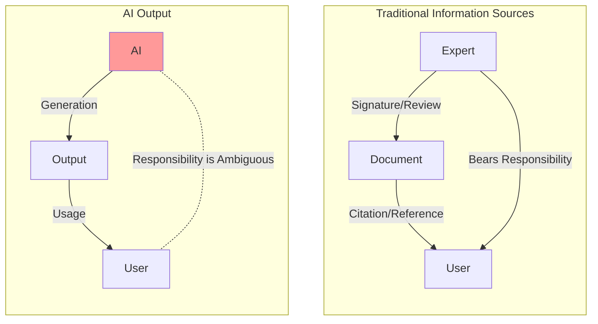

| Problem                     | Description                      | Result                    |
| --------------------------- | -------------------------------- | ------------------------- |
| **Source Opacity**          | Unknown basis for generation     | Cannot verify             |
| **Revision Untraceability** | Unknown when information is from | Cannot audit              |
| **Error Attribution**       | Unclear who bears responsibility | Difficult risk management |

These accountability issues create significant challenges for risk management and compliance.

## What Are "Authoritative Reference Sources"?

### 2.1 Definition

**Authoritative Reference Sources** are information sources that satisfy the following characteristics, each contributing to overall trustworthiness:

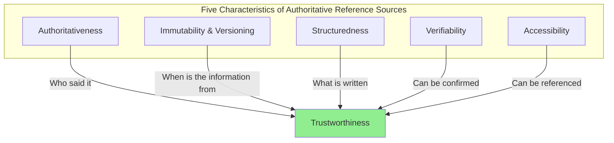

### 2.2 The Five Characteristics

#### 2.2.1 Authoritativeness

The information source has **official decision-making authority or expertise** in its domain. Different types of authority carry different weights:

| Type of Authority           | Description                                               | Examples                             |
| --------------------------- | --------------------------------------------------------- | ------------------------------------ |
| **Institutional Authority** | Official bodies established by law or treaty              | IETF, W3C, ISO, National Governments |
| **De facto Authority**      | Entities recognized as de facto standards in the industry | OWASP, Ecma International            |
| **Academic Authority**      | Academic communities with peer review processes           | IEEE, ACM                            |
| **Technical Authority**     | Developers/maintainers of technology                      | OSS Projects, Vendors                |

The hierarchy of authority is shown in the following diagram:

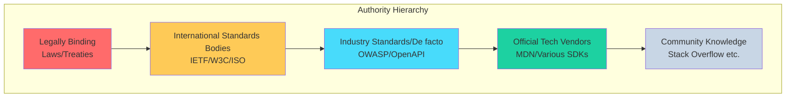

#### 2.2.2 Immutability & Versioning

Once published, content either **does not change** or when it does, **clear version management** is applied. These patterns ensure you know the precise source of information:

| Pattern                   | Description                        | Example                            |
| ------------------------- | ---------------------------------- | ---------------------------------- |
| **Complete Immutability** | Never changed once published       | RFC (except Errata)                |
| **Versioned Changes**     | New version replaces old version   | ISO Standards, W3C Recommendations |
| **Explicit Deprecation**  | Old versions explicitly deprecated | RFC obsoletes/updates              |

Here is how the RFC versioning model exemplifies this principle:

```
RFC Immutability Model:

RFC 2616 (HTTP/1.1, 1999)
    ↓ obsoleted by
RFC 7230-7235 (2014)
    ↓ obsoleted by
RFC 9110-9114 (2022)

→ Each RFC is unchanged after publication
→ New RFCs "replace" old RFCs
→ Clear which point in time the specification is from
```

#### 2.2.3 Structuredness

Information is **systematically organized** so specific information can be precisely referenced. Structured sources allow for unambiguous citations:

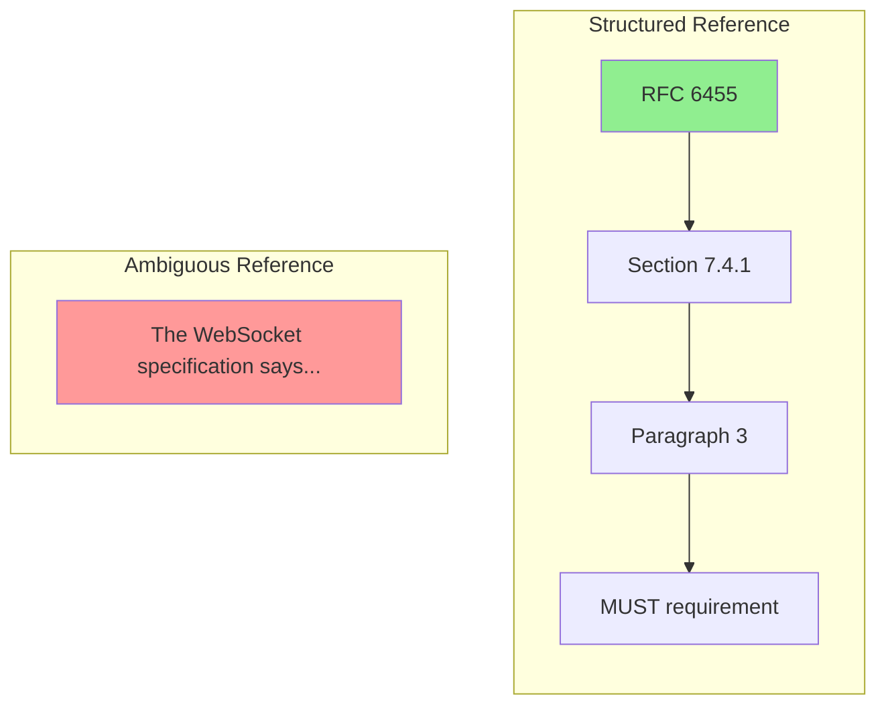

| Structuring Element        | Description                                     | Benefit for AI                          |
| -------------------------- | ----------------------------------------------- | --------------------------------------- |
| **Hierarchical Structure** | Clear hierarchy of chapters/sections/paragraphs | Precise reference to specific locations |
| **Identifiers**            | Unique section/article numbers                  | Unambiguous citations                   |
| **Cross-references**       | Explicit links to other documents/sections      | Tracking related information            |
| **Index**                  | Term index, requirement lists                   | Efficient searching                     |

#### 2.2.4 Verifiability

AI output can be **confirmed against the original source**. The following sequence diagram shows how verification works in practice:

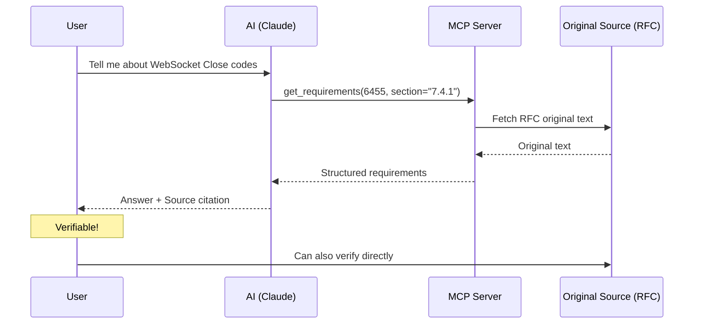

**Elements Ensuring Verifiability**

| Element                    | Description                          | Implementation                        |
| -------------------------- | ------------------------------------ | ------------------------------------- |
| **Persistent URI**         | Reference won't disappear            | DOI, RFC number, Legal article number |
| **Version Specification**  | Clarify which version was referenced | RFC 9110, ISO 27001:2022              |
| **Section Specification**  | Clarify which part was referenced    | Section 7.4.1                         |
| **Original Text Citation** | Show the referenced wording          | MUST/SHOULD/MAY original text         |

#### 2.2.5 Accessibility

Provided in a format that **AI can access programmatically**. Different levels of accessibility present different opportunities and challenges:

| Level               | Description                           | Example             |
| ------------------- | ------------------------------------- | ------------------- |
| **Structured API**  | Accessible in machine-readable format | RFC XML, e-Gov API  |
| **HTML/PDF**        | Published on web but requires parsing | W3C specs, most ISO |
| **Paid/Restricted** | Access has constraints                | Some ISO standards  |

The diagram below illustrates the accessibility spectrum:

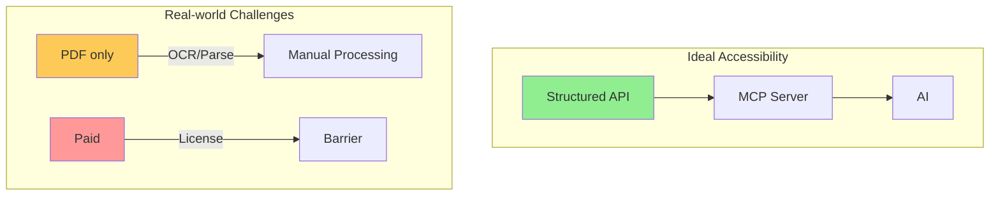

### 2.3 Criteria for Evaluating "Authoritative Reference Sources"

Use this decision flowchart to evaluate whether an information source qualifies as authoritative:

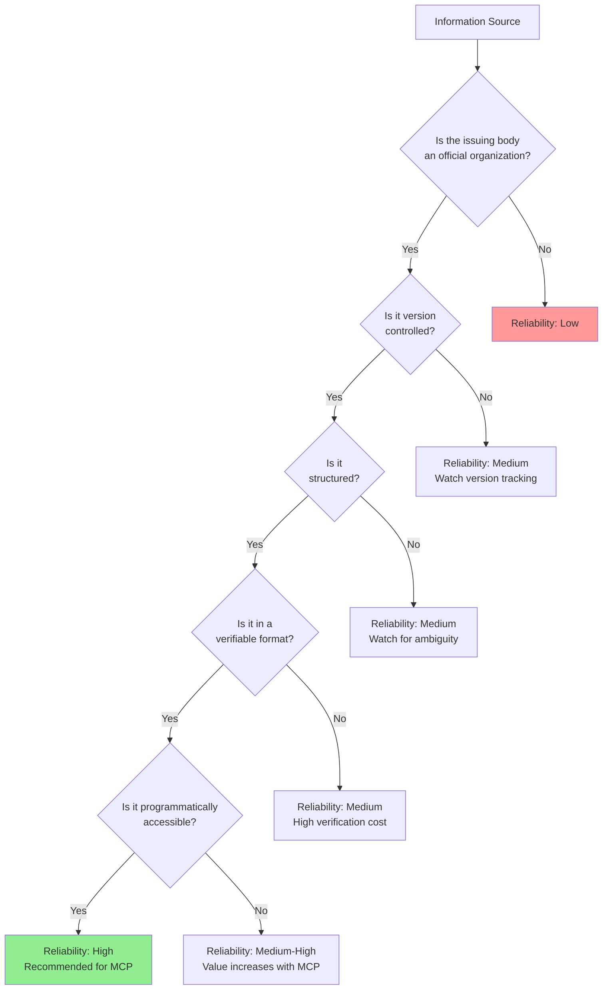

## Hierarchical Structure of Reference Sources

### 3.1 The Four-Layer Model

Reference sources are organized into a four-level hierarchy, where each level has different compliance requirements:

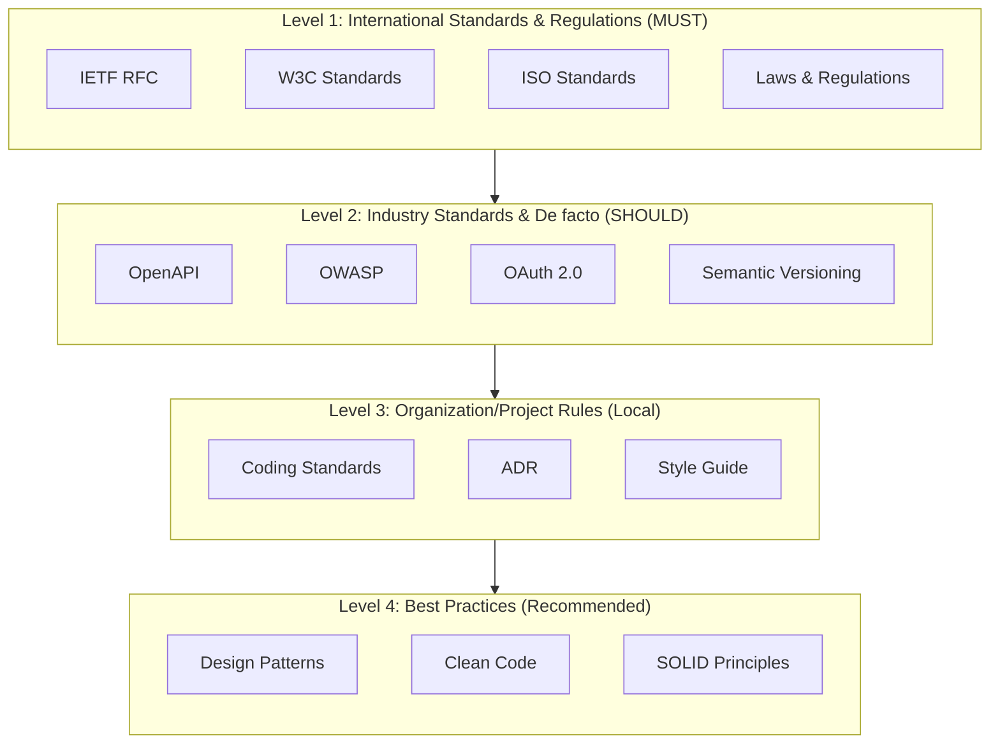

### 3.2 Level Details

#### Level 1: International Standards & Regulations (MUST Comply)

Highest authority reference sources. Violations cause **interoperability issues or legal problems**. The following table shows examples from different domains:

| Category                    | Reference    | 5 Characteristics Rating | MCP Status             |
| --------------------------- | ------------ | ------------------------ | ---------------------- |
| **Communication Protocols** | IETF RFC     | ◎◎◎◎◎                    | ✅ rfcxml-mcp          |
| **Web Standards**           | W3C / WHATWG | ◎◎◎◎○                    | ✅ w3c-mcp             |
| **International Standards** | ISO          | ◎◎◎○△                    | 🔜 Under consideration |
| **Japanese Laws**           | e-Gov        | ◎◎◎◎◎                    | ✅ hourei-mcp          |
| **EU Regulations**          | EUR-Lex      | ◎◎◎◎○                    | 📋 Planned             |

IETF RFCs exemplify the highest standard for all five characteristics:

```
Authoritativeness: ◎ Official publication by IETF, WG consensus
Immutability:      ◎ No changes after publication, managed via obsoletes/updates
Structuredness:    ◎ Section numbers, clear MUST/SHOULD/MAY definitions
Verifiability:     ◎ Uniquely identified by RFC number and section number
Accessibility:     ◎ Published in RFC XML format, free access
```

#### Level 2: Industry Standards & De facto (SHOULD Comply)

Widely adopted standards. Non-compliance causes **compatibility issues within the industry**. Key examples include:

| Category           | Reference        | Characteristics                     | MCP Value |
| ------------------ | ---------------- | ----------------------------------- | --------- |
| **API Design**     | OpenAPI Spec     | De facto standard for REST APIs     | High      |
| **Security**       | OWASP            | Web security best practices         | High      |
| **Authentication** | OAuth 2.0 / OIDC | De facto standard for authorization | High      |
| **Messaging**      | AsyncAPI         | Async API specification             | Medium    |

#### Level 3: Organization/Project Rules (Local Compliance)

Rules that should be unified within teams/projects. These are managed at a local scope:

| Type                 | Characteristics               | Management Method         |
| -------------------- | ----------------------------- | ------------------------- |
| **Coding Standards** | Project-specific styles       | Markdown / Linter configs |
| **ADR**              | Architecture decision records | Git-managed Markdown      |
| **CLAUDE.md**        | Claude-specific instructions  | Project root placement    |

#### Level 4: Best Practices (Recommended)

Recommendations based on experience. **Apply as appropriate to the situation**. These guide implementation when no standard applies:

| Type                  | Source           | Application Judgment      |
| --------------------- | ---------------- | ------------------------- |
| **Design Principles** | SOLID, DRY, KISS | Situational               |
| **Design Patterns**   | GoF, POSA        | When matching the problem |
| **Clean Code**        | Robert C. Martin | Within team agreement     |

## AI Decision Flow

### 4.1 Decision Algorithm Based on Reference Sources

When implementing a feature or making a decision, AI should follow this hierarchical decision flow:

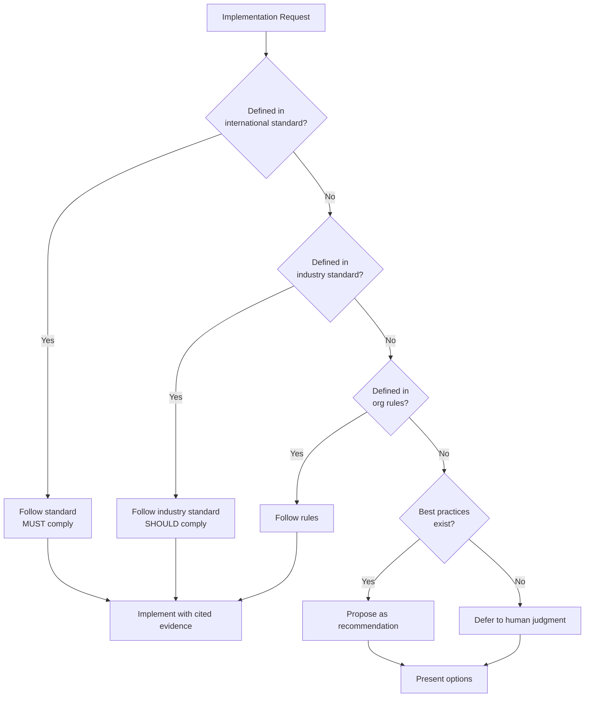

### 4.2 Output Templates

When providing answers, structure your response according to whether authoritative sources are available. Here is the template for cases where a reference source is found:

```markdown
## Answer

Status code 1006 for WebSocket Close frames indicates "Abnormal Closure."

### Evidence

- **Source**: RFC 6455, Section 7.4.1
- **Original Text**: "1006 is a reserved value and MUST NOT be set as a status code
  in a Close control frame by an endpoint. It is designated for use in
  applications expecting a status code to indicate that the connection
  was closed abnormally"
- **Requirement Level**: MUST NOT (must not be set in implementation)

### Notes

This code is for applications to detect abnormal termination and
cannot be sent in actual Close frames.
```

When no authoritative reference source is available, use this template to transparently acknowledge the limitation:

```markdown
## Answer

I could not identify an authoritative reference source for this matter.

### Information Sources Checked

- RFC 6455: No relevant description found
- W3C WebSocket API: No relevant description found

### Speculation

As a general implementation practice, there is a tendency to~, but
this is not defined by any standard.

### Recommendation

If precise specifications are needed, I recommend checking~.
```

## Design Requirements for Reference Source MCPs

### 5.0 Separation of MCP and Skills

MCP and Skills are both means to achieve "authoritative reference sources", but they serve different purposes:

| Aspect              | MCP                                        | Skills                              |
| ------------------- | ------------------------------------------ | ----------------------------------- |
| **Target**          | External authoritative information sources | Domain knowledge & best practices   |
| **Examples**        | RFC, Laws, W3C standards                   | Design principles, Coding standards |
| **Characteristics** | Dynamic access, via API                    | Static reference, Markdown format   |
| **Updates**         | Dependent on external systems              | Team-driven updates                 |

> For details, see [skills/vs-mcp.md](../skills/vs-mcp.md).

### 5.1 Required Functions

MCPs should provide these core functions to enable comprehensive access to reference sources:

| Function                    | Description                                | Example                         |
| --------------------------- | ------------------------------------------ | ------------------------------- |
| **Search**                  | Keyword search within specifications       | "WebSocket close frame"         |
| **Structure Retrieval**     | Chapter/section hierarchy                  | Table of contents for RFC 6455  |
| **Requirements Extraction** | Extract MUST/SHOULD/MAY                    | List of normative requirements  |
| **Term Definitions**        | Get definitions of technical terms         | Definition of "Origin"          |
| **Reference Relationships** | Dependencies on other specifications       | RFC 6455 → RFC 2616             |
| **Checklist Generation**    | Generate implementation verification items | Client implementation checklist |
| **Validation**              | Check if implementation complies with spec | Statement validation            |

### 5.2 RFC MCP Tool Design

The following TypeScript interface illustrates the structure of an RFC MCP implementation:

```typescript
interface RfcMcpTools {
	// Search & Retrieval
	searchRfc(keyword: string): RfcSummary[];
	getRfcStructure(rfcNumber: number): Section[];
	getRfcSection(rfcNumber: number, section: string): Content;

	// Requirements Extraction
	getRequirements(rfcNumber: number, level?: RequirementLevel): Requirement[];
	getDefinitions(rfcNumber: number, term?: string): Definition[];

	// Relationships
	getDependencies(rfcNumber: number): Dependency[];
	getRelatedSections(rfcNumber: number, section: string): RelatedSection[];

	// Implementation Support
	generateChecklist(rfcNumber: number, role: 'client' | 'server'): Checklist;
	validateStatement(rfcNumber: number, statement: string): ValidationResult;
}
```

## Concrete Example — Electronic Signature Act × RFC 3161

### 6.1 Mapping Legal Requirements to Technical Specifications

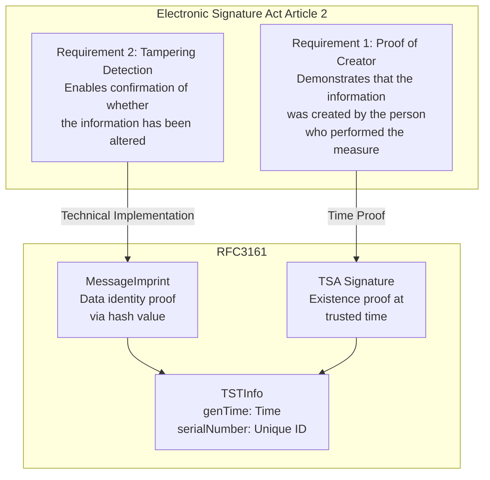

### 6.2 Verification Workflow via MCP Integration

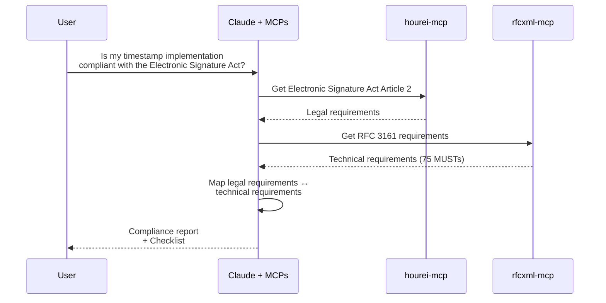

## Resolving Reference Source Conflicts

### 7.1 Conflict Resolution Rules

1. **Higher levels take priority** - Laws > Industry standards > Organization rules
2. **Newer versions take priority** - RFC 9110 > RFC 7230 (obsolete)
3. **More specific specifications take priority** - WebSocket RFC > General TCP specifications
4. **When contradictions exist, defer to human judgment**

### 7.2 Example: HTTP Specification References

```
❌ RFC 2616 (HTTP/1.1 - obsolete)
✅ RFC 9110 (HTTP Semantics - current)
✅ RFC 9111 (HTTP Caching - current)
```

## List of Built Reference Source MCPs

| MCP            | Target                        | Main Functions                                                     | Repository                                          |
| -------------- | ----------------------------- | ------------------------------------------------------------------ | --------------------------------------------------- |
| **rfcxml-mcp** | IETF RFC                      | Structure retrieval, requirements extraction, checklist generation | [GitHub](https://github.com/shuji-bonji/rfcxml-mcp) |
| **w3c-mcp**    | W3C/WHATWG/IETF Web Standards | WebIDL, CSS, HTML elements                                         | [GitHub](https://github.com/shuji-bonji/w3c-mcp)    |
| **hourei-mcp** | Japanese Laws (e-Gov)         | Law search, article retrieval                                      | [GitHub](https://github.com/ryoooo/e-gov-law-mcp)   |

## Future Expansion Candidates

### High Priority

| Candidate       | Target            | Value                                      |
| --------------- | ----------------- | ------------------------------------------ |
| **OpenAPI MCP** | OpenAPI Spec      | API design standards compliance            |
| **OWASP MCP**   | OWASP Top 10 etc. | Security requirements checking             |
| **OAuth MCP**   | OAuth 2.0 / OIDC  | Authentication flow implementation support |

### Medium Priority

| Candidate        | Target            | Value                             |
| ---------------- | ----------------- | --------------------------------- |
| **ISO MCP**      | ISO Standards     | International standards reference |
| **PDF Spec MCP** | ISO 32000         | PDF specification reference       |
| **BIM/IFC MCP**  | buildingSMART IFC | Building information model        |
| **HL7 FHIR MCP** | HL7 FHIR          | Healthcare information exchange   |

## Summary

### Core Messages

1. **AI "fluctuates"** - Probabilistic generation, training data constraints, lack of authority
2. **"Authoritative reference sources" are needed** - Authoritativeness, immutability, structuredness, verifiability, accessibility
3. **Organize hierarchically** - International standards > Industry standards > Organization rules > Best practices
4. **Connect to external information sources via MCP** - Provide RFC, laws, W3C standards in a format AI can reference
5. **Systematize domain knowledge with Skills** - Share team know-how in reusable formats
6. **Always cite evidence** - Show source, section, and original text

### The Value of "Authoritative Reference Sources"

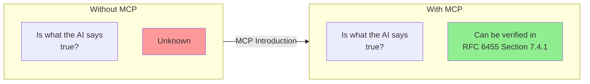

**By providing authoritative reference sources for AI decisions, output reliability and verifiability are ensured.**
