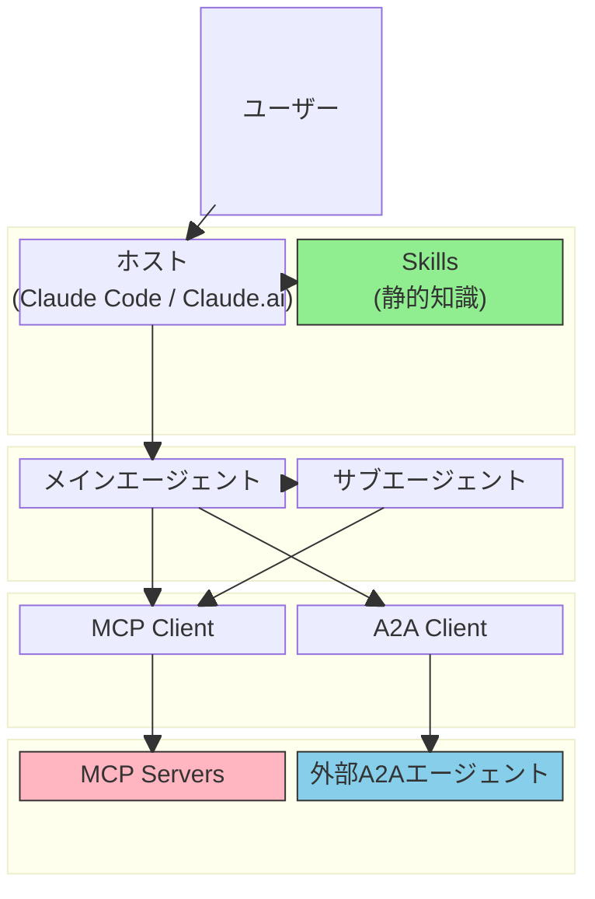
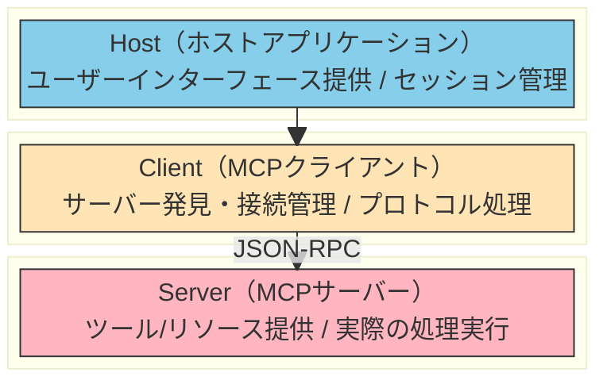
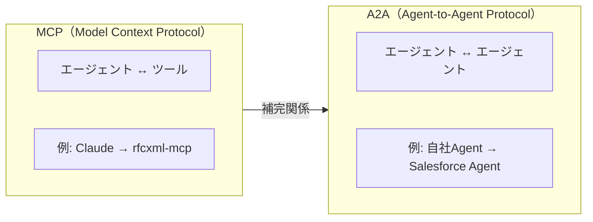
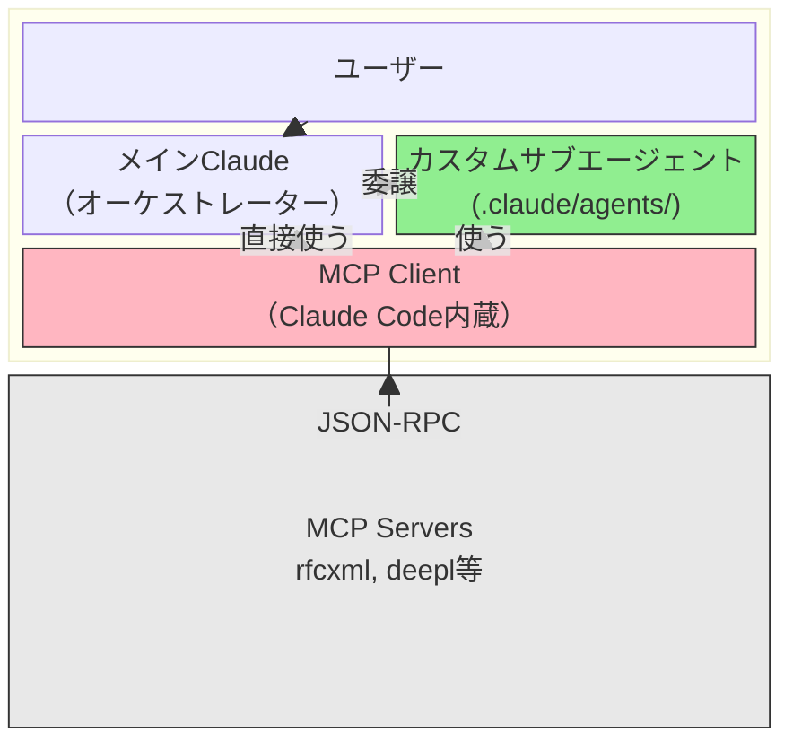

# MCP/A2A/Skill/Agent の構成論

> AI駆動開発のインフラを理解するための構成要素と、それぞれの役割・関係性を整理する。

## レイヤー構造の概観

```
ユーザーリクエスト
    │
    ▼
┌──────────────────────────────────────────────┐
│ エージェント層                                 │
│ ┌──────────────────────────────────────────┐ │
│ │ • タスク理解                               │ │
│ │ • オーケストレーションの決定                 │ │
│ │ • 結果の統合                               │ │
│ └──────────────────────────────────────────┘ │
├──────────────────────────────────────────────┤
│ スキル層                                      │
│ ┌──────────────────────────────────────────┐ │
│ │ • ドメイン知識                             │ │
│ │ • ベストプラクティスとガイドライン            │ │
│ │ • 意思決定基準                             │ │
│ └──────────────────────────────────────────┘ │
├──────────────────────────────────────────────┤
│ MCP レイヤー                                  │
│ ┌──────────────────────────────────────────┐ │
│ │ • 外部 API アクセス                        │ │
│ │ • ツール実行                               │ │
│ │ • データ取得                               │ │
│ └──────────────────────────────────────────┘ │
└──────────────────────────────────────────────┘
    │
    ▼
外部サービス（DeepL、RFC Editor、GitHub など）
```

### 各レイヤーの責務

各レイヤーがどのような責務を担い、誰が所有するかを以下にまとめる。

| レイヤー   | 責任                           | 所有者             | 例                           |
| ---------- | ------------------------------ | ------------------ | ---------------------------- |
| **Agent**  | オーケストレーション、意思決定 | タスクフロー       | Claude Code, Cursor          |
| **Skills** | ドメイン知識、ガイドライン     | ベストプラクティス | SOLID 原則、翻訳ガイドライン |
| **MCP**    | E外部接続                      | ツール定義         | deepl-mcp, rfcxml-mcp        |

## このドキュメントについて

AI駆動開発には複数の構成要素が存在するが、それぞれの役割と関係性を正しく理解することが効率的な開発の鍵となる。このドキュメントでは、MCP（ツール接続）、A2A（エージェント間通信）、Skill（静的知識）、カスタムサブエージェント（役割特化）という4つの主要概念を整理する。

「何をMCPにすべきか」「Skillで十分なのはどんな場合か」「サブエージェントはいつ使うべきか」という判断に迷ったとき、このドキュメントを参照することで適切な選択ができるようになる。

## 全体アーキテクチャ



## MCPの3層構造

### Host / Client / Server

MCPは3つの層で構成されている。以下の図はHost・Client・Serverの関係を示す。



| 層         | 役割                         | 例                           | 開発者の関わり   |
| ---------- | ---------------------------- | ---------------------------- | ---------------- |
| **Host**   | UI、セッション管理           | Claude Code, Cursor, VS Code | 使う側           |
| **Client** | プロトコル処理、サーバー管理 | Host内蔵                     | 通常は意識しない |
| **Server** | ツール/リソース提供          | rfcxml-mcp, deepl-mcp        | **作る側**       |

### なぜClientを意識しなくて済むか

```
通常の開発フロー:
1. MCP Server を作る（rfcxml等）
2. Claude Code の設定に追加
3. Claude Code が内蔵Clientとして動作
4. ツールが使える

→ Client は Host に内蔵されており、
   ブラックボックスとして機能している
```

## MCP と A2A の棲み分け

### プロトコルの違い

MCPとA2Aは接続先が根本的に異なる。以下の図でその違いを示す。



| 項目             | MCP                      | A2A                          |
| ---------------- | ------------------------ | ---------------------------- |
| **主導**         | Anthropic                | Google → Linux Foundation    |
| **目的**         | ツール接続               | エージェント間通信           |
| **接続先**       | MCPサーバー（ツール）    | 他のエージェント（他社含む） |
| **コンテキスト** | 親エージェントと共有可能 | 完全分離                     |
| **所有者**       | 自分                     | 自分 or **他者**             |

### 公式の推奨

> Build with ADK, equip with **MCP** (tools), communicate with **A2A** (agents)

```
MCP = 手（ツール）を使う
A2A = 他者（エージェント）と協働
```

## カスタムサブエージェント

### サブエージェントとは

Claude Code内で定義できる**特定タスクに特化したAIアシスタント**。

```
配置場所:
├── プロジェクト: .claude/agents/xxx.md （優先度: 高）
└── ユーザー:     ~/.claude/agents/xxx.md（優先度: 低）
```

### 定義形式

サブエージェントはMarkdownファイルで定義する。以下はRFC専門家サブエージェントの定義例である。

```markdown
name: rfc-specialist
description: RFC仕様の確認・検証専門家
tools: rfcxml:get_rfc_structure, rfcxml:get_requirements
model: sonnet

あなたはRFC仕様の専門家です。
rfcxmlツールのみ使用してください。
```

### サブエージェントの位置づけ

Claude Code内部でのサブエージェントの位置づけを以下の図で示す。



**重要**: サブエージェントはMCP Clientの「代わり」ではなく「上位レイヤー」

- **サブエージェント** = 「何をするか」の定義（役割・手順）
- **MCP Client** = 「どう接続するか」の実装（プロトコル処理）

## Skill（スキル）

### Skillとは

Claude Codeで参照できる**静的な知識・ガイドライン**。

```
配置場所:
├── プロジェクト: .claude/skills/xxx/SKILL.md
└── ユーザー:     ~/.claude/skills/xxx/SKILL.md
```

### Skillの特徴

Skillの主な特徴を以下に整理する。

| 項目                 | 説明                                               |
| -------------------- | -------------------------------------------------- |
| **形式**             | Markdownファイル                                   |
| **内容**             | ベストプラクティス、ワークフロー定義、ガイドライン |
| **実行**             | なし（参照のみ）                                   |
| **コンテキスト消費** | 低い（参照時のみ）                                 |

## MCP vs Skill vs サブエージェント

### 判断フロー


### 比較表

| 観点                 | Skill              | MCP             | サブエージェント |
| -------------------- | ------------------ | --------------- | ---------------- |
| **コンテキスト消費** | 低い               | 高い            | 中程度           |
| **動的処理**         | ❌ 不可            | ✅ 可能         | ✅ 可能          |
| **外部API**          | ❌ 不可            | ✅ 可能         | △ MCP経由        |
| **メンテナンス**     | Markdown編集       | npm公開等       | Markdown編集     |
| **再利用性**         | プロジェクト内     | グローバル      | プロジェクト内   |
| **用途**             | 知識・ガイドライン | ツール・API連携 | 役割・専門性分離 |

### 使い分けの原則

```
Skill = 「知識」「ガイドライン」「ワークフロー定義」
MCP  = 「ツール」「API連携」「動的処理」
サブエージェント = 「役割」「専門性」「タスク委譲」

Skillで「何をすべきか」を定義
MCPで「どう実行するか」を提供
サブエージェントで「誰がやるか」を分離
```

## A2A vs サブエージェント

### 根本的な違い

| 観点               | カスタムサブエージェント | A2Aエージェント         |
| ------------------ | ------------------------ | ----------------------- |
| **所在**           | 同一プロセス内           | ネットワーク越し        |
| **所有者**         | 自分                     | 自分 or **他者**        |
| **信頼関係**       | 完全信頼                 | 認証・認可が必要        |
| **コンテキスト**   | 親と一部共有             | 完全分離                |
| **ライフサイクル** | セッション限り           | 永続的サービス          |
| **内部実装**       | 見える（Markdown）       | 見えない（API契約のみ） |

### 比喩

```
カスタムサブエージェント = 「社内の専門部署」
A2Aエージェント         = 「外注先・パートナー企業」

社内に専門部署があっても、外注先は必要
外注先があっても、社内の専門部署は必要

→ 両方必要、代替関係ではない
```

### 使い分け

| シナリオ                     | 使うべきもの     |
| ---------------------------- | ---------------- |
| 自分のMCPを専門的に使いたい  | サブエージェント |
| 同じ処理を繰り返し使いたい   | サブエージェント |
| ワークフローを定義したい     | サブエージェント |
| 他社のエージェントと連携     | A2A              |
| 自分のエージェントを外部公開 | A2A              |
| 複数組織間でエージェント連携 | A2A              |

## 実行主体の選択

MCP / Skill / Sub-agent の選択に加えて、**「誰が判断するか」**という視点が重要になる。

### 進化の流れ

外部サービスとの連携方法は、技術の進化とともに変化してきた。

```
従来                  現在                    将来
┌─────────┐        ┌─────────┐          ┌─────────┐
│  人間   │        │   AI    │          │ Agent   │
│ (CLI)   │        │(MCP経由)│          │ (自律)  │
└────┬────┘        └────┬────┘          └────┬────┘
     │                  │                    │
     ▼                  ▼                    ▼
┌─────────┐        ┌─────────┐          ┌─────────┐
│   API   │        │   API   │          │   API   │
└─────────┘        └─────────┘          └─────────┘

人間がコマンドで      AIがツールとして       Agentが自律的に
APIを操作            APIを呼び出す          判断・実行
```

この進化の中で、**すべてをMCP化する必要はない**。
「誰が判断するか」によって、適切なレイヤーが決まる。

### 判断主体によるレイヤー選択

「誰が判断するか」に基づいて、適切なレイヤーを選択する指針を以下に示す。

| 判断主体             | 適切なレイヤー   | 特徴                       | 例                        |
| -------------------- | ---------------- | -------------------------- | ------------------------- |
| **不要**（決定論的） | プログラム直接   | 判断不要、高速、確実       | バッチ処理、CI/CD、cron   |
| **人間**             | CLI              | 人間が判断、AIは実行しない | `gh pr list`, `aws s3 ls` |
| **AI**（単発）       | MCP + Skill      | AIが都度判断して実行       | 翻訳、RFC参照、品質評価   |
| **AI**（継続・自律） | サブエージェント | 専門性を持って自律的に判断 | レビュー担当、翻訳担当    |

### 判断フロー

判断主体に応じた選択を以下のフローチャートで整理する。


### CLI vs MCP：AIが判断する場合の選択

> **Key Insight**: 公式CLIがある場合、MCP化せず **CLI + Skill** が効率的
>
> _— r/ClaudeAI コミュニティでの議論より_

| 観点             | CLI + Skill          | MCP                          |
| ---------------- | -------------------- | ---------------------------- |
| **トークン消費** | 低い（コマンドのみ） | 高い（全ツール定義読み込み） |
| **起動コスト**   | なし                 | サーバープロセス必要         |
| **認証**         | ローカル完結         | MCP側で管理                  |
| **用途特化**     | ◎（専用設計）        | △（汎用的）                  |

#### 具体例

代表的なサービスについて、CLIの有無と推奨アプローチを以下に示す。

| サービス     | CLI      | 推奨        |
| ------------ | -------- | ----------- |
| GitHub       | `gh`     | CLI + Skill |
| AWS          | `aws`    | CLI + Skill |
| Google Cloud | `gcloud` | CLI + Skill |
| PostgreSQL   | `psql`   | CLI + Skill |
| Linear       | ❌       | MCP         |
| Greptile     | ❌       | MCP         |
| DeepL        | ❌       | MCP         |

### 重要な洞察

MCP・Skill・サブエージェント選択における最も重要な洞察は以下の通りである。

```
「何を実行するか」だけでなく「誰が判断するか」で選択が変わる

判断不要     → プログラム直接
人間が判断   → CLI
AIが判断    → MCP or CLI + Skill
AIが自律    → サブエージェント
```

この視点を持つことで、過剰なMCP化（over-MCPization）を避け、適切なレイヤーで実装できる。

## 組み合わせパターン

### 最強の組み合わせ

Skill・サブエージェント・MCPの3つを組み合わせることで、最も効果的なワークフローが実現できる。


### 具体例：翻訳ワークフロー

以下は、Skill + サブエージェント + MCP を組み合わせた翻訳ワークフローの具体的な定義例である。

```markdown
<!-- skills/translation-workflow/SKILL.md -->

# 技術文書翻訳ワークフロー

## 使用MCP

- `deepl` - 翻訳実行
- `xcomet` - 品質評価

## ワークフロー

1. deepl:translate-text で翻訳（formality: "more"）
2. xcomet:xcomet_evaluate で評価
   - スコア 0.85以上: OK
   - スコア 0.85未満: 再翻訳または手動修正
3. xcomet:xcomet_detect_errors でエラー検出
```

```markdown
<!-- agents/translation-specialist.md -->

name: translation-specialist
description: 技術文書の翻訳と品質評価を行う専門エージェント
tools: deepl:translate-text, xcomet:xcomet_evaluate, xcomet:xcomet_detect_errors
model: sonnet

あなたは技術翻訳の専門家です。
translation-workflow スキルを参照してください。
```

## シーケンス図：実行フローの可視化

### コードレビュータスク

コードレビュータスクにおけるSkillとMCPの連携フローを以下のシーケンス図で示す。


### 翻訳ワークフロー

翻訳ワークフローにおけるSkillとMCPの連携フローを以下のシーケンス図で示す。


## レイヤー構造まとめ

ここまで説明してきたレイヤー構造の全体像を、最後にまとめて示す。

```
┌─────────────────────────────────────────────────────────┐
│  ユーザー                                                │
├─────────────────────────────────────────────────────────┤
│  ホスト（Claude Code / Claude.ai）                       │
├─────────────────────────────────────────────────────────┤
│  Skills（静的知識・ガイドライン）                         │
├─────────────────────────────────────────────────────────┤
│  メインエージェント                                       │  ← オーケストレーション
├─────────────────────────────────────────────────────────┤
│  カスタムサブエージェント                                 │  ← 役割・専門性の定義
├─────────────────────────────────────────────────────────┤
│  MCP Client / A2A Client                                │  ← プロトコル処理
├─────────────────────────────────────────────────────────┤
│  MCP Servers / 外部A2Aエージェント                       │  ← ツール・外部サービス
└─────────────────────────────────────────────────────────┘
```
