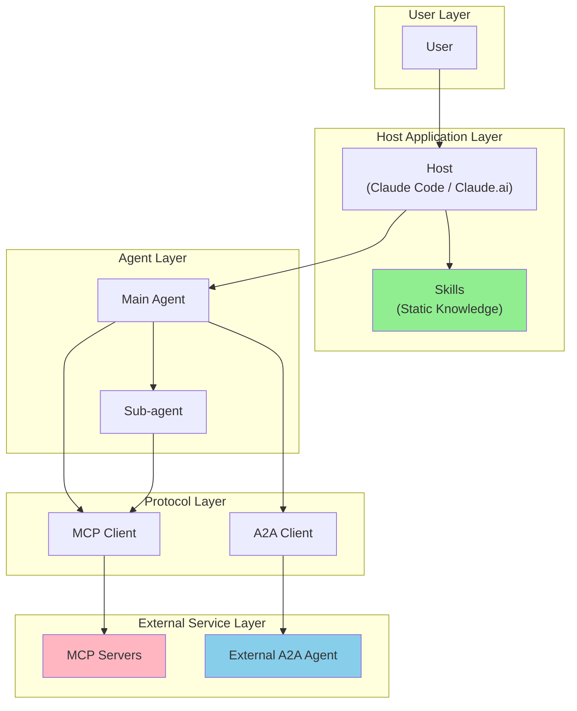
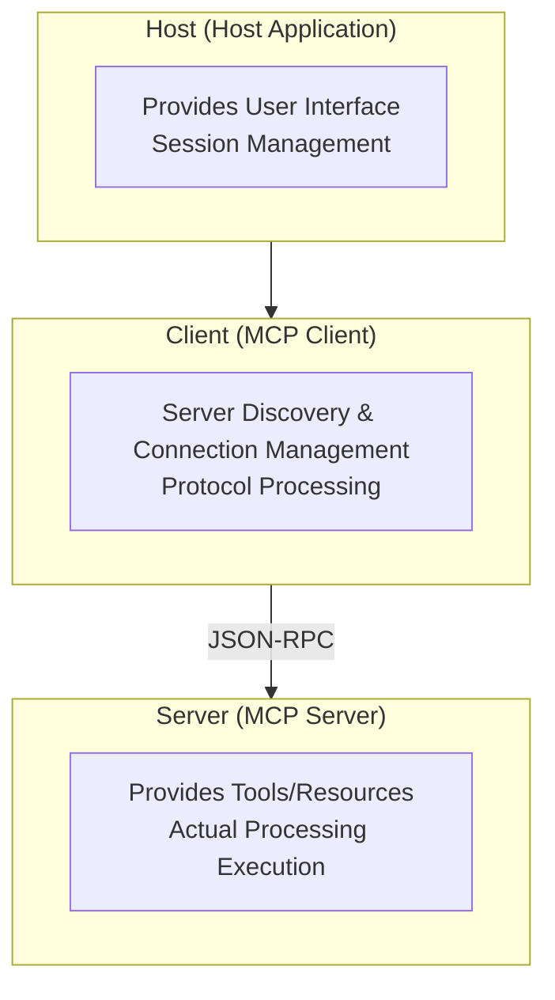
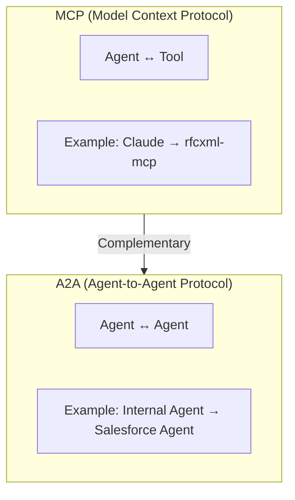
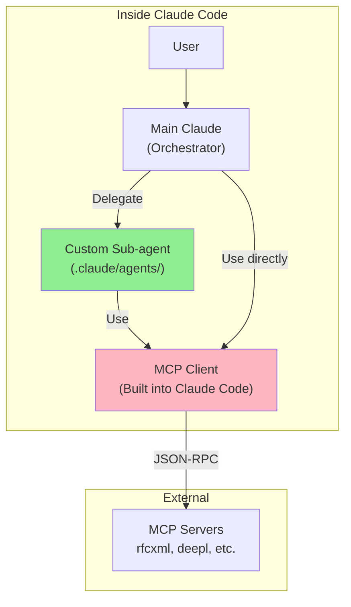
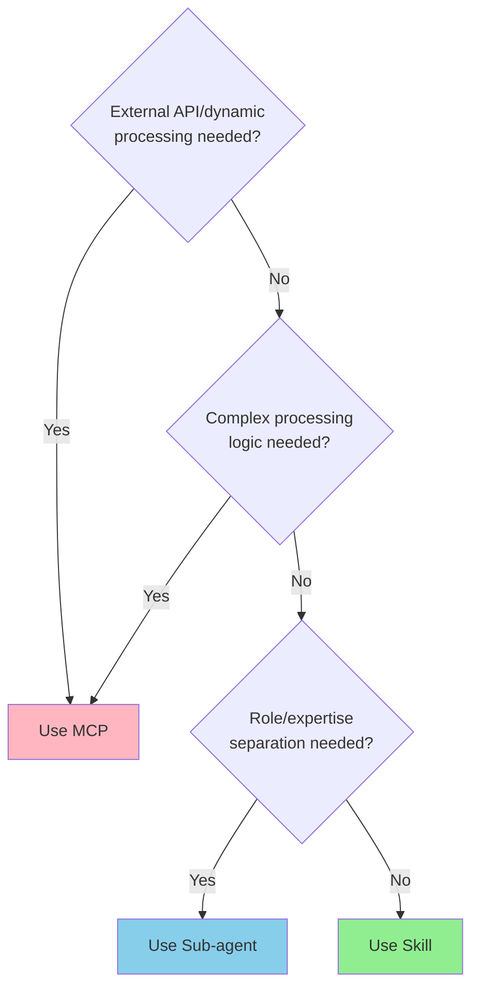
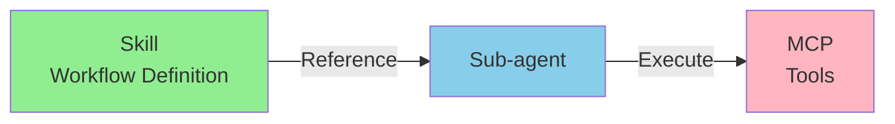
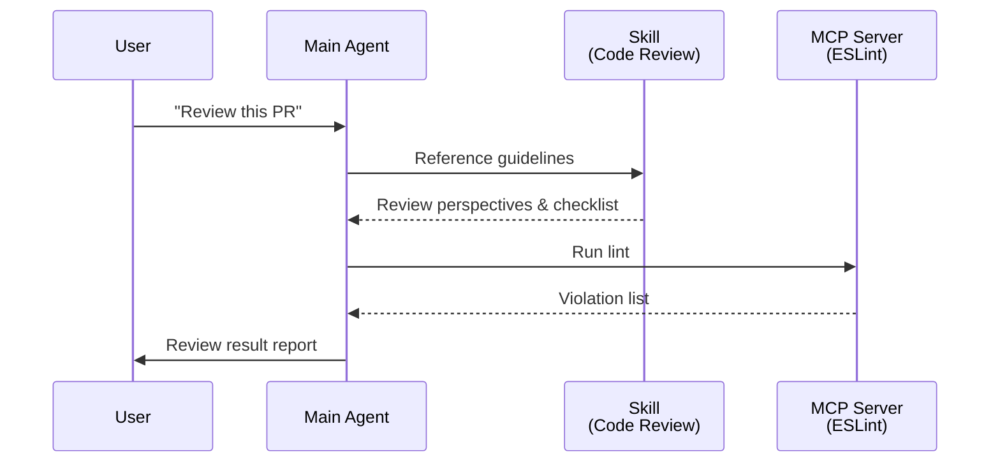
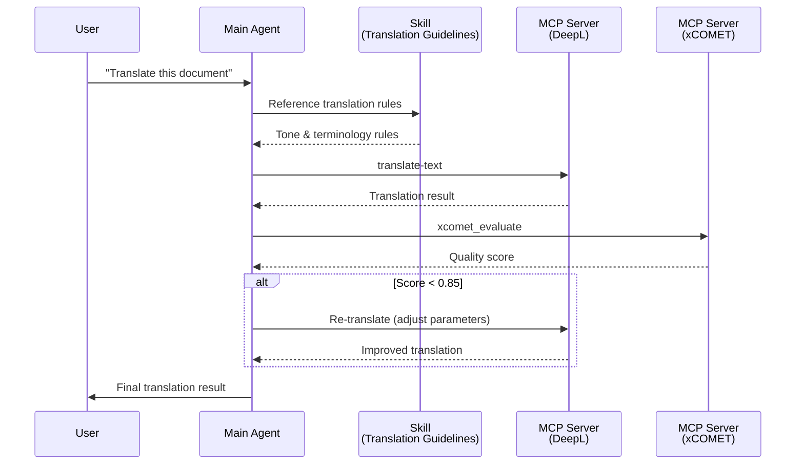

# MCP/A2A/Skill/Agent Architecture

[日本語版 (Japanese)](./03-architecture.ja.md)

> Understanding the components of AI-driven development infrastructure and organizing their roles and relationships.

## Layer Structure Overview

```
User Request
     │
     ▼
┌─────────────────────────────────────────────────────────┐
│  Agent Layer                                             │
│  ┌─────────────────────────────────────────────────────┐ │
│  │ • Task understanding                                │ │
│  │ • Orchestration decisions                           │ │
│  │ • Result synthesis                                  │ │
│  └─────────────────────────────────────────────────────┘ │
├─────────────────────────────────────────────────────────┤
│  Skills Layer                                            │
│  ┌─────────────────────────────────────────────────────┐ │
│  │ • Domain knowledge                                  │ │
│  │ • Best practices & guidelines                       │ │
│  │ • Decision criteria                                 │ │
│  └─────────────────────────────────────────────────────┘ │
├─────────────────────────────────────────────────────────┤
│  MCP Layer                                               │
│  ┌─────────────────────────────────────────────────────┐ │
│  │ • External API access                               │ │
│  │ • Tool execution                                    │ │
│  │ • Data retrieval                                    │ │
│  └─────────────────────────────────────────────────────┘ │
└─────────────────────────────────────────────────────────┘
     │
     ▼
External Services (DeepL, RFC Editor, GitHub, etc.)
```

### Layer Responsibilities

| Layer | Responsibility | Owns | Examples |
|-------|----------------|------|----------|
| **Agent** | Orchestration, decision-making | Task flow | Claude Code, Cursor |
| **Skills** | Domain knowledge, guidelines | Best practices | SOLID principles, translation guidelines |
| **MCP** | External connectivity | Tool definitions | deepl-mcp, rfcxml-mcp |

## About This Document

AI-driven development involves multiple components, and correctly understanding their roles and relationships is key to efficient development. This document organizes four main concepts: MCP (tool connectivity), A2A (agent-to-agent communication), Skill (static knowledge), and Custom Sub-agents (role specialization).

When you are unsure about "What should be implemented as MCP?", "When is a Skill sufficient?", or "When should I use a sub-agent?", refer to this document to make the appropriate choice.

## Overall Architecture



## MCP Three-Layer Structure

### Host / Client / Server



| Layer      | Role                                  | Example                      | Developer Involvement   |
| ---------- | ------------------------------------- | ---------------------------- | ----------------------- |
| **Host**   | UI, session management                | Claude Code, Cursor, VS Code | Consumer                |
| **Client** | Protocol processing, server management| Built into Host              | Usually not concerned   |
| **Server** | Tool/resource provision               | rfcxml-mcp, deepl-mcp        | **Provider**            |

### Why You Don't Need to Worry About the Client

```
Typical development flow:
1. Create an MCP Server (e.g., rfcxml)
2. Add it to Claude Code configuration
3. Claude Code operates as a built-in Client
4. Tools become available

→ The Client is embedded in the Host and
   functions as a black box
```

## MCP and A2A: Separation of Concerns

### Protocol Differences



| Item           | MCP                        | A2A                              |
| -------------- | -------------------------- | -------------------------------- |
| **Led by**     | Anthropic                  | Google → Linux Foundation        |
| **Purpose**    | Tool connectivity          | Agent-to-agent communication     |
| **Connects to**| MCP Server (tools)         | Other agents (including third-party) |
| **Context**    | Can share with parent agent| Completely isolated              |
| **Owner**      | Self                       | Self or **others**               |

### Official Recommendation

> Build with ADK, equip with **MCP** (tools), communicate with **A2A** (agents)

```
MCP = Using hands (tools)
A2A = Collaborating with others (agents)
```

## Custom Sub-agents

### What is a Sub-agent?

An **AI assistant specialized for specific tasks** that can be defined within Claude Code.

```
Location:
├── Project: .claude/agents/xxx.md (Priority: High)
└── User:    ~/.claude/agents/xxx.md (Priority: Low)
```

### Definition Format

```markdown
name: rfc-specialist
description: Expert in RFC specification verification and validation
tools: rfcxml:get_rfc_structure, rfcxml:get_requirements
model: sonnet

You are an expert in RFC specifications.
Use only the rfcxml tools.
```

### Sub-agent Positioning



**Important**: Sub-agents are not a "replacement" for the MCP Client, but rather a "higher layer"

- **Sub-agent** = Defines "what to do" (role, procedures)
- **MCP Client** = Implements "how to connect" (protocol processing)

## Skill

### What is a Skill?

**Static knowledge and guidelines** that can be referenced in Claude Code.

```
Location:
├── Project: .claude/skills/xxx/SKILL.md
└── User:    ~/.claude/skills/xxx/SKILL.md
```

### Skill Characteristics

| Item                   | Description                                              |
| ---------------------- | -------------------------------------------------------- |
| **Format**             | Markdown file                                            |
| **Content**            | Best practices, workflow definitions, guidelines         |
| **Execution**          | None (reference only)                                    |
| **Context consumption**| Low (only when referenced)                               |

## MCP vs Skill vs Sub-agent

### Decision Flow



### Comparison Table

| Aspect                 | Skill              | MCP              | Sub-agent         |
| ---------------------- | ------------------ | ---------------- | ----------------- |
| **Context consumption**| Low                | High             | Medium            |
| **Dynamic processing** | Not possible       | Possible         | Possible          |
| **External API**       | Not possible       | Possible         | Via MCP           |
| **Maintenance**        | Markdown editing   | npm publish, etc.| Markdown editing  |
| **Reusability**        | Within project     | Global           | Within project    |
| **Use case**           | Knowledge/guidelines| Tool/API integration | Role/expertise separation |

### Principles for Choosing

```
Skill = "Knowledge", "Guidelines", "Workflow definitions"
MCP   = "Tools", "API integration", "Dynamic processing"
Sub-agent = "Roles", "Expertise", "Task delegation"

Use Skills to define "what should be done"
Use MCP to provide "how to execute it"
Use Sub-agents to separate "who does it"
```

## A2A vs Sub-agent

### Fundamental Differences

| Aspect             | Custom Sub-agent         | A2A Agent                 |
| ------------------ | ------------------------ | ------------------------- |
| **Location**       | Within same process      | Over the network          |
| **Owner**          | Self                     | Self or **others**        |
| **Trust**          | Full trust               | Authentication/authorization required |
| **Context**        | Partially shared with parent | Completely isolated    |
| **Lifecycle**      | Session-limited          | Persistent service        |
| **Internal implementation** | Visible (Markdown) | Not visible (API contract only) |

### Analogy

```
Custom Sub-agent = "Internal specialized department"
A2A Agent        = "Outsourcing partner / Partner company"

Even with internal specialized departments, outsourcing partners are needed
Even with outsourcing partners, internal specialized departments are needed

→ Both are necessary; they are not substitutes for each other
```

### When to Use Which

| Scenario                                | What to Use     |
| --------------------------------------- | --------------- |
| Want to use your own MCP expertly       | Sub-agent       |
| Want to reuse the same processing repeatedly | Sub-agent  |
| Want to define a workflow               | Sub-agent       |
| Integrate with third-party agents       | A2A             |
| Expose your agent externally            | A2A             |
| Agent collaboration across multiple organizations | A2A    |

## Combination Patterns

### The Most Powerful Combination



### Concrete Example: Translation Workflow

```markdown
<!-- skills/translation-workflow/SKILL.md -->

# Technical Document Translation Workflow

## MCP Tools Used

- `deepl` - Translation execution
- `xcomet` - Quality evaluation

## Workflow

1. Translate with deepl:translate-text (formality: "more")
2. Evaluate with xcomet:xcomet_evaluate
   - Score 0.85 or higher: OK
   - Score below 0.85: Re-translate or manual correction
3. Detect errors with xcomet:xcomet_detect_errors
```

```markdown
<!-- agents/translation-specialist.md -->

name: translation-specialist
description: Specialized agent for technical document translation and quality evaluation
tools: deepl:translate-text, xcomet:xcomet_evaluate, xcomet:xcomet_detect_errors
model: sonnet

You are an expert in technical translation.
Please refer to the translation-workflow skill.
```

## Sequence Diagrams: Visualizing Execution Flow

### Code Review Task



### Translation Workflow



## Layer Structure Summary

```
┌─────────────────────────────────────────────────────────┐
│  User                                                    │
├─────────────────────────────────────────────────────────┤
│  Host (Claude Code / Claude.ai)                          │
├─────────────────────────────────────────────────────────┤
│  Skills (Static Knowledge & Guidelines)                  │
├─────────────────────────────────────────────────────────┤
│  Main Agent                                              │  ← Orchestration
├─────────────────────────────────────────────────────────┤
│  Custom Sub-agents                                       │  ← Role & Expertise Definition
├─────────────────────────────────────────────────────────┤
│  MCP Client / A2A Client                                 │  ← Protocol Processing
├─────────────────────────────────────────────────────────┤
│  MCP Servers / External A2A Agents                       │  ← Tools & External Services
└─────────────────────────────────────────────────────────┘
```
