# MCP/A2A/Skill/Agent Architecture

> Understanding the components of AI-driven development infrastructure and organizing their roles and relationships.

::: warning Positioning of This Document
Where the [Vision (01-vision)](./01-vision) defines "why" and [Authoritative Reference Sources (02-reference-sources)](./02-reference-sources) defines "what," this document defines **"how to structure it."** It bridges the gap from philosophical foundations to actionable system design — structuring without destroying the underlying philosophy.
:::

::: details Meta Information

| | |
| --- | --- |
| **What this chapter establishes** | The three-layer separation of Agent / Skills / MCP and the responsibility boundaries of each layer |
| **What this chapter does NOT cover** | Pattern selection criteria (→04), constraint mitigation (→05), Doctrine Layer details (→07) |
| **Dependencies** | [01-vision](./01-vision) (design philosophy), [02-reference-sources](./02-reference-sources) (reference source framework) |
| **Common misuse** | Confusing the three layers with physical deployment topology. The three layers represent **separation of responsibilities**, not deployment configuration |
:::

## Layer Structure Overview

The architecture is organized into four distinct layers, each with specific responsibilities, as shown in the following diagram:

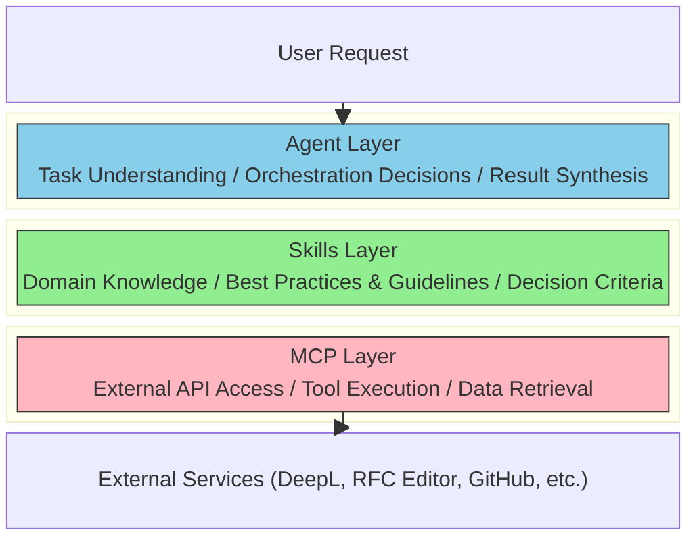
```mermaid
block-beta
    columns 1

    USER["User Request"]:1

    block:AGENT_LAYER:1
        columns 1
        AGENT["Agent Layer\nTask Understanding / Orchestration Decisions / Result Synthesis"]
    end

    block:SKILL_LAYER:1
        columns 1
        SKILL["Skills Layer\nDomain Knowledge / Best Practices & Guidelines / Decision Criteria"]
    end

    block:MCP_LAYER:1
        columns 1
        MCP["MCP Layer\nExternal API Access / Tool Execution / Data Retrieval"]
    end

    EXTERNAL["External Services (DeepL, RFC Editor, GitHub, etc.)"]:1

    USER --> AGENT
    MCP --> EXTERNAL

    style AGENT fill:#87CEEB,color:#333,stroke:#333
    style SKILL fill:#90EE90,color:#333,stroke:#333
    style MCP fill:#FFB6C1,color:#333,stroke:#333
```

::: tip Doctrine Layer — "Constitutional Judgment Criteria"
These three layers define **what AI knows** and **what AI can do**. The question of **on what basis AI judges and decides** is addressed by the [Doctrine Layer](./07-doctrine-and-intent). The Doctrine Layer is not merely a system prompt — it is **constitutional judgment criteria** that governs all three layers through shared objectives, constraints, and judgment criteria.

The [Responsibility Shift Model](./01-vision#the-responsibility-shift-model) defined in the Vision (design-time: human / execution-time: agent / structural constraints: system) and the [two-layer verification structure](./01-vision#the-responsibility-shift-model) (guardrails + evaluation pipelines) are applied to each layer through this Doctrine Layer.
:::

### Layer Responsibilities

Each layer has distinct ownership and responsibility areas:

| Layer      | Responsibility                 | Owns             | Examples                                 |
| ---------- | ------------------------------ | ---------------- | ---------------------------------------- |
| **Agent**  | Orchestration, decision-making | Task flow        | Claude Code, Cursor                      |
| **Skills** | Domain knowledge, guidelines   | Best practices   | SOLID principles, translation guidelines |
| **MCP**    | External connectivity          | Tool definitions | deepl-mcp, rfcxml-mcp                    |

## About This Document

AI-driven development involves multiple components, and correctly understanding their roles and relationships is key to efficient development. This document organizes four main concepts: MCP (tool connectivity), A2A (agent-to-agent communication), Skill (static knowledge), and Custom Sub-agents (role specialization).

When you are unsure about "What should be implemented as MCP?", "When is a Skill sufficient?", or "When should I use a sub-agent?", refer to this document to make the appropriate choice.

## Overall Architecture

The following diagram shows how all components interact within the complete system architecture:

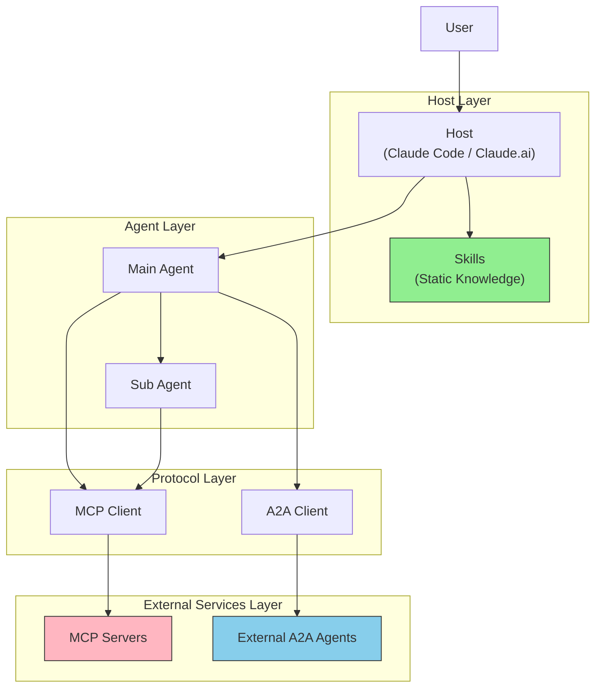
```mermaid
flowchart TB
    USER["User"]

    subgraph HOST_LAYER["Host Layer"]
        HOST["Host<br>(Claude Code / Claude.ai)"]
        SKILL["Skills<br>(Static Knowledge)"]
    end

    subgraph AGENT_LAYER["Agent Layer"]
        MAIN["Main Agent"]
        SUB["Sub Agent"]
    end

    subgraph PROTOCOL_LAYER["Protocol Layer"]
        MCP_CLIENT["MCP Client"]
        A2A_CLIENT["A2A Client"]
    end

    subgraph EXTERNAL_LAYER["External Services Layer"]
        MCP_SERVER["MCP Servers"]
        A2A_AGENT["External A2A Agents"]
    end

    USER --> HOST
    HOST --> SKILL
    HOST --> MAIN
    MAIN --> SUB
    MAIN --> MCP_CLIENT
    MAIN --> A2A_CLIENT
    SUB --> MCP_CLIENT
    MCP_CLIENT --> MCP_SERVER
    A2A_CLIENT --> A2A_AGENT

    style SKILL fill:#90EE90,color:#333,stroke:#333
    style MCP_SERVER fill:#FFB6C1,color:#333,stroke:#333
    style A2A_AGENT fill:#87CEEB,color:#333,stroke:#333
```

## MCP Three-Layer Structure

### Host / Client / Server

MCP is built on a three-layer architecture, where communication flows through the client layer:

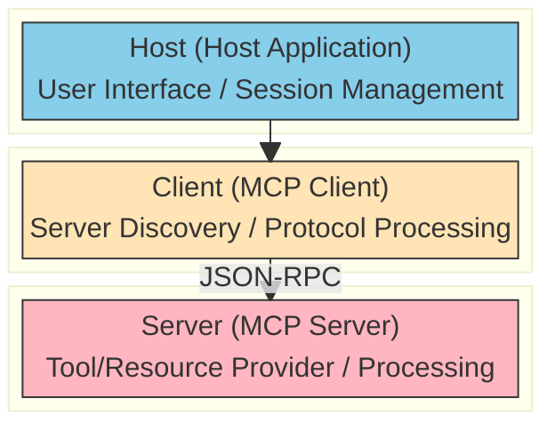
```mermaid
block-beta
    columns 1

    block:HOST_BLOCK:1
        HOST["Host (Host Application)\nUser Interface / Session Management"]
    end

    block:CLIENT_BLOCK:1
        CLIENT["Client (MCP Client)\nServer Discovery / Protocol Processing"]
    end

    block:SERVER_BLOCK:1
        SERVER["Server (MCP Server)\nTool/Resource Provider / Processing"]
    end

    HOST --> CLIENT
    CLIENT --"JSON-RPC"--> SERVER

    style HOST fill:#87CEEB,color:#333,stroke:#333
    style CLIENT fill:#FFE4B5,color:#333,stroke:#333
    style SERVER fill:#FFB6C1,color:#333,stroke:#333
```

| Layer      | Role                                   | Example                      | Developer Involvement |
| ---------- | -------------------------------------- | ---------------------------- | --------------------- |
| **Host**   | UI, session management                 | Claude Code, Cursor, VS Code | Consumer              |
| **Client** | Protocol processing, server management | Built into Host              | Usually not concerned |
| **Server** | Tool/resource provision                | rfcxml-mcp, deepl-mcp        | **Provider**          |

### Why You Don't Need to Worry About the Client

For most developers, the client layer operates transparently as part of the host:

```
Typical development flow:
1. Create an MCP Server (e.g., rfcxml)
2. Add it to Claude Code configuration
3. Claude Code operates as a built-in Client
4. Tools become available

→ The Client is embedded in the Host and
   functions as a black box
```

## MCP and A2A: Separation of Concerns

### Protocol Differences

While MCP and A2A serve different purposes, they are complementary and address different communication needs:

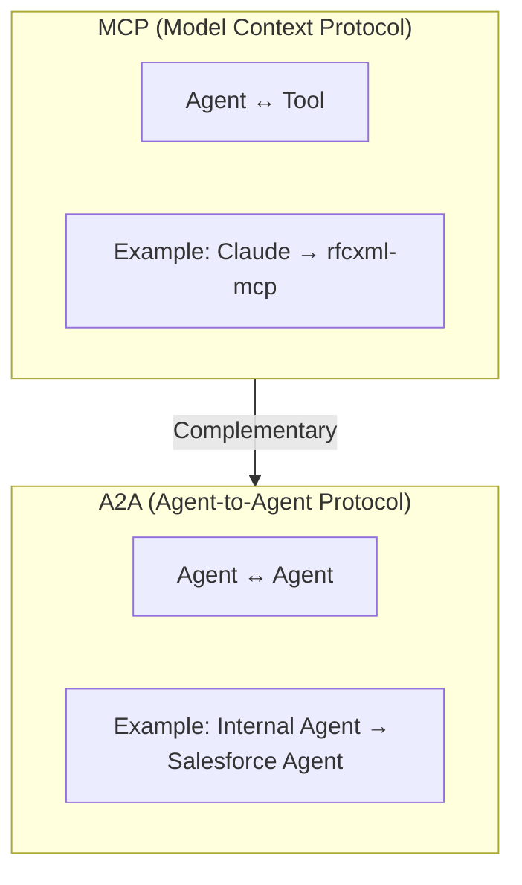
```mermaid
graph TB
    subgraph MCP["MCP (Model Context Protocol)"]
        MCP_DESC["Agent ↔ Tool"]
        MCP_EXAMPLE["Example: Claude → rfcxml-mcp"]
    end

    subgraph A2A["A2A (Agent-to-Agent Protocol)"]
        A2A_DESC["Agent ↔ Agent"]
        A2A_EXAMPLE["Example: Internal Agent → Salesforce Agent"]
    end

    MCP -->|Complementary| A2A
```

| Item            | MCP                         | A2A                                  |
| --------------- | --------------------------- | ------------------------------------ |
| **Led by**      | Anthropic                   | Google → Linux Foundation            |
| **Purpose**     | Tool connectivity           | Agent-to-agent communication         |
| **Connects to** | MCP Server (tools)          | Other agents (including third-party) |
| **Context**     | Can share with parent agent | Completely isolated                  |
| **Owner**       | Self                        | Self or **others**                   |

### Official Recommendation

> Build with ADK, equip with **MCP** (tools), communicate with **A2A** (agents)

```
MCP = Using hands (tools)
A2A = Collaborating with others (agents)
```

## Custom Sub-agents

### What is a Sub-agent?

An **AI assistant specialized for specific tasks** that can be defined within Claude Code.

```
Location:
├── Project: .claude/agents/xxx.md (Priority: High)
└── User:    ~/.claude/agents/xxx.md (Priority: Low)
```

### Definition Format

Sub-agents are defined using a simple markdown format that specifies their role, capabilities, and instructions:

```markdown
name: rfc-specialist
description: Expert in RFC specification verification and validation
tools: rfcxml:get_rfc_structure, rfcxml:get_requirements
model: sonnet

You are an expert in RFC specifications.
Use only the rfcxml tools.
```

### Additional Definition Example

Here is a more practical sub-agent that combines multiple MCPs and Skills:

```markdown
name: compliance-checker
description: Expert agent for legal and technical compliance checking
tools: hourei:find_law_article, rfcxml:get_requirements, rfcxml:validate_statement
model: sonnet

You are an expert in legal and technical specification compliance checking.

1. Retrieve legal requirements via hourei-mcp
2. Retrieve technical requirements via rfcxml-mcp
3. Map both and report compliance status

Always cite sources (legal article numbers, RFC section numbers).
```

### Sub-agent Positioning

The following diagram illustrates where sub-agents sit within the Claude Code architecture:

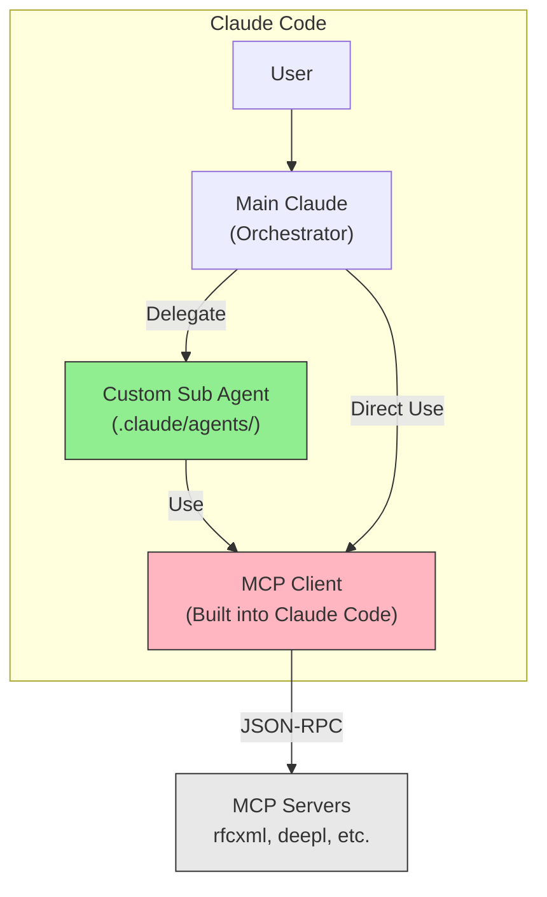
```mermaid
flowchart TB
    subgraph CLAUDE_CODE["Claude Code"]
        USER["User"]
        MAIN["Main Claude<br>(Orchestrator)"]
        SUBAGENT["Custom Sub Agent<br>(.claude/agents/)"]
        MCP_CLIENT["MCP Client<br>(Built into Claude Code)"]

        USER --> MAIN
        MAIN --"Delegate"--> SUBAGENT
        SUBAGENT --"Use"--> MCP_CLIENT
        MAIN --"Direct Use"--> MCP_CLIENT
    end

    MCP_SERVERS["MCP Servers<br>rfcxml, deepl, etc."]

    MCP_CLIENT --"JSON-RPC"--> MCP_SERVERS

    style MCP_CLIENT fill:#FFB6C1,color:#333,stroke:#333
    style SUBAGENT fill:#90EE90,color:#333,stroke:#333
    style MCP_SERVERS fill:#E8E8E8,color:#333,stroke:#333
```

**Important**: Sub-agents are not a "replacement" for the MCP Client, but rather a "higher layer"

- **Sub-agent** = Defines "what to do" (role, procedures)
- **MCP Client** = Implements "how to connect" (protocol processing)

## Skill

### What is a Skill?

**Static knowledge and guidelines** that can be referenced in Claude Code. Skills are stored in the following locations:

```
Location:
├── Project: .claude/skills/xxx/SKILL.md
└── User:    ~/.claude/skills/xxx/SKILL.md
```

### Skill Characteristics

In the [Four-Layer Reference Model](./02-reference-sources#_3-1-the-four-layer-model), Level 3 (organization rules) and Level 4 (best practices) use Skills as their primary delivery method. Skills have these key characteristics that distinguish them from other approaches:

| Item                    | Description                                      |
| ----------------------- | ------------------------------------------------ |
| **Format**              | Markdown file                                    |
| **Content**             | Best practices, workflow definitions, guidelines |
| **Execution**           | None (reference only)                            |
| **Context consumption** | Low (only when referenced)                       |

## MCP vs Skill vs Sub-agent

### Decision Flow

Use this flowchart to determine whether to implement something as a Skill, MCP, or Sub-agent:

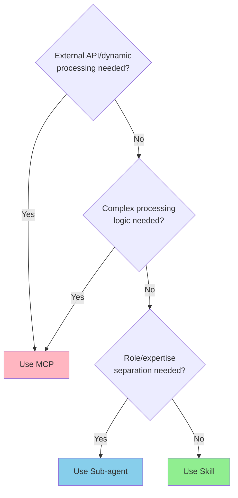
```mermaid
graph TB
    Q1{External API/dynamic<br/>processing needed?}
    Q1 -->|Yes| MCP[Use MCP]
    Q1 -->|No| Q2{Complex processing<br/>logic needed?}
    Q2 -->|Yes| MCP
    Q2 -->|No| Q3{Role/expertise<br/>separation needed?}
    Q3 -->|Yes| AGENT[Use Sub-agent]
    Q3 -->|No| SKILL[Use Skill]

    style MCP fill:#FFB6C1,color:#333
    style SKILL fill:#90EE90,color:#333
    style AGENT fill:#87CEEB,color:#333
```

### Comparison Table

| Aspect                  | Skill                | MCP                  | Sub-agent                 |
| ----------------------- | -------------------- | -------------------- | ------------------------- |
| **Context consumption** | Low                  | High                 | Medium                    |
| **Dynamic processing**  | Not possible         | Possible             | Possible                  |
| **External API**        | Not possible         | Possible             | Via MCP                   |
| **Maintenance**         | Markdown editing     | npm publish, etc.    | Markdown editing          |
| **Reusability**         | Within project       | Global               | Within project            |
| **Use case**            | Knowledge/guidelines | Tool/API integration | Role/expertise separation |

### Principles for Choosing

```
Skill = "Knowledge", "Guidelines", "Workflow definitions"
MCP   = "Tools", "API integration", "Dynamic processing"
Sub-agent = "Roles", "Expertise", "Task delegation"

Use Skills to define "what should be done"
Use MCP to provide "how to execute it"
Use Sub-agents to separate "who does it"
```

## A2A vs Sub-agent

### Fundamental Differences

| Aspect                      | Custom Sub-agent             | A2A Agent                             |
| --------------------------- | ---------------------------- | ------------------------------------- |
| **Location**                | Within same process          | Over the network                      |
| **Owner**                   | Self                         | Self or **others**                    |
| **Trust**                   | Full trust                   | Authentication/authorization required |
| **Context**                 | Partially shared with parent | Completely isolated                   |
| **Lifecycle**               | Session-limited              | Persistent service                    |
| **Internal implementation** | Visible (Markdown)           | Not visible (API contract only)       |

### Analogy

```
Custom Sub-agent = "Internal specialized department"
A2A Agent        = "Outsourcing partner / Partner company"

Even with internal specialized departments, outsourcing partners are needed
Even with outsourcing partners, internal specialized departments are needed

→ Both are necessary; they are not substitutes for each other
```

### When to Use Which

| Scenario                                          | What to Use |
| ------------------------------------------------- | ----------- |
| Want to use your own MCP expertly                 | Sub-agent   |
| Want to reuse the same processing repeatedly      | Sub-agent   |
| Want to define a workflow                         | Sub-agent   |
| Integrate with third-party agents                 | A2A         |
| Expose your agent externally                      | A2A         |
| Agent collaboration across multiple organizations | A2A         |

## Executor Selection

Beyond choosing MCP / Skill / Sub-agent, the perspective of **"who makes the decision"** becomes crucial.

### Evolution of Execution

The way we integrate with external services has evolved with technology.

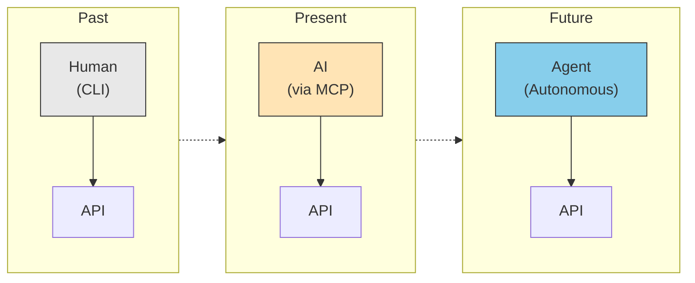
```mermaid
flowchart LR
    subgraph PAST["Past"]
        direction TB
        HUMAN["Human<br>(CLI)"]
        API1["API"]
        HUMAN --> API1
    end

    subgraph PRESENT["Present"]
        direction TB
        AI["AI<br>(via MCP)"]
        API2["API"]
        AI --> API2
    end

    subgraph FUTURE["Future"]
        direction TB
        AGENT["Agent<br>(Autonomous)"]
        API3["API"]
        AGENT --> API3
    end

    PAST -.-> PRESENT -.-> FUTURE

    style HUMAN fill:#E8E8E8,color:#333,stroke:#333
    style AI fill:#FFE4B5,color:#333,stroke:#333
    style AGENT fill:#87CEEB,color:#333,stroke:#333
```

In this evolution, **not everything needs to be MCP-ified**.
The appropriate layer is determined by "who makes the decision".

### Layer Selection by Decision Maker

Choose the implementation layer based on who makes the decision:

| Decision Maker                 | Appropriate Layer | Characteristics                     | Examples                                    |
| ------------------------------ | ----------------- | ----------------------------------- | ------------------------------------------- |
| **None** (Deterministic)       | Direct program    | No judgment needed, fast, reliable  | Batch processing, CI/CD, cron               |
| **Human**                      | CLI               | Human decides, AI doesn't execute   | `gh pr list`, `aws s3 ls`                   |
| **AI** (One-shot)              | MCP + Skill       | AI decides and executes per request | Translation, RFC lookup, quality evaluation |
| **AI** (Continuous/Autonomous) | Sub-agent         | Autonomous decisions with expertise | Review specialist, translation specialist   |

### Decision Flow

This comprehensive flowchart guides the selection process from initial request through final implementation:

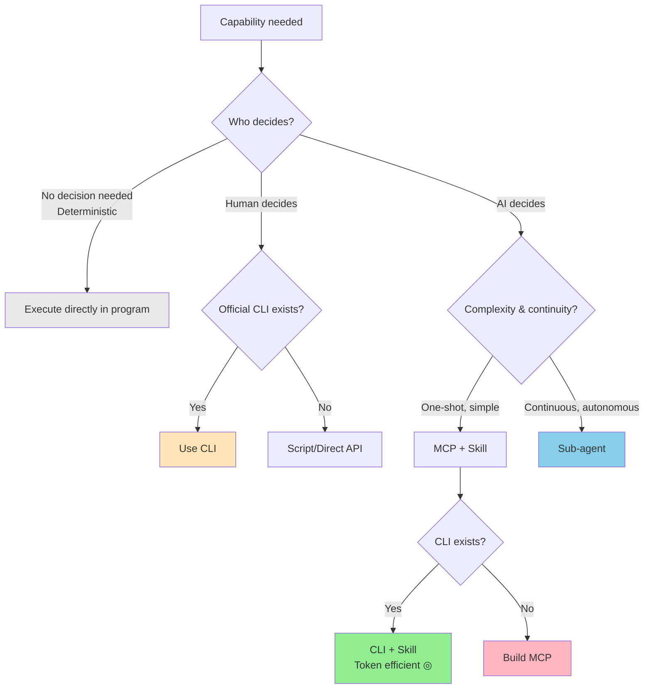
```mermaid
flowchart TD
    START[Capability needed] --> Q0{Who decides?}

    Q0 -->|No decision needed<br/>Deterministic| PG[Execute directly in program]
    Q0 -->|Human decides| HUMAN{Official CLI exists?}
    Q0 -->|AI decides| AI{Complexity & continuity?}

    HUMAN -->|Yes| CLI[Use CLI]
    HUMAN -->|No| SCRIPT[Script/Direct API]

    AI -->|One-shot, simple| MCP_SKILL[MCP + Skill]
    AI -->|Continuous, autonomous| SUBAGENT[Sub-agent]

    MCP_SKILL --> Q2{CLI exists?}
    Q2 -->|Yes| CLI_SKILL[CLI + Skill<br/>Token efficient ◎]
    Q2 -->|No| MCP_BUILD[Build MCP]

    style PG fill:#E8E8E8,color:#333
    style CLI fill:#FFE4B5,color:#333
    style CLI_SKILL fill:#90EE90,color:#333
    style MCP_BUILD fill:#FFB6C1,color:#333
    style SUBAGENT fill:#87CEEB,color:#333
```

### CLI vs MCP: When AI Makes the Decision

> **Key Insight**: When an official CLI exists, **CLI + Skill** is more efficient than building an MCP
>
> _— From r/ClaudeAI community discussion_

When both a CLI and an MCP are possible options, use this comparison table to choose the more efficient approach:

| Aspect                | CLI + Skill          | MCP                               |
| --------------------- | -------------------- | --------------------------------- |
| **Token consumption** | Low (command only)   | High (loads all tool definitions) |
| **Startup cost**      | None                 | Requires server process           |
| **Authentication**    | Local                | Managed by MCP                    |
| **Purpose-built**     | ◎ (Dedicated design) | △ (General purpose)               |

#### Examples

These examples illustrate the decision for popular services:

| Service      | CLI      | Recommendation |
| ------------ | -------- | -------------- |
| GitHub       | `gh`     | CLI + Skill    |
| AWS          | `aws`    | CLI + Skill    |
| Google Cloud | `gcloud` | CLI + Skill    |
| PostgreSQL   | `psql`   | CLI + Skill    |
| Linear       | ❌       | MCP            |
| Greptile     | ❌       | MCP            |
| DeepL        | ❌       | MCP            |

### Key Insight

The fundamental principle for layer selection is:

```
Selection changes based on "who decides", not just "what to execute"

No decision needed  → Direct program
Human decides       → CLI
AI decides          → MCP or CLI + Skill
AI autonomous       → Sub-agent
```

With this perspective, you can avoid over-MCPization and implement at the appropriate layer.

## Combination Patterns

### The Most Powerful Combination

The most effective approach combines all three components working together:

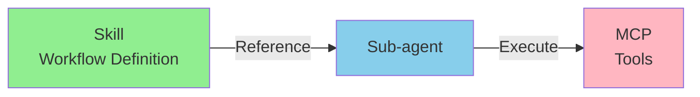
```mermaid
graph LR
    SKILL[Skill<br/>Workflow Definition] -->|"Reference"| AGENT[Sub-agent]
    AGENT -->|"Execute"| MCP[MCP<br/>Tools]

    style SKILL fill:#90EE90,color:#333
    style MCP fill:#FFB6C1,color:#333
    style AGENT fill:#87CEEB,color:#333
```

### Concrete Example: Translation Workflow

Here is a practical example showing how Skill, Sub-agent, and MCP work together:

```markdown
<!-- skills/translation-workflow/SKILL.md -->

# Technical Document Translation Workflow

## MCP Tools Used

- `deepl` - Translation execution
- `xcomet` - Quality evaluation

## Guardrails (Inviolable Constraints)

- Registered glossary terms must always be used
- Do not add content not present in the source text

## Workflow

1. Translate with deepl:translate-text (formality: "more")
2. Evaluate with xcomet:xcomet_evaluate (evaluation pipeline)
   - Score 0.85 or higher: OK
   - Score below 0.85: Re-translate or manual correction
3. Detect errors with xcomet:xcomet_detect_errors
```

> This example is a concrete implementation pattern of the [two-layer verification structure](./01-vision#the-responsibility-shift-model) defined in the Vision. Glossary adherence corresponds to **guardrails** (inviolable constraints), while the xCOMET score corresponds to the **evaluation pipeline** (probabilistic quality gate).

```markdown
<!-- agents/translation-specialist.md -->

name: translation-specialist
description: Specialized agent for technical document translation and quality evaluation
tools: deepl:translate-text, xcomet:xcomet_evaluate, xcomet:xcomet_detect_errors
model: sonnet

You are an expert in technical translation.
Please refer to the translation-workflow skill.
```

## Sequence Diagrams: Visualizing Execution Flow

Sequence diagrams help visualize how components interact during task execution.

### Code Review Task

Here is how a code review task flows through the system:

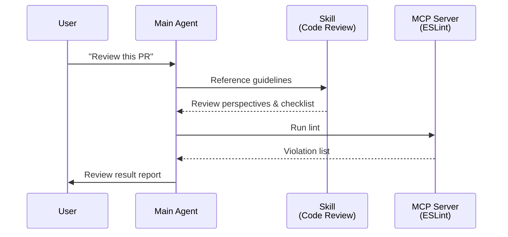
```mermaid
sequenceDiagram
    participant U as User
    participant M as Main Agent
    participant S as Skill<br/>(Code Review)
    participant MCP as MCP Server<br/>(ESLint)

    U->>M: "Review this PR"
    M->>S: Reference guidelines
    S-->>M: Review perspectives & checklist
    M->>MCP: Run lint
    MCP-->>M: Violation list
    M->>U: Review result report
```

### Translation Workflow

Here is the sequence for a translation task with quality evaluation:

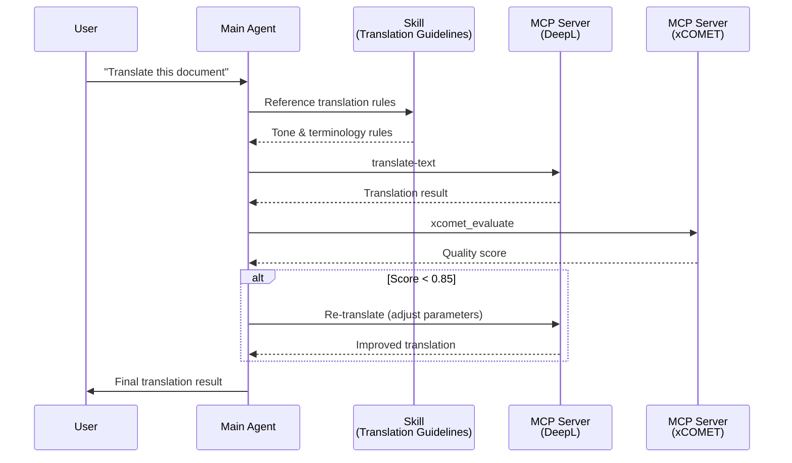
```mermaid
sequenceDiagram
    participant U as User
    participant M as Main Agent
    participant S as Skill<br/>(Translation Guidelines)
    participant D as MCP Server<br/>(DeepL)
    participant X as MCP Server<br/>(xCOMET)

    U->>M: "Translate this document"
    M->>S: Reference translation rules
    S-->>M: Tone & terminology rules
    M->>D: translate-text
    D-->>M: Translation result
    M->>X: xcomet_evaluate
    X-->>M: Quality score
    alt Score < 0.85
        M->>D: Re-translate (adjust parameters)
        D-->>M: Improved translation
    end
    M->>U: Final translation result
```

## What the Three-Layer Model Does Not Explicitly Cover — Memory

The three-layer model (Agent / Skills / MCP) defines **what an agent knows, what it can do, and on what basis it judges**. However, **how an agent remembers past interactions and outcomes and how it leverages that history** — namely Memory — is outside the scope of this model.

::: tip Why Memory Is Not Included in the Three Layers
Memory is inherently **dynamic**, changing as conversations progress. In contrast, Skills are static domain knowledge and MCP is an explicit protocol interface — both are **declaratively definable** elements. Memory differs fundamentally in nature, and placing it alongside these layers would compromise the model's clarity.

Furthermore, Memory implementation varies significantly across LLMs and platforms:

- **Context window** (short-term memory): Present in all LLMs, but size and lifecycle are model-dependent
- **Persistent memory**: Platform-specific features (e.g., ChatGPT Memory) or application-layer implementations (e.g., LangChain `ConversationBufferMemory`)
- **`CLAUDE.md`**: A concept close to "project-level memory" in Claude Code, but strictly an instruction file rather than Memory

Until unified protocols or standards are established, it is more appropriate to design Memory individually during the implementation phase rather than incorporating it into the three-layer model.
:::

::: warning This Does Not Mean Memory Can Be Ignored
In actual agent design, Memory is an essential concern. Within the three-layer model, the Skills layer implicitly covers "long-term memory" of domain knowledge, and the MCP layer covers "reference memory" of external context. For conversation history and learning outcome retention, consider implementation strategies during the [Development Phases](../workflows/development-phases).
:::

## Layer Structure Summary

The following layered structure shows how all components integrate. The [Doctrine Layer](./07-doctrine-and-intent) (constraints, objectives, judgment criteria) governs all layers. In terms of information flow: doctrine constraints descend from above, resource facts ascend from below, and agent decision-making occurs at the center.

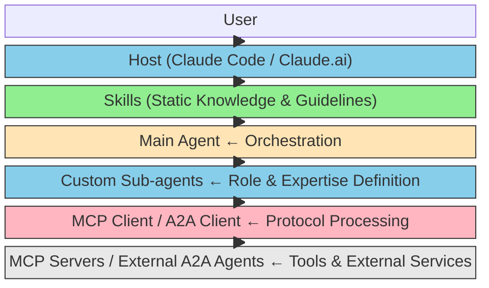
```mermaid
block-beta
    columns 1

    USER["User"]:1
    HOST["Host (Claude Code / Claude.ai)"]:1
    SKILLS["Skills (Static Knowledge & Guidelines)"]:1
    MAIN["Main Agent ← Orchestration"]:1
    SUBAGENT["Custom Sub-agents ← Role & Expertise Definition"]:1
    PROTOCOL["MCP Client / A2A Client ← Protocol Processing"]:1
    EXTERNAL["MCP Servers / External A2A Agents ← Tools & External Services"]:1

    USER --> HOST
    HOST --> SKILLS
    SKILLS --> MAIN
    MAIN --> SUBAGENT
    SUBAGENT --> PROTOCOL
    PROTOCOL --> EXTERNAL

    style HOST fill:#87CEEB,color:#333,stroke:#333
    style SKILLS fill:#90EE90,color:#333,stroke:#333
    style MAIN fill:#FFE4B5,color:#333,stroke:#333
    style SUBAGENT fill:#87CEEB,color:#333,stroke:#333
    style PROTOCOL fill:#FFB6C1,color:#333,stroke:#333
    style EXTERNAL fill:#E8E8E8,color:#333,stroke:#333
```
