# AI Design Patterns and the Role of MCP

> As AI systems have advanced, how has the industry addressed the LLM's "knowledge limitations"? Where does MCP fit in, and what makes it different?

## About This Document

Implementing generative AI (LLM) in practical systems requires more than the capabilities of the model alone. AI knowledge has inherent limitations (see [01-vision.md](./01-vision.md)), and various design patterns have emerged to overcome them.

This document provides an overview of major design patterns and carefully explains the differences between RAG (Retrieval-Augmented Generation) and MCP. The goal is to answer questions like "What's the difference between RAG and MCP?" and "Why does this project choose MCP?"

## LLM's "Knowledge Limitations" — Why External Knowledge is Needed

LLMs are probabilistic generative models trained on massive amounts of text data. They possess remarkably broad knowledge, but have clear limitations (see Chapter 1 of [02-reference-sources.md](./02-reference-sources.md) for details).

```
LLM Knowledge
┌─────────────────────────────────────────┐
│  ✅ Pre-trained knowledge (vast but fixed) │
│     - General knowledge, programming, languages │
│     - Information up to training cutoff       │
├─────────────────────────────────────────┤
│  ❌ Knowledge it lacks                  │
│     - Information after training cutoff     │
│     - Internal documents and proprietary data │
│     - Rare specialized knowledge (obscure RFC details) │
│     - Real-time information                │
└─────────────────────────────────────────┘
```

Various design patterns have been devised to address this "missing knowledge."

## Major AI Design Patterns

### 2.1 Overview of Patterns

Here's a summary of the major design patterns for addressing LLM knowledge limitations.

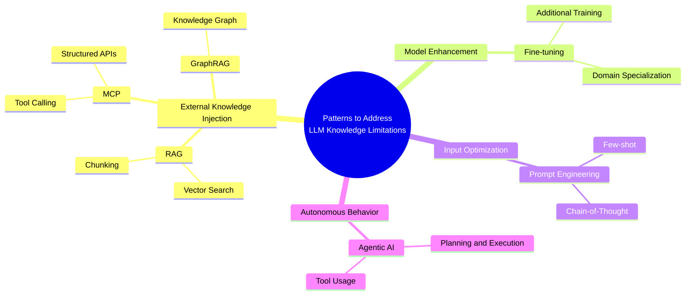

### 2.2 Overview of Each Pattern

#### RAG (Retrieval-Augmented Generation)

A technique that searches external documents and injects relevant information into the LLM's prompt. Rather than modifying the LLM itself, it combines "retrieval + generation."

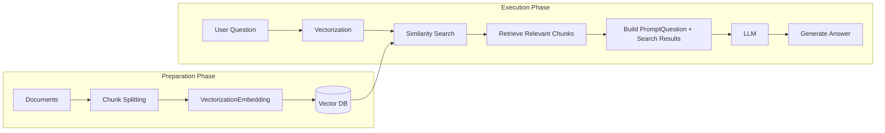

**Key Point**: The core of RAG is searching information using "vector similarity." Documents are split into small fragments (chunks), and fragments semantically closest to the question are retrieved and passed to the LLM.

| Characteristic     | Description                                                    |
| ------------------ | -------------------------------------------------------------- |
| **Target**         | Unstructured text (documents, FAQs, internal wikis, etc.)      |
| **Search Method**  | Vector similarity search (semantic search)                     |
| **Pre-processing** | Document chunking → Vectorization → DB storage                 |
| **Strengths**      | Can find relevant information from large document collections  |
| **Weaknesses**     | Context is lost through chunking, doesn't understand structure |

#### MCP (Model Context Protocol)

A standard protocol developed by Anthropic for connecting AI models with external tools and services. It enables AIs to access external data through structured APIs and execute actions.

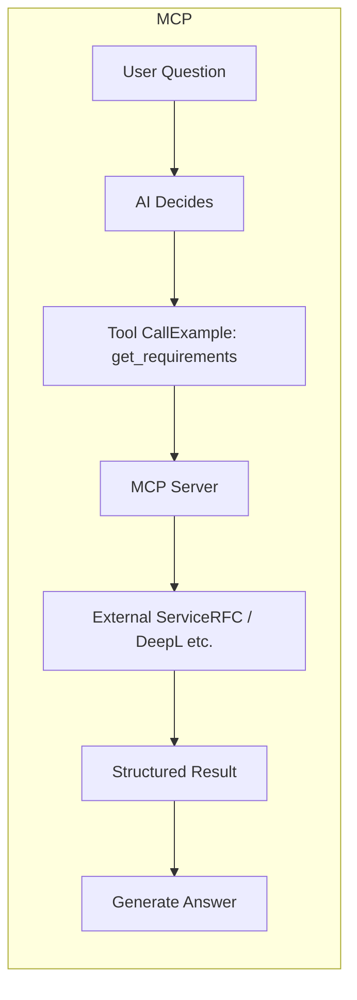

**Key Point**: The core of MCP is accessing information through "structured APIs." Data is retrieved with understanding of domain structure (sections, requirement levels, cross-references, etc.).

| Characteristic     | Description                                        |
| ------------------ | -------------------------------------------------- |
| **Target**         | Structured data, APIs, external services           |
| **Access Method**  | Structured API calls (JSON-RPC)                    |
| **Pre-processing** | Not required (MCP server understands structure)    |
| **Strengths**      | Accurate data retrieval, verifiable, distributable |
| **Weaknesses**     | Requires MCP server development                    |

> **MCP Details**: See [mcp/what-is-mcp.md](../mcp/what-is-mcp.md).

#### Fine-tuning

A technique that performs additional training of LLM parameters on domain-specific data. It rewrites the model's "internal knowledge."

```
Base Model (GPT-4, Claude, etc.)
    ↓ + Additional training with domain-specific data
Customized Model
    ↓
Can answer with domain-specific knowledge
```

| Characteristic         | Description                                                            |
| ---------------------- | ---------------------------------------------------------------------- |
| **Target**             | Domain-specific knowledge and style                                    |
| **Modified Component** | Model parameters themselves                                            |
| **Cost**               | High (data preparation + computational resources)                      |
| **Strengths**          | Deep knowledge embedding in the model                                  |
| **Weaknesses**         | Difficult to update, complete elimination of hallucinations impossible |

#### Prompt Engineering

A technique that controls output quality through careful input prompt design without modifying model parameters.

```
Main techniques:
- Zero-shot:         Instruction only
- Few-shot:          Provide several examples
- Chain-of-Thought:  "Think step by step"
- System Prompt:     Pre-define role and constraints
```

| Characteristic         | Description                                        |
| ---------------------- | -------------------------------------------------- |
| **Target**             | Any task                                           |
| **Modified Component** | Input prompt only                                  |
| **Cost**               | Lowest                                             |
| **Strengths**          | Can try immediately, no model modification needed  |
| **Weaknesses**         | Cannot supplement knowledge the model doesn't have |

#### Agentic AI

A pattern where the LLM autonomously plans, calls tools, and solves problems through multiple steps. MCP is one of the foundational technologies supporting this pattern.

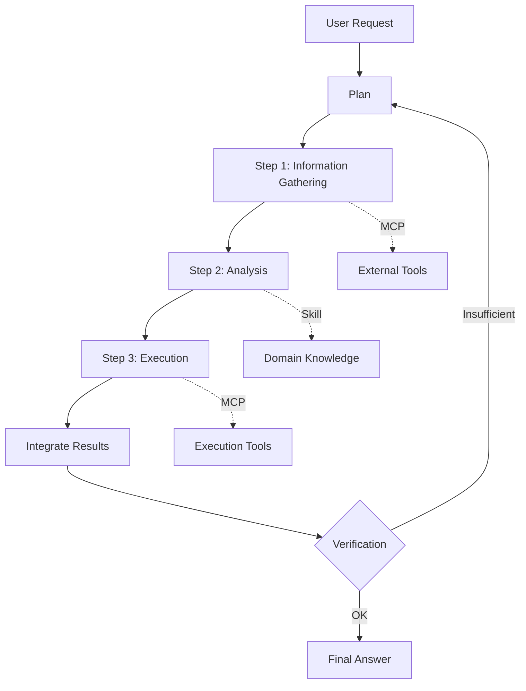

| Characteristic   | Description                                         |
| ---------------- | --------------------------------------------------- |
| **Target**       | Complex, multi-step tasks                           |
| **Operation**    | Autonomous planning → execution → verification loop |
| **Dependencies** | MCP (tool connection), Skills (knowledge reference) |
| **Strengths**    | Can automate complex tasks                          |
| **Weaknesses**   | Hard to predict, difficult to control in some cases |

> **Agent Details**: See [03-architecture.md](./03-architecture.md).

#### GraphRAG

A technique combining knowledge graphs with standard RAG to leverage relationships between entities.

```
Standard RAG:  Documents → Chunks → Vector Search
GraphRAG:      Documents → Entity Extraction → Build Relationship Graph → Graph Search
```

| Characteristic | Description                                             |
| -------------- | ------------------------------------------------------- |
| **Target**     | Data where relationships between entities are important |
| **Strengths**  | Strong at "How does A relate to B?"                     |
| **Weaknesses** | High cost of graph construction                         |

### 2.3 Pattern Comparison Table

| Pattern                | Problem Solved                           | Modified Component | Cost        | Real-time                             |
| ---------------------- | ---------------------------------------- | ------------------ | ----------- | ------------------------------------- |
| **RAG**                | Knowledge completion                     | Prompt             | Medium      | △ (depends on index update frequency) |
| **MCP**                | Tool connection, accurate data retrieval | Prompt             | Medium-High | ◎ (Real-time)                         |
| **Fine-tuning**        | Domain specialization                    | Model parameters   | High        | ✗ (retraining needed)                 |
| **Prompt Engineering** | Output quality control                   | Prompt             | Low         | -                                     |
| **Agentic AI**         | Complex task automation                  | Architecture       | High        | ◎                                     |
| **GraphRAG**           | Relationship understanding               | Prompt + Graph     | High        | △                                     |

### 2.4 Patterns Are Not Mutually Exclusive

These patterns **are not mutually exclusive; they can and should be combined**.

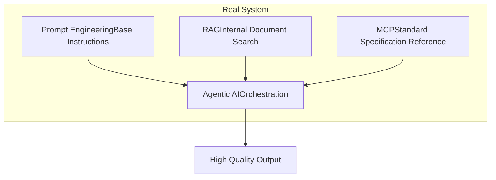

For example, a system where Agentic AI receives appropriate instructions through Prompt Engineering, searches internal documents through RAG as needed, and confirms standard specifications through MCP is entirely plausible.

## Deep Dive into RAG

### 3.1 How RAG Works

RAG is a technique published in 2020 by Meta's (formerly Facebook's) research team and is the most popular pattern for providing external knowledge to LLMs.

#### Step 1: Index Building (Offline)

```
Original Document:
  "RFC 6455 defines the WebSocket protocol.
   Section 5.5.1 specifies the format of Close frames,
   Section 7.4.1 defines status codes.
   1006 indicates abnormal closure and
   MUST NOT be included in Close frames."

    ↓ Chunk Splitting

Chunk 1: "RFC 6455 defines the WebSocket protocol.
         Section 5.5.1 specifies the format of Close frames"
Chunk 2: "Section 7.4.1 defines status codes.
         1006 indicates abnormal closure"
Chunk 3: "MUST NOT be included in Close frames."

    ↓ Vectorization (Embedding)

Chunk 1 → [0.12, -0.34, 0.56, ...]  ← Numerical vector, hundreds to thousands of dimensions
Chunk 2 → [0.23, -0.11, 0.78, ...]
Chunk 3 → [0.45, -0.67, 0.12, ...]

    ↓ Store in Vector DB
```

#### Step 2: Search and Generation (Online)

```
User Question: "What does WebSocket status code 1006 mean?"

    ↓ Vectorize Question

Question Vector → [0.21, -0.15, 0.72, ...]

    ↓ Similarity Search (Cosine Similarity, etc.)

Closest Chunk → Chunk 2:
  "Section 7.4.1 defines status codes.
   1006 indicates abnormal closure"

    ↓ Inject into Prompt

"Please answer the question using the following information.
 ---
 Section 7.4.1 defines status codes.
 1006 indicates abnormal closure
 ---
 Question: What does WebSocket status code 1006 mean?"

    ↓ LLM Generates Answer
```

### 3.2 RAG Strengths and Typical Use Cases

Here are the scenarios where RAG is particularly effective.

| Use Case                     | Description                                                       | Example                      |
| ---------------------------- | ----------------------------------------------------------------- | ---------------------------- |
| **Internal Document Search** | Retrieve information from large amounts of internal documentation | Internal Wiki, Manuals, FAQs |
| **Customer Support**         | Generate answers from product knowledge base                      | Help Center, Chatbots        |
| **Academic Research**        | Extract relevant information from paper databases                 | Literature review support    |
| **Legal Support**            | Similarity search of contracts and case law                       | Finding similar clauses      |

**What RAG Excels At**: Finding information that is "semantically similar" from large amounts of unstructured text.

### 3.3 RAG Limitations

However, RAG has structural limitations.

#### Loss of Context Through Chunk Splitting

```
Original Context:
  "1006 indicates abnormal closure and
   MUST NOT be included in Close frames."

After Chunking:
  Chunk A: "1006 indicates abnormal closure"          ← Retrieved
  Chunk B: "MUST NOT be included in Close frames"     ← May not be retrieved

→ Risk of losing the important MUST NOT requirement
```

#### Insufficient Structure Understanding

```
What RAG Returns:
  "1006 indicates abnormal closure" (text fragment)

What RAG Cannot Return:
  - That this is defined in Section 7.4.1
  - That it is a MUST NOT level requirement
  - The relationship with Close frame format in Section 5.5.1
  - Its position in RFC 6455 as a whole
```

#### Search Precision Limitations

Vector similarity search returns things that are "semantically similar" but not necessarily "exactly matching."

```
Question: "What is the meaning of RFC 6455 status code 1002?"

Chunks that Might Be Returned:
  ✅ "1002 indicates a protocol error" (correct)
  ❌ "1006 indicates abnormal closure" (semantically similar, but not what was asked)
  ❌ "1000 indicates normal closure" (same category but different code)
```

## Where RAG Fits in the Architecture — What Should Users Do?

After understanding how RAG works, a common question arises:

> "I get that RAG is important. But **what should I actually do?**"

To answer this, let's position RAG within this project's architecture.

### 3.5.1 RAG Is a "Design Pattern," Not a "Standard"

First, an important premise: **RAG is not a standardized protocol**.

| Aspect | RAG | MCP | Skills |
| --- | --- | --- | --- |
| **Type** | Design pattern | Standard protocol (with spec) | Specification (Agent Skills Spec) |
| **Standardization** | None (no RFC or W3C spec exists) | [modelcontextprotocol.io](https://modelcontextprotocol.io) | [agentskills.io](https://agentskills.io) |
| **Implementation uniformity** | Vendor-specific (LangChain, LlamaIndex, Bedrock, etc.) | Standard SDKs (TypeScript/Python) | Standard format (SKILL.md) |
| **Interoperability** | None | Yes (any agent can connect) | Yes (16+ agents supported) |

In other words, RAG only has **conceptual consensus** — "retrieve, inject into context, generate" — while the concrete implementation is left to each vendor.

### 3.5.2 RAG Is an Internal Processing Pipeline of the Agent

RAG processing is executed as an **internal operation** of the agent, invisible to the user.

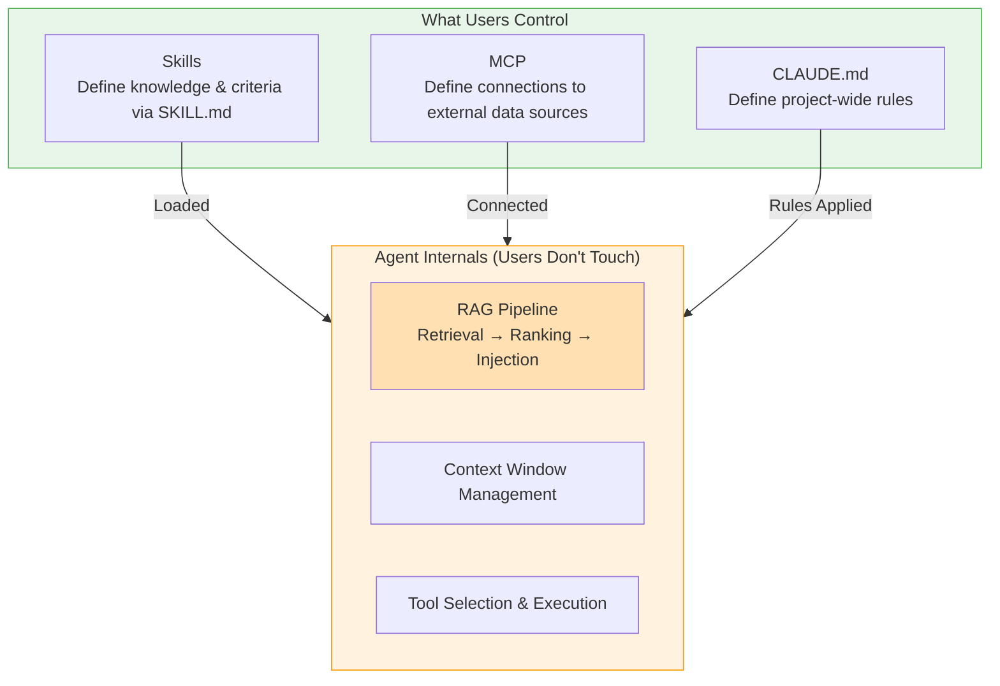

The key point here:

- **Users define "what to search" and "what knowledge to use"** → via Skills and MCP
- **The agent decides "how to search and how to inject"** → via the RAG pipeline

Users don't operate RAG directly — they **benefit from RAG indirectly through Skills and MCP**.

### 3.5.3 What Should Users Do?

To maximize the benefits of RAG, here's what users can do:

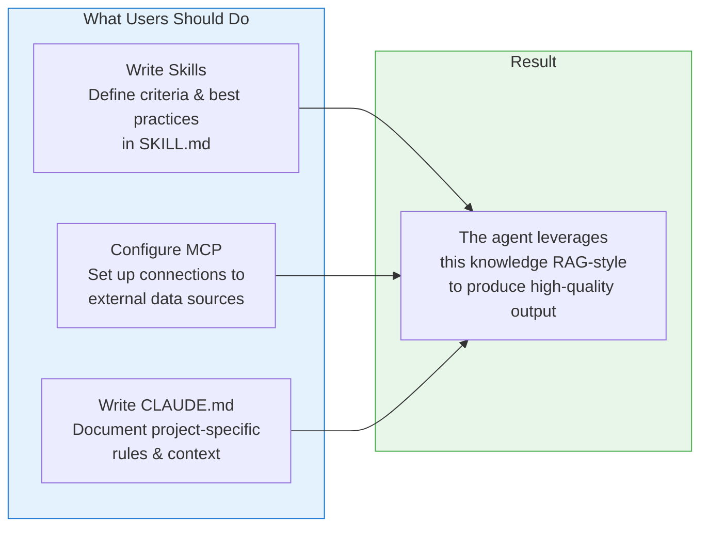

| Action | Concrete Steps | Relationship to RAG |
| --- | --- | --- |
| **Define Skills** | Write translation quality criteria, code review guidelines, spec compliance checklists as SKILL.md | Becomes the "static knowledge base" the agent references |
| **Connect MCP** | Configure MCP servers for vector DBs, RFCs, legislation, DeepL, etc. | Becomes the "external data source" the agent searches |
| **Write CLAUDE.md** | Document project policies, terminology, constraints | Constantly injected as the agent's "context" |

> **Takeaway**: You don't need to build or control RAG yourself. Your role as a user is to tell the agent "what it should know" through **standardized interfaces** — Skills, MCP, and CLAUDE.md.

## Essential Differences Between RAG and MCP

### 4.1 Fundamental Difference in Approach

Both RAG and MCP "provide external knowledge to LLMs," but their approaches differ fundamentally.

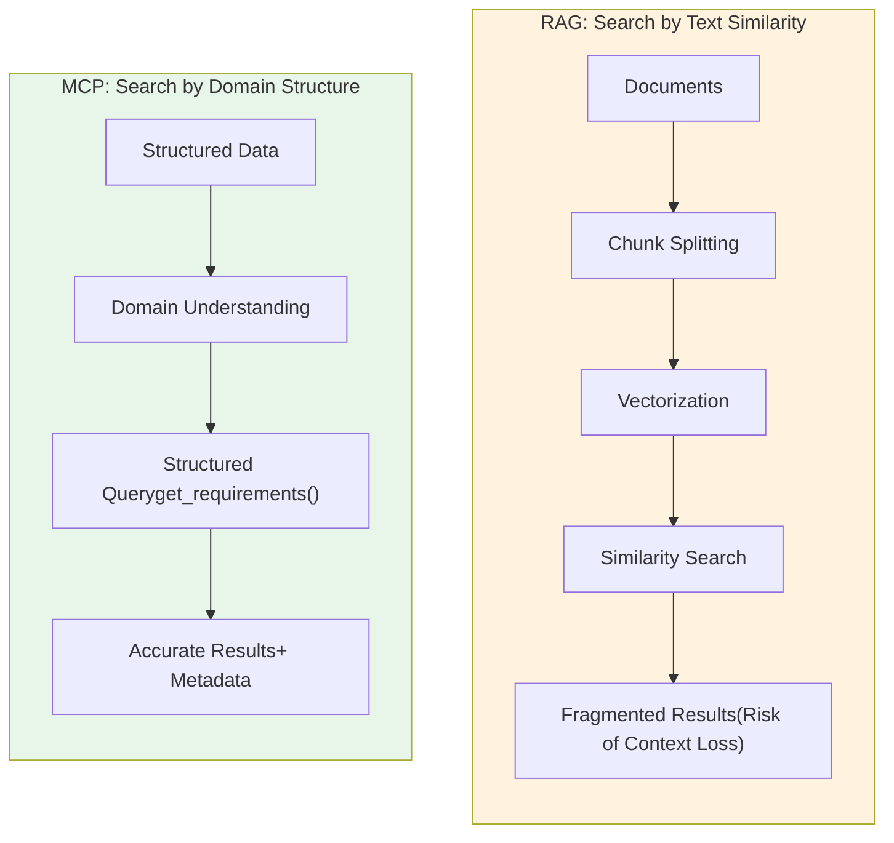

| Aspect               | RAG                                   | MCP                                             |
| -------------------- | ------------------------------------- | ----------------------------------------------- |
| **Search Principle** | Semantic similarity of text           | Precise query based on domain structure         |
| **Prerequisite**     | Can chunk documents                   | Exists an API that understands domain structure |
| **Result Nature**    | "Probably relevant" text fragments    | "Definitely applicable" structured data         |
| **Source Clarity**   | Ambiguous (hard to trace which chunk) | Clear (RFC 6455 Section 7.4.1, etc.)            |

### 4.2 Comparison by the 5 Characteristics of "Unshakeable References"

Comparing by the five characteristics of "unshakeable references" defined in [02-reference-sources.md](./02-reference-sources.md) makes the differences even clearer.

| Characteristic                       | RAG | MCP (Reference MCP) | Description                                                                           |
| ------------------------------------ | --- | ------------------- | ------------------------------------------------------------------------------------- |
| **Authority**                        | △   | ◎                   | RAG chunk origins are ambiguous. MCP accesses the original source directly            |
| **Immutability, Version Management** | △   | ◎                   | RAG depends on index update timing. MCP reflects original version management          |
| **Structuring**                      | ✗   | ◎                   | RAG loses structure through chunking. MCP preserves sections and requirement levels   |
| **Verifiability**                    | △   | ◎                   | RAG makes it difficult to trace "which chunk generated this." MCP shows exact sources |
| **Accessibility**                    | ○   | ◎                   | Both are programmatically accessible, but MCP uses a standard protocol                |

### 4.3 Comparison with Concrete Examples

#### Example: "What is the meaning of Close code 1006 in RFC 6455?"

**With RAG:**

```
1. Pre-process RFC 6455 full text into chunks and store in vector DB
2. Vectorize question and search similar chunks
3. Returned chunk:
   "1006 is a reserved value and MUST NOT be set as a status code
    in a Close control frame by an endpoint."

Problems:
- Unclear that this chunk comes from Section 7.4.1
- Requirement level MUST NOT not attached as metadata
- Surrounding context (why MUST NOT) may be missing
- May return a different chunk (explanation of 1002, etc.)
```

**With rfcxml-mcp:**

```
1. Call get_requirements(rfc=6455, section="7.4.1")
2. Returned result:
   {
     section: "7.4.1",
     requirement: "1006 is a reserved value and MUST NOT be set
                   as a status code in a Close control frame
                   by an endpoint.",
     level: "MUST NOT",
     context: "It is designated for use in applications
               expecting a status code to indicate that
               the connection was closed abnormally"
   }

Benefits:
- Section number is clear (Section 7.4.1)
- Requirement level is structured (MUST NOT)
- Surrounding context is preserved
- Can even verify implementation compliance with validate_statement()
```

#### Example: "What are the requirements of Article 2 of the Electronic Signature Act?"

**With RAG:**

```
Chunk the entire law → Search chunks related to "Article 2"
→ Law structure (articles, subsections, items) is lost
→ Risk of mixing pre-amendment and post-amendment versions
```

**With hourei-mcp (e-gov-law MCP):**

```
Call find_law_article(law_name="Electronic Signature Act", article_number="2")
→ Can retrieve the law text structure (subsections, items) intact
→ Get latest law data (real-time from e-Gov API)
```

### 4.4 Distribution Capability Difference

MCP has a decisive advantage: "it can be distributed as a standard protocol."

```
Sharing RAG Pipeline:
  1. Document preparation
  2. Implement chunking logic
  3. Select Embedding model
  4. Build and operate vector DB
  5. Tune search parameters
  → Each organization must build independently

Sharing MCP Server:
  npx @shuji-bonji/rfcxml-mcp
  → Anyone can get structured RFC access with just this
```

| Aspect                  | RAG                                  | MCP                                     |
| ----------------------- | ------------------------------------ | --------------------------------------- |
| **Distribution Method** | Independent construction required    | Can be distributed as npm package, etc. |
| **Deployment Cost**     | Vector DB construction + indexing    | Single configuration file               |
| **Quality Consistency** | Depends on builder's skills          | Developer ensures quality               |
| **Maintenance**         | Each organization handles separately | Developer updates centrally             |

## MCP Servers in This Project vs RAG

### 5.1 "Isn't This Just RAG in Disguise?" Question

Looking at this project's related MCP servers (rfcxml-mcp, w3c-mcp, pdf-spec-mcp, epsg-mcp, etc.), one might think "searching external specifications and passing them to LLM" is the same as RAG.

However, there is a fundamental difference.

### 5.2 "Text Search" vs "Domain Knowledge Codification"

Each MCP server provides **an API that understands the target domain's structure and semantics**. This is not merely text search; it is **the codification of domain knowledge**.

| MCP Server         | Structure It Understands                                                                         | What RAG Loses                                                           |
| ------------------ | ------------------------------------------------------------------------------------------------ | ------------------------------------------------------------------------ |
| **rfcxml-mcp**     | Section hierarchy, MUST/SHOULD/MAY classification, RFC cross-references (obsoletes/updates)      | Distinction of requirement levels, relationships between sections        |
| **w3c-mcp**        | WebIDL definitions, CSS specification structure, HTML element attributes and content models      | Type information of interfaces, inheritance relationships of properties  |
| **pdf-spec-mcp**   | ISO 32000 chapter structure, requirement tables, term definitions                                | Table structure, differences between specification versions              |
| **epsg-mcp**       | Recommended uses of coordinate reference systems, transformation paths, accuracy characteristics | Spatial scope of applicability, transformation accuracy information      |
| **pdf-reader-mcp** | Internal object structure of PDFs, tag hierarchy, font information                               | Binary structure interpretation, reference relationships between objects |

### 5.3 Practical Differences

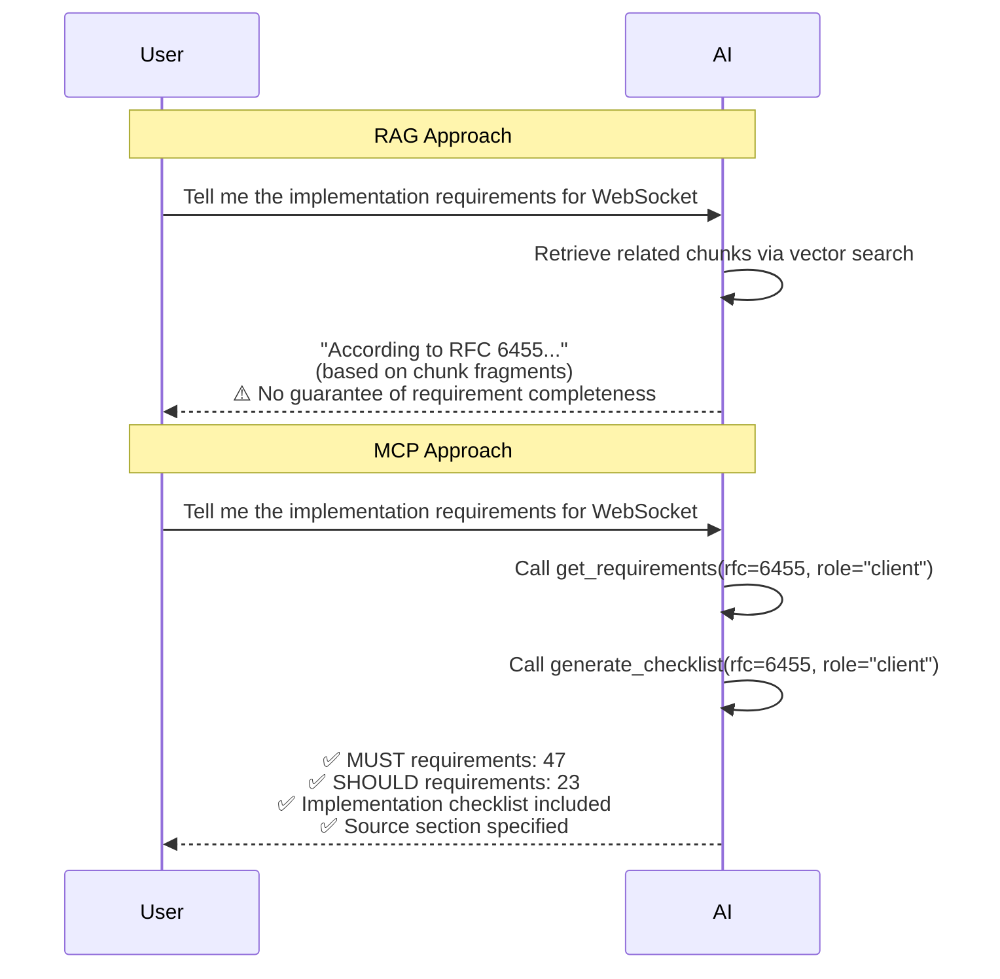

## When to Use RAG vs MCP

### 6.1 Decision Flow

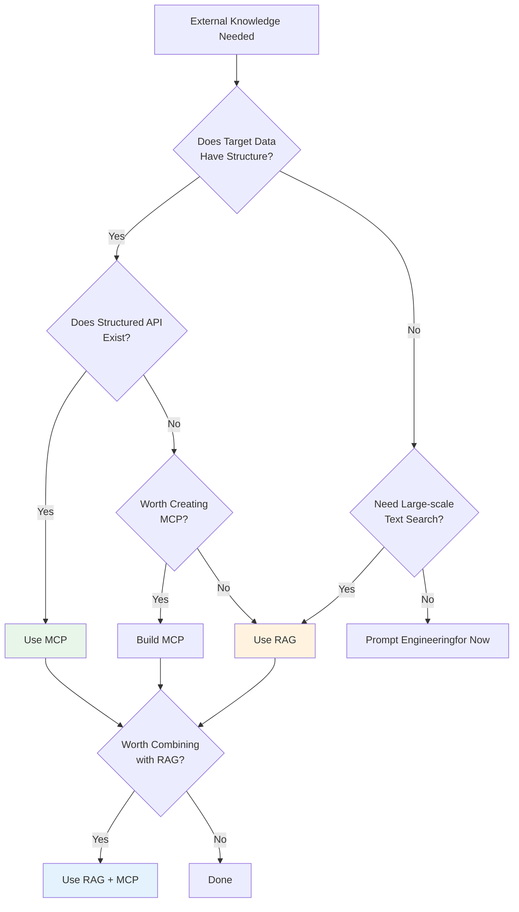

### 6.2 Selection Guide

| Scenario                           | Recommended          | Reason                                               |
| ---------------------------------- | -------------------- | ---------------------------------------------------- |
| **Verify RFC/W3C compliance**      | **MCP**              | Need structured requirement extraction               |
| **Search internal documents**      | **RAG**              | Large-scale unstructured text search                 |
| **Get law article text**           | **MCP**              | Need to preserve article, subsection, item structure |
| **Customer support FAQs**          | **RAG**              | Flexible handling of diverse questions               |
| **Translation quality evaluation** | **MCP**              | Structured scores and error detection                |
| **Summarize research papers**      | **RAG**              | Process large volumes of unstructured text           |
| **PDF spec requirement check**     | **MCP**              | Accurate retrieval of tables and requirement levels  |
| **Team knowledge sharing**         | **RAG** or **Skill** | Choose based on context                              |

### 6.3 Combined Patterns

RAG and MCP are not mutually exclusive. The following combined patterns are conceivable.

**Pattern: Understand Overview with RAG → Verify Accuracy with MCP**

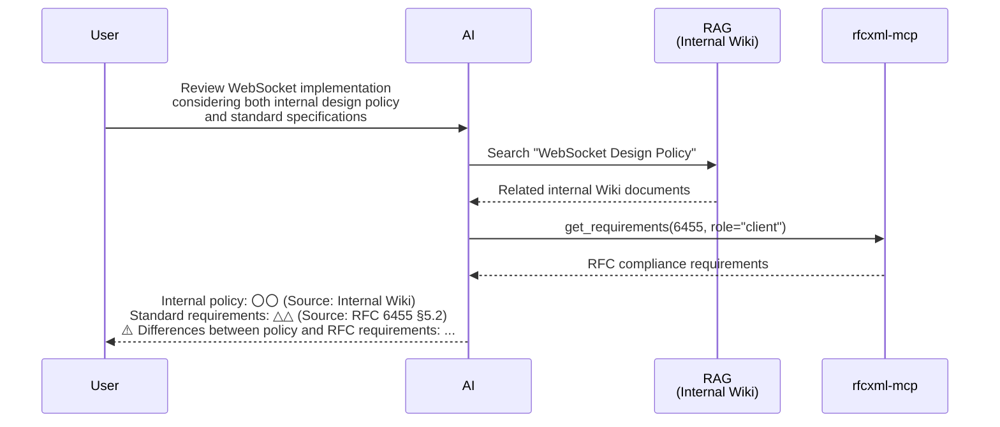

## Why This Project Chooses MCP

### 7.1 Alignment with Project Philosophy

The core philosophy of this project is "unshakeable references" (see [01-vision.md](./01-vision.md)).

```
RAG returns "probably relevant information"    → Can be unreliable
MCP returns "definitely applicable information" → Reliable
```

To give AI output **verifiable foundations**, clear sources and structured data access are essential. This is the fundamental reason why this project centers on MCP.

### 7.2 The 3 Values of MCP

The value that MCP provides in this project's context can be summarized in three points.

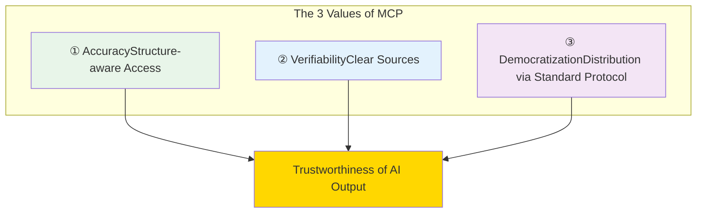

1. **Accuracy**: Retrieve accurate information through APIs that understand domain structure
2. **Verifiability**: Source (RFC number, section number, etc.) is always explicit
3. **Democratization**: Can be distributed as npm packages, providing everyone equal quality access

### 7.3 We Are Not Rejecting RAG

As an important caveat, this project is not rejecting RAG. RAG is a very powerful technique for the purpose of "finding relevant information from large amounts of unstructured text."

However, **for the purpose of providing "unshakeable references" to AI judgment**, MCP's approach is more appropriate. Each pattern has appropriate use cases.

```
RAG's appropriate use:  "Want to find likely related items from lots of documents"
MCP's appropriate use:  "Want to get accurate information from specific standards/regulations"

→ Different purposes, so it's about choosing the right tool, not ranking
```

## Summary

### Core Messages

1. **Generative AI has various design patterns** — RAG, MCP, Fine-tuning, Agentic AI, etc., each solves different problems
2. **RAG searches by "text similarity"** — Strong at finding related information from large amounts of unstructured text
3. **MCP searches by "domain structure"** — Retrieves accurate information through structured APIs
4. **MCP is better suited for "unshakeable references"** — MCP has advantages in authority, structuring, verifiability, and distributability
5. **RAG and MCP are not mutually exclusive** — Each has appropriate use cases, and combined use is possible
6. **Each MCP server codifies domain knowledge** — Not merely text search, but provides understanding of structure

### Related Documents

- [01-vision.md](./01-vision.md) — AI limitations and the need for "unshakeable references"
- [02-reference-sources.md](./02-reference-sources.md) — System of reference sources by five characteristics
- [03-architecture.md](./03-architecture.md) — Composition theory of MCP/Skills/Agents
- [mcp/what-is-mcp.md](../mcp/what-is-mcp.md) — MCP details
- [skills/vs-mcp.md](../skills/vs-mcp.md) — Choosing between MCP and Skills
