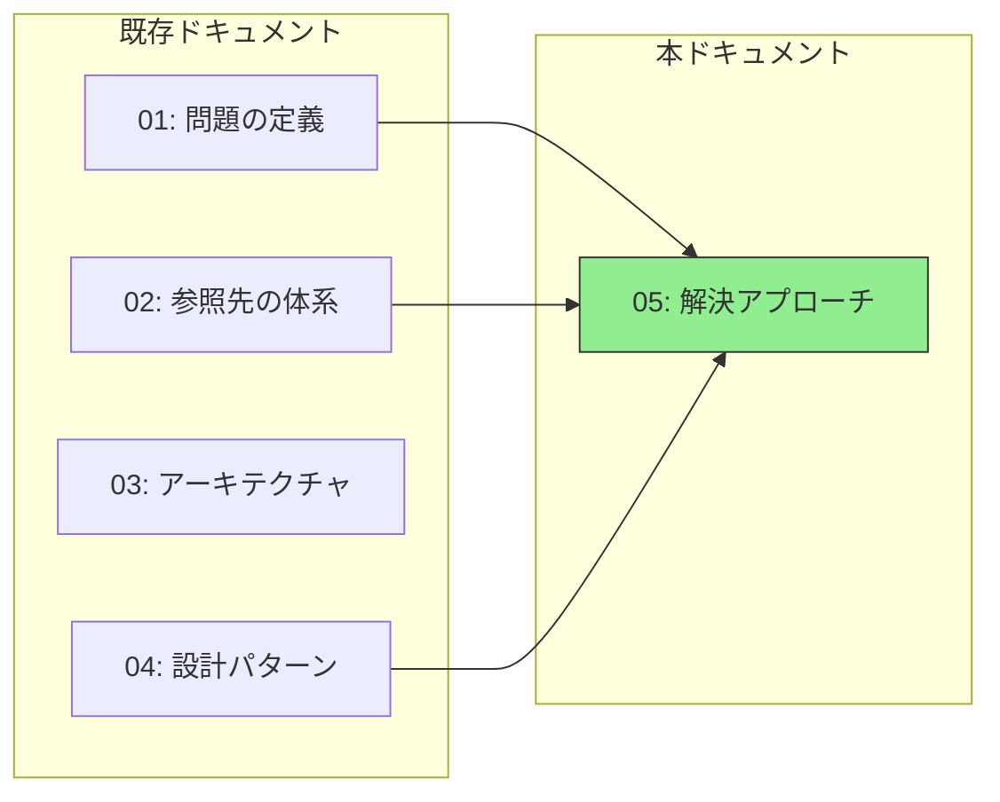
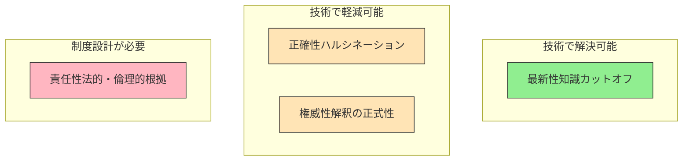
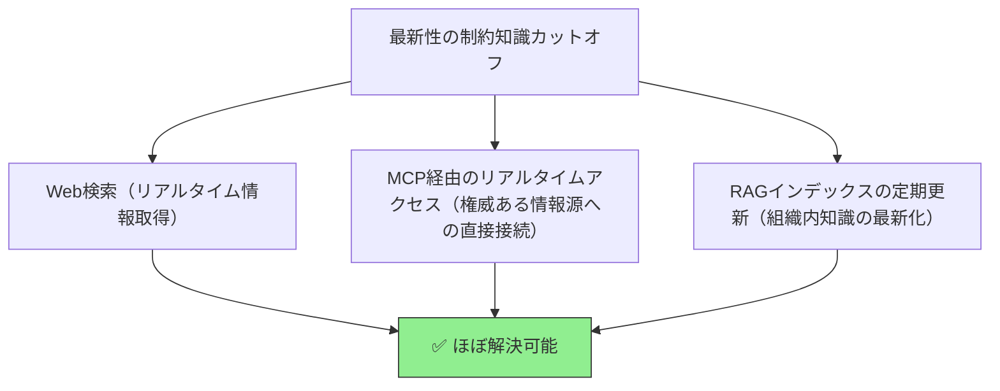
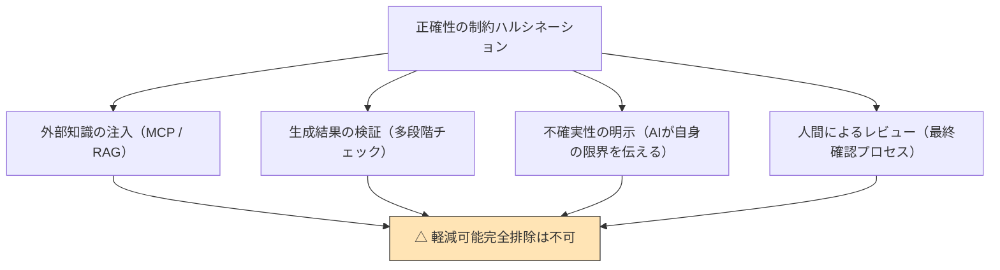
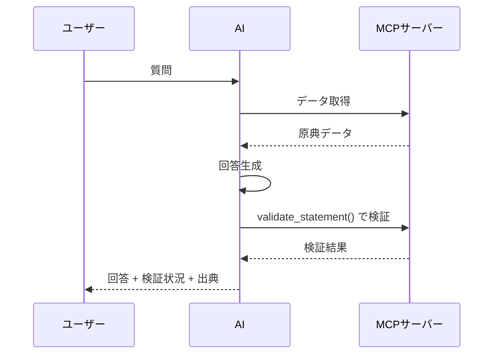
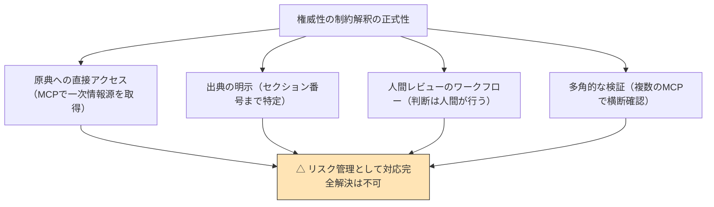
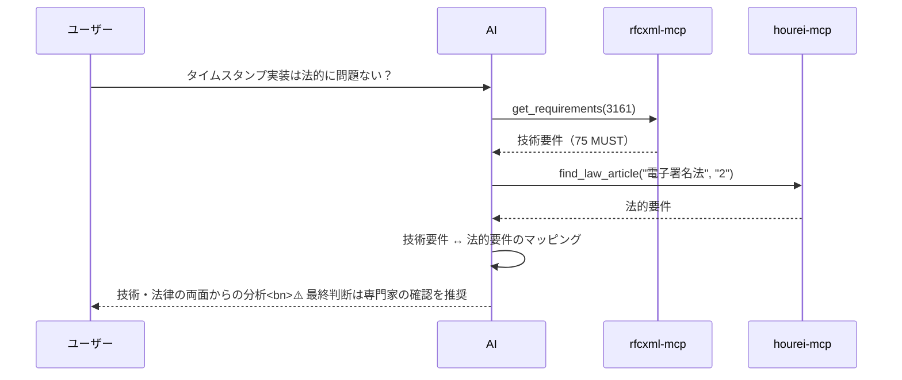
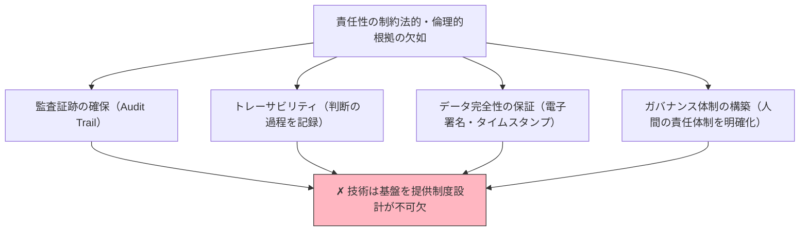
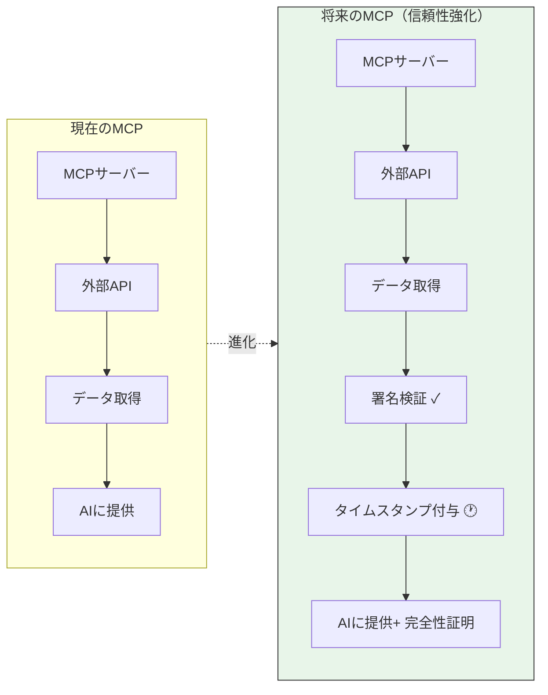
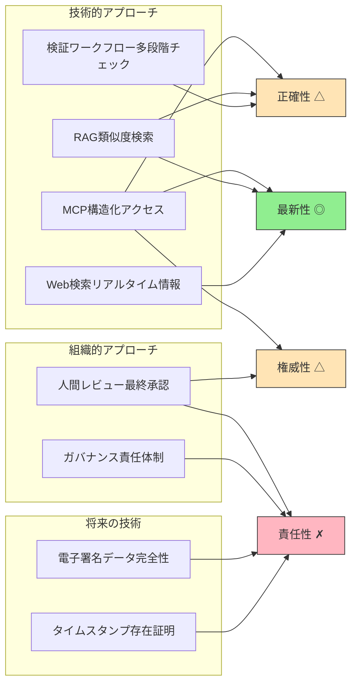

# AI制約を解決する — 現時点で実際に使えるアプローチ

> AIの4つの根本的制約に対して、「今、何ができるのか」を整理する。

## このドキュメントについて

[01-vision.md](./01-vision.ja.md) と [02-reference-sources.md](./02-reference-sources.ja.md) では、AIの4つの根本的制約（正確性・最新性・権威性・責任性）を**問題として定義**した。[04-ai-design-patterns.md](./04-ai-design-patterns.ja.md) では、RAGやMCPなどの**設計パターン**を整理した。

本ドキュメントでは、それらの制約に対して**現時点で実際に使える解決アプローチ**を整理する。完璧な解決策は存在しないが、各制約の性質を理解し、適切なアプローチを組み合わせることで、実用的なレベルまでリスクを低減できる。



## 4つの制約と解決可能性の概観

まず全体像を把握する。4つの制約は、その性質によって**解決の可能性が大きく異なる**。



| 制約       | 解決可能性                 | 理由                                                             |
| ---------- | -------------------------- | ---------------------------------------------------------------- |
| **最新性** | ◎ ほぼ解決可能             | Web検索やMCP経由のリアルタイムアクセスで対処できる               |
| **正確性** | △ 軽減可能、完全排除は不可 | LLMの確率的生成という本質的性質から、原理的に完全排除はできない  |
| **権威性** | △ 軽減可能、完全解決は不可 | AIの出力はあくまで「一つの解釈」であり、公式見解にはなり得ない   |
| **責任性** | ✗ 技術だけでは解決不可     | 法的・倫理的な制度設計の領域であり、技術はその基盤を提供するのみ |

## 第1章：最新性の解決 — 最も手段が明確な制約

### 1.1 問題の本質

LLMの知識は学習データの時点で固定される（詳細: [02-reference-sources.md 1.2.2](./02-reference-sources.ja.md)）。しかし、この制約に対しては**外部情報源への接続**という明確な解決手段がある。

### 1.2 解決アプローチ



#### Web検索による最新情報取得

最も手軽な手段。Claude等のAIアシスタントは、組み込みのWeb検索機能でリアルタイム情報を取得できる。

| 利点                 | 制約                           |
| -------------------- | ------------------------------ |
| 追加コストなし       | 検索結果の信頼性は保証されない |
| すぐに利用可能       | 情報の構造化が不十分           |
| 幅広い情報源をカバー | ノイズが多い                   |

#### MCP経由のリアルタイムアクセス

権威ある情報源に**構造化された方法で**直接アクセスする。このプロジェクトが推進するアプローチ。

```
rfcxml-mcp   → IETFの最新RFCを直接取得
hourei-mcp   → e-Gov APIから最新法令を取得
w3c-mcp      → W3C/WHATWGの最新仕様を取得
```

| 利点                       | 制約                           |
| -------------------------- | ------------------------------ |
| 権威あるソースから直接取得 | MCPサーバーの開発・保守が必要  |
| 構造化されたデータ         | 対象ドメインごとにMCPが必要    |
| 検証可能な出典             | すべての情報源をカバーできない |

#### RAGインデックスの定期更新

組織内のドキュメントについては、RAGインデックスを定期的に更新することで最新性を確保できる。

### 1.3 実現度の評価

最新性は**4つの制約の中で最も解決手段が明確**であり、適切なツールを組み合わせることで実用レベルで解決可能である。残る課題は「すべての情報源をリアルタイムでカバーすることの現実的な困難さ」であり、これは運用上の問題として対処可能。

## 第2章：正確性の軽減 — 完全排除は原理的に不可能

### 2.1 問題の本質

ハルシネーション（事実と異なる情報の生成）は、LLMが「正しい」のではなく「もっともらしい」出力を確率的に生成するという**本質的な性質**に起因する（詳細: [02-reference-sources.md 1.2.1](./02-reference-sources.ja.md)）。

これは「バグ」ではなく「仕様」であり、**完全に排除することは原理的に不可能**である。

### 2.2 軽減アプローチ



#### 外部知識の注入（MCP / RAG）

AIに正確な情報源を提供することで、ハルシネーションの発生頻度を低減する。

```
MCPの効果:
  質問: 「RFC 6455のステータスコード1006の意味は？」

  MCP なし → AIが学習データから「もっともらしい」回答を生成（誤る可能性）
  MCP あり → rfcxml-mcp が原文を取得 → 正確な回答が可能

  → ハルシネーションの発生率が大幅に低下
```

ただし、MCPで取得したデータの**解釈**においてハルシネーションが発生する可能性は残る。

#### 生成結果の検証（多段階チェック）

AIの出力を別の手段で検証するワークフロー。



このプロジェクトのrfcxml-mcpの `validate_statement()` は、まさにこの用途のために設計されている。

#### 不確実性の明示

AIが自身の回答に確信を持てない場合、それを明示する仕組み。

```
確信度の段階:
  ✅ 確認済み: MCP/原典で検証できた情報
  ⚠️ 推定: 学習データに基づくが、原典で未検証
  ❓ 不確実: 情報が見つからない、または矛盾がある
```

#### 人間によるレビュー

最終的な品質保証として、人間によるレビュープロセスを設ける。特に重要な判断（法的判断、セキュリティ要件等）では不可欠。

### 2.3 実現度の評価

正確性の完全な保証は**原理的に不可能**だが、上記のアプローチを組み合わせることで、実用上のリスクを大幅に低減できる。重要なのは「AIの出力をそのまま信じない」文化と、検証可能なワークフローの構築である。

## 第3章：権威性の確保 — 完全解決ではなくリスク管理

### 3.1 問題の本質

AIの出力は「一つの解釈」であり、**公式な見解ではない**（詳細: [02-reference-sources.md 1.2.3](./02-reference-sources.ja.md)）。RFC、法令、標準仕様の「正式な解釈」を提供できるのは、その策定主体（IETF、立法機関等）のみである。

この制約は、AIの性質というよりも**情報の権威性の本質**に起因するため、技術だけでは完全に解決できない。

### 3.2 対応アプローチ



#### 原典への直接アクセス

MCPを通じて一次情報源に直接アクセスし、AIの解釈ではなく**原文を提示**する。

```
AIの出力を権威づけるのではなく、
原典そのものを提示し、人間が判断できるようにする。

例:
  AI: 「RFC 6455 Section 7.4.1 の原文は以下の通りです」
      ↓ 原文を提示
  人間: 「なるほど、この場合はこう解釈すべきだ」
      ↓ 人間が判断
```

#### 出典の明示

すべてのAI出力に、参照した情報源のセクション番号まで明示する。これにより人間が**独立して検証**できる。

> 出力テンプレートの詳細は [02-reference-sources.md 第4章](./02-reference-sources.ja.md) を参照。

#### 人間レビューのワークフロー

権威性が求められる判断（法的判断、仕様解釈等）では、AIの出力を**下書き・参考情報として扱い**、最終判断を人間が行うワークフローを構築する。

```
AIの役割: 情報の収集・整理・候補の提示
人間の役割: 最終的な判断・承認

→ AIは「万能な回答者」ではなく「優秀なリサーチアシスタント」
```

#### 多角的な検証

複数のMCPを使って、異なる角度から情報を検証する。



### 3.3 実現度の評価

権威性を「完全に解決する」のではなく、**リスク管理**として対処する姿勢が重要。AIは権威ある情報源へのアクセスを**効率化**するが、権威そのものを**代替**することはできない。

## 第4章：責任性の確保 — 技術と制度設計の交差点

### 4.1 問題の本質

AIの出力には**説明責任（Accountability）の主体がない**（詳細: [02-reference-sources.md 1.2.4](./02-reference-sources.ja.md)）。これは技術的な問題というよりも、法的・倫理的な問題である。

### 4.2 技術が提供できる基盤

技術だけでは責任性を完全に解決できないが、責任性を支える**基盤**を提供できる。



#### 監査証跡の確保（Audit Trail）

AIがどのデータを参照し、どのような処理を経て出力を生成したかの記録。

```
記録すべき情報:
  - いつ: タイムスタンプ
  - 何を: 参照したデータソース（MCP呼び出しログ）
  - どう: 処理の過程（プロンプト、ツール呼び出しの連鎖）
  - 何を出力したか: 最終出力
```

#### トレーサビリティ

AIの出力から、参照した原典まで遡れること。MCPが提供する構造化された出典情報がこれを可能にする。

```
AIの出力: 「ステータスコード1006はClose frameに含めてはなりません」
    ↓ トレース
参照: rfcxml-mcp → get_requirements(6455, section="7.4.1")
    ↓ トレース
原典: RFC 6455, Section 7.4.1, MUST NOT requirement
    ↓ 検証
人間が原典を直接確認可能
```

ここでこそ、**オープンソースMCPの透明性**が価値を持つ。MCPサーバーのソースコードが公開されていれば、「データがどのように取得・加工されているか」をコードレベルで検証できる。プロプライエタリなパイプラインではこの検証が不可能であり、トレーサビリティの連鎖が途切れる。

#### データ完全性の保証

MCPが外部サービスから取得したデータが、改竄されていないことを保証する仕組み。将来的には以下のような技術の導入が必要になる。

| 技術                   | 目的                   | 標準               |
| ---------------------- | ---------------------- | ------------------ |
| **タイムスタンプ**     | データの存在時刻を証明 | RFC 3161           |
| **HTTPメッセージ署名** | 通信の真正性を保証     | RFC 9421           |
| **電子署名**           | データの非改竄を証明   | 電子署名法 / eIDAS |



現時点でMCPプロトコルにこのような仕組みは組み込まれていないが、MCPが外部サービスへの接続を担う以上、接続経路と取得データの完全性保証は**避けて通れない将来的課題**である。

#### ガバナンス体制の構築

技術の範疇を超えるが、AIの出力に対する責任体制を組織的に整備する必要がある。

```
誰が: AIの出力を最終承認するか
何に基づいて: どのガイドラインで判断するか
どう記録するか: 承認プロセスの証跡をどう残すか
問題発生時に: 誰がどのように対応するか
```

### 4.3 実現度の評価

責任性は**技術を超えた制度設計の領域**である。技術（監査証跡、トレーサビリティ、データ完全性）はその基盤を提供するが、最終的には法的枠組み・組織体制・業界標準の整備が必要。

現時点で個人や小チームができることは、**技術的な基盤をできる限り整備し、将来の制度設計に備える**ことである。このプロジェクトのMCPアプローチ（オープンソース、出典明示、構造化アクセス）は、まさにその基盤を構築している。

## 第5章：4つのアプローチの全体像

### 5.1 まとめ表

| 制約       | 解決可能性       | 主な手段                             | このプロジェクトの対応         |
| ---------- | ---------------- | ------------------------------------ | ------------------------------ |
| **最新性** | ◎ ほぼ解決可能   | Web検索、MCP、RAG更新                | rfcxml-mcp等でリアルタイム取得 |
| **正確性** | △ 軽減可能       | MCP/RAG注入、検証、不確実性明示      | validate_statement()、出典明示 |
| **権威性** | △ リスク管理     | 原典アクセス、出典明示、人間レビュー | MCP経由の一次情報源アクセス    |
| **責任性** | ✗ 制度設計が必要 | 監査証跡、トレーサビリティ、署名     | オープンソースMCPによる透明性  |

### 5.2 各アプローチと解決策のマッピング



### 5.3 重要な認識

```
AIの制約を「すべて技術で解決する」ことはできない。

正確性 → 技術で軽減し、残存リスクを受容する
最新性 → 技術でほぼ解決できる
権威性 → 技術でリスクを管理し、人間が最終判断する
責任性 → 技術は基盤を提供し、制度設計に委ねる

→ 重要なのは「完全な解決」を目指すことではなく、
  各制約の性質を理解し、適切なアプローチを選択すること
```

このプロジェクトのMCPアプローチは、4つすべての制約に対して部分的に寄与する。特に「ブレない参照先」を通じた正確性・最新性・権威性の向上と、オープンソースの透明性を通じた責任性の基盤構築が、現時点で実現可能な最善のアプローチである。

## 関連ドキュメント

- [01-vision.md](./01-vision.ja.md) — AIの限界の定義と「ブレない参照先」の必要性
- [02-reference-sources.md](./02-reference-sources.ja.md) — 5つの特性による参照先の体系
- [03-architecture.md](./03-architecture.ja.md) — MCP/Skills/Agentの構成論
- [04-ai-design-patterns.md](./04-ai-design-patterns.ja.md) — RAG/MCP等の設計パターン比較
- [mcp/what-is-mcp.md](../mcp/what-is-mcp.ja.md) — MCPの詳細
