# Solving AI Limitations — Practical Approaches Available Today

> Organizing what we can actually do now against AI's four fundamental limitations.

::: warning Positioning of This Page
[01-vision](./01-vision) (**WHY** — Why unshakeable references are needed)  
→ [02-reference-sources](./02-reference-sources) (**WHAT** — What qualifies as a reference source)  
→ [03-architecture](./03-architecture) (**HOW** — How to structure the system)  
→ [04-ai-design-patterns](./04-ai-design-patterns) (**WHICH** — Which pattern to choose and when)  
→ **This page (REALITY — How far can we address each constraint?)**

This page treats AI constraints not as "defects" but as **"properties"**, and **draws the boundary** between what is solvable and what is not.
:::

## About This Document

In [01-vision](./01-vision) and [02-reference-sources](./02-reference-sources), we **defined the problem** of AI's four fundamental limitations (accuracy, currency, authority, and accountability). In [04-ai-design-patterns](./04-ai-design-patterns), we organized **design patterns** such as RAG and MCP.

This document organizes **practical solution approaches available today** to address these limitations. While perfect solutions don't exist, by understanding the nature of each constraint and combining appropriate approaches, we can reduce risks to a practical level.

### What This Document Does Not Solve

This document does **not promise** the following. Stated explicitly to avoid misunderstanding.

| What this document shows                    | What this document does NOT guarantee                 | What it provides instead                            |
| ------------------------------------------- | ----------------------------------------------------- | --------------------------------------------------- |
| Boundary of solvability for each constraint | That all AI constraints can be resolved by technology | Realistic coping strategies per constraint          |
| Mitigation approaches via MCP/RAG etc.      | Complete elimination of hallucinations                | Verification workflows + explicit uncertainty       |
| Technical foundation for accountability     | Resolution of legal/ethical responsibility issues     | Design guidelines for audit trails and traceability |

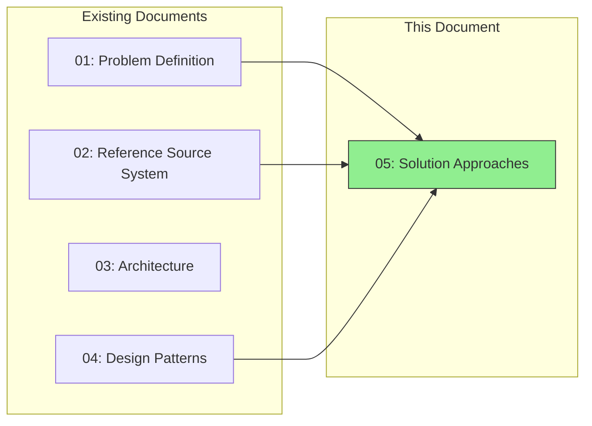
```mermaid
flowchart LR
    subgraph EXISTING["Existing Documents"]
        V["01: Problem Definition"]
        R["02: Reference Source System"]
        A["03: Architecture"]
        D["04: Design Patterns"]
    end

    subgraph THIS["This Document"]
        S["05: Solution Approaches"]
    end

    V --> S
    R --> S
    D --> S

    style S fill:#90EE90,color:#333,stroke:#333
```

## Four Constraints and Solution Feasibility Overview

First, let's understand the full picture. The four constraints have **very different possibilities for solutions** depending on their nature.

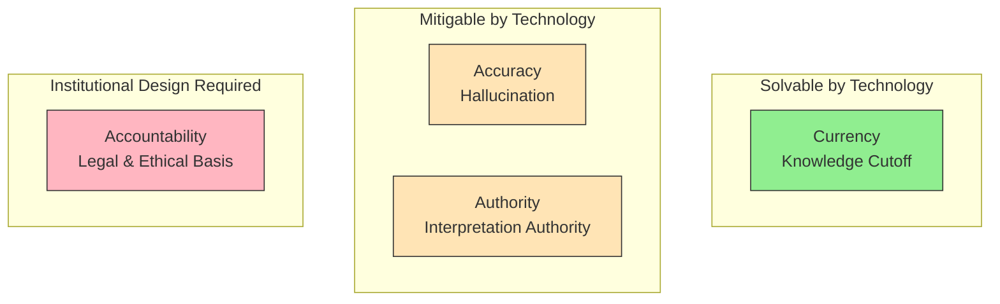
```mermaid
flowchart TB
    subgraph SOLVABLE["Solvable by Technology"]
        CURRENCY["Currency<br>Knowledge Cutoff"]
    end

    subgraph MITIGABLE["Mitigable by Technology"]
        ACCURACY["Accuracy<br>Hallucination"]
        AUTHORITY["Authority<br>Interpretation Authority"]
    end

    subgraph SYSTEMIC["Institutional Design Required"]
        ACCOUNTABILITY["Accountability<br>Legal & Ethical Basis"]
    end

    style CURRENCY fill:#90EE90,color:#333,stroke:#333
    style ACCURACY fill:#FFE4B5,color:#333,stroke:#333
    style AUTHORITY fill:#FFE4B5,color:#333,stroke:#333
    style ACCOUNTABILITY fill:#FFB6C1,color:#333,stroke:#333
```

| Constraint         | Solvability                             | Reason                                                                                                         |
| ------------------ | --------------------------------------- | -------------------------------------------------------------------------------------------------------------- |
| **Currency**       | ◎ Largely Solvable                      | Can be addressed through web search and real-time access via MCP                                               |
| **Accuracy**       | △ Mitigable, Not Completely Preventable | Due to the fundamental probabilistic nature of LLM generation, complete elimination is impossible in principle |
| **Authority**      | △ Mitigable, Not Completely Solvable    | AI output is ultimately "one interpretation" and cannot become official authority                              |
| **Accountability** | ✗ Not Solvable by Technology Alone      | This is a matter of legal and ethical institutional design; technology only provides the foundation            |

### Constraint Categories and Coping Strategies

The four constraints fall into two broad categories.

| Category                      | Constraints               | Nature                                             | Coping Strategy                                       |
| ----------------------------- | ------------------------- | -------------------------------------------------- | ----------------------------------------------------- |
| **Knowledge Constraints**     | Currency, Accuracy        | Arising from LLM's training and generation process | External knowledge injection + verification workflows |
| **Institutional Constraints** | Authority, Accountability | Arising from the social positioning of information | Technical foundation + human judgment                 |

> Knowledge constraints can be mitigated by technology, but institutional constraints cannot be solved by technology alone. This distinction is the starting point for design decisions.

### Architecture Three-Layer Model and Four Constraints Mapping

How the three-layer model (Agent / Skills / MCP) from [03-architecture](./03-architecture) contributes to each constraint.

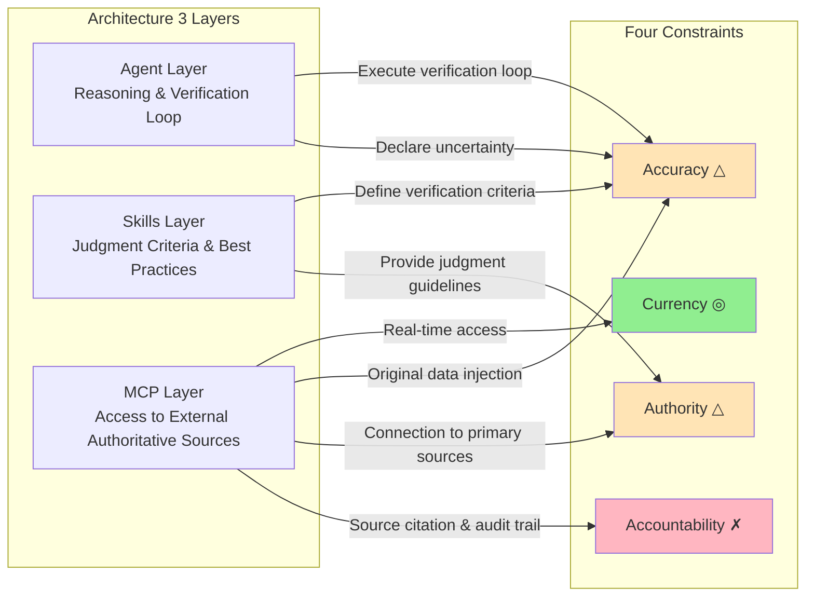
```mermaid
flowchart LR
    subgraph Architecture["Architecture 3 Layers"]
        Agent["Agent Layer<br/>Reasoning & Verification Loop"]
        Skills["Skills Layer<br/>Judgment Criteria & Best Practices"]
        MCP_L["MCP Layer<br/>Access to External Authoritative Sources"]
    end

    subgraph Constraints["Four Constraints"]
        C1["Currency ◎"]
        C2["Accuracy △"]
        C3["Authority △"]
        C4["Accountability ✗"]
    end

    MCP_L -->|"Real-time access"| C1
    MCP_L -->|"Original data injection"| C2
    MCP_L -->|"Connection to primary sources"| C3
    MCP_L -->|"Source citation & audit trail"| C4
    Skills -->|"Define verification criteria"| C2
    Skills -->|"Provide judgment guidelines"| C3
    Agent -->|"Execute verification loop"| C2
    Agent -->|"Declare uncertainty"| C2

    style C1 fill:#90EE90,color:#333
    style C2 fill:#FFE4B5,color:#333
    style C3 fill:#FFE4B5,color:#333
    style C4 fill:#FFB6C1,color:#333
```

> The MCP Layer contributes partially to all constraints. For currency, accuracy, and authority in particular, it provides a direct solution through structured external access.

### Verification Loop — Separating Probabilistic Reasoning from Deterministic Verification

The core design for mitigating AI constraints is **separating probabilistic reasoning** (LLM generation) from **deterministic verification** (tool-based validation).

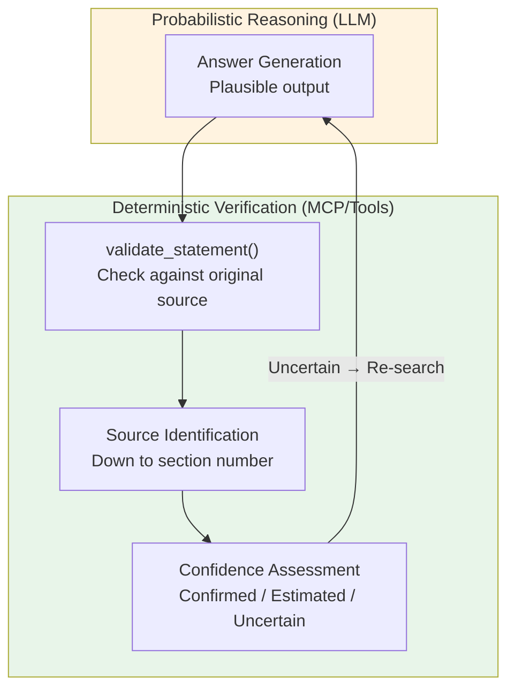
```mermaid
flowchart TB
    subgraph Probabilistic["Probabilistic Reasoning (LLM)"]
        G["Answer Generation<br/>Plausible output"]
    end

    subgraph Deterministic["Deterministic Verification (MCP/Tools)"]
        V1["validate_statement()<br/>Check against original source"]
        V2["Source Identification<br/>Down to section number"]
        V3["Confidence Assessment<br/>Confirmed / Estimated / Uncertain"]
    end

    G --> V1
    V1 --> V2
    V2 --> V3
    V3 -->|"Uncertain → Re-search"| G

    style Probabilistic fill:#fff3e0,color:#333
    style Deterministic fill:#e8f5e9,color:#333
```

::: tip Bounded Autonomy
The agents in this project do not aim to "make autonomous judgments on everything." Agent autonomy is **bounded to what can be verified**. For decisions that cannot be verified, the design escalates to human judgment (see [Responsibility Shift Model](./01-vision#the-responsibility-shift-model)).
:::

## Solving Currency — The Constraint with the Clearest Solutions

### 1.1 The Nature of the Problem

LLM knowledge is fixed at the point of training data (details: [02-reference-sources 1.2.2](./02-reference-sources)). However, for this constraint, there is a **clear solution: connecting to external information sources**.

### 1.2 Solution Approaches

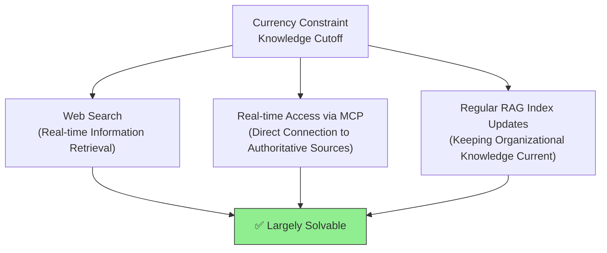
```mermaid
flowchart TB
    PROBLEM["Currency Constraint<br>Knowledge Cutoff"]

    PROBLEM --> WEB["Web Search<br>(Real-time Information Retrieval)"]
    PROBLEM --> MCP_RT["Real-time Access via MCP<br>(Direct Connection to Authoritative Sources)"]
    PROBLEM --> RAG_UP["Regular RAG Index Updates<br>(Keeping Organizational Knowledge Current)"]

    WEB --> EVAL["✅ Largely Solvable"]
    MCP_RT --> EVAL
    RAG_UP --> EVAL

    style EVAL fill:#90EE90,color:#333,stroke:#333
```

#### Retrieving Current Information via Web Search

The most convenient approach. AI assistants like Claude can retrieve real-time information using built-in web search functionality.

| Advantages                     | Constraints                              |
| ------------------------------ | ---------------------------------------- |
| No additional cost             | Search result reliability not guaranteed |
| Available immediately          | Information structure is insufficient    |
| Covers a wide range of sources | High noise                               |

#### Real-time Access via MCP

**Directly accessing** authoritative information sources in a **structured manner**. This is the approach this project promotes.

```
rfcxml-mcp   → Get latest RFCs directly from IETF
hourei-mcp   → Get latest laws from e-Gov API
w3c-mcp      → Get latest specs from W3C/WHATWG
```

| Advantages                              | Constraints                                     |
| --------------------------------------- | ----------------------------------------------- |
| Get directly from authoritative sources | MCP server development and maintenance required |
| Structured data                         | MCP needed for each target domain               |
| Verifiable sources                      | Cannot cover all information sources            |

#### Regular RAG Index Updates

For organizational documents, ensuring currency is possible by regularly updating RAG indexes.

### 1.3 Implementation Evaluation

Currency is **the constraint with the clearest solution among the four**, and can be practically solved by combining appropriate tools. The remaining challenge is "the practical difficulty of covering all information sources in real-time," which is manageable as an operational issue.

## Mitigating Accuracy — Complete Elimination is Impossible in Principle

### 2.1 The Nature of the Problem

Hallucination (generating information that contradicts facts) stems from the **fundamental nature** that LLMs generate probabilistically "plausible" rather than "correct" output (details: [02-reference-sources 1.2.1](./02-reference-sources)).

This is not a "bug" but a "feature," and **it is impossible to eliminate it completely in principle**.

### 2.2 Mitigation Approaches

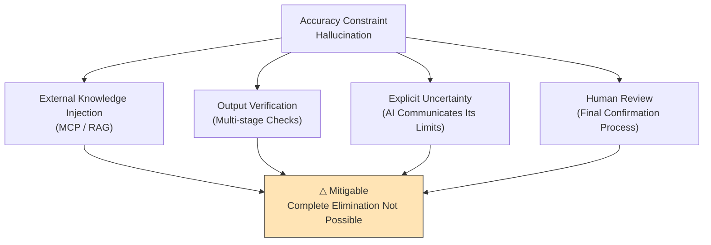
```mermaid
flowchart TB
    PROBLEM["Accuracy Constraint<br>Hallucination"]

    PROBLEM --> INJECT["External Knowledge Injection<br>(MCP / RAG)"]
    PROBLEM --> VERIFY["Output Verification<br>(Multi-stage Checks)"]
    PROBLEM --> DECLARE["Explicit Uncertainty<br>(AI Communicates Its Limits)"]
    PROBLEM --> HUMAN["Human Review<br>(Final Confirmation Process)"]

    INJECT --> EVAL["△ Mitigable<br>Complete Elimination Not Possible"]
    VERIFY --> EVAL
    DECLARE --> EVAL
    HUMAN --> EVAL

    style EVAL fill:#FFE4B5,color:#333,stroke:#333
```

#### External Knowledge Injection (MCP / RAG)

Reduce the frequency of hallucinations by providing AI with accurate information sources.

```
MCP Effect:
  Question: "What does status code 1006 in RFC 6455 mean?"

  Without MCP → AI generates "plausible" answer from training data (may be wrong)
  With MCP → rfcxml-mcp retrieves original text → accurate answer possible

  → Hallucination rate decreases dramatically
```

However, hallucination may still occur in the **interpretation** of data retrieved by MCP.

#### Output Verification (Multi-stage Checks)

A workflow to verify AI output through alternative means.

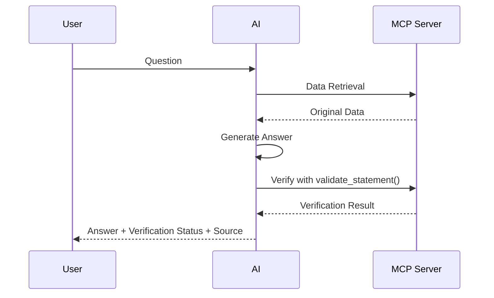
```mermaid
sequenceDiagram
    participant U as User
    participant AI as AI
    participant MCP as MCP Server

    U->>AI: Question
    AI->>MCP: Data Retrieval
    MCP-->>AI: Original Data
    AI->>AI: Generate Answer
    AI->>MCP: Verify with validate_statement()
    MCP-->>AI: Verification Result
    AI-->>U: Answer + Verification Status + Source
```

The `validate_statement()` of rfcxml-mcp in this project is precisely designed for this purpose.

#### Explicit Uncertainty

A mechanism for AI to make explicit when it cannot be confident in its answer.

```
Verification Status Levels:
  ✅ Verified: Information verified through MCP/original source
  ⚠️ Estimated: Based on training data but not verified from source
  ❓ Uncertain: Information not found or contradictory
```

#### Human Review

Establish a human review process as final quality assurance. Especially critical for important judgments (legal decisions, security requirements, etc.).

### 2.3 Implementation Evaluation

Complete accuracy assurance is **impossible in principle**, but by combining the above approaches, we can significantly reduce practical risks. The key is building a culture that "doesn't simply trust AI output" and creating verifiable workflows.

## Ensuring Authority — Risk Management Rather Than Complete Solution

### 3.1 The Nature of the Problem

AI output is "one interpretation" and **not an official view** (details: [02-reference-sources 1.2.3](./02-reference-sources)). Only the creators (IETF, legislative bodies, etc.) can provide the "official interpretation" of RFCs, laws, and standard specifications.

This constraint arises from **the nature of information authority itself** rather than AI characteristics, making it impossible to completely solve with technology alone.

### 3.2 Response Approaches

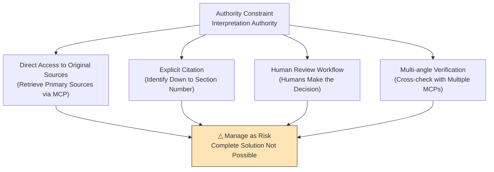
```mermaid
flowchart TB
    PROBLEM["Authority Constraint<br>Interpretation Authority"]

    PROBLEM --> DIRECT["Direct Access to Original Sources<br>(Retrieve Primary Sources via MCP)"]
    PROBLEM --> CITE["Explicit Citation<br>(Identify Down to Section Number)"]
    PROBLEM --> WORKFLOW["Human Review Workflow<br>(Humans Make the Decision)"]
    PROBLEM --> MULTI["Multi-angle Verification<br>(Cross-check with Multiple MCPs)"]

    DIRECT --> EVAL["△ Manage as Risk<br>Complete Solution Not Possible"]
    CITE --> EVAL
    WORKFLOW --> EVAL
    MULTI --> EVAL

    style EVAL fill:#FFE4B5,color:#333,stroke:#333
```

#### Direct Access to Original Sources

Access primary information sources directly through MCP and **present the original text** rather than AI interpretation.

```
Rather than authorize AI output,
present the original source itself so humans can decide.

Example:
  AI: "The original text of RFC 6455 Section 7.4.1 is as follows:"
      ↓ Present original text
  Human: "I see, this case should be interpreted this way"
      ↓ Human decides
```

#### Explicit Citation

Explicitly indicate section numbers of information sources in all AI output. This allows humans to **independently verify**.

> For details on output templates, see [02-reference-sources Chapter 4](./02-reference-sources).

#### Human Review Workflow

For judgments where authority is required (legal decisions, spec interpretation, etc.), build a workflow that treats AI output as **draft/reference information** and has humans make the final decision.

```
AI's Role: Information collection, organization, candidate presentation
Human's Role: Final decision and approval

→ AI is "an excellent research assistant" not "an omniscient answerer"
```

#### Multi-angle Verification

Verify information from different angles using multiple MCPs.

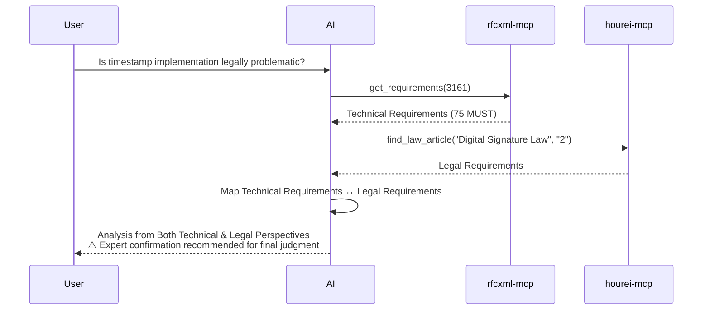
```mermaid
sequenceDiagram
    participant U as User
    participant AI as AI
    participant RFC as rfcxml-mcp
    participant LAW as hourei-mcp

    U->>AI: Is timestamp implementation legally problematic?
    AI->>RFC: get_requirements(3161)
    RFC-->>AI: Technical Requirements (75 MUST)
    AI->>LAW: find_law_article("Digital Signature Law", "2")
    LAW-->>AI: Legal Requirements
    AI->>AI: Map Technical Requirements ↔ Legal Requirements
    AI-->>U: Analysis from Both Technical & Legal Perspectives<br>⚠️ Expert confirmation recommended for final judgment
```

### 3.3 Implementation Evaluation

Rather than "completely solving" authority, the mindset of **managing it as a risk** is important. AI **improves efficiency** of access to authoritative information sources but cannot **replace** the authority itself.

## Ensuring Accountability — The Intersection of Technology and Institutional Design

### 4.1 The Nature of the Problem

AI output has **no clear subject of accountability** (details: [02-reference-sources 1.2.4](./02-reference-sources)). This is more a legal and ethical issue than a technical one.

### 4.2 Foundation Technology Can Provide

While technology alone cannot completely solve accountability, it can provide the **foundation** supporting it.

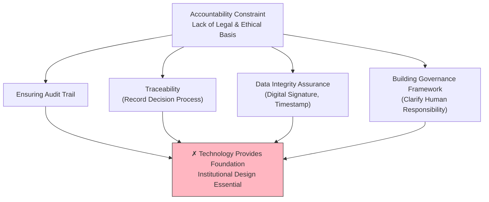
```mermaid
flowchart TB
    PROBLEM["Accountability Constraint<br>Lack of Legal & Ethical Basis"]

    PROBLEM --> AUDIT["Ensuring Audit Trail"]
    PROBLEM --> TRACE["Traceability<br>(Record Decision Process)"]
    PROBLEM --> INTEGRITY["Data Integrity Assurance<br>(Digital Signature, Timestamp)"]
    PROBLEM --> GOVERNANCE["Building Governance Framework<br>(Clarify Human Responsibility)"]

    AUDIT --> EVAL["✗ Technology Provides Foundation<br>Institutional Design Essential"]
    TRACE --> EVAL
    INTEGRITY --> EVAL
    GOVERNANCE --> EVAL

    style EVAL fill:#FFB6C1,color:#333,stroke:#333
```

#### Ensuring Audit Trail

Recording what data AI references, how it processes it, and how it generates output.

```
Information to Record:
  - When: Timestamp
  - What: Referenced data sources (MCP call logs)
  - How: Process steps (prompts, tool call chains)
  - What Output: Final output
```

#### Traceability

The ability to trace back from AI output to the original sources referenced. Structured source information provided by MCP makes this possible.

```
AI Output: "Status code 1006 must not be included in Close frame"
    ↓ Trace
Reference: rfcxml-mcp → get_requirements(6455, section="7.4.1")
    ↓ Trace
Original: RFC 6455, Section 7.4.1, MUST NOT requirement
    ↓ Verify
Humans can verify the original source directly
```

Here is where **transparency of open-source MCP** has value. If MCP server source code is publicly available, we can verify "how data is obtained and processed" at the code level. Proprietary pipelines make this verification impossible, breaking the chain of traceability.

#### Data Integrity Assurance

A mechanism ensuring that data retrieved by MCP from external services has not been tampered with. The following technologies will be necessary in the future.

| Technology                 | Purpose                           | Standard                      |
| -------------------------- | --------------------------------- | ----------------------------- |
| **Timestamp**              | Prove time of data existence      | RFC 3161                      |
| **HTTP Message Signature** | Ensure communication authenticity | RFC 9421                      |
| **Digital Signature**      | Prove data non-tampering          | Digital Signature Law / eIDAS |

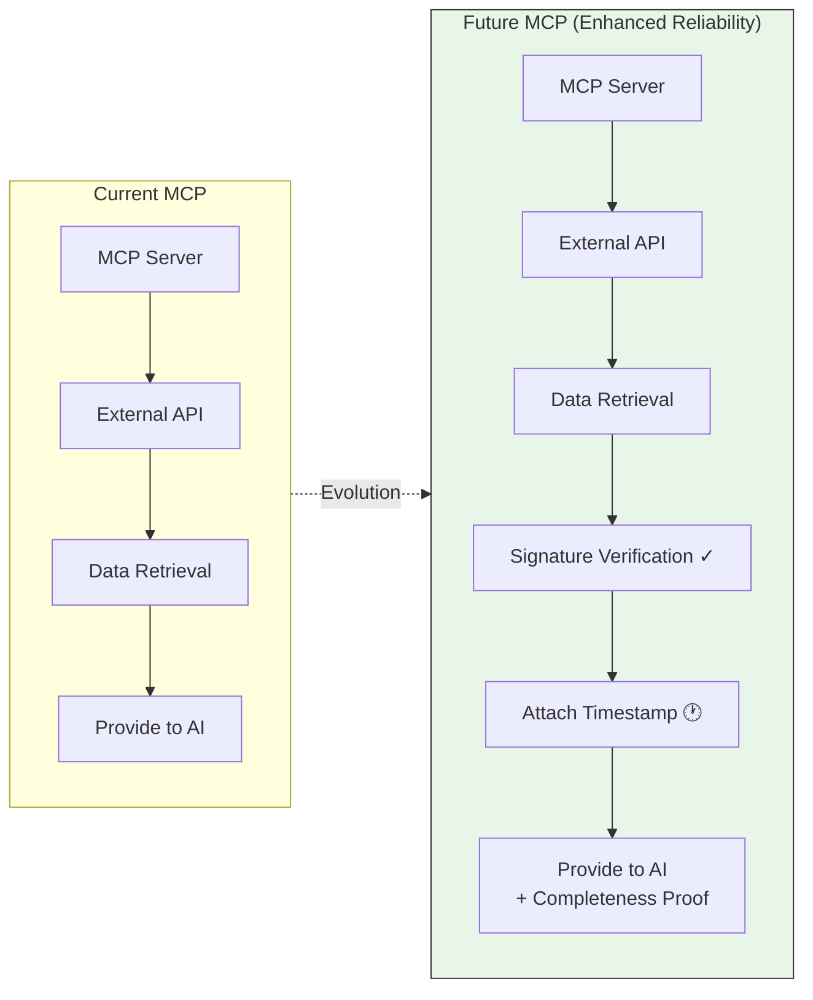
```mermaid
flowchart LR
    subgraph CURRENT["Current MCP"]
        C1["MCP Server"] --> C2["External API"]
        C2 --> C3["Data Retrieval"]
        C3 --> C4["Provide to AI"]
    end

    subgraph FUTURE["Future MCP (Enhanced Reliability)"]
        F1["MCP Server"] --> F2["External API"]
        F2 --> F3["Data Retrieval"]
        F3 --> F4["Signature Verification ✓"]
        F4 --> F5["Attach Timestamp 🕐"]
        F5 --> F6["Provide to AI<br>+ Completeness Proof"]
    end

    CURRENT -.->|"Evolution"| FUTURE

    style FUTURE fill:#e8f5e9,color:#333,stroke:#333
```

Currently, such mechanisms are not built into the MCP protocol, but since MCP handles connections to external services, ensuring integrity of connection paths and retrieved data is an **unavoidable future challenge**.

#### Building Governance Framework

Beyond technology scope, organizations need to systematically establish responsibility for AI output.

```
Who: Who approves AI output finally
Based on What: By what guidelines to decide
How to Record: How to maintain approval process evidence
When Issues Arise: Who responds and how
```

### 4.3 Implementation Evaluation

Accountability is **an area of institutional design beyond technology**. Technology (audit trail, traceability, data integrity) provides its foundation, but ultimately requires legal frameworks, organizational structures, and industry standard improvements.

What individuals and small teams can do now is **establish technological foundations as much as possible and prepare for future institutional design**. This project's MCP approach (open-source, explicit sourcing, structured access) is precisely building this foundation.

## Overall Picture of Four Approaches

### 5.1 Summary Table

| Constraint         | Solvability                     | Primary Means                                            | This Project's Response                 |
| ------------------ | ------------------------------- | -------------------------------------------------------- | --------------------------------------- |
| **Currency**       | ◎ Largely Solvable              | Web search, MCP, RAG updates                             | Real-time retrieval via rfcxml-mcp etc. |
| **Accuracy**       | △ Mitigable                     | MCP/RAG injection, verification, uncertainty declaration | validate_statement(), explicit sourcing |
| **Authority**      | △ Risk Management               | Original source access, explicit citation, human review  | Access to primary sources via MCP       |
| **Accountability** | ✗ Institutional Design Required | Audit trail, traceability, signatures                    | Transparency through open-source MCP    |

### 5.2 Mapping Approaches and Solutions

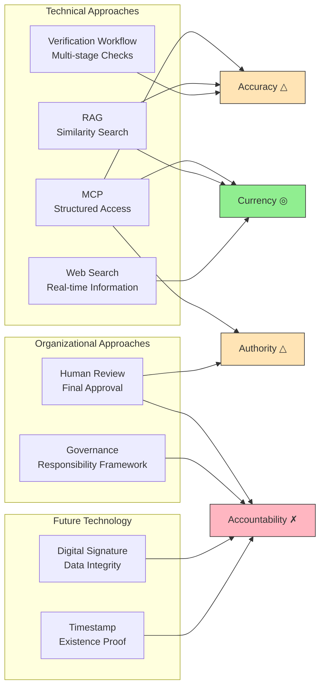
```mermaid
flowchart LR
    subgraph TECH["Technical Approaches"]
        direction LR
        MCP_APPROACH["MCP<br>Structured Access"]
        RAG_APPROACH["RAG<br>Similarity Search"]
        WEBSEARCH["Web Search<br>Real-time Information"]
        VALIDATION["Verification Workflow<br>Multi-stage Checks"]
    end

    subgraph ORG["Organizational Approaches"]
        direction LR
        REVIEW["Human Review<br>Final Approval"]
        GOVERNANCE["Governance<br>Responsibility Framework"]
    end

    subgraph FUTURE_TECH["Future Technology"]
        direction LR
        SIGNATURE["Digital Signature<br>Data Integrity"]
        TIMESTAMP["Timestamp<br>Existence Proof"]
    end

    MCP_APPROACH --> ACCURACY["Accuracy △"]
    MCP_APPROACH --> CURRENCY["Currency ◎"]
    MCP_APPROACH --> AUTHORITY["Authority △"]
    RAG_APPROACH --> CURRENCY
    RAG_APPROACH --> ACCURACY
    WEBSEARCH --> CURRENCY
    VALIDATION --> ACCURACY
    REVIEW --> AUTHORITY
    REVIEW --> ACCOUNTABILITY["Accountability ✗"]
    GOVERNANCE --> ACCOUNTABILITY
    SIGNATURE --> ACCOUNTABILITY
    TIMESTAMP --> ACCOUNTABILITY

    style CURRENCY fill:#90EE90,color:#333,stroke:#333
    style ACCURACY fill:#FFE4B5,color:#333,stroke:#333
    style AUTHORITY fill:#FFE4B5,color:#333,stroke:#333
    style ACCOUNTABILITY fill:#FFB6C1,color:#333,stroke:#333
```

### 5.3 Key Understanding

We cannot solve all AI constraints with technology alone. These approaches **do not completely eliminate** the constraints. The premise is selecting strategies appropriate to each constraint's nature.

| Constraint         | Strategy                                                      | Stance              |
| ------------------ | ------------------------------------------------------------- | ------------------- |
| **Currency**       | Largely solvable with technology                              | Solve               |
| **Accuracy**       | Mitigate with technology, accept residual risk                | Mitigate + Accept   |
| **Authority**      | Manage risk with technology, humans make final decisions      | Risk Management     |
| **Accountability** | Technology provides foundation, defer to institutional design | Foundation Building |

> The important thing is not aiming for "complete solution" but understanding each constraint's nature and selecting appropriate approaches.

This project's MCP approach contributes partially to all four constraints. Particularly, improving accuracy, currency, and authority through "unshakeable reference sources," and building the foundation for accountability through open-source transparency, is the best approach practically achievable today.

## Related Documents

- [01-vision](./01-vision) — Definition of AI limitations and the need for "unshakeable reference sources" (WHY)
- [02-reference-sources](./02-reference-sources) — System of reference sources by five characteristics (WHAT)
- [03-architecture](./03-architecture) — Composition of MCP/Skills/Agent (HOW)
- [04-ai-design-patterns](./04-ai-design-patterns) — Comparison of design patterns like RAG/MCP (WHICH)
- [mcp/what-is-mcp](../mcp/what-is-mcp) — Details about MCP
- [07-doctrine-and-intent](./07-doctrine-and-intent) — Doctrine Layer: constraints, objectives, and judgment criteria
