# Solving AI Limitations — Practical Approaches Available Today

[日本語版 (Japanese)](./05-solving-ai-limitations.ja.md)

> Organizing what we can actually do now against AI's four fundamental limitations.

## About This Document

In [01-vision.md](./01-vision.md) and [02-reference-sources.md](./02-reference-sources.md), we **defined the problem** of AI's four fundamental limitations (accuracy, currency, authority, and accountability). In [04-ai-design-patterns.md](./04-ai-design-patterns.md), we organized **design patterns** such as RAG and MCP.

This document organizes **practical solution approaches available today** to address these limitations. While perfect solutions don't exist, by understanding the nature of each constraint and combining appropriate approaches, we can reduce risks to a practical level.


## Four Constraints and Solution Feasibility Overview

First, let's understand the full picture. The four constraints have **very different possibilities for solutions** depending on their nature.


| Constraint         | Solvability                             | Reason                                                                                                         |
| ------------------ | --------------------------------------- | -------------------------------------------------------------------------------------------------------------- |
| **Currency**       | ◎ Largely Solvable                      | Can be addressed through web search and real-time access via MCP                                               |
| **Accuracy**       | △ Mitigable, Not Completely Preventable | Due to the fundamental probabilistic nature of LLM generation, complete elimination is impossible in principle |
| **Authority**      | △ Mitigable, Not Completely Solvable    | AI output is ultimately "one interpretation" and cannot become official authority                              |
| **Accountability** | ✗ Not Solvable by Technology Alone      | This is a matter of legal and ethical institutional design; technology only provides the foundation            |

## Chapter 1: Solving Currency — The Constraint with the Clearest Solutions

### 1.1 The Nature of the Problem

LLM knowledge is fixed at the point of training data (details: [02-reference-sources.md 1.2.2](./02-reference-sources.md)). However, for this constraint, there is a **clear solution: connecting to external information sources**.

### 1.2 Solution Approaches


#### Retrieving Current Information via Web Search

The most convenient approach. AI assistants like Claude can retrieve real-time information using built-in web search functionality.

| Advantages                     | Constraints                              |
| ------------------------------ | ---------------------------------------- |
| No additional cost             | Search result reliability not guaranteed |
| Available immediately          | Information structure is insufficient    |
| Covers a wide range of sources | High noise                               |

#### Real-time Access via MCP

**Directly accessing** authoritative information sources in a **structured manner**. This is the approach this project promotes.

```
rfcxml-mcp   → Get latest RFCs directly from IETF
hourei-mcp   → Get latest laws from e-Gov API
w3c-mcp      → Get latest specs from W3C/WHATWG
```

| Advantages                              | Constraints                                     |
| --------------------------------------- | ----------------------------------------------- |
| Get directly from authoritative sources | MCP server development and maintenance required |
| Structured data                         | MCP needed for each target domain               |
| Verifiable sources                      | Cannot cover all information sources            |

#### Regular RAG Index Updates

For organizational documents, ensuring currency is possible by regularly updating RAG indexes.

### 1.3 Implementation Evaluation

Currency is **the constraint with the clearest solution among the four**, and can be practically solved by combining appropriate tools. The remaining challenge is "the practical difficulty of covering all information sources in real-time," which is manageable as an operational issue.

## Chapter 2: Mitigating Accuracy — Complete Elimination is Impossible in Principle

### 2.1 The Nature of the Problem

Hallucination (generating information that contradicts facts) stems from the **fundamental nature** that LLMs generate probabilistically "plausible" rather than "correct" output (details: [02-reference-sources.md 1.2.1](./02-reference-sources.md)).

This is not a "bug" but a "feature," and **it is impossible to eliminate it completely in principle**.

### 2.2 Mitigation Approaches

```mermaid
flowchart TB
    PROBLEM["Accuracy Constraint<bn>Hallucination"]

    PROBLEM --> INJECT["External Knowledge Injection<bn>(MCP / RAG)"]
    PROBLEM --> VERIFY["Output Verification<bn>(Multi-stage Checks)"]
    PROBLEM --> DECLARE["Explicit Uncertainty<bn>(AI Communicates Its Limits)"]
    PROBLEM --> HUMAN["Human Review<bn>(Final Confirmation Process)"]

    INJECT --> EVAL["△ Mitigable<bn>Complete Elimination Not Possible"]
    VERIFY --> EVAL
    DECLARE --> EVAL
    HUMAN --> EVAL

    style EVAL fill:#FFE4B5,color:#333,stroke:#333
```



#### External Knowledge Injection (MCP / RAG)

Reduce the frequency of hallucinations by providing AI with accurate information sources.

```
MCP Effect:
  Question: "What does status code 1006 in RFC 6455 mean?"

  Without MCP → AI generates "plausible" answer from training data (may be wrong)
  With MCP → rfcxml-mcp retrieves original text → accurate answer possible

  → Hallucination rate decreases dramatically
```

However, hallucination may still occur in the **interpretation** of data retrieved by MCP.

#### Output Verification (Multi-stage Checks)

A workflow to verify AI output through alternative means.


The `validate_statement()` of rfcxml-mcp in this project is precisely designed for this purpose.

#### Explicit Uncertainty

A mechanism for AI to make explicit when it cannot be confident in its answer.

```
Confidence Levels:
  ✅ Verified: Information verified through MCP/original source
  ⚠️ Estimated: Based on training data but not verified from source
  ❓ Uncertain: Information not found or contradictory
```

#### Human Review

Establish a human review process as final quality assurance. Especially critical for important judgments (legal decisions, security requirements, etc.).

### 2.3 Implementation Evaluation

Complete accuracy assurance is **impossible in principle**, but by combining the above approaches, we can significantly reduce practical risks. The key is building a culture that "doesn't simply trust AI output" and creating verifiable workflows.

## Chapter 3: Ensuring Authority — Risk Management Rather Than Complete Solution

### 3.1 The Nature of the Problem

AI output is "one interpretation" and **not an official view** (details: [02-reference-sources.md 1.2.3](./02-reference-sources.md)). Only the creators (IETF, legislative bodies, etc.) can provide the "official interpretation" of RFCs, laws, and standard specifications.

This constraint arises from **the nature of information authority itself** rather than AI characteristics, making it impossible to completely solve with technology alone.

### 3.2 Response Approaches

```mermaid
flowchart TB
    PROBLEM["Authority Constraint<bn>Interpretation Authority"]

    PROBLEM --> DIRECT["Direct Access to Original Sources<bn>(Retrieve Primary Sources via MCP)"]
    PROBLEM --> CITE["Explicit Citation<bn>(Identify Down to Section Number)"]
    PROBLEM --> WORKFLOW["Human Review Workflow<bn>(Humans Make the Decision)"]
    PROBLEM --> MULTI["Multi-angle Verification<bn>(Cross-check with Multiple MCPs)"]

    DIRECT --> EVAL["△ Manage as Risk<bn>Complete Solution Not Possible"]
    CITE --> EVAL
    WORKFLOW --> EVAL
    MULTI --> EVAL

    style EVAL fill:#FFE4B5,color:#333,stroke:#333
```



#### Direct Access to Original Sources

Access primary information sources directly through MCP and **present the original text** rather than AI interpretation.

```
Rather than authorize AI output,
present the original source itself so humans can decide.

Example:
  AI: "The original text of RFC 6455 Section 7.4.1 is as follows:"
      ↓ Present original text
  Human: "I see, this case should be interpreted this way"
      ↓ Human decides
```

#### Explicit Citation

Explicitly indicate section numbers of information sources in all AI output. This allows humans to **independently verify**.

> For details on output templates, see [02-reference-sources.md Chapter 4](./02-reference-sources.md).

#### Human Review Workflow

For judgments where authority is required (legal decisions, spec interpretation, etc.), build a workflow that treats AI output as **draft/reference information** and has humans make the final decision.

```
AI's Role: Information collection, organization, candidate presentation
Human's Role: Final decision and approval

→ AI is "an excellent research assistant" not "an omniscient answerer"
```

#### Multi-angle Verification

Verify information from different angles using multiple MCPs.

```mermaid
sequenceDiagram
    participant U as User
    participant AI as AI
    participant RFC as rfcxml-mcp
    participant LAW as hourei-mcp

    U->>AI: Is timestamp implementation legally problematic?
    AI->>RFC: get_requirements(3161)
    RFC-->>AI: Technical Requirements (75 MUST)
    AI->>LAW: find_law_article("Digital Signature Law", "2")
    LAW-->>AI: Legal Requirements
    AI->>AI: Map Technical Requirements ↔ Legal Requirements
    AI-->>U: Analysis from Both Technical & Legal Perspectives<bn>⚠️ Expert confirmation recommended for final judgment
```



### 3.3 Implementation Evaluation

Rather than "completely solving" authority, the mindset of **managing it as a risk** is important. AI **improves efficiency** of access to authoritative information sources but cannot **replace** the authority itself.

## Chapter 4: Ensuring Accountability — The Intersection of Technology and Institutional Design

### 4.1 The Nature of the Problem

AI output has **no clear subject of accountability** (details: [02-reference-sources.md 1.2.4](./02-reference-sources.md)). This is more a legal and ethical issue than a technical one.

### 4.2 Foundation Technology Can Provide

While technology alone cannot completely solve accountability, it can provide the **foundation** supporting it.

```mermaid
flowchart TB
    PROBLEM["Accountability Constraint<bn>Lack of Legal & Ethical Basis"]

    PROBLEM --> AUDIT["Ensuring Audit Trail"]
    PROBLEM --> TRACE["Traceability<bn>(Record Decision Process)"]
    PROBLEM --> INTEGRITY["Data Integrity Assurance<bn>(Digital Signature, Timestamp)"]
    PROBLEM --> GOVERNANCE["Building Governance Framework<bn>(Clarify Human Responsibility)"]

    AUDIT --> EVAL["✗ Technology Provides Foundation<bn>Institutional Design Essential"]
    TRACE --> EVAL
    INTEGRITY --> EVAL
    GOVERNANCE --> EVAL

    style EVAL fill:#FFB6C1,color:#333,stroke:#333
```



#### Ensuring Audit Trail

Recording what data AI references, how it processes it, and how it generates output.

```
Information to Record:
  - When: Timestamp
  - What: Referenced data sources (MCP call logs)
  - How: Process steps (prompts, tool call chains)
  - What Output: Final output
```

#### Traceability

The ability to trace back from AI output to the original sources referenced. Structured source information provided by MCP makes this possible.

```
AI Output: "Status code 1006 must not be included in Close frame"
    ↓ Trace
Reference: rfcxml-mcp → get_requirements(6455, section="7.4.1")
    ↓ Trace
Original: RFC 6455, Section 7.4.1, MUST NOT requirement
    ↓ Verify
Humans can verify the original source directly
```

Here is where **transparency of open-source MCP** has value. If MCP server source code is publicly available, we can verify "how data is obtained and processed" at the code level. Proprietary pipelines make this verification impossible, breaking the chain of traceability.

#### Data Integrity Assurance

A mechanism ensuring that data retrieved by MCP from external services has not been tampered with. The following technologies will be necessary in the future.

| Technology                 | Purpose                           | Standard                      |
| -------------------------- | --------------------------------- | ----------------------------- |
| **Timestamp**              | Prove time of data existence      | RFC 3161                      |
| **HTTP Message Signature** | Ensure communication authenticity | RFC 9421                      |
| **Digital Signature**      | Prove data non-tampering          | Digital Signature Law / eIDAS |


Currently, such mechanisms are not built into the MCP protocol, but since MCP handles connections to external services, ensuring integrity of connection paths and retrieved data is an **unavoidable future challenge**.

#### Building Governance Framework

Beyond technology scope, organizations need to systematically establish responsibility for AI output.

```
Who: Who approves AI output finally
Based on What: By what guidelines to decide
How to Record: How to maintain approval process evidence
When Issues Arise: Who responds and how
```

### 4.3 Implementation Evaluation

Accountability is **an area of institutional design beyond technology**. Technology (audit trail, traceability, data integrity) provides its foundation, but ultimately requires legal frameworks, organizational structures, and industry standard improvements.

What individuals and small teams can do now is **establish technological foundations as much as possible and prepare for future institutional design**. This project's MCP approach (open-source, explicit sourcing, structured access) is precisely building this foundation.

## Chapter 5: Overall Picture of Four Approaches

### 5.1 Summary Table

| Constraint         | Solvability                     | Primary Means                                            | This Project's Response                 |
| ------------------ | ------------------------------- | -------------------------------------------------------- | --------------------------------------- |
| **Currency**       | ◎ Largely Solvable              | Web search, MCP, RAG updates                             | Real-time retrieval via rfcxml-mcp etc. |
| **Accuracy**       | △ Mitigable                     | MCP/RAG injection, verification, uncertainty declaration | validate_statement(), explicit sourcing |
| **Authority**      | △ Risk Management               | Original source access, explicit citation, human review  | Access to primary sources via MCP       |
| **Accountability** | ✗ Institutional Design Required | Audit trail, traceability, signatures                    | Transparency through open-source MCP    |

### 5.2 Mapping Approaches and Solutions

```mermaid
flowchart LR
    subgraph TECH["Technical Approaches"]
        direction LR
        MCP_APPROACH["MCP<bn>Structured Access"]
        RAG_APPROACH["RAG<bn>Similarity Search"]
        WEBSEARCH["Web Search<bn>Real-time Information"]
        VALIDATION["Verification Workflow<bn>Multi-stage Checks"]
    end

    subgraph ORG["Organizational Approaches"]
        direction LR
        REVIEW["Human Review<bn>Final Approval"]
        GOVERNANCE["Governance<bn>Responsibility Framework"]
    end

    subgraph FUTURE_TECH["Future Technology"]
        direction LR
        SIGNATURE["Digital Signature<bn>Data Integrity"]
        TIMESTAMP["Timestamp<bn>Existence Proof"]
    end

    MCP_APPROACH --> ACCURACY["Accuracy △"]
    MCP_APPROACH --> CURRENCY["Currency ◎"]
    MCP_APPROACH --> AUTHORITY["Authority △"]
    RAG_APPROACH --> CURRENCY
    RAG_APPROACH --> ACCURACY
    WEBSEARCH --> CURRENCY
    VALIDATION --> ACCURACY
    REVIEW --> AUTHORITY
    REVIEW --> ACCOUNTABILITY["Accountability ✗"]
    GOVERNANCE --> ACCOUNTABILITY
    SIGNATURE --> ACCOUNTABILITY
    TIMESTAMP --> ACCOUNTABILITY

    style CURRENCY fill:#90EE90,color:#333,stroke:#333
    style ACCURACY fill:#FFE4B5,color:#333,stroke:#333
    style AUTHORITY fill:#FFE4B5,color:#333,stroke:#333
    style ACCOUNTABILITY fill:#FFB6C1,color:#333,stroke:#333
```



### 5.3 Key Understanding

```
We cannot solve all AI constraints with technology alone.

Accuracy → Mitigate with technology, accept residual risk
Currency → Largely solvable with technology
Authority → Manage risk with technology, humans make final decisions
Accountability → Technology provides foundation, defer to institutional design

→ The important thing is not aiming for "complete solution"
  but understanding each constraint's nature and selecting appropriate approaches
```

This project's MCP approach contributes partially to all four constraints. Particularly, improving accuracy, currency, and authority through "unshakeable reference sources," and building the foundation for accountability through open-source transparency, is the best approach practically achievable today.

## Related Documents

- [01-vision.md](./01-vision.md) — Definition of AI limitations and the need for "unshakeable reference sources"
- [02-reference-sources.md](./02-reference-sources.md) — System of reference sources by five characteristics
- [03-architecture.md](./03-architecture.md) — Composition of MCP/Skills/Agent
- [04-ai-design-patterns.md](./04-ai-design-patterns.md) — Comparison of design patterns like RAG/MCP
- [mcp/what-is-mcp.md](../mcp/what-is-mcp.md) — Details about MCP
