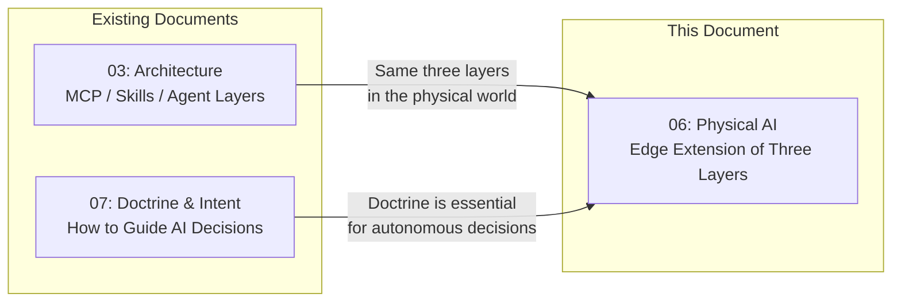
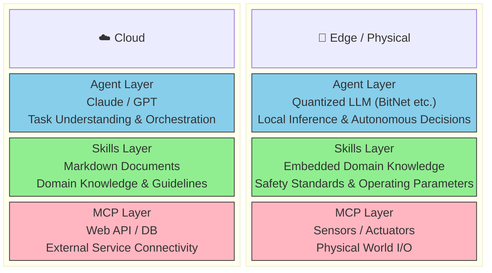
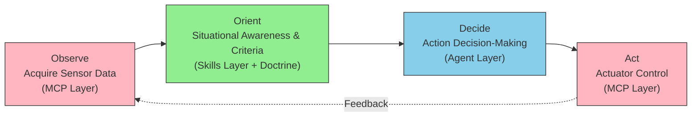
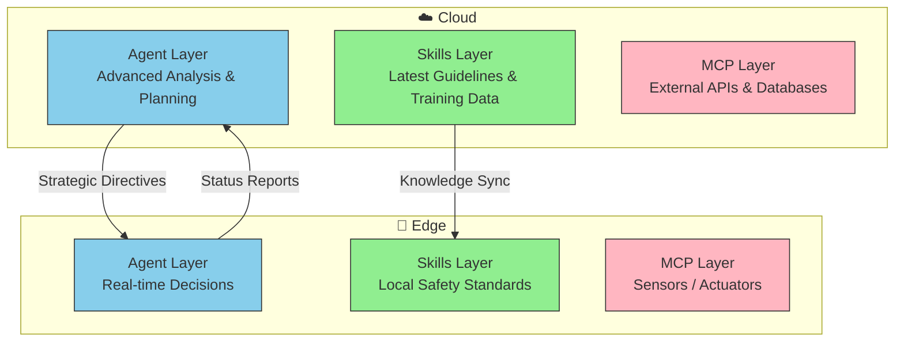

# Physical AI — Extending the Three-Layer Architecture to the Edge

The Agent / Skills / MCP three-layer model established in the cloud maintains structural integrity when deployed to edge devices and robotics.

::: info
Does the Agent / Skills / MCP three-layer model that works in cloud environments
also hold up in edge devices operating in the physical world?

> The answer is "yes" — and moreover, it holds up **without changing the structure**.

:::

**Target audience**: Engineers who want to understand AI agent architecture beyond the boundaries of software. Also useful for teams designing interfaces with edge AI, IoT, and robotics.

## Position Within the Document Series



## What Is Physical AI?

Physical AI refers to the technology domain where AI perceives the physical world, makes decisions, and directly acts upon it. Autonomous driving, industrial robots, drones, and humanoids are typical application areas.

Traditionally, Physical AI has been discussed as a separate world from software AI. However, the following technological advances are dissolving this boundary:

- **BitNet (1.58-bit quantized LLM)** — Enables large language model inference on edge devices
- **MCP (Model Context Protocol)** — Standardizes tool connectivity
- **Edge computing evolution** — Improves real-time processing capabilities on devices

## BitNet b1.58 — Making Edge Inference a Reality

The key to establishing the Agent layer for Physical AI is **BitNet b1.58**, published by Microsoft Research.

### Why "1.58-bit"?

Conventional LLMs store weights as 16-bit (FP16) or 32-bit (FP32) floating-point values. BitNet b1.58 compresses these to an extreme — **only three values: {-1, 0, 1}**. The number "1.58" derives from the information required to encode three equiprobable values: log₂(3) ≈ 1.58.

```
Conventional LLM: weights = arbitrary floating-point values (FP16: 65,536 possibilities)
BitNet b1.58:     weights = only three values {-1, 0, 1}
```

### How It Differs from Conventional Quantization

Existing methods such as GPTQ, AWQ, and QLoRA compress pre-trained models **after the fact**. A trade-off between precision and compression ratio is unavoidable. In contrast, BitNet b1.58 replaces the Transformer's linear layers with **BitLinear** and **trains from scratch at 1.58-bit**. This structurally avoids the quality degradation inherent in post-hoc compression.

```
Existing quantization: Train (FP16) → Post-compress → Quality degradation is unavoidable
BitNet b1.58:          Train at 1.58-bit from scratch → Structurally optimized
```

### Concrete Performance

The 70B-parameter BitNet b1.58 model shows the following results compared to LLaMA (FP16) of equivalent scale:

| Metric                                 | BitNet b1.58 vs LLaMA (FP16) |
| -------------------------------------- | ---------------------------- |
| **Inference speed**                    | 4.1x faster                  |
| **Batch capacity**                     | 11x                          |
| **Throughput**                         | 8.9x                         |
| **Matrix operation energy efficiency** | 71.4x                        |
| **ARM CPU speedup**                    | 1.37–5.07x                   |
| **x86 CPU speedup**                    | 2.37–6.17x                   |
| **x86 CPU energy reduction**           | 71.9–82.2%                   |

Notably, a 100B-parameter model runs on a **single CPU**, achieving processing speeds equivalent to human reading speed (5–7 tokens per second).

### No Special Hardware Required

The greatest significance of BitNet b1.58 is that it **requires no special hardware**.

The inference framework [BitNet.cpp](https://github.com/microsoft/BitNet) is built on llama.cpp and has been verified on the following architectures:

| Architecture      | Verified Hardware Examples         | Use Case              |
| ----------------- | ---------------------------------- | --------------------- |
| **x86-64 (AVX2)** | Intel i7-13800H (laptop), AMD EPYC | Desktop / Server      |
| **ARM (NEON)**    | Apple M2, Cobalt 100               | Laptop / Tablet       |
| **ARM (DOTPROD)** | ARM v8.2 and later                 | Mobile / Edge devices |

Running an LLM at practical speeds on a laptop CPU — this means "edge AI" is no longer confined to research labs. It can be **started on the hardware you already have**.

The latest parallel kernel optimizations (January 2026) introduced configurable tiling, achieving an **additional 1.15–2.1x speedup**. Embedding layer quantization (Q6_K format) is also supported, improving memory usage and inference speed while nearly maintaining accuracy.

::: tip GPU's Role Changes but Doesn't Disappear
BitNet b1.58 drastically reduces GPU dependency for inference, but GPU is still required for model training. The accurate understanding is not "GPU becomes unnecessary" but rather **"inference becomes practical on CPU"**. Additionally, being built on llama.cpp makes integration with existing inference pipelines straightforward.
:::

### Affinity with Physical AI

This efficiency holds particular significance in the context of Physical AI. Robots and drones are fundamentally **battery-powered**, and 71.4x energy efficiency means not just "it can run on the edge" but "**it can operate autonomously on battery for extended periods**."

Furthermore, physical world control tasks often don't require the same precision as language generation:

```
Text generation     : Expressing subtle nuances → High precision required
Code generation     : Syntactic accuracy → High precision required
──────────────────────────────────────────
Robot control       : "Rotate 30 degrees right" → Discrete decisions suffice
Anomaly detection   : "Normal / Abnormal" → Close to binary classification
Route selection     : "A / B / or C" → Limited choices
```

1.58-bit weight precision may be insufficient for text generation, but it is **fully practical for physical control**. This is what makes the combination of quantized models and Physical AI viable.

## Three-Layer Mapping: Cloud and Edge

### Structural Symmetry

The three-layer model established in the cloud maps directly to the edge:



### Layer Correspondence

| Layer      | Cloud                          | Edge / Physical                                                  |
| ---------- | ------------------------------ | ---------------------------------------------------------------- |
| **Agent**  | LLMs such as Claude, GPT       | Local inference via quantized LLM (BitNet etc.)                  |
| **Skills** | Markdown documents, guidelines | Embedded domain knowledge, safety standards, physical parameters |
| **MCP**    | Web API, DB, external services | Sensor input, actuator control, physical device I/O              |

## Why It Holds Up "Without Changing the Structure"

The essence of the three-layer model is not technical implementation but **separation of responsibilities**:

```
Agent  = "Decide what should be done"
Skills = "Hold the knowledge needed for decisions"
MCP    = "Connect to the outside world and execute"
```

This separation of responsibilities doesn't change whether the connection target is a Web API or a sensor. What changes is each layer's **implementation**, not its **structure**.

### Implementation Differences

| Aspect                   | Cloud                                            | Edge                                                 |
| ------------------------ | ------------------------------------------------ | ---------------------------------------------------- |
| **Inference model**      | Full-size LLM (tens to hundreds of B parameters) | Quantized model (1.58-bit, several B or less)        |
| **Knowledge storage**    | File system / API                                | Embedded ROM / local storage                         |
| **Tool connectivity**    | HTTP / JSON-RPC                                  | GPIO / CAN / serial communication                    |
| **Latency requirements** | Seconds to minutes                               | Milliseconds to seconds                              |
| **Connectivity**         | Always-connected assumed                         | Offline operation is essential                       |
| **Energy constraints**   | Data center power                                | Battery-powered (efficiency is a survival condition) |

## The Indispensability of the Doctrine Layer

For AI operating autonomously in the physical world, the importance of the [Doctrine Layer](./07-doctrine-and-intent) is even higher than in the cloud.

```
Cloud: Decision error → Data misprocessing, degraded user experience
Edge:  Decision error → Physical accidents, potential human casualties
```

Physical AI doctrine includes elements absent from software:

- **Safety Constraints** — Hard limits to prevent physical harm
- **Fail-safe** — Retreat behavior during communication loss or anomalies
- **Ethical Constraints** — Inviolable rules that prioritize human safety above all
- **Real-time Constraints** — Acceptable limits for decision latency

::: warning Autonomous Decisions in the Physical World
In the software world, decision errors can be "undone," but in the physical world, they can produce irreversible consequences. Doctrine layer constraints function as **safety mechanisms** in Physical AI.
:::

## Correspondence with the OODA Cycle

Physical AI is the most intuitive implementation of the OODA cycle:



| OODA Phase  | Three-Layer Correspondence | Physical AI Examples                                                         |
| ----------- | -------------------------- | ---------------------------------------------------------------------------- |
| **Observe** | MCP Layer (input)          | Data acquisition from cameras, LiDAR, temperature sensors                    |
| **Orient**  | Skills Layer + Doctrine    | Referencing safety standards, classifying situations, determining priorities |
| **Decide**  | Agent Layer                | Selecting actions such as "stop," "evade," or "continue"                     |
| **Act**     | MCP Layer (output)         | Motor control, alert notification, communication transmission                |

## Cloud × Edge Collaboration Patterns

In actual Physical AI systems, edge devices do not operate in isolation — collaboration with the cloud is assumed:



### Collaboration Patterns

| Pattern                   | Description                                             | Example                                                        |
| ------------------------- | ------------------------------------------------------- | -------------------------------------------------------------- |
| **Knowledge Sync**        | Reflect cloud Skills to the edge                        | Safety standard updates, distributing new operating parameters |
| **Decision Distribution** | Real-time decisions at edge, advanced analysis in cloud | Emergency stop is local, route optimization is cloud           |
| **Status Reporting**      | Aggregate edge sensor data to the cloud                 | Anomaly detection log transmission, remote monitoring          |

## What This Means for Software Engineers

Physical AI is not "a different world." With an understanding of the three-layer model, software engineers can participate in architecture design:

```
The MCP server you're designing right now —
its connection target just changed from a Web API to a sensor.

The Skill domain knowledge you're writing right now —
it just changed from translation guidelines to safety standards.

The Agent decision logic you're configuring right now —
it just changed from text processing to motor control.
```

The three-layer **structure** is the same. Only the **implementation details** change.

## Summary

Physical AI is not a "special case" of the three-layer architecture — it is its **most direct extension**.

- The separation of responsibilities across Agent / Skills / MCP holds in the physical world as-is
- BitNet b1.58 has made local inference on edge devices practical (71.4x energy efficiency vs LLaMA)
- The importance of the Doctrine layer is most pronounced in the physical world, where consequences can be irreversible
- The OODA cycle functions naturally as a design framework for Physical AI

```
Architecture learned in the cloud becomes a bridge to the physical world.
Those who understand the structure can adapt regardless of the deployment target.
```

## References

- [BitNet.cpp — Microsoft Research](https://github.com/microsoft/BitNet) — Official 1-bit LLM inference framework repository
- [BitNet CPU Inference Optimization](https://github.com/microsoft/BitNet/blob/main/src/README.md) — Technical details on parallel kernel implementations, supported architectures, and benchmark results
- [BitNet: A 1-bit Model Solving LLM Challenges](https://note.com/shimmyo_lab/n/n78197cb4936f) — Background on BitNet and comparison with existing quantization methods
- [The Mechanism and Significance of BitNet b1.58](https://qiita.com/tech-Mira/items/67dec9c5a5f025d2727a) — Naming rationale for b1.58, performance data, and edge device applicability
