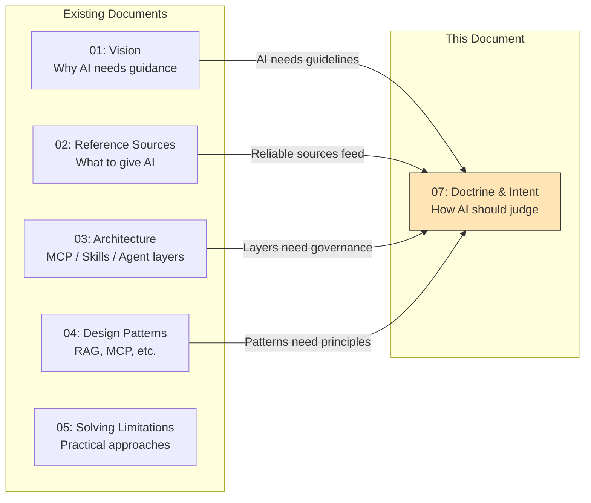
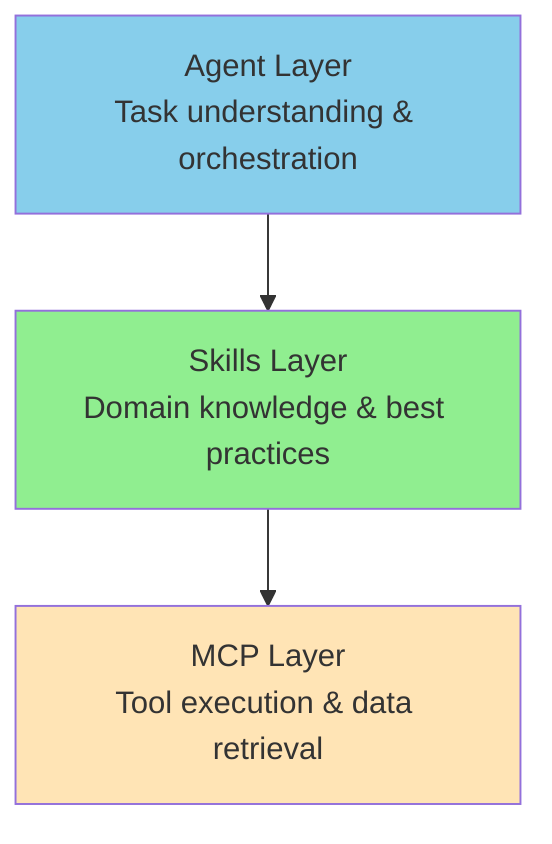
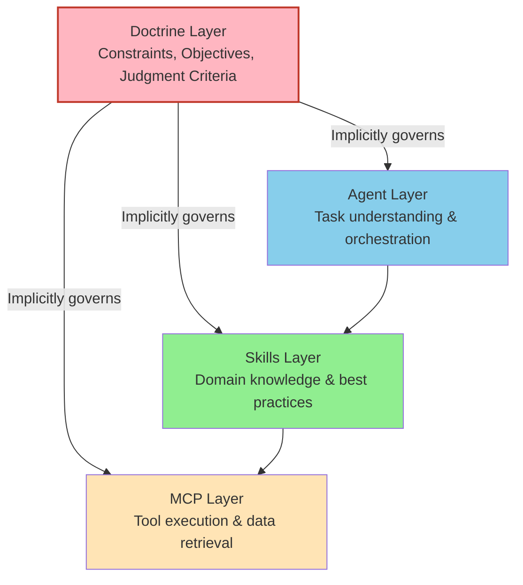
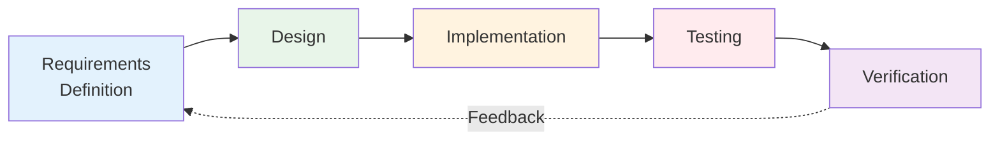
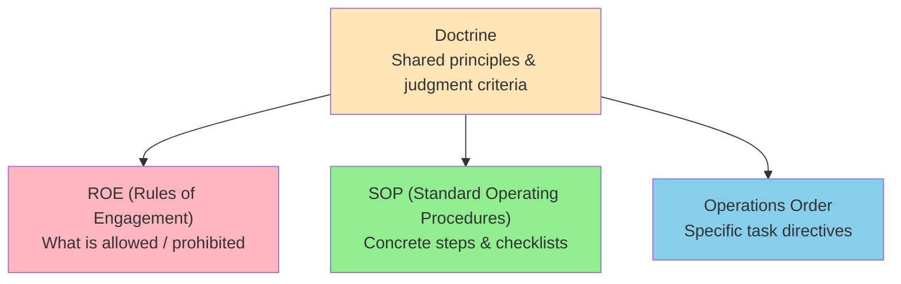
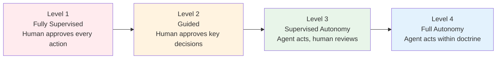
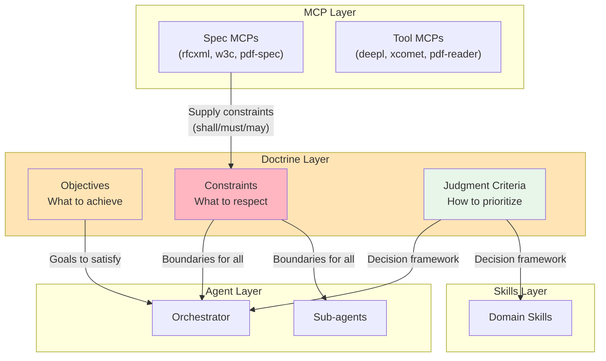
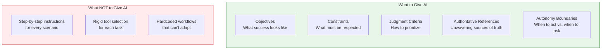

# Doctrine Layer — Give AI Constraints and Objectives, Not Instructions

> Defining **what AI should uphold and achieve**, rather than dictating how it should act step by step.

## About This Document

This document addresses two open issues simultaneously:

- [#28: Autonomy of Judgment and Action](https://github.com/shuji-bonji/ai-agent-architecture/issues/28) — "How should AI judge and decide?"
- [#30: Introducing the Doctrine Layer](https://github.com/shuji-bonji/ai-agent-architecture/issues/30) — "What shared principles should all agents follow?"

The connecting insight is a single design principle:

```
Don't tell AI "do it this way."
Tell AI "satisfy these conditions, within these resources, at this reliability level."
```

This shifts AI input from **imperative instructions** to **declarative intent** — constraints and objectives that remain valid regardless of how the AI chooses to implement them.

> **Audience**: Engineers building AI agent systems who want to move beyond step-by-step prompting toward principled, constraint-based AI governance. Also useful for team leads establishing shared guidelines across multiple agents.

## Position in Document Series



| Document | Central Question |
|----------|-----------------|
| 01-vision | Why does AI need guidance? |
| 02-reference-sources | **What** should AI know? |
| 03-architecture | **Where** do components live? |
| 04-design-patterns | **Which** pattern to use? |
| 05-solving-limitations | **How** to mitigate AI constraints? |
| **07-doctrine-and-intent** | **On what basis** should AI judge and act? |

## The Missing Layer

The existing three-layer architecture ([03-architecture](./03-architecture)) defines Agent, Skills, and MCP layers — covering what AI knows and what AI can do. But it leaves a critical gap: **on what basis does AI judge and decide?**

### Current Three-Layer Model

The existing architecture covers **what AI knows** and **what AI can do**:



### What's Missing: The Basis for Judgment

Mapping to the OODA loop (as identified in [#28](https://github.com/shuji-bonji/ai-agent-architecture/issues/28)):

| OODA Phase | Role | Current Coverage |
|------------|------|-----------------|
| **Observe** | Gather context, sensor data | MCP layer (✅ covered) |
| **Orient** | Apply judgment criteria, policies | ❌ **Not explicitly defined** |
| **Decide** | Prioritize, resolve trade-offs | ❌ **Not explicitly defined** |
| **Act** | Execute via tools | MCP layer (✅ covered) |

The **Orient** and **Decide** phases — where judgment criteria and decision-making principles live — have no dedicated home in the current architecture. This is where the **Doctrine Layer** belongs.

### Four-Layer Model with Doctrine



## Core Principle: Constraints and Objectives Over Instructions

With the four-layer model established, we can now articulate the core design principle that drives the Doctrine Layer: **give AI constraints and objectives, not step-by-step instructions.** This principle mirrors the broader trajectory of software abstraction.

### The Abstraction History of Software

Every generation of software development has raised the level of abstraction for what humans provide:

| Era | What Humans Provide | What Machines Handle |
|-----|---------------------|---------------------|
| Assembly | Register operations | Instruction encoding |
| C | Logic description | Memory management |
| Python | Intent in code | Type handling, GC |
| AI (current) | Intent in natural language | Code generation |
| AI (next) | **Constraints + Objectives** | Implementation decisions |

The key insight: **as abstraction rises, the human input shifts from "how" to "what" and ultimately to "why" and "within what bounds."**

### Instructions vs. Intent

| Approach | Example | Problem |
|----------|---------|---------|
| **Imperative** (instructions) | "Search for 'digital signature' in the spec, then extract Section 12.8, then list all shall requirements" | Brittle — breaks if spec structure changes |
| **Declarative** (intent) | "Verify that our implementation satisfies all normative requirements for digital signatures in PDF 2.0" | Resilient — AI chooses the right tools and path |

The declarative approach requires the AI to have:
1. **Objectives** — what success looks like
2. **Constraints** — what must be respected
3. **Judgment criteria** — how to evaluate trade-offs

These three elements form the **Doctrine**.

### Why This Matters for Development

Whether AI-driven or human-driven, the essential development process remains the same:



This cycle does not change whether code is written by hand, generated by AI, or produced by future compilation technologies. What changes is the abstraction level — but **"Did you define requirements? Did you design? Did you test? Did you verify?"** remains universal.

The Doctrine Layer formalizes the governance of this process for AI agents.

## Doctrine Layer Structure

The Doctrine Layer draws its structural inspiration from military doctrine — a well-established framework for enabling autonomous decision-making under uncertainty. The key insight is that military organizations have long solved the problem we now face with AI agents: **how do you ensure consistent judgment when direct communication is impossible?**

### Military Doctrine Mapping

As analyzed in [#30](https://github.com/shuji-bonji/ai-agent-architecture/issues/30), the military doctrine hierarchy maps directly to AI agent configuration:



| Military Concept | Role | Claude Code Location | AI Architecture Layer |
|-----------------|------|---------------------|----------------------|
| **Doctrine** | Shared principles for all | `CLAUDE.md` (root) | **Doctrine Layer** |
| **ROE** | Allowed / prohibited actions | `.claude/rules/` | **Doctrine Layer** |
| **SOP** | Standardized procedures | `.claude/skills/` | **Skills Layer** |
| **Operations Order** | Specific task directives | `.claude/commands/` | **Agent Layer** |
| **Unit Organization** | Specialized capabilities | `.claude/agents/` | **Agent Layer** |

### Three Components of Doctrine

#### 1. Objectives — What Success Looks Like

Define the "why" — not the "how":

```markdown
## Objectives
- All public API endpoints MUST comply with RFC 7231 (HTTP Semantics)
- Translation output MUST achieve xCOMET score ≥ 0.85
- Code coverage MUST NOT fall below 80%
```

#### 2. Constraints — What Must Be Respected

Define boundaries that no agent may cross:

```markdown
## Constraints
- MUST NOT commit code without passing tests
- MUST NOT call external APIs without security review
- MUST verify against authoritative specification before claiming compliance
- MUST request human approval for destructive operations
```

#### 3. Judgment Criteria — How to Evaluate Trade-offs

Define how to prioritize when objectives conflict:

```markdown
## Judgment Criteria
- Security > Performance > Convenience
- Specification compliance > Implementation speed
- When uncertain, ask the user rather than assume
- Prefer structured access over similarity search for specification documents
```

The last criterion — "prefer structured access over similarity search for specification documents" — is an example of how architectural decisions (like choosing MCP over RAG for ISO specifications) become doctrine.

## Autonomy Levels

A critical function of the Doctrine Layer is defining **how much freedom each agent has**. Not all agents need the same level of autonomy — a formatting agent requires far less oversight than a production deployment agent. The Doctrine Layer should define where each agent sits on this spectrum:



| Level | When to Use | Example |
|-------|------------|---------|
| Level 1 | High-risk operations (production deployment) | Database migration agent |
| Level 2 | Moderate risk (code changes) | Code review agent |
| Level 3 | Low risk, high volume (translations) | Translation workflow agent |
| Level 4 | Routine tasks with clear constraints | Formatting, linting agent |

The doctrine defines the **default autonomy level** and the **conditions for escalation**.

## Integration with Existing Architecture

The Doctrine Layer does not replace the existing three layers — it **governs** them. Each existing layer continues to operate as before, but now with explicit principles that guide their behavior. The following diagram shows how the three components of doctrine (Objectives, Constraints, Judgment Criteria) flow into each layer.

### How Doctrine Feeds Each Layer



Note how **specification MCPs feed the Doctrine Layer**: `pdf-spec-mcp`'s `get_requirements` extracts normative requirements (shall/must/may) that become constraints in the doctrine. This is the architectural reason why structured access to specifications matters more than RAG-based similarity search — doctrine needs **precise, authoritative constraints**, not "similar-sounding passages."

### Connection to Development Phases

Each development phase ([development-phases.md](../workflows/development-phases.md)) maps to doctrine elements:

| Development Phase | Doctrine Element | MCP Support |
|------------------|------------------|-------------|
| Requirements Definition | Objectives + Constraints | rfcxml-mcp, w3c-mcp, hourei-mcp |
| Design | Judgment Criteria | Skills (design patterns) |
| Implementation | Constraints (coding standards) | rxjs-mcp, linting tools |
| Testing | Objectives (coverage targets) | xcomet-mcp, test frameworks |
| Verification | All three elements | pdf-spec-mcp (`get_requirements`) |

## Practical Example: Doctrine for a Translation Workflow

To make the concept concrete, here is a complete doctrine definition for a translation workflow. This example shows how the three doctrine components (Objectives, Constraints, Judgment Criteria) plus autonomy level work together to enable an agent to operate independently while maintaining quality and consistency.

```markdown
# Translation Workflow Doctrine

## Objectives
- Produce Japanese translations of technical specifications
  that maintain terminology consistency and technical accuracy
- Achieve xCOMET quality score ≥ 0.85

## Constraints
- MUST use registered glossary for domain terminology
- MUST NOT translate PDF specification keywords (shall, object, stream)
  differently across sections
- MUST preserve section numbering and cross-references
- Translation of a single specification SHOULD complete within one session

## Judgment Criteria
- Terminology consistency > Natural-sounding Japanese
- When a term has multiple valid translations, prefer the glossary entry
- If xCOMET score < 0.80, re-translate the segment before proceeding
- If quality cannot be improved after 2 attempts, flag for human review

## Autonomy Level
- Level 3 (Supervised Autonomy): Agent translates and evaluates,
  human reviews final output
```

This doctrine enables the translation agent to make decisions **without explicit instructions for every situation** — exactly what military doctrine was designed to achieve: "when communication is cut, every unit still makes the same judgment."

## What to Give AI: A Summary

The following diagram distills the entire Doctrine Layer philosophy into a single visual: what you should provide to AI agents versus what you should avoid providing. This serves as a quick reference for teams adopting the doctrine-based approach.



The Doctrine Layer is where this principle becomes operational — encoded into `CLAUDE.md`, `.claude/rules/`, and the governance structure that surrounds all agent activity.

## Related Documents

- [01-vision.md](./01-vision) — Why AI needs guidance (problem definition)
- [02-reference-sources.md](./02-reference-sources) — Unwavering reference sources (what to know)
- [03-architecture.md](./03-architecture) — MCP/Skills/Agent layer structure
- [05-solving-ai-limitations.md](./05-solving-ai-limitations) — Practical approaches to AI constraints
- [Development Phases](../workflows/development-phases) — MCP integration per development phase
- [Skill Design Guide](../skills/creating-skills) — MUST/SHOULD/MUST NOT constraint patterns
- [Discussion #29](https://github.com/shuji-bonji/ai-agent-architecture/discussions/29) — Original doctrine discussion
