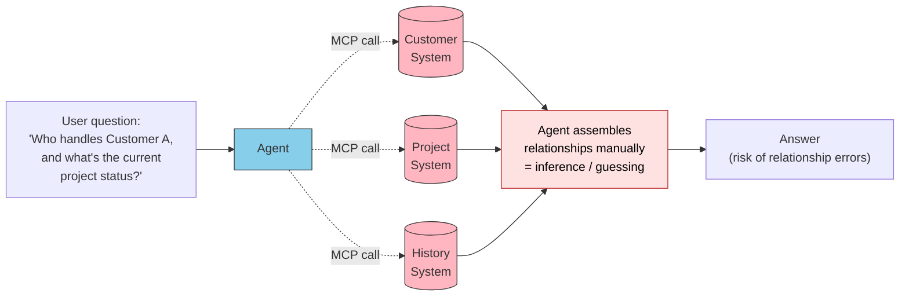
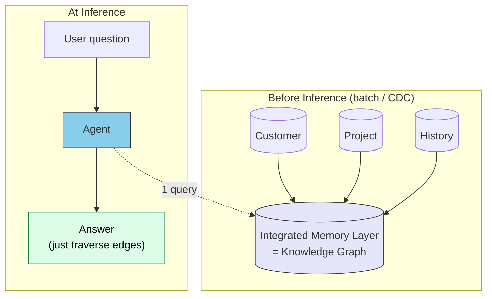
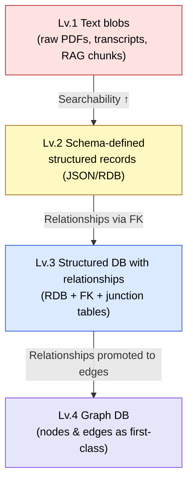
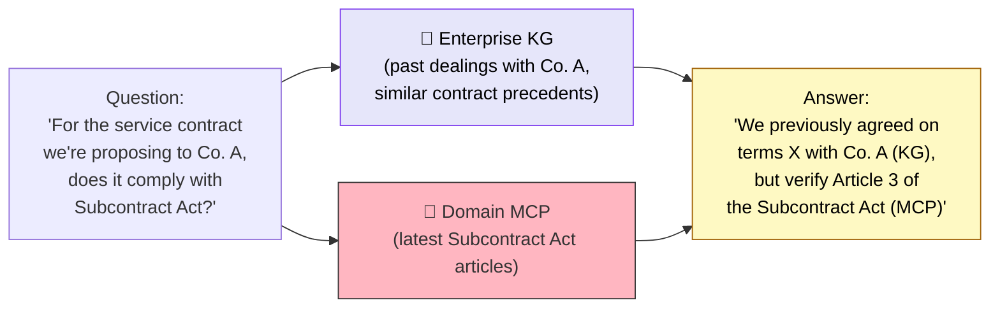
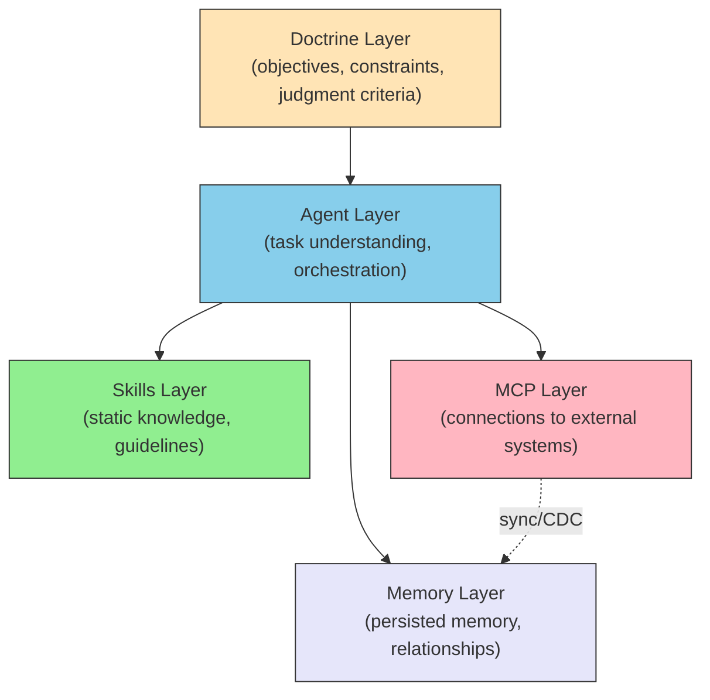
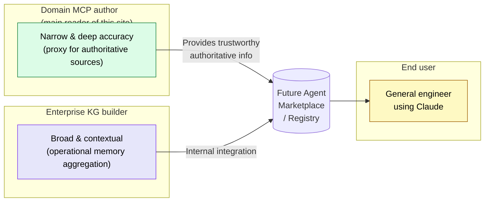
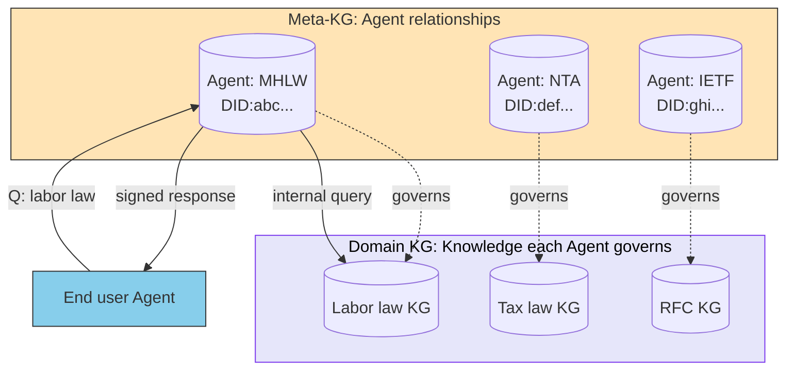

# Memory and Knowledge Integration — The Memory Layer and Knowledge Graphs

> For an agent to answer "**the continuation from last time**" or "**how this relates to other systems**," it needs an integrated memory layer **before inference**. MCP provides connections, but memory does not emerge from connections alone.

## About This Document

This document, building on the three-layer model ([03-architecture](./03-architecture)) and the reference source taxonomy ([02-reference-sources](./02-reference-sources)), addresses **the fourth structural concern**.

```
Designs that fetch data at inference time (scatter-gather) hit structural limits.
— Latency, token consumption, loss of relationships.
— With an integrated "memory" before inference, all three are resolved at the design level.
```

> **Target Reader**: Engineers who need to implement "inference spanning multiple systems" or "decisions grounded in past context" — situations a single MCP cannot fully address. For domain MCP authors, this chapter explains how your MCP fits into a larger memory layer.

::: warning Position of This Page
[01-vision](./01-vision) (**WHY** — why unwavering reference sources matter) \
→ [02-reference-sources](./02-reference-sources) (**WHAT** — what to use as reference sources) \
→ [03-architecture](./03-architecture) (**HOW** — how to structure the system) \
→ [04-ai-design-patterns](./04-ai-design-patterns) (**WHICH** — which pattern to choose and when) \
→ [05-solving-ai-limitations](./05-solving-ai-limitations) (**REALITY** — how to address real-world constraints) \
→ [06-physical-ai](./06-physical-ai) (**EXTENSION** — extending the three-layer model to the physical world) \
→ [07-doctrine-and-intent](./07-doctrine-and-intent) (**DOCTRINE** — on what basis AI should judge and act) \
→ **This page (MEMORY — what agents remember and how they connect)**
:::

::: details Meta Information

|                          |                                                                                                                                                                                            |
| ------------------------ | ------------------------------------------------------------------------------------------------------------------------------------------------------------------------------------------ |
| **What this chapter fixes** | The role of the Memory layer, the scatter-gather problem, Memory-first design, and the division of responsibility between domain MCPs (proxies for authoritative sources) and enterprise integrated KGs (aggregated operational memory) |
| **Not covered**          | Implementation details of specific KG products (Neo4j / RDF Triple Store selection criteria), internals of Entity Resolution algorithms, AgentID standard authentication flows (→ [agents/agent-identity](../agents/agent-identity)) |
| **Depends on**           | [03-architecture](./03-architecture) (the three layers being integrated), [02-reference-sources](./02-reference-sources) (taxonomy of authoritative sources), [agents/agent-identity](../agents/agent-identity) (identifiers and delegation) |
| **Pitfall**              | Treating the Memory layer as a "fast cache." The essence of the Memory layer is **persisting relationships**, not merely speeding things up                                                |

:::

## Position in the Document Series

```mermaid
flowchart LR
    subgraph EXISTING["Existing Documents"]
        V["01: Vision"]
        R["02: Reference Sources"]
        A["03: Architecture<br/>MCP / Skills / Agent"]
        D["04: Design Patterns"]
        S["05: Solving Limitations"]
        P["06: Physical AI"]
        DOC["07: Doctrine & Intent"]
    end

    subgraph THIS["This Document"]
        M["08: Memory & Knowledge<br/>Memory & KG"]
    end

    A -->|"Three layers define inference capability<br/>but "memory" needs separate treatment"| M
    R -->|"References are fetched real-time<br/>→ who owns the relationships?"| M
    DOC -->|"Judgment needs context<br/>→ where does context accumulate?"| M

    style M fill:#E6E6FA,color:#333,stroke:#333
```

| Document                      | Central Question                                            |
| ----------------------------- | ----------------------------------------------------------- |
| 02-reference-sources          | **What** should be used as reference sources?               |
| 03-architecture               | **Where** should components be placed?                      |
| 07-doctrine-and-intent        | **On what basis** should AI judge?                          |
| **08-memory-and-knowledge**   | **What** does the agent remember, **and how** does it connect? |

## The Problem — Why a Memory Layer Is Needed

### LLMs Can Only Think Inside the Context Window

LLM inference operates solely on information **expanded into the context window**. This is a structural constraint that cannot be bypassed. For the structural details, see the sister site [understanding-llm / Part 2: Context Window](https://shuji-bonji.github.io/understanding-llm-through-claude-code/02-context-window/).

The consequences are clear:

- Knowledge crossing session boundaries **must be persisted externally**
- Relationships spanning multiple systems **degrade if reconstructed from scratch at inference time**
- "What did we do last time?" and "How does this relate to other cases?" should **be held as memory**

### The Scatter-Gather Problem

When the three-layer model alone is asked to answer "questions spanning multiple systems," the agent must call several MCPs sequentially within the inference loop. This is the **scatter-gather** pattern (gather information from scattered systems).



Scatter-gather incurs three costs by construction:

| Cost | Description |
| --- | --- |
| **Latency** | The slowest MCP call dictates the total response time |
| **Token consumption** | Context is rebuilt from scratch each time, piling up input tokens |
| **Accuracy degradation** | Cross-system "relationships" must be inferred ad-hoc by the LLM, creating fertile ground for hallucinations |

> [!WARNING]
> The more domain MCPs you add, the worse scatter-gather costs scale — superlinearly. **"More tools = smarter agent" is wrong**; without a relationship-integration layer, accuracy on complex questions does not improve.

### Memory-First Design

The structural answer to scatter-gather is **Memory-first design**. **Before** inference begins, required data is already integrated with its relationships intact.



Instead of gathering data at inference, the agent **queries an already-integrated memory layer**. Since relationship assembly (= guessing) is unnecessary, hallucination decreases by construction.

## The Essence of the Memory Layer — Why Knowledge Graphs Over RDBs

> [!NOTE]
> "If we're pre-integrating, why not just use an RDB or Redis?" is a natural question. The essence of the Memory layer is **persisting relationships**, and that is where RDBs hit progressive limits.

Data storage approaches divide into four levels by the depth of relationships they express.



| Level | Strength | Limit |
| --- | --- | --- |
| Lv.1 Text blobs | Raw data preserved, searchable | Relationships cannot be expressed; RAG alone degrades on relational reasoning |
| Lv.2 Structured records | Single-record retrieval is fast | Relationships require separate design |
| Lv.3 RDB + JOIN | 2-hop joins are standard | 3–4 hop traversals break down; schema migrations are expensive |
| Lv.4 Graph DB | Multi-hop traversal is uniform; pairs well with Entity Resolution | Learning curve, tool selection |

The essence of the scatter-gather problem is not "collecting data from each system" but **"using inter-data relationships in inference."** When 3+ hop relationship traversal is frequent, Lv.4 (graph DB) gains a design advantage.

### Classification by the Source of "Truth"

This is the most important branch when designing a Memory layer. **What to hold as memory** depends fundamentally on the **source** of that knowledge.

| Aspect | Domain MCP world | Enterprise integrated KG world |
| --- | --- | --- |
| Source of knowledge | **External authoritative sources** (laws, RFCs, IFC specs) | **Internal operational history** (customer interactions, projects, contracts) |
| What is demanded | **Faithful reproduction** of the original text | **Continuity** of past context |
| Failure risk | Misquoting law → loss of trust | Loss of customer interaction context → degraded UX |
| Location of "truth" | A single answer defined officially | The accumulated total of context built up internally |
| Required depth | Domain-expert rigor | Sufficient to trace "what happened last time" |

The two often coexist within the same system:



In practice, answers often require alternating between "**what we agreed to (enterprise KG)**" and "**the external absolute standard (domain MCP)**."

## Adding the Memory Layer to the Three-Layer Model

The three-layer model in [03-architecture](./03-architecture) (Agent / Skills / MCP) defined **inference capability**. The Memory layer added here defines **the memory that supports inference**.



Responsibility boundaries:

| Layer | Provides | Examples |
| --- | --- | --- |
| **Agent** | Task understanding, orchestration, final response | Claude itself, sub-agents |
| **Skills** | Static guidelines, templates, judgment criteria | `SKILL.md` files under `.claude/skills/` |
| **Memory** | Persisted facts, relationships, historical context | Knowledge Graph, operational memory, durable cache |
| **MCP** | Real-time connections to external systems | DB clients, APIs, filesystems |

> [!IMPORTANT]
> The Memory and MCP layers **often connect bidirectionally**. MCP pulls data from external systems and syncs it into the Memory layer (CDC); at inference time, the Memory layer is read. This enables a design where "MCP is called only when real-time is required" and "routine references complete within the Memory layer."

## Implementation Patterns (by Scale)

The Memory layer is **strengthened incrementally based on scale and use case** — there is no need to start with a full KG.

### Stage 1: Personal Project (Files + Markdown)

Claude Code's `CLAUDE.md`, the memory system, and per-editor project files fall here.

- Format: Markdown / plain text
- Relationships: file-to-file links (`[[name]]`, etc.)
- Rough scale: dozens to hundreds of entries
- Examples: personal work notes, project-specific context

### Stage 2: Medium Scale (SQLite + Relational Tables)

For small-to-medium teams or projects that need structured persistence.

- Format: SQLite / Postgres + FK
- Relationships: up to 2-hop JOINs
- Rough scale: thousands to tens of thousands of entities
- Examples: shared team project DB, customer master + history

### Stage 3: Large Scale (Property Graph DB)

When cross-system relationships and 3+ hop traversals become frequent.

- Format: Neo4j / Amazon Neptune / RDF Triple Store
- Relationships: arbitrary-depth edge traversal, Entity Resolution
- Rough scale: hundreds of thousands to tens of millions of entities
- Examples: company-wide integrated KG; product–customer–incident–patch relationships

### Stage 4: Enterprise Integration (CDC + KG + Entity Resolution)

Multiple SaaS / internal systems are integrated into a KG in real time and operated as the memory foundation for production agents.

- Format: CDC-based bidirectional sync + property graph DB + ER engine
- Relationships: cross-system entity resolution, permission graphs included
- Rough scale: dozens of systems / millions to billions of entities
- Examples: DevRev Computer + AirSync; integrating Salesforce/Zendesk/Jira

> [!TIP]
> You do not need to aim for Stage 4 immediately. The principle is to **advance to the next stage only after actually feeling the scatter-gather pain**. Use cases sufficiently served by Stages 1–2 are more common than you might expect.

## Position of Domain MCP Authors (Readers of This Site)

Most readers of this site are **builders of single-domain MCPs**. Let us clarify where your MCP sits in the Memory layer discussion.



It clarifies things to view a domain MCP as **already containing a "mini KG" inside itself**.

- Law MCP nodes: laws, articles, notices, cabinet/ministerial orders, precedents
- IFC MCP nodes: entities, property sets, inheritance relationships
- RFC MCP nodes: RFCs, dependent RFCs, referenced standards

These are essentially **small domain KGs exposed for remote reading**. Once the AgentID era matures, such MCPs are likely to stand as **"proxy agents for authoritative public domains"** — referenced by enterprise integrated KGs (see next section).

## Convergence with the AgentID Era

The AgentID covered in [agents/agent-identity](../agents/agent-identity) structurally overlaps with this chapter's Memory layer.

A knowledge graph is the world of "**identifiable entities + their relationships**." The agent world is the world of "**identifiable actors + their capabilities**." Their structures are remarkably similar and naturally converge.



- **Meta-KG**: a graph of "which Agent specializes in what, and who trusts whom"
- **Domain KG**: each Agent's internal specialized-knowledge graph

Domain MCPs have the potential to evolve into **"specialist Agents equipped with a domain KG."** Once AgentID standards (DID, Agent Card, A2A Protocol) mature, current MCPs are likely to shift in role from "**self-built wrappers → proxy clients for official Agents**."

## Design Judgment — When to Introduce the Memory Layer

> [!IMPORTANT]
> Introducing the Memory layer is **a design judgment, not a technology judgment**. Rather than "introducing a KG because I want to use one," advance to the next stage **when scatter-gather costs can no longer meet business requirements**.

Signals to introduce:

- ✅ The same data is repeatedly fetched from multiple MCPs
- ✅ Entity Resolution issues are surfacing (e.g., LLM misidentifies "Co. A" and "Acme Corp" as different)
- ✅ Questions involving 3+ hop relationships occur often (e.g., "customer → project → owner → past projects")
- ✅ Latency requirements cannot be met by scatter-gather
- ✅ Business requirements demand answers about "past decisions" or "continuation from last time"

Conversely, signals **not** to introduce:

- ❌ Domain is single-purpose and 1–2 hop relationships suffice
- ❌ Accurate retrieval of authoritative sources is the primary goal; accumulating past context is not a requirement
- ❌ Few users / projects make persistence cost-prohibitive
- ❌ Adequate latency is achievable with MCP-side caching alone

## Concepts → Implementation Connection

| What you want to know | Next page |
| --- | --- |
| Structure of the three-layer model | [03-architecture](./03-architecture) |
| Agent identification and delegation | [agents/agent-identity](../agents/agent-identity) |
| Criteria for choosing reference sources | [reference-selection-checklist](../reference-selection-checklist) |
| Choosing between Skills and MCP | [skills/vs-mcp](../skills/vs-mcp) / [FAQ](../faq/mcp-vs-skills) |
| Mapping to development phases | [workflows/development-phases](../workflows/development-phases) |

## 🔗 Deeper: Why LLMs Need Memory in the First Place

This page covers the **structure (what/how)** of the Memory layer. If you want to understand **why** LLMs need a memory layer at all — from the perspective of context window mechanics and session management — the sister site provides the foundational reasoning.

- [understanding-llm / Part 2: Context Window](https://shuji-bonji.github.io/understanding-llm-through-claude-code/02-context-window/) — Structure of the LLM's "thinking space"
- [understanding-llm / Part 8: Session Management](https://shuji-bonji.github.io/understanding-llm-through-claude-code/08-session-management/) — Conversation lifespan and memory operations
- [understanding-llm / Part 10: Multi-Session Coordination](https://shuji-bonji.github.io/understanding-llm-through-claude-code/10-multi-session/) — Scaling memory across sessions

## Related Documents

- [02-reference-sources](./02-reference-sources) — **WHAT**: the source material to integrate into the Memory layer
- [03-architecture](./03-architecture) — **HOW**: responsibility boundaries between Memory and the existing three layers
- [07-doctrine-and-intent](./07-doctrine-and-intent) — **DOCTRINE**: judgment grounded in remembered context
- [agents/agent-identity](../agents/agent-identity) — How the Memory layer identifies "whose memory this is"
- [skills/vs-mcp](../skills/vs-mcp) — Skills / MCP role separation (relationship with the Memory layer)

### References

- takanorisuzuki (2026). "The Limits of Designs Where AI Agents Fetch Data Every Time." Zenn. [zenn.dev/knowledge_graph](https://zenn.dev/knowledge_graph/articles/kg-agent-memory-first-design) — Scatter-gather and Memory-first design
- takanorisuzuki (2025). "Introduction to Knowledge Graphs." Zenn. [zenn.dev/knowledge_graph](https://zenn.dev/knowledge_graph/articles/knowledge-graph-intro) — KG fundamentals
- Berners-Lee, T., Hendler, J., & Lassila, O. (2001). "The Semantic Web." Scientific American. [scientificamerican.com](https://www.scientificamerican.com/article/the-semantic-web/) — Philosophical origins of KGs

---

> **Previous**: [07-doctrine-and-intent](./07-doctrine-and-intent)

> **Next**: [Concepts Overview](./)
