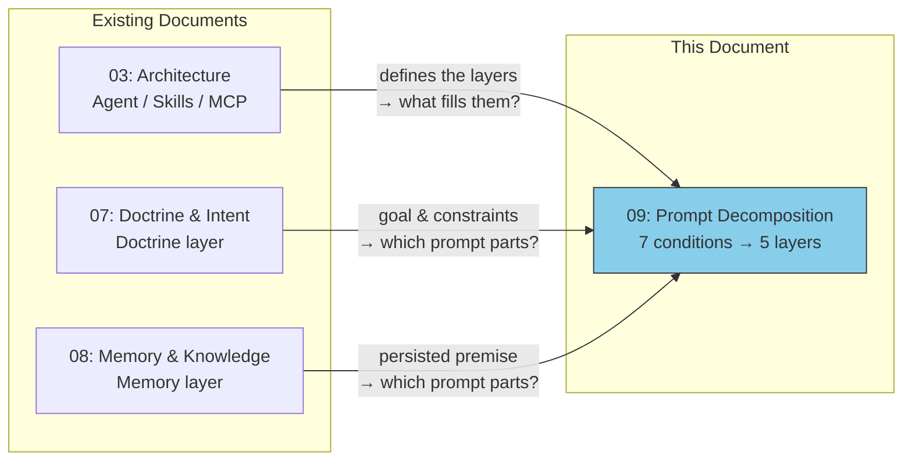
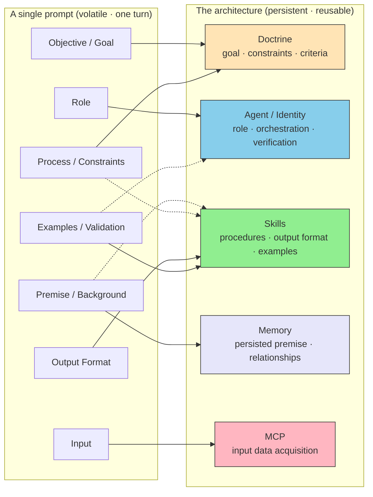
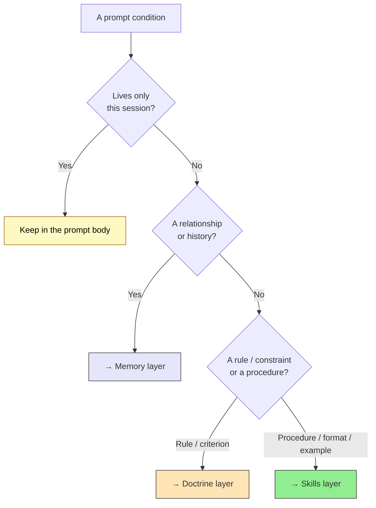

# Prompt Decomposition — From a Flattened Snapshot to a Layered Architecture

> A prompt co-locates every condition inside a single context. An architecture distributes each condition to the layer that can best **persist** it. The seven conditions of a good prompt are the same seven concerns the five layers were built to hold.

## About This Document

This document, building on the three-layer model ([03-architecture](./03-architecture)), the Doctrine layer ([07-doctrine-and-intent](./07-doctrine-and-intent)), and the Memory layer ([08-memory-and-knowledge](./08-memory-and-knowledge)), addresses a synthesizing question: **where does each part of a prompt actually live once you stop writing it by hand every time?**

```
A well-formed prompt has a logical structure — role, premise, goal, input,
process, output format, examples.
A well-formed system has the same structure, but each part is externalized
to the layer best suited to persist and reuse it.
Design, Skills, MCP, and settings are not alternatives to prompting —
they are where the prompt's conditions go to live permanently.
```

> **Target Reader**: Anyone who writes the same kinds of prompts repeatedly and wonders *what* should be lifted out of the prompt and into `CLAUDE.md`, a Skill, an MCP, or a sub-agent — and *which layer* each piece belongs to.

::: warning Position of This Page
[01-vision](./01-vision) (**WHY** — why unwavering reference sources matter) \
→ [02-reference-sources](./02-reference-sources) (**WHAT** — what to use as reference sources) \
→ [03-architecture](./03-architecture) (**HOW** — how to structure the system) \
→ [04-ai-design-patterns](./04-ai-design-patterns) (**WHICH** — which pattern to choose and when) \
→ [05-solving-ai-limitations](./05-solving-ai-limitations) (**REALITY** — how to address real-world constraints) \
→ [06-physical-ai](./06-physical-ai) (**EXTENSION** — extending the three-layer model to the physical world) \
→ [07-doctrine-and-intent](./07-doctrine-and-intent) (**DOCTRINE** — on what basis AI should judge and act) \
→ [08-memory-and-knowledge](./08-memory-and-knowledge) (**MEMORY** — what agents remember and how they connect) \
→ **This page (DECOMPOSITION — how a prompt decomposes across the layers)**
:::

::: details Meta Information

|                          |                                                                                                                                                                                            |
| ------------------------ | ------------------------------------------------------------------------------------------------------------------------------------------------------------------------------------------ |
| **What this chapter fixes** | The mapping from a prompt's seven logical conditions onto the five layers; the two axes that determine *where* a condition lives (kind and volatility); the anti-pattern of re-specifying everything in every prompt |
| **Not covered**          | Prompt-engineering technique itself (wording, few-shot construction), and the internal reasons a flat prompt degrades — those belong to the sister site ([why](#deeper-why-a-flat-prompt-degrades)) |
| **Depends on**           | [03-architecture](./03-architecture) (the layers being targeted), [07-doctrine-and-intent](./07-doctrine-and-intent) (Doctrine layer), [08-memory-and-knowledge](./08-memory-and-knowledge) (Memory layer) |
| **Pitfall**              | Treating "design vs. prompting" as a choice. The layers are not a *substitute* for the prompt — they are where the prompt's conditions are **persisted** so they need not be retyped       |

:::

## Position in the Document Series



| Document                      | Central Question                                            |
| ----------------------------- | ----------------------------------------------------------- |
| 03-architecture               | **Where** should components be placed?                      |
| 07-doctrine-and-intent        | **On what basis** should AI judge?                          |
| 08-memory-and-knowledge       | **What** does the agent remember, and how does it connect?  |
| **09-prompt-decomposition**   | **How** does a prompt's structure decompose across the layers? |

## The Seven Conditions of a Prompt

A well-formed prompt is not a single instruction — it is a bundle of distinct logical conditions. Even when written as one paragraph, it carries seven separable concerns:

| # | Condition | What it specifies |
| --- | --- | --- |
| 1 | **Role** | The AI's identity and perspective |
| 2 | **Premise / Background** | The foundation of shared knowledge and situation |
| 3 | **Objective / Goal** | The clear outcome to be achieved |
| 4 | **Input** | The data and state to be processed |
| 5 | **Process / Constraints** | The reasoning steps and rules |
| 6 | **Output Format** | The structure and data type of the result |
| 7 | **Examples / Validation** | Examples of expected results and how to verify them |

### Why These Seven

The seven conditions are not an arbitrary taxonomy — they **exhaust the independent axes along which output can vary**. Each condition corresponds to one question that, if left unspecified, the model fills in implicitly — and any axis the model fills becomes nondeterminism (a place where the result drifts each time).

| If unspecified… | …what the model silently decides |
| --- | --- |
| Role | From which perspective, vocabulary, and judgment criteria to answer |
| Premise | What to treat as shared knowledge |
| Objective | What counts as "success" |
| Input | What to treat as the subject of processing |
| Process / Constraints | Which rules to honor and what is forbidden |
| Output Format | In what structure to return the result |
| Examples / Validation | How to judge correct from incorrect |

> [!NOTE]
> *Why* the model cannot decide these axes on its own and instead fills them implicitly (the underlying principle) is out of scope for this site. The mechanics — how an LLM responds to statistical token patterns and fills weakly-specified axes from its prior distribution — are covered by the sister site (see "[Deeper](#deeper-why-a-flat-prompt-degrades)" at the end).

## The Core Thesis — A Prompt Is a Flattened Snapshot

In a one-off prompt, all seven conditions are **co-located in a single context window**. That is convenient for a single turn, but it means every condition is volatile: it disappears when the session ends, and must be retyped next time.

A system design does the opposite. It takes each condition and **externalizes it to the layer best able to persist and reuse it**. The prompt does not vanish — it thins out, because its stable parts now live elsewhere.



> [!IMPORTANT]
> "Design vs. prompting" is a false choice. The five layers are not an alternative to writing prompts — they are the **addresses where the prompt's conditions are filed for reuse**. Every layer in this site exists so that some prompt condition no longer has to be re-stated each turn.

## The Mapping — Seven Conditions to Five Layers

| Prompt condition | Essence | Home layer(s) | Concrete artifact |
| --- | --- | --- | --- |
| **Role** | Identity & perspective | **Agent / Identity** | system-prompt persona, `CLAUDE.md` header, `.claude/agents/*.md`, Agent ID / DID |
| **Premise / Background** | Shared knowledge base | **Memory + Skills** | `CLAUDE.md` (project-stable), `SKILL.md` (domain), memory files / KG (relational, historical) |
| **Objective / Goal** | The outcome to achieve | **Doctrine** | mission / intent statements, judgment criteria |
| **Input** | Data & state to process | **MCP** | MCP server tools, file / API / DB fetch |
| **Process / Constraints** | Reasoning steps & rules | **Doctrine** (constraints) + **Skills** (procedures) | RFC 2119 ladder (MUST / SHOULD), `SKILL.md` procedures, guardrails |
| **Output Format** | Structure & type of result | **Skills** | docx / pptx / xlsx format skills, schemas, templates |
| **Examples / Validation** | Expected results & checks | **Skills** (examples) + **Doctrine** (criteria) + **Agent** (verification) | `SKILL.md` examples, pass criteria, sub-agent quality gates |

Note that the mapping is not strictly one-to-one. **Process / Constraints** splits between Doctrine (the *constraints* — what must not happen) and Skills (the *procedure* — how to carry it out). **Premise** splits between Memory (relational, historical context) and Skills (stable domain knowledge). A single prompt condition can fan out across layers, which leads to the second axis.

## The Second Axis — Volatility Decides the Address

The first axis is *kind* (the table above). The second axis is **how long the condition needs to live**. The same condition lands in a different place depending on its lifespan:

| Lifespan | Where it lives | Example |
| --- | --- | --- |
| **Session-only** (volatile) | The prompt body itself | "this particular file, today's specific ask" |
| **Project-persistent** | `CLAUDE.md` / Skills / Doctrine | coding conventions, the standard output format, the agent's role |
| **Cross-cutting / relational** | Memory (KG, memory files) | "what we decided last time," entity relationships across systems |

This is why "Premise" has no single home. A premise true only for this session stays in the prompt; a premise true for the whole project goes to `CLAUDE.md`; a premise that is really a *relationship* to past work goes to Memory. The decision is not "which layer is the premise" but "**how persistent is this particular premise**."



## Walking the Seven Conditions

**Role → Agent / Identity.** A role stated once per prompt ("you are a careful reviewer") becomes, at the system level, the persona in the system prompt, the opening of `CLAUDE.md`, or a dedicated sub-agent definition under `.claude/agents/`. In the AgentID era it becomes a verifiable identity (DID). The role stops being a sentence and becomes *who the agent is by default*.

**Premise / Background → Memory + Skills.** Shared facts that are stable for the project belong in `CLAUDE.md` or a Skill; facts that are really *relationships to prior work* belong in Memory (see [08](./08-memory-and-knowledge)). The test: if the premise is "what is true," it tends toward Skills; if it is "what happened," it tends toward Memory.

**Objective / Goal → Doctrine.** The outcome to achieve, and the criteria for "good enough," are exactly what the Doctrine layer holds ([07](./07-doctrine-and-intent)). A goal repeated in every prompt is a sign that the project's intent has not been fixed in Doctrine.

**Input → MCP.** "Here is the data" in a prompt becomes, at the system level, an MCP tool that *fetches* the data and state on demand ([03](./03-architecture)). Pasting input into the prompt is the flattened form; an MCP boundary is its persistent form.

**Process / Constraints → Doctrine + Skills.** This condition splits. The *constraints* (what must never happen, the boundaries) live in Doctrine and are read through the RFC 2119 strength ladder (MUST / SHOULD / MAY). The *procedure* (the step-by-step recipe) lives in a Skill's `SKILL.md`.

**Output Format → Skills.** "Return a table with these columns," "produce a `.docx`," "match this schema" — these are precisely what format Skills encode (the docx / pptx / xlsx skills are the canonical examples). The format stops being described and becomes a reusable template.

**Examples / Validation → Skills + Doctrine + Agent.** Worked examples live in `SKILL.md`. The *pass criteria* are Doctrine, expressed on the RFC 2119 ladder. The *act of verifying* is an Agent-layer responsibility — a verification step or a sub-agent quality gate.

## Anti-Pattern — Re-Specifying Everything Every Time

The failure mode this chapter guards against is keeping all seven conditions in the prompt forever — re-pasting the role, the conventions, the format, and the examples into every request.

> [!WARNING]
> A flattened prompt does not just cost typing. As the prompt grows, the *structural* behavior of the LLM degrades: stable instructions compete with the live request for attention, middle content is lost, and earlier rules decay. The cure is not a longer prompt but **moving each stable condition to its layer**, so the live prompt carries only what is genuinely new this turn.

The signal that a condition should be externalized is simple: **you have typed it more than once.** A role you restate every session belongs in `CLAUDE.md`; a format you re-describe every time belongs in a Skill; a constraint you keep repeating belongs in Doctrine; a premise about past work belongs in Memory.

## Design Judgment — When to Externalize a Condition

> [!IMPORTANT]
> Externalizing a prompt condition is a **design judgment, not a reflex**. Move a condition to a layer when its lifespan exceeds the session and its cost of repetition exceeds the cost of maintaining it in a layer.

Signals to externalize:

- ✅ The same role, constraint, or format is restated across many prompts
- ✅ The condition must hold identically for every team member, not just you
- ✅ Forgetting to restate it would silently change the result
- ✅ The premise is really a *relationship* to prior decisions (→ Memory)

Signals to keep it in the prompt:

- ❌ It is true only for this one request
- ❌ It changes every time (the actual task, today's specific input)
- ❌ Fixing it in a layer would over-constrain future, different work

## Related Documents

- [03-architecture](./03-architecture) — **HOW**: the layers each condition is filed into
- [07-doctrine-and-intent](./07-doctrine-and-intent) — **DOCTRINE**: home of Goal and Constraints
- [08-memory-and-knowledge](./08-memory-and-knowledge) — **MEMORY**: home of relational Premise
- [skills/vs-mcp](../skills/vs-mcp) — Output Format / Procedure (Skills) vs. Input (MCP)
- [faq/agent-vs-subagent-vs-skill](../faq/agent-vs-subagent-vs-skill) — where Role and Verification are filed

## 🔗 Deeper: Why a Flat Prompt Degrades {#deeper-why-a-flat-prompt-degrades}

This page covers the **structure (what/how)** of decomposition — which condition goes to which layer. If you want to understand **why** an LLM forces this decomposition — why everything cannot simply stay in one prompt — the sister site explains it from the loading-tier mechanics of the context window.

- [understanding-llm / Part 1: LLM Structural Problems](https://shuji-bonji.github.io/understanding-llm-through-claude-code/01-llm-structural-problems/) — Context Rot, Priority Saturation, Instruction Decay: why a long flat prompt loses fidelity
- [understanding-llm / Part 3: Always-Loaded Context](https://shuji-bonji.github.io/understanding-llm-through-claude-code/03-always-loaded-context/) — Role and stable Premise as the always-loaded tier (`CLAUDE.md`)
- [understanding-llm / Part 4–5: Conditional & On-Demand Context](https://shuji-bonji.github.io/understanding-llm-through-claude-code/04-conditional-context/) — Skills loaded only when relevant
- [understanding-llm / Part 6: Tool Context](https://shuji-bonji.github.io/understanding-llm-through-claude-code/06-tool-context/) — Input acquired through tools / MCP rather than pasted
- [understanding-llm / Prompt Sensitivity: Underspecification](https://shuji-bonji.github.io/understanding-llm-through-claude-code/01-llm-structural-problems/prompt-sensitivity/#underspecification) — why the model cannot decide weakly-specified axes on its own and fills them from its prior

---

> **Previous**: [08-memory-and-knowledge](./08-memory-and-knowledge)

> **Next**: [Concepts Overview](./)
