# Concepts — Overview of Design Philosophy

> A bird's-eye view of the "AI Agent Architecture Design Philosophy" across seven chapters.

## Document Chain

```mermaid
flowchart LR
    V["01: Vision<br/>WHY"]
    R["02: Reference Sources<br/>WHAT"]
    A["03: Architecture<br/>HOW"]
    D["04: Design Patterns<br/>WHICH"]
    S["05: Solving Limitations<br/>REALITY"]
    P["06: Physical AI<br/>EXTENSION"]
    DOC["07: Doctrine & Intent<br/>DOCTRINE"]

    V --> R --> A --> D --> S --> P --> DOC

    style V fill:#FFE4B5,color:#333,stroke:#333
    style R fill:#FFE4B5,color:#333,stroke:#333
    style A fill:#87CEEB,color:#333,stroke:#333
    style D fill:#90EE90,color:#333,stroke:#333
    style S fill:#FFB6C1,color:#333,stroke:#333
    style P fill:#DDA0DD,color:#333,stroke:#333
    style DOC fill:#F0E68C,color:#333,stroke:#333
```

## Chapter Overview

| Ch. | Label | Central Question | Link |
| --- | --- | --- | --- |
| **01** | **WHY** | Why do AI agents need guiding principles? | [01-vision](./01-vision) |
| **02** | **WHAT** | What should be used as reference sources? | [02-reference-sources](./02-reference-sources) |
| **03** | **HOW** | How should the system be structured? | [03-architecture](./03-architecture) |
| **04** | **WHICH** | Which pattern should be chosen and when? | [04-ai-design-patterns](./04-ai-design-patterns) |
| **05** | **REALITY** | How do we address real-world constraints? | [05-solving-ai-limitations](./05-solving-ai-limitations) |
| **06** | **EXTENSION** | Does the three-layer model hold in the physical world? | [06-physical-ai](./06-physical-ai) |
| **07** | **DOCTRINE** | On what basis should AI judge and act? | [07-doctrine-and-intent](./07-doctrine-and-intent) |

## Layer × Concern Cross-Reference Matrix

Shows which chapters cover which concerns for each layer.

| Concern | Agent Layer | Skills Layer | MCP Layer | Doctrine Layer |
| --- | --- | --- | --- | --- |
| **Structural Definition** | 03 | 03 | 03 | 07 |
| **Design Patterns** | 04 | 04 | 04 | — |
| **Constraints & Countermeasures** | 05 | 05 | 05 | 05 |
| **Edge Extension** | 06 | 06 | 06 | 06 |
| **Judgment Criteria** | 07 | 07 | — | 07 |
| **Reference Source Taxonomy** | — | 02 | 02 | — |
| **Design Philosophy (WHY)** | 01 | 01 | 01 | 01 |

## Mermaid Diagram Color Legend

The following color codes represent layers consistently across all chapters.

| Layer | Color | Mermaid `fill` |
| --- | --- | --- |
| **Agent Layer** | Light Blue | `#87CEEB` |
| **Skills Layer** | Light Green | `#90EE90` |
| **MCP Layer** | Pink | `#FFB6C1` |
| **Doctrine Layer** | Light Orange | `#FFE4B5` |

## Normative Strength Ladder (shall / should / may)

This site's documentation uses normative keywords conforming to RFC 2119.

| Keyword | Strength | Meaning |
| --- | --- | --- |
| **MUST** / **SHALL** | Required | An absolute requirement. Violation constitutes a design defect |
| **MUST NOT** / **SHALL NOT** | Prohibited | An absolute prohibition |
| **SHOULD** | Recommended | Deviation only with justified reason |
| **SHOULD NOT** | Not Recommended | Adoption only with justified reason |
| **MAY** | Optional | Entirely discretionary |

Constraints within doctrine ([07-doctrine-and-intent](./07-doctrine-and-intent)) and normative requirements extracted from spec MCPs are interpreted according to this strength ladder.

## Concepts → Implementation Exit Checklist

A checklist to confirm that your understanding of the Concepts section is sufficient to proceed to the implementation phase.

### Minimum Readiness Conditions

- [ ] **Reference Sources Minimum Catalog** — Have you identified the authoritative sources your project will reference, and prioritized them for MCP integration? (See 02)
- [ ] **Three-Layer Separation Understanding** — Can you explain the responsibility boundaries of Agent / Skills / MCP, and recognize anti-patterns (layer confusion)? (See 03)
- [ ] **Pattern Selection Rationale** — Can you justify whether to adopt RAG, MCP, or Fine-tuning, and explain the reasoning? (See 04)
- [ ] **Constraint Boundary Awareness** — Can you distinguish between constraints solvable by technology (knowledge constraints) and those not solvable by technology alone (institutional constraints)? (See 05)
- [ ] **Human Intervention Point Agreement** — Has your team agreed on the agent's autonomy level and the conditions for escalation to humans? (See 07)
- [ ] **Evidence Trail Minimum Requirements** — Does your design include mechanisms for post-hoc verification of AI decisions (verification status, source records)? (See 05)

### Once These Are Met

→ Proceed to [Development Phases](../workflows/development-phases) and implement MCP integration at each phase
→ Refer to the [Skills Design Guide](../skills/creating-skills) and formalize domain knowledge as Skills

## Correspondence with AI Research

The conceptual framework of this site corresponds to standard structures in AI agent research as follows.

| Standard AI Research Structure | Corresponding Concept in This Site | Chapter |
| --- | --- | --- |
| **Goal** | Intent | 07 |
| **Policy** | Doctrine | 07 |
| **Reasoning** | Agent Layer (inference & judgment) | 03 |
| **Tools / Skills** | Skills Layer + MCP Layer | 03 |
| **Execution** | Tool execution via MCP | 03, 04 |
| **Physical Action** | Physical AI | 06 |
