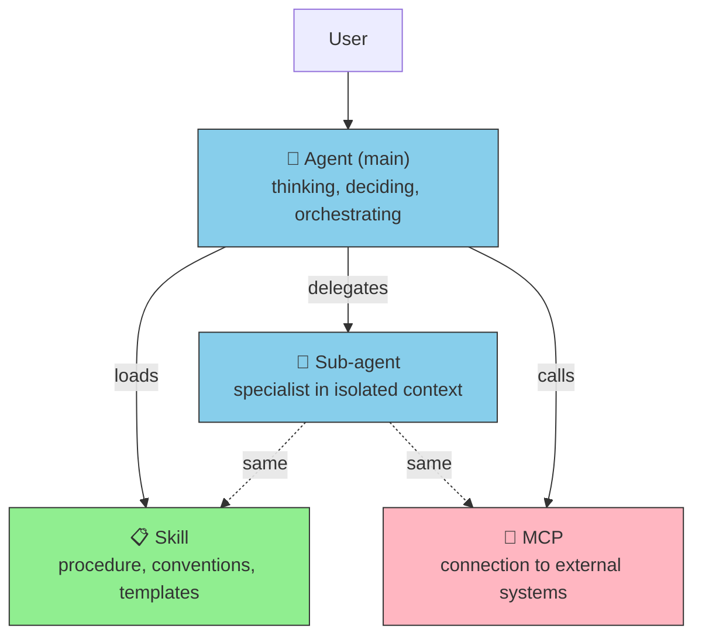
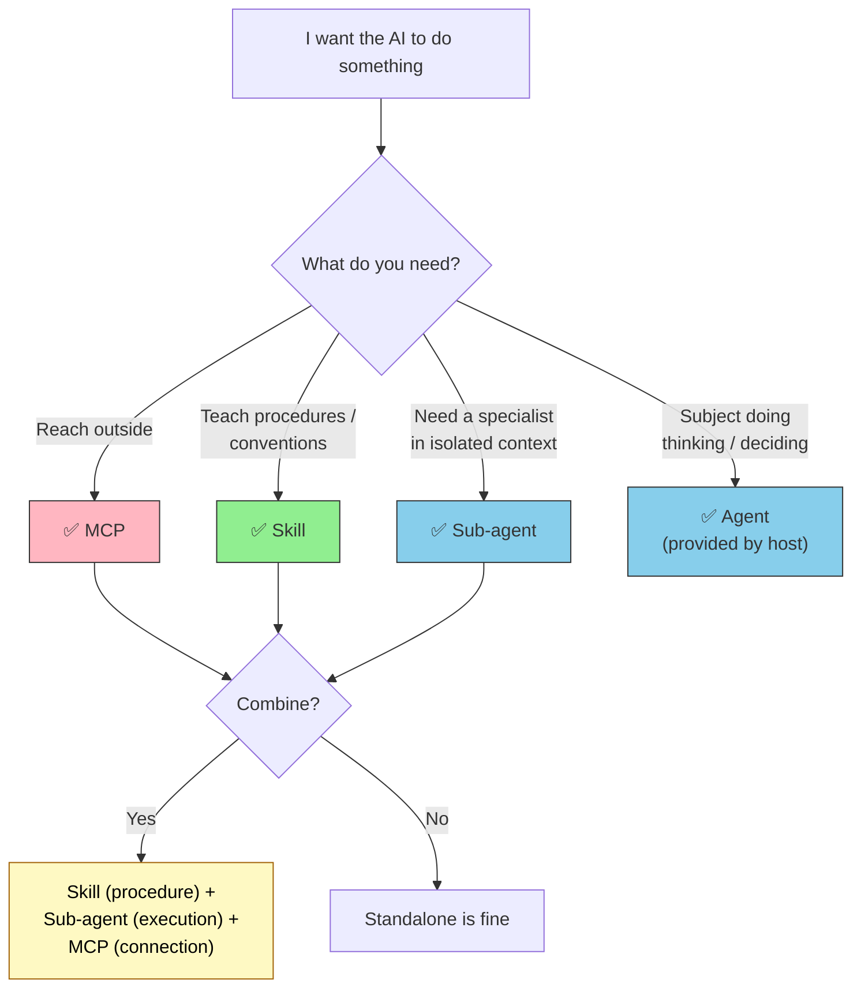

# Agent / Sub-agent / Skill / MCP — 4 Roles in 3 Lines

> [!IMPORTANT] Answered in 3 lines
> 1. **Agent** = the "person" who thinks and decides; **Sub-agent** = a specialist team inside an Agent
> 2. **Skill** = an instruction sheet for "how to do" something; **MCP** = a "connection" to external systems
> 3. They are not the same. They differ along four axes: **who, what they know, what they connect to**.

## At-a-glance mapping

| What you want to do | Agent | Sub-agent | Skill | MCP |
| --- | :---: | :---: | :---: | :---: |
| Talk with the user and understand the task | ✅ | ❌ | ❌ | ❌ |
| Orchestrate the entire job | ✅ | ❌ | ❌ | ❌ |
| Work on a specialty in an isolated context | ❌ | ✅ | ❌ | ❌ |
| Objective quality gate (review, validation) | ❌ | ✅ | ❌ | ❌ |
| Teach "how to create a PR" procedure | ❌ | ❌ | ✅ | ❌ |
| Convey coding conventions / domain knowledge | ❌ | ❌ | ✅ | ❌ |
| Call an external API | ❌ | ❌ | ❌ | ✅ |
| Query an internal database | ❌ | ❌ | ❌ | ✅ |
| Access the filesystem | ❌ | ❌ | ❌ | ✅ |

## The Four in One Diagram

- **Agent / Sub-agent** = actors (subjects)
- **Skill** = knowledge and procedures the actor references
- **MCP** = the connection point through which the actor reaches the world

## Common search questions, answered in 3 lines

### Q: Difference between Skill and Sub-agent in one line?

**A**: **Skill expands in the parent context; Sub-agent launches in an isolated context.** The dividing question is whether intermediate tool calls flow into the parent. See [Sub-agent vs Skills](../agents/subagent-vs-skill).

### Q: What's different between MCP and Sub-agent?

**A**: **MCP is a "connection"; Sub-agent is a "specialist."** MCP is a server process (an opening to external systems); Sub-agent is a separate persona running inside Claude Code. The Sub-agent uses MCP from the inside.

### Q: Which of the four should I build first?

**A**: **Start with Skill.** A single Markdown file is enough; the ROI is immediate. Next comes MCP (when external connection is required), and last Sub-agent (once isolated context becomes a hard requirement). Agent (main) is already provided by hosts like Claude Code.

### Q: How are Agent and Sub-agent related?

**A**: **Sub-agent is a form of Agent.** Specifically, "**a child Agent delegated by a parent and executed in an isolated context**." It is general Agent / custom agent, narrowed by lifecycle attributes (Ephemeral / Spawned). See [Agent Taxonomy](../agents/agent-taxonomy).

### Q: Do I have to use all four?

**A**: **No.** Use only what your task needs. For example: "teach coding conventions" — Skill only; "call an external API and show results" — MCP only; "exploratory codebase investigation" — Sub-agent only. All are fine.

### Q: What is the typical composition pattern?

**A**: The **3-layer pattern**: "**Skill for procedure, Sub-agent for execution, MCP for connection.**" Example: translation workflow → Skill `translation-workflow` defines the procedure, Sub-agent `translator` executes as the specialist, MCP `deepl-mcp` calls the translation API.

### Q: Where do meta-agents, Orchestrator, Swarm fit?

**A**: These are **design patterns**, not implementation units. Agent / Sub-agent / Skill / MCP are implementation units; Orchestrator-Worker and Swarm are architectural patterns that combine them. See [Agent Taxonomy](../agents/agent-taxonomy).

### Q: When the same goal can be implemented as either Skill or Sub-agent, which?

**A**: **Default to Skill.** Reasons: lower startup cost, less host dependency. When **promotion conditions** (Skill → Sub-agent) emerge, migrate. Promotion signals: "parent context inflates," "parallelism needed," "objectivity required." See [Sub-agent vs Skills / When to promote](../agents/subagent-vs-skill).

## Decision flow (decide in 15 seconds)

## Going deeper

| What you want to know | Page |
| --- | --- |
| MCP vs Skills, 3-line answer | [MCP vs Skills FAQ](./mcp-vs-skills) |
| Detailed Skill vs Sub-agent selection | [Sub-agent vs Skills](../agents/subagent-vs-skill) |
| Using Sub-agents as quality gates | [Using sub-agents as quality gates](../agents/subagent-quality-gate) |
| Agent terminology organization (Orchestrator, Swarm, etc.) | [Agent Taxonomy](../agents/agent-taxonomy) |
| Sub-agent basics | [What is a Custom Sub-agent](../agents/what-is-subagent) |
| MCP basics | [What is MCP](../mcp/what-is-mcp) |
| Skill basics | [What is Skills](../skills/what-is-skills) |
| Architecture overview | [II.1 Five layers](../part-2/layers) |
| Relation to the Memory layer | [III.4 Memory](../part-3/memory) |

---

> **Next**: [MCP vs Skills FAQ](./mcp-vs-skills)
